<!-- markdownlint-capture -->
<!-- markdownlint-disable -->

# Code Metrics

This file is dynamically maintained by a bot, *please do not* edit this by hand. It represents various [code metrics](https://aka.ms/dotnet/code-metrics), such as cyclomatic complexity, maintainability index, and so on.

<div id='bitgo'></div>

## BitGo :question:

The *BitGo.csproj* project file contains:

- 0 namespaces.
- 0 named types.
- 0 total lines of source code.
- Approximately 0 lines of executable code.
- The highest cyclomatic complexity is 0 :question:.

<a href="#bitgo">:top: back to BitGo</a>

<div id='myjetwallet-bitgo'></div>

## MyJetWallet.BitGo :heavy_check_mark:

The *MyJetWallet.BitGo.csproj* project file contains:

- 14 namespaces.
- 120 named types.
- 5,470 total lines of source code.
- Approximately 2,153 lines of executable code.
- The highest cyclomatic complexity is 6 :heavy_check_mark:.

<details>
<summary>
  <strong id="myjetwallet-bitgo-models-address">
    MyJetWallet.BitGo.Models.Address :heavy_check_mark:
  </strong>
</summary>
<br>

The `MyJetWallet.BitGo.Models.Address` namespace contains 7 named types.

- 7 named types.
- 149 total lines of source code.
- Approximately 60 lines of executable code.
- The highest cyclomatic complexity is 2 :heavy_check_mark:.

<details>
<summary>
  <strong id="addressbalance">
    AddressBalance :heavy_check_mark:
  </strong>
</summary>
<br>

- The `AddressBalance` contains 5 members.
- 17 total lines of source code.
- Approximately 10 lines of executable code.
- The highest cyclomatic complexity is 2 :heavy_check_mark:.

| Member kind | Line number | Maintainability index | Cyclomatic complexity | Depth of inheritance | Class coupling | Lines of source / executable code |
| :-: | :-: | :-: | :-: | :-: | :-: | :-: |
| Property | <a href='https://github.com/MyJetWallet/MyJetWallet.BitGo/blob/master/src/BitGo/Models/Address/AddressBalance.cs#L8' title='decimal AddressBalance.Balance'>8</a> | 100 | 2 :heavy_check_mark: | 0 | 2 | 2 / 2 |
| Property | <a href='https://github.com/MyJetWallet/MyJetWallet.BitGo/blob/master/src/BitGo/Models/Address/AddressBalance.cs#L11' title='int AddressBalance.NumberOfTransactions'>11</a> | 100 | 2 :heavy_check_mark: | 0 | 1 | 2 / 2 |
| Property | <a href='https://github.com/MyJetWallet/MyJetWallet.BitGo/blob/master/src/BitGo/Models/Address/AddressBalance.cs#L14' title='int AddressBalance.NumberOfUnspents'>14</a> | 100 | 2 :heavy_check_mark: | 0 | 1 | 2 / 2 |
| Property | <a href='https://github.com/MyJetWallet/MyJetWallet.BitGo/blob/master/src/BitGo/Models/Address/AddressBalance.cs#L17' title='decimal AddressBalance.TotalReceived'>17</a> | 100 | 2 :heavy_check_mark: | 0 | 2 | 2 / 2 |
| Property | <a href='https://github.com/MyJetWallet/MyJetWallet.BitGo/blob/master/src/BitGo/Models/Address/AddressBalance.cs#L20' title='decimal AddressBalance.TotalSent'>20</a> | 100 | 2 :heavy_check_mark: | 0 | 2 | 2 / 2 |

<a href="#AddressBalance-class-diagram">:link: to `AddressBalance` class diagram</a>

<a href="#myjetwallet-bitgo-models-address">:top: back to MyJetWallet.BitGo.Models.Address</a>

</details>

<details>
<summary>
  <strong id="addresscoinspecific">
    AddressCoinSpecific :heavy_check_mark:
  </strong>
</summary>
<br>

- The `AddressCoinSpecific` contains 3 members.
- 11 total lines of source code.
- Approximately 6 lines of executable code.
- The highest cyclomatic complexity is 2 :heavy_check_mark:.

| Member kind | Line number | Maintainability index | Cyclomatic complexity | Depth of inheritance | Class coupling | Lines of source / executable code |
| :-: | :-: | :-: | :-: | :-: | :-: | :-: |
| Property | <a href='https://github.com/MyJetWallet/MyJetWallet.BitGo/blob/master/src/BitGo/Models/Address/AddressCoinSpecific.cs#L8' title='string AddressCoinSpecific.MemoId'>8</a> | 100 | 2 :heavy_check_mark: | 0 | 1 | 2 / 2 |
| Property | <a href='https://github.com/MyJetWallet/MyJetWallet.BitGo/blob/master/src/BitGo/Models/Address/AddressCoinSpecific.cs#L14' title='string AddressCoinSpecific.RedeemScript'>14</a> | 100 | 2 :heavy_check_mark: | 0 | 1 | 2 / 2 |
| Property | <a href='https://github.com/MyJetWallet/MyJetWallet.BitGo/blob/master/src/BitGo/Models/Address/AddressCoinSpecific.cs#L11' title='string AddressCoinSpecific.RootAddress'>11</a> | 100 | 2 :heavy_check_mark: | 0 | 1 | 2 / 2 |

<a href="#AddressCoinSpecific-class-diagram">:link: to `AddressCoinSpecific` class diagram</a>

<a href="#myjetwallet-bitgo-models-address">:top: back to MyJetWallet.BitGo.Models.Address</a>

</details>

<details>
<summary>
  <strong id="addressinfo">
    AddressInfo :heavy_check_mark:
  </strong>
</summary>
<br>

- The `AddressInfo` contains 10 members.
- 35 total lines of source code.
- Approximately 20 lines of executable code.
- The highest cyclomatic complexity is 2 :heavy_check_mark:.

| Member kind | Line number | Maintainability index | Cyclomatic complexity | Depth of inheritance | Class coupling | Lines of source / executable code |
| :-: | :-: | :-: | :-: | :-: | :-: | :-: |
| Property | <a href='https://github.com/MyJetWallet/MyJetWallet.BitGo/blob/master/src/BitGo/Models/Address/AddressInfo.cs#L12' title='string AddressInfo.Address'>12</a> | 100 | 2 :heavy_check_mark: | 0 | 1 | 2 / 2 |
| Property | <a href='https://github.com/MyJetWallet/MyJetWallet.BitGo/blob/master/src/BitGo/Models/Address/AddressInfo.cs#L9' title='string AddressInfo.AddressId'>9</a> | 100 | 2 :heavy_check_mark: | 0 | 1 | 2 / 2 |
| Property | <a href='https://github.com/MyJetWallet/MyJetWallet.BitGo/blob/master/src/BitGo/Models/Address/AddressInfo.cs#L36' title='string AddressInfo.AddressType'>36</a> | 100 | 2 :heavy_check_mark: | 0 | 1 | 5 / 2 |
| Property | <a href='https://github.com/MyJetWallet/MyJetWallet.BitGo/blob/master/src/BitGo/Models/Address/AddressInfo.cs#L15' title='int AddressInfo.Chain'>15</a> | 100 | 2 :heavy_check_mark: | 0 | 1 | 2 / 2 |
| Property | <a href='https://github.com/MyJetWallet/MyJetWallet.BitGo/blob/master/src/BitGo/Models/Address/AddressInfo.cs#L21' title='string AddressInfo.Coin'>21</a> | 100 | 2 :heavy_check_mark: | 0 | 1 | 2 / 2 |
| Property | <a href='https://github.com/MyJetWallet/MyJetWallet.BitGo/blob/master/src/BitGo/Models/Address/AddressInfo.cs#L39' title='AddressCoinSpecific AddressInfo.CoinSpecific'>39</a> | 100 | 2 :heavy_check_mark: | 0 | 2 | 2 / 2 |
| Property | <a href='https://github.com/MyJetWallet/MyJetWallet.BitGo/blob/master/src/BitGo/Models/Address/AddressInfo.cs#L18' title='int AddressInfo.Index'>18</a> | 100 | 2 :heavy_check_mark: | 0 | 1 | 2 / 2 |
| Property | <a href='https://github.com/MyJetWallet/MyJetWallet.BitGo/blob/master/src/BitGo/Models/Address/AddressInfo.cs#L30' title='string AddressInfo.Label'>30</a> | 100 | 2 :heavy_check_mark: | 0 | 1 | 2 / 2 |
| Property | <a href='https://github.com/MyJetWallet/MyJetWallet.BitGo/blob/master/src/BitGo/Models/Address/AddressInfo.cs#L24' title='int AddressInfo.LastNonce'>24</a> | 100 | 2 :heavy_check_mark: | 0 | 1 | 2 / 2 |
| Property | <a href='https://github.com/MyJetWallet/MyJetWallet.BitGo/blob/master/src/BitGo/Models/Address/AddressInfo.cs#L27' title='string AddressInfo.WalletId'>27</a> | 100 | 2 :heavy_check_mark: | 0 | 1 | 2 / 2 |

<a href="#AddressInfo-class-diagram">:link: to `AddressInfo` class diagram</a>

<a href="#myjetwallet-bitgo-models-address">:top: back to MyJetWallet.BitGo.Models.Address</a>

</details>

<details>
<summary>
  <strong id="addressinfolist">
    AddressInfoList :heavy_check_mark:
  </strong>
</summary>
<br>

- The `AddressInfoList` contains 6 members.
- 20 total lines of source code.
- Approximately 12 lines of executable code.
- The highest cyclomatic complexity is 2 :heavy_check_mark:.

| Member kind | Line number | Maintainability index | Cyclomatic complexity | Depth of inheritance | Class coupling | Lines of source / executable code |
| :-: | :-: | :-: | :-: | :-: | :-: | :-: |
| Property | <a href='https://github.com/MyJetWallet/MyJetWallet.BitGo/blob/master/src/BitGo/Models/Address/AddressInfoList.cs#L20' title='AddressInfo[] AddressInfoList.Addresses'>20</a> | 100 | 2 :heavy_check_mark: | 0 | 2 | 2 / 2 |
| Property | <a href='https://github.com/MyJetWallet/MyJetWallet.BitGo/blob/master/src/BitGo/Models/Address/AddressInfoList.cs#L8' title='string AddressInfoList.Coin'>8</a> | 100 | 2 :heavy_check_mark: | 0 | 1 | 2 / 2 |
| Property | <a href='https://github.com/MyJetWallet/MyJetWallet.BitGo/blob/master/src/BitGo/Models/Address/AddressInfoList.cs#L23' title='int AddressInfoList.Count'>23</a> | 100 | 2 :heavy_check_mark: | 0 | 1 | 2 / 2 |
| Property | <a href='https://github.com/MyJetWallet/MyJetWallet.BitGo/blob/master/src/BitGo/Models/Address/AddressInfoList.cs#L17' title='string AddressInfoList.NextBatchPrevId'>17</a> | 100 | 2 :heavy_check_mark: | 0 | 1 | 2 / 2 |
| Property | <a href='https://github.com/MyJetWallet/MyJetWallet.BitGo/blob/master/src/BitGo/Models/Address/AddressInfoList.cs#L14' title='int AddressInfoList.PendingAddressCount'>14</a> | 100 | 2 :heavy_check_mark: | 0 | 1 | 2 / 2 |
| Property | <a href='https://github.com/MyJetWallet/MyJetWallet.BitGo/blob/master/src/BitGo/Models/Address/AddressInfoList.cs#L11' title='int AddressInfoList.TotalAddressCount'>11</a> | 100 | 2 :heavy_check_mark: | 0 | 1 | 2 / 2 |

<a href="#AddressInfoList-class-diagram">:link: to `AddressInfoList` class diagram</a>

<a href="#myjetwallet-bitgo-models-address">:top: back to MyJetWallet.BitGo.Models.Address</a>

</details>

<details>
<summary>
  <strong id="addressinfowithbalance">
    AddressInfoWithBalance :heavy_check_mark:
  </strong>
</summary>
<br>

- The `AddressInfoWithBalance` contains 1 members.
- 5 total lines of source code.
- Approximately 2 lines of executable code.
- The highest cyclomatic complexity is 2 :heavy_check_mark:.

| Member kind | Line number | Maintainability index | Cyclomatic complexity | Depth of inheritance | Class coupling | Lines of source / executable code |
| :-: | :-: | :-: | :-: | :-: | :-: | :-: |
| Property | <a href='https://github.com/MyJetWallet/MyJetWallet.BitGo/blob/master/src/BitGo/Models/Address/AddressInfoWithBalance.cs#L9' title='AddressBalance AddressInfoWithBalance.Balance'>9</a> | 100 | 2 :heavy_check_mark: | 0 | 2 | 2 / 2 |

<a href="#AddressInfoWithBalance-class-diagram">:link: to `AddressInfoWithBalance` class diagram</a>

<a href="#myjetwallet-bitgo-models-address">:top: back to MyJetWallet.BitGo.Models.Address</a>

</details>

<details>
<summary>
  <strong id="requestdata_addresscreate">
    RequestData_AddressCreate :heavy_check_mark:
  </strong>
</summary>
<br>

- The `RequestData_AddressCreate` contains 4 members.
- 26 total lines of source code.
- Approximately 8 lines of executable code.
- The highest cyclomatic complexity is 2 :heavy_check_mark:.

| Member kind | Line number | Maintainability index | Cyclomatic complexity | Depth of inheritance | Class coupling | Lines of source / executable code |
| :-: | :-: | :-: | :-: | :-: | :-: | :-: |
| Property | <a href='https://github.com/MyJetWallet/MyJetWallet.BitGo/blob/master/src/BitGo/Models/Address/RequestData_AddressCreate.cs#L12' title='int RequestData_AddressCreate.Chain'>12</a> | 100 | 2 :heavy_check_mark: | 0 | 1 | 5 / 2 |
| Property | <a href='https://github.com/MyJetWallet/MyJetWallet.BitGo/blob/master/src/BitGo/Models/Address/RequestData_AddressCreate.cs#L30' title='string RequestData_AddressCreate.GasPrice'>30</a> | 100 | 2 :heavy_check_mark: | 0 | 2 | 5 / 2 |
| Property | <a href='https://github.com/MyJetWallet/MyJetWallet.BitGo/blob/master/src/BitGo/Models/Address/RequestData_AddressCreate.cs#L18' title='string RequestData_AddressCreate.Label'>18</a> | 100 | 2 :heavy_check_mark: | 0 | 1 | 5 / 2 |
| Property | <a href='https://github.com/MyJetWallet/MyJetWallet.BitGo/blob/master/src/BitGo/Models/Address/RequestData_AddressCreate.cs#L24' title='bool RequestData_AddressCreate.LowPriority'>24</a> | 100 | 2 :heavy_check_mark: | 0 | 1 | 5 / 2 |

<a href="#RequestData_AddressCreate-class-diagram">:link: to `RequestData_AddressCreate` class diagram</a>

<a href="#myjetwallet-bitgo-models-address">:top: back to MyJetWallet.BitGo.Models.Address</a>

</details>

<details>
<summary>
  <strong id="requestdata_addressupdate">
    RequestData_AddressUpdate :heavy_check_mark:
  </strong>
</summary>
<br>

- The `RequestData_AddressUpdate` contains 1 members.
- 8 total lines of source code.
- Approximately 2 lines of executable code.
- The highest cyclomatic complexity is 2 :heavy_check_mark:.

| Member kind | Line number | Maintainability index | Cyclomatic complexity | Depth of inheritance | Class coupling | Lines of source / executable code |
| :-: | :-: | :-: | :-: | :-: | :-: | :-: |
| Property | <a href='https://github.com/MyJetWallet/MyJetWallet.BitGo/blob/master/src/BitGo/Models/Address/RequestData_AddressUpdate.cs#L12' title='string RequestData_AddressUpdate.Label'>12</a> | 100 | 2 :heavy_check_mark: | 0 | 1 | 5 / 2 |

<a href="#RequestData_AddressUpdate-class-diagram">:link: to `RequestData_AddressUpdate` class diagram</a>

<a href="#myjetwallet-bitgo-models-address">:top: back to MyJetWallet.BitGo.Models.Address</a>

</details>

</details>

<details>
<summary>
  <strong id="myjetwallet-bitgo-base">
    MyJetWallet.BitGo.Base :heavy_check_mark:
  </strong>
</summary>
<br>

The `MyJetWallet.BitGo.Base` namespace contains 1 named types.

- 1 named types.
- 65 total lines of source code.
- Approximately 20 lines of executable code.
- The highest cyclomatic complexity is 3 :heavy_check_mark:.

<details>
<summary>
  <strong id="baseconvertert">
    BaseConverter&lt;T&gt; :heavy_check_mark:
  </strong>
</summary>
<br>

- The `BaseConverter<T>` contains 9 members.
- 62 total lines of source code.
- Approximately 20 lines of executable code.
- The highest cyclomatic complexity is 3 :heavy_check_mark:.

| Member kind | Line number | Maintainability index | Cyclomatic complexity | Depth of inheritance | Class coupling | Lines of source / executable code |
| :-: | :-: | :-: | :-: | :-: | :-: | :-: |
| Field | <a href='https://github.com/MyJetWallet/MyJetWallet.BitGo/blob/master/src/BitGo/Base/BaseConverter.cs#L12' title='bool BaseConverter<T>._quotes'>12</a> | 100 | 0 :heavy_check_mark: | 0 | 0 | 1 / 0 |
| Method | <a href='https://github.com/MyJetWallet/MyJetWallet.BitGo/blob/master/src/BitGo/Base/BaseConverter.cs#L14' title='BaseConverter<T>.BaseConverter(bool useQuotes)'>14</a> | 96 | 1 :heavy_check_mark: | 0 | 0 | 4 / 1 |
| Method | <a href='https://github.com/MyJetWallet/MyJetWallet.BitGo/blob/master/src/BitGo/Base/BaseConverter.cs#L47' title='bool BaseConverter<T>.CanConvert(Type objectType)'>47</a> | 91 | 2 :heavy_check_mark: | 0 | 3 | 5 / 1 |
| Method | <a href='https://github.com/MyJetWallet/MyJetWallet.BitGo/blob/master/src/BitGo/Base/BaseConverter.cs#L53' title='bool BaseConverter<T>.GetValue(string value, out T result)'>53</a> | 70 | 2 :heavy_check_mark: | 0 | 3 | 12 / 7 |
| Method | <a href='https://github.com/MyJetWallet/MyJetWallet.BitGo/blob/master/src/BitGo/Base/BaseConverter.cs#L66' title='string BaseConverter<T>.GetValue(T value)'>66</a> | 87 | 1 :heavy_check_mark: | 0 | 3 | 4 / 2 |
| Property | <a href='https://github.com/MyJetWallet/MyJetWallet.BitGo/blob/master/src/BitGo/Base/BaseConverter.cs#L11' title='List<KeyValuePair<T, string>> BaseConverter<T>.Mapping'>11</a> | 100 | 1 :heavy_check_mark: | 0 | 2 | 1 / 0 |
| Method | <a href='https://github.com/MyJetWallet/MyJetWallet.BitGo/blob/master/src/BitGo/Base/BaseConverter.cs#L28' title='object BaseConverter<T>.ReadJson(JsonReader reader, Type objectType, object existingValue, JsonSerializer serializer)'>28</a> | 74 | 3 :heavy_check_mark: | 0 | 5 | 13 / 5 |
| Method | <a href='https://github.com/MyJetWallet/MyJetWallet.BitGo/blob/master/src/BitGo/Base/BaseConverter.cs#L42' title='T BaseConverter<T>.ReadString(string data)'>42</a> | 86 | 1 :heavy_check_mark: | 0 | 3 | 4 / 2 |
| Method | <a href='https://github.com/MyJetWallet/MyJetWallet.BitGo/blob/master/src/BitGo/Base/BaseConverter.cs#L19' title='void BaseConverter<T>.WriteJson(JsonWriter writer, object value, JsonSerializer serializer)'>19</a> | 83 | 2 :heavy_check_mark: | 0 | 3 | 8 / 2 |

<a href="#BaseConverter&lt;T&gt;-class-diagram">:link: to `BaseConverter&lt;T&gt;` class diagram</a>

<a href="#myjetwallet-bitgo-base">:top: back to MyJetWallet.BitGo.Base</a>

</details>

</details>

<details>
<summary>
  <strong id="myjetwallet-bitgo">
    MyJetWallet.BitGo :heavy_check_mark:
  </strong>
</summary>
<br>

The `MyJetWallet.BitGo` namespace contains 7 named types.

- 7 named types.
- 3,073 total lines of source code.
- Approximately 951 lines of executable code.
- The highest cyclomatic complexity is 6 :heavy_check_mark:.

<details>
<summary>
  <strong id="bitgoapi">
    BitGoApi :heavy_check_mark:
  </strong>
</summary>
<br>

- The `BitGoApi` contains 120 members.
- 1,833 total lines of source code.
- Approximately 454 lines of executable code.
- The highest cyclomatic complexity is 6 :heavy_check_mark:.

| Member kind | Line number | Maintainability index | Cyclomatic complexity | Depth of inheritance | Class coupling | Lines of source / executable code |
| :-: | :-: | :-: | :-: | :-: | :-: | :-: |
| Field | <a href='https://github.com/MyJetWallet/MyJetWallet.BitGo/blob/master/src/BitGo/BitGoApi.cs#L32' title='object BitGoApi._gate'>32</a> | 93 | 0 :heavy_check_mark: | 0 | 0 | 1 / 1 |
| Field | <a href='https://github.com/MyJetWallet/MyJetWallet.BitGo/blob/master/src/BitGo/BitGoApi.cs#L29' title='HttpClient BitGoApi._httpClient'>29</a> | 100 | 0 :heavy_check_mark: | 0 | 1 | 1 / 0 |
| Field | <a href='https://github.com/MyJetWallet/MyJetWallet.BitGo/blob/master/src/BitGo/BitGoApi.cs#L31' title='HttpClient BitGoApi._lastHttpClient'>31</a> | 100 | 0 :heavy_check_mark: | 0 | 1 | 1 / 0 |
| Field | <a href='https://github.com/MyJetWallet/MyJetWallet.BitGo/blob/master/src/BitGo/BitGoApi.cs#L30' title='DateTime BitGoApi._lastHttpSetupTime'>30</a> | 100 | 0 :heavy_check_mark: | 0 | 1 | 1 / 0 |
| Method | <a href='https://github.com/MyJetWallet/MyJetWallet.BitGo/blob/master/src/BitGo/BitGoApi.cs#L36' title='BitGoApi.BitGoApi(string accessToken, BitGoNetwork network = BitGoNetwork.Main)'>36</a> | 76 | 2 :heavy_check_mark: | 0 | 1 | 8 / 3 |
| Method | <a href='https://github.com/MyJetWallet/MyJetWallet.BitGo/blob/master/src/BitGo/BitGoApi.cs#L42' title='BitGoApi.BitGoApi(string accessToken, string apiRootUrl)'>42</a> | 72 | 3 :heavy_check_mark: | 0 | 3 | 13 / 5 |
| Property | <a href='https://github.com/MyJetWallet/MyJetWallet.BitGo/blob/master/src/BitGo/BitGoApi.cs#L25' title='SecureString BitGoApi.AccessToken'>25</a> | 100 | 2 :heavy_check_mark: | 0 | 1 | 1 / 0 |
| Method | <a href='https://github.com/MyJetWallet/MyJetWallet.BitGo/blob/master/src/BitGo/BitGoApi.Enterprise.cs#L131' title='WebCallResult<PendingApprovalInfo> BitGoApi.AddUserToEnterprise(string enterpriseId, string username, string[] usernames, string permission, CancellationToken cancellationToken = null)'>131</a> | 81 | 1 :heavy_check_mark: | 0 | 5 | 16 / 2 |
| Method | <a href='https://github.com/MyJetWallet/MyJetWallet.BitGo/blob/master/src/BitGo/BitGoApi.Enterprise.cs#L138' title='Task<WebCallResult<PendingApprovalInfo>> BitGoApi.AddUserToEnterpriseAsync(string enterpriseId, string username, string[] usernames, string permission, CancellationToken cancellationToken = null)'>138</a> | 73 | 1 :heavy_check_mark: | 0 | 6 | 16 / 3 |
| Method | <a href='https://github.com/MyJetWallet/MyJetWallet.BitGo/blob/master/src/BitGo/BitGoApi.Wallets.cs#L196' title='WebCallResult<WalletInfo> BitGoApi.AddWallet(string coin, string label, string enterpriseId, string stellarUsername, bool isCold, string[] keys, string bitgoKeySignature, string backupKeySignature, int requiredSignaturesNumber, int providedKeysNumber, string[] tags, string type, CancellationToken cancellationToken = null)'>196</a> | 77 | 1 :heavy_check_mark: | 0 | 5 | 117 / 2 |
| Method | <a href='https://github.com/MyJetWallet/MyJetWallet.BitGo/blob/master/src/BitGo/BitGoApi.Wallets.cs#L224' title='Task<WebCallResult<WalletInfo>> BitGoApi.AddWalletAsync(string coin, string label, string enterpriseId, string stellarUsername, bool isCold, string[] keys, string bitgoKeySignature, string backupKeySignature, int requiredSignaturesNumber, int providedKeysNumber, string[] tags, string type, CancellationToken cancellationToken = null)'>224</a> | 69 | 1 :heavy_check_mark: | 0 | 7 | 49 / 3 |
| Method | <a href='https://github.com/MyJetWallet/MyJetWallet.BitGo/blob/master/src/BitGo/BitGoApi.Webhooks.cs#L23' title='WebCallResult<WebhookInfo> BitGoApi.AddWebhook(string coin, string walletId, string type, bool allToken, string url, string label, int numConfirmations, bool listenToFailureStates, CancellationToken cancellationToken = null)'>23</a> | 79 | 1 :heavy_check_mark: | 0 | 5 | 17 / 2 |
| Method | <a href='https://github.com/MyJetWallet/MyJetWallet.BitGo/blob/master/src/BitGo/BitGoApi.Webhooks.cs#L29' title='Task<WebCallResult<WebhookInfo>> BitGoApi.AddWebhookAsync(string coin, string walletId, string type, bool allToken, string url, string label, int numConfirmations, bool listenToFailureStates, CancellationToken cancellationToken = null)'>29</a> | 71 | 1 :heavy_check_mark: | 0 | 6 | 18 / 3 |
| Method | <a href='https://github.com/MyJetWallet/MyJetWallet.BitGo/blob/master/src/BitGo/BitGoApi.cs#L102' title='bool BitGoApi.CheckForErrors(string data)'>102</a> | 88 | 5 :heavy_check_mark: | 0 | 1 | 5 / 1 |
| Method | <a href='https://github.com/MyJetWallet/MyJetWallet.BitGo/blob/master/src/BitGo/BitGoApi.cs#L108' title='string BitGoApi.ConvertToQueryString(Dictionary<string, object> nvc)'>108</a> | 72 | 2 :heavy_check_mark: | 0 | 3 | 9 / 5 |
| Method | <a href='https://github.com/MyJetWallet/MyJetWallet.BitGo/blob/master/src/BitGo/BitGoApi.Address.cs#L90' title='WebCallResult<AddressInfo> BitGoApi.CreateAddress(string coin, string walletId, string label, int chain, string gasPrice, bool lowPriority, CancellationToken cancellationToken = null)'>90</a> | 79 | 1 :heavy_check_mark: | 0 | 5 | 21 / 2 |
| Method | <a href='https://github.com/MyJetWallet/MyJetWallet.BitGo/blob/master/src/BitGo/BitGoApi.Address.cs#L112' title='Task<WebCallResult<AddressInfo>> BitGoApi.CreateAddressAsync(string coin, string walletId, string label, int chain = 0, string gasPrice = null, bool lowPriority = false, CancellationToken cancellationToken = null)'>112</a> | 61 | 2 :heavy_check_mark: | 0 | 6 | 35 / 8 |
| Method | <a href='https://github.com/MyJetWallet/MyJetWallet.BitGo/blob/master/src/BitGo/BitGoApi.Enterprise.cs#L33' title='WebCallResult<EnterpriseInfoObjectTags> BitGoApi.CreateEnterprise(string name, string enterpriseUrl, string emergencyPhone = "", CancellationToken cancellationToken = null)'>33</a> | 76 | 1 :heavy_check_mark: | 0 | 5 | 14 / 3 |
| Method | <a href='https://github.com/MyJetWallet/MyJetWallet.BitGo/blob/master/src/BitGo/BitGoApi.Enterprise.cs#L39' title='Task<WebCallResult<EnterpriseInfoObjectTags>> BitGoApi.CreateEnterpriseAsync(string name, string enterpriseUrl, string emergencyPhone = "", CancellationToken cancellationToken = null)'>39</a> | 69 | 1 :heavy_check_mark: | 0 | 6 | 15 / 4 |
| Method | <a href='https://github.com/MyJetWallet/MyJetWallet.BitGo/blob/master/src/BitGo/BitGoApi.Key.cs#L39' title='WebCallResult<KeyInfo> BitGoApi.CreateKey(string coin, string enterpriseId, string source = "bitgo", string encryptedPrv = "", bool newFeeAddress = false, string pub = "", CancellationToken cancellationToken = null)'>39</a> | 66 | 1 :heavy_check_mark: | 0 | 5 | 20 / 6 |
| Method | <a href='https://github.com/MyJetWallet/MyJetWallet.BitGo/blob/master/src/BitGo/BitGoApi.Key.cs#L48' title='Task<WebCallResult<KeyInfo>> BitGoApi.CreateKeyAsync(string coin, string enterpriseId = "", string source = "bitgo", string encryptedPrv = "", bool newFeeAddress = false, string pub = "", CancellationToken cancellationToken = null)'>48</a> | 60 | 1 :heavy_check_mark: | 0 | 6 | 20 / 8 |
| Method | <a href='https://github.com/MyJetWallet/MyJetWallet.BitGo/blob/master/src/BitGo/BitGoApi.cs#L150' title='Task<WebCallResult<T>> BitGoApi.DeleteAsync<T>(string url, object obj = null, CancellationToken cancellationToken = null)'>150</a> | 63 | 2 :heavy_check_mark: | 0 | 7 | 12 / 9 |
| Method | <a href='https://github.com/MyJetWallet/MyJetWallet.BitGo/blob/master/src/BitGo/BitGoApi.Wallets.cs#L318' title='WebCallResult<WalletInfo> BitGoApi.DeleteWallet(string coin, string walletId, CancellationToken cancellationToken = null)'>318</a> | 82 | 1 :heavy_check_mark: | 0 | 5 | 13 / 2 |
| Method | <a href='https://github.com/MyJetWallet/MyJetWallet.BitGo/blob/master/src/BitGo/BitGoApi.Wallets.cs#L323' title='Task<WebCallResult<WalletInfo>> BitGoApi.DeleteWalletAsync(string coin, string walletId, CancellationToken cancellationToken = null)'>323</a> | 79 | 1 :heavy_check_mark: | 0 | 5 | 7 / 2 |
| Method | <a href='https://github.com/MyJetWallet/MyJetWallet.BitGo/blob/master/src/BitGo/BitGoApi.cs#L216' title='void BitGoApi.Dispose()'>216</a> | 81 | 4 :heavy_check_mark: | 0 | 3 | 8 / 3 |
| Property | <a href='https://github.com/MyJetWallet/MyJetWallet.BitGo/blob/master/src/BitGo/BitGoApi.cs#L23' title='string BitGoApi.EndpointUrl'>23</a> | 100 | 2 :heavy_check_mark: | 0 | 0 | 2 / 0 |
| Method | <a href='https://github.com/MyJetWallet/MyJetWallet.BitGo/blob/master/src/BitGo/BitGoApi.cs#L204' title='WebCallResult<T> BitGoApi.EvaluateError<T>(Error error)'>204</a> | 80 | 2 :heavy_check_mark: | 0 | 4 | 9 / 3 |
| Method | <a href='https://github.com/MyJetWallet/MyJetWallet.BitGo/blob/master/src/BitGo/BitGoApi.cs#L163' title='WebCallResult<T> BitGoApi.EvaluateResponse<T>(HttpResponseMessage response, string content)'>163</a> | 58 | 6 :heavy_check_mark: | 0 | 4 | 32 / 14 |
| Method | <a href='https://github.com/MyJetWallet/MyJetWallet.BitGo/blob/master/src/BitGo/BitGoApi.Transfers.cs#L163' title='WebCallResult<FeeEstimateInfo> BitGoApi.FeeEstimate(string coin, int? numBlocks = null, string recipient = null, string data = null, bool? hop = null, CancellationToken cancellationToken = null)'>163</a> | 66 | 1 :heavy_check_mark: | 0 | 6 | 18 / 6 |
| Method | <a href='https://github.com/MyJetWallet/MyJetWallet.BitGo/blob/master/src/BitGo/BitGoApi.Transfers.cs#L171' title='Task<WebCallResult<FeeEstimateInfo>> BitGoApi.FeeEstimateAsync(string coin, int? numBlocks = null, string recipient = null, string data = null, bool? hop = null, CancellationToken cancellationToken = null)'>171</a> | 62 | 1 :heavy_check_mark: | 0 | 7 | 17 / 7 |
| Method | <a href='https://github.com/MyJetWallet/MyJetWallet.BitGo/blob/master/src/BitGo/BitGoApi.Enterprise.cs#L187' title='WebCallResult<Freeze> BitGoApi.FreezeEnterprise(string enterpriseId, int durationInSeconds, CancellationToken cancellationToken = null)'>187</a> | 82 | 1 :heavy_check_mark: | 0 | 5 | 12 / 2 |
| Method | <a href='https://github.com/MyJetWallet/MyJetWallet.BitGo/blob/master/src/BitGo/BitGoApi.Enterprise.cs#L192' title='Task<WebCallResult<Freeze>> BitGoApi.FreezeEnterpriseAsync(string enterpriseId, int durationInSeconds, CancellationToken cancellationToken = null)'>192</a> | 75 | 1 :heavy_check_mark: | 0 | 6 | 12 / 3 |
| Method | <a href='https://github.com/MyJetWallet/MyJetWallet.BitGo/blob/master/src/BitGo/BitGoApi.Wallets.cs#L364' title='WebCallResult<Freeze> BitGoApi.FreezeWallet(string coin, string walletId, int durationInSeconds, CancellationToken cancellationToken = null)'>364</a> | 81 | 1 :heavy_check_mark: | 0 | 5 | 14 / 2 |
| Method | <a href='https://github.com/MyJetWallet/MyJetWallet.BitGo/blob/master/src/BitGo/BitGoApi.Wallets.cs#L370' title='Task<WebCallResult<Freeze>> BitGoApi.FreezeWalletAsync(string coin, string walletId, int durationInSeconds, CancellationToken cancellationToken = null)'>370</a> | 75 | 1 :heavy_check_mark: | 0 | 6 | 13 / 3 |
| Method | <a href='https://github.com/MyJetWallet/MyJetWallet.BitGo/blob/master/src/BitGo/BitGoApi.Address.cs#L144' title='WebCallResult<AddressInfoWithBalance> BitGoApi.GetAddress(string coin, string walletId, string addressOrId, CancellationToken cancellationToken = null)'>144</a> | 81 | 1 :heavy_check_mark: | 0 | 5 | 14 / 2 |
| Method | <a href='https://github.com/MyJetWallet/MyJetWallet.BitGo/blob/master/src/BitGo/BitGoApi.Address.cs#L159' title='Task<WebCallResult<AddressInfoWithBalance>> BitGoApi.GetAddressAsync(string coin, string walletId, string addressOrId, CancellationToken cancellationToken = null)'>159</a> | 79 | 1 :heavy_check_mark: | 0 | 5 | 16 / 2 |
| Method | <a href='https://github.com/MyJetWallet/MyJetWallet.BitGo/blob/master/src/BitGo/BitGoApi.Key.cs#L81' title='Task<WebCallResult<KeyInfo>> BitGoApi.GetAddressAsync(string coin, string keyId, CancellationToken cancellationToken = null)'>81</a> | 80 | 1 :heavy_check_mark: | 0 | 5 | 7 / 2 |
| Method | <a href='https://github.com/MyJetWallet/MyJetWallet.BitGo/blob/master/src/BitGo/BitGoApi.Address.cs#L24' title='WebCallResult<AddressInfoList> BitGoApi.GetAddresses(string coin, string walletId, string labelContains = null, int limit = 25, bool mine = false, string prevId = null, string[] chains = null, int sort = 1, CancellationToken cancellationToken = null)'>24</a> | 62 | 1 :heavy_check_mark: | 0 | 5 | 24 / 8 |
| Method | <a href='https://github.com/MyJetWallet/MyJetWallet.BitGo/blob/master/src/BitGo/BitGoApi.Address.cs#L49' title='Task<WebCallResult<AddressInfoList>> BitGoApi.GetAddressesAsync(string coin, string walletId, string labelContains = null, int limit = 25, bool mine = false, string prevId = null, string[] chains = null, int sort = 1, CancellationToken cancellationToken = null)'>49</a> | 55 | 5 :heavy_check_mark: | 0 | 8 | 41 / 11 |
| Method | <a href='https://github.com/MyJetWallet/MyJetWallet.BitGo/blob/master/src/BitGo/BitGoApi.cs#L118' title='Task<WebCallResult<T>> BitGoApi.GetAsync<T>(string url, CancellationToken cancellationToken = null)'>118</a> | 71 | 1 :heavy_check_mark: | 0 | 5 | 9 / 5 |
| Method | <a href='https://github.com/MyJetWallet/MyJetWallet.BitGo/blob/master/src/BitGo/BitGoApi.Wallets.cs#L418' title='WebCallResult<BalanceReserve> BitGoApi.GetBalanceReserve(string coin, CancellationToken cancellationToken = null)'>418</a> | 84 | 1 :heavy_check_mark: | 0 | 5 | 10 / 2 |
| Method | <a href='https://github.com/MyJetWallet/MyJetWallet.BitGo/blob/master/src/BitGo/BitGoApi.Wallets.cs#L422' title='Task<WebCallResult<BalanceReserve>> BitGoApi.GetBalanceReserveAsync(string coin, CancellationToken cancellationToken = null)'>422</a> | 81 | 1 :heavy_check_mark: | 0 | 5 | 6 / 2 |
| Method | <a href='https://github.com/MyJetWallet/MyJetWallet.BitGo/blob/master/src/BitGo/BitGoApi.Wallets.cs#L392' title='WebCallResult<BalanceInfo> BitGoApi.GetBalances(string coin, bool allTokens = true, string enterpriseId = null, CancellationToken cancellationToken = null)'>392</a> | 72 | 1 :heavy_check_mark: | 0 | 5 | 14 / 4 |
| Method | <a href='https://github.com/MyJetWallet/MyJetWallet.BitGo/blob/master/src/BitGo/BitGoApi.Wallets.cs#L398' title='Task<WebCallResult<BalanceInfo>> BitGoApi.GetBalancesAsync(string coin, bool allTokens = true, string enterpriseId = null, CancellationToken cancellationToken = null)'>398</a> | 67 | 1 :heavy_check_mark: | 0 | 6 | 13 / 5 |
| Method | <a href='https://github.com/MyJetWallet/MyJetWallet.BitGo/blob/master/src/BitGo/BitGoApi.Enterprise.cs#L61' title='WebCallResult<EnterpriseInfoObjectTags> BitGoApi.GetEnterprise(string enterpriseId, CancellationToken cancellationToken = null)'>61</a> | 84 | 1 :heavy_check_mark: | 0 | 5 | 10 / 2 |
| Method | <a href='https://github.com/MyJetWallet/MyJetWallet.BitGo/blob/master/src/BitGo/BitGoApi.Enterprise.cs#L65' title='Task<WebCallResult<EnterpriseInfoObjectTags>> BitGoApi.GetEnterpriseAsync(string enterpriseId, CancellationToken cancellationToken = null)'>65</a> | 81 | 1 :heavy_check_mark: | 0 | 5 | 6 / 2 |
| Method | <a href='https://github.com/MyJetWallet/MyJetWallet.BitGo/blob/master/src/BitGo/BitGoApi.Enterprise.cs#L233' title='WebCallResult<EnterpriseFeeWalletBalance> BitGoApi.GetEnterpriseFeeWalletBalance(string enterpriseId, string coin, CancellationToken cancellationToken = null)'>233</a> | 82 | 1 :heavy_check_mark: | 0 | 5 | 4 / 2 |
| Method | <a href='https://github.com/MyJetWallet/MyJetWallet.BitGo/blob/master/src/BitGo/BitGoApi.Enterprise.cs#L238' title='Task<WebCallResult<EnterpriseFeeWalletBalance>> BitGoApi.GetEnterpriseFeeWalletBalanceAsync(string enterpriseId, string coin, CancellationToken cancellationToken = null)'>238</a> | 80 | 1 :heavy_check_mark: | 0 | 5 | 6 / 2 |
| Method | <a href='https://github.com/MyJetWallet/MyJetWallet.BitGo/blob/master/src/BitGo/BitGoApi.Enterprise.cs#L19' title='WebCallResult<EnterpriseInfoList> BitGoApi.GetEnterprises(CancellationToken cancellationToken = null)'>19</a> | 86 | 1 :heavy_check_mark: | 0 | 5 | 7 / 2 |
| Method | <a href='https://github.com/MyJetWallet/MyJetWallet.BitGo/blob/master/src/BitGo/BitGoApi.Enterprise.cs#L20' title='Task<WebCallResult<EnterpriseInfoList>> BitGoApi.GetEnterprisesAsync(CancellationToken cancellationToken = null)'>20</a> | 82 | 1 :heavy_check_mark: | 0 | 5 | 4 / 2 |
| Method | <a href='https://github.com/MyJetWallet/MyJetWallet.BitGo/blob/master/src/BitGo/BitGoApi.Enterprise.cs#L105' title='WebCallResult<EnterpriseUsers> BitGoApi.GetEnterpriseUsers(string enterpriseId, bool allowInactiveAdmins, CancellationToken cancellationToken = null)'>105</a> | 82 | 1 :heavy_check_mark: | 0 | 5 | 12 / 2 |
| Method | <a href='https://github.com/MyJetWallet/MyJetWallet.BitGo/blob/master/src/BitGo/BitGoApi.Enterprise.cs#L110' title='Task<WebCallResult<EnterpriseUsers>> BitGoApi.GetEnterpriseUsersAsync(string enterpriseId, bool allowInactiveAdmins, CancellationToken cancellationToken = null)'>110</a> | 75 | 1 :heavy_check_mark: | 0 | 6 | 11 / 3 |
| Method | <a href='https://github.com/MyJetWallet/MyJetWallet.BitGo/blob/master/src/BitGo/BitGoApi.Enterprise.cs#L213' title='WebCallResult<EnterpriseWalletLimits> BitGoApi.GetEnterpriseWalletLimits(string enterpriseId, string[] coin = null, bool? isCustodial = null, CancellationToken cancellationToken = null)'>213</a> | 72 | 1 :heavy_check_mark: | 0 | 6 | 14 / 4 |
| Method | <a href='https://github.com/MyJetWallet/MyJetWallet.BitGo/blob/master/src/BitGo/BitGoApi.Enterprise.cs#L219' title='Task<WebCallResult<EnterpriseWalletLimits>> BitGoApi.GetEnterpriseWalletLimitsAsync(string enterpriseId, string[] coin = null, bool? isCustodial = null, CancellationToken cancellationToken = null)'>219</a> | 66 | 1 :heavy_check_mark: | 0 | 7 | 13 / 5 |
| Method | <a href='https://github.com/MyJetWallet/MyJetWallet.BitGo/blob/master/src/BitGo/BitGoApi.cs#L69' title='HttpClient BitGoApi.GetHttpClient()'>69</a> | 74 | 3 :heavy_check_mark: | 0 | 3 | 16 / 4 |
| Method | <a href='https://github.com/MyJetWallet/MyJetWallet.BitGo/blob/master/src/BitGo/BitGoApi.Key.cs#L76' title='WebCallResult<KeyInfo> BitGoApi.GetKey(string coin, string keyId, CancellationToken cancellationToken = null)'>76</a> | 82 | 1 :heavy_check_mark: | 0 | 5 | 12 / 2 |
| Method | <a href='https://github.com/MyJetWallet/MyJetWallet.BitGo/blob/master/src/BitGo/BitGoApi.Key.cs#L17' title='WebCallResult<KeyInfoList> BitGoApi.GetKeys(string coin, CancellationToken cancellationToken = null)'>17</a> | 84 | 1 :heavy_check_mark: | 0 | 5 | 11 / 2 |
| Method | <a href='https://github.com/MyJetWallet/MyJetWallet.BitGo/blob/master/src/BitGo/BitGoApi.Key.cs#L21' title='Task<WebCallResult<KeyInfoList>> BitGoApi.GetKeysAsync(string coin, CancellationToken cancellationToken = null)'>21</a> | 81 | 1 :heavy_check_mark: | 0 | 5 | 6 / 2 |
| Method | <a href='https://github.com/MyJetWallet/MyJetWallet.BitGo/blob/master/src/BitGo/BitGoApi.Wallets.cs#L505' title='WebCallResult<SpendableInfo> BitGoApi.GetMaximumSpendable(string coin, string walletId, int limit = 25, bool? allTokens = null, bool? enforceMinConfirmsForChange = null, int? feeRate = null, int? maxFeeRate = null, int? minConfirms = null, decimal? minHeight = null, decimal? minValue = null, decimal? maxValue = null, int numBlocks = 2, CancellationToken cancellationToken = null)'>505</a> | 56 | 1 :heavy_check_mark: | 0 | 7 | 33 / 12 |
| Method | <a href='https://github.com/MyJetWallet/MyJetWallet.BitGo/blob/master/src/BitGo/BitGoApi.Wallets.cs#L520' title='Task<WebCallResult<SpendableInfo>> BitGoApi.GetMaximumSpendableAsync(string coin, string walletId, int limit = 25, bool? allTokens = null, bool? enforceMinConfirmsForChange = null, int? feeRate = null, int? maxFeeRate = null, int? minConfirms = null, decimal? minHeight = null, decimal? minValue = null, decimal? maxValue = null, int numBlocks = 2, CancellationToken cancellationToken = null)'>520</a> | 50 | 5 :heavy_check_mark: | 0 | 10 | 36 / 15 |
| Method | <a href='https://github.com/MyJetWallet/MyJetWallet.BitGo/blob/master/src/BitGo/BitGoApi.PendingApprovals.cs#L53' title='WebCallResult<PendingApprovalInfo> BitGoApi.GetPendingApproval(string pendingId, CancellationToken cancellationToken = null)'>53</a> | 84 | 1 :heavy_check_mark: | 0 | 5 | 11 / 2 |
| Method | <a href='https://github.com/MyJetWallet/MyJetWallet.BitGo/blob/master/src/BitGo/BitGoApi.PendingApprovals.cs#L57' title='Task<WebCallResult<PendingApprovalInfo>> BitGoApi.GetPendingApprovalAsync(string pendingId, CancellationToken cancellationToken = null)'>57</a> | 81 | 1 :heavy_check_mark: | 0 | 5 | 6 / 2 |
| Method | <a href='https://github.com/MyJetWallet/MyJetWallet.BitGo/blob/master/src/BitGo/BitGoApi.PendingApprovals.cs#L22' title='WebCallResult<PendingApprovalInfoList> BitGoApi.GetPendingApprovals(string enterpriseId = null, string walletId = null, string[] coin = null, string[] state = null, CancellationToken cancellationToken = null)'>22</a> | 67 | 1 :heavy_check_mark: | 0 | 5 | 18 / 6 |
| Method | <a href='https://github.com/MyJetWallet/MyJetWallet.BitGo/blob/master/src/BitGo/BitGoApi.PendingApprovals.cs#L29' title='Task<WebCallResult<PendingApprovalInfoList>> BitGoApi.GetPendingApprovalsAsync(string enterpriseId = null, string walletId = null, string[] coin = null, string[] state = null, CancellationToken cancellationToken = null)'>29</a> | 57 | 3 :heavy_check_mark: | 0 | 6 | 16 / 12 |
| Method | <a href='https://github.com/MyJetWallet/MyJetWallet.BitGo/blob/master/src/BitGo/BitGoApi.User.cs#L84' title='WebCallResult<UserSession> BitGoApi.GetSession(CancellationToken cancellationToken = null)'>84</a> | 86 | 1 :heavy_check_mark: | 0 | 5 | 8 / 2 |
| Method | <a href='https://github.com/MyJetWallet/MyJetWallet.BitGo/blob/master/src/BitGo/BitGoApi.User.cs#L87' title='Task<WebCallResult<UserSession>> BitGoApi.GetSessionAsync(CancellationToken cancellationToken = null)'>87</a> | 82 | 1 :heavy_check_mark: | 0 | 5 | 5 / 2 |
| Method | <a href='https://github.com/MyJetWallet/MyJetWallet.BitGo/blob/master/src/BitGo/BitGoApi.Wallets.cs#L566' title='WebCallResult<SpendingLimits> BitGoApi.GetSpendingLimitsForWallet(string coin, string walletId, CancellationToken cancellationToken = null)'>566</a> | 82 | 1 :heavy_check_mark: | 0 | 5 | 12 / 2 |
| Method | <a href='https://github.com/MyJetWallet/MyJetWallet.BitGo/blob/master/src/BitGo/BitGoApi.Wallets.cs#L571' title='Task<WebCallResult<SpendingLimits>> BitGoApi.GetSpendingLimitsForWalletAsync(string coin, string walletId, CancellationToken cancellationToken = null)'>571</a> | 80 | 1 :heavy_check_mark: | 0 | 5 | 7 / 2 |
| Method | <a href='https://github.com/MyJetWallet/MyJetWallet.BitGo/blob/master/src/BitGo/BitGoApi.Transfers.cs#L115' title='WebCallResult<TransferInfo> BitGoApi.GetTransfer(string coin, string walletId, string transferId, CancellationToken cancellationToken = null)'>115</a> | 81 | 1 :heavy_check_mark: | 0 | 5 | 14 / 2 |
| Method | <a href='https://github.com/MyJetWallet/MyJetWallet.BitGo/blob/master/src/BitGo/BitGoApi.Transfers.cs#L121' title='Task<WebCallResult<TransferInfo>> BitGoApi.GetTransferAsync(string coin, string walletId, string transferId = null, CancellationToken cancellationToken = null)'>121</a> | 74 | 1 :heavy_check_mark: | 0 | 5 | 8 / 3 |
| Method | <a href='https://github.com/MyJetWallet/MyJetWallet.BitGo/blob/master/src/BitGo/BitGoApi.Transfers.cs#L138' title='WebCallResult<TransferInfo> BitGoApi.GetTransferBySequenceId(string coin, string walletId, string sequenceId, CancellationToken cancellationToken = null)'>138</a> | 81 | 1 :heavy_check_mark: | 0 | 5 | 14 / 2 |
| Method | <a href='https://github.com/MyJetWallet/MyJetWallet.BitGo/blob/master/src/BitGo/BitGoApi.Transfers.cs#L144' title='Task<WebCallResult<TransferInfo>> BitGoApi.GetTransferBySequenceIdAsync(string coin, string walletId, string sequenceId = null, CancellationToken cancellationToken = null)'>144</a> | 74 | 1 :heavy_check_mark: | 0 | 5 | 8 / 3 |
| Method | <a href='https://github.com/MyJetWallet/MyJetWallet.BitGo/blob/master/src/BitGo/BitGoApi.Transfers.cs#L33' title='WebCallResult<TransferInfoList> BitGoApi.GetTransfers(string coin, string walletId, bool? allTokens = null, string prevId = null, string state = null, string searchLabel = null, int limit = 25, string type = null, string pendingApprovalId = null, long? valueGte = null, long? valueLt = null, DateTime? dateGte = null, DateTime? dateLt = null, string address = null, bool? includeHex = null, CancellationToken cancellationToken = null)'>33</a> | 53 | 1 :heavy_check_mark: | 0 | 7 | 55 / 15 |
| Method | <a href='https://github.com/MyJetWallet/MyJetWallet.BitGo/blob/master/src/BitGo/BitGoApi.Transfers.cs#L67' title='Task<WebCallResult<TransferInfoList>> BitGoApi.GetTransfersAsync(string coin, string walletId, bool? allTokens = null, string prevId = null, string state = null, string searchLabel = null, int limit = 25, string type = null, string pendingApprovalId = null, long? valueGte = null, long? valueLt = null, DateTime? dateGte = null, DateTime? dateLt = null, string address = null, bool? includeHex = null, CancellationToken cancellationToken = null)'>67</a> | 49 | 3 :heavy_check_mark: | 0 | 10 | 39 / 17 |
| Method | <a href='https://github.com/MyJetWallet/MyJetWallet.BitGo/blob/master/src/BitGo/BitGoApi.Wallets.cs#L444' title='WebCallResult<UnspentsInfoList> BitGoApi.GetUnspents(string coin, string walletId, int limit = 25, decimal? minValue = null, decimal? maxValue = null, int? minConfirms = null, int? minHeight = null, string prevId = null, int? target = null, string[] chains = null, CancellationToken cancellationToken = null)'>444</a> | 59 | 1 :heavy_check_mark: | 0 | 7 | 28 / 10 |
| Method | <a href='https://github.com/MyJetWallet/MyJetWallet.BitGo/blob/master/src/BitGo/BitGoApi.Wallets.cs#L457' title='Task<WebCallResult<UnspentsInfoList>> BitGoApi.GetUnspentsAsync(string coin, string walletId, int limit = 25, decimal? minValue = null, decimal? maxValue = null, int? minConfirms = null, int? minHeight = null, string prevId = null, int? target = null, string[] chains = null, CancellationToken cancellationToken = null)'>457</a> | 54 | 3 :heavy_check_mark: | 0 | 10 | 29 / 12 |
| Method | <a href='https://github.com/MyJetWallet/MyJetWallet.BitGo/blob/master/src/BitGo/BitGoApi.User.cs#L18' title='WebCallResult<UserInfoResponse> BitGoApi.GetUser(string userId, CancellationToken cancellationToken = null)'>18</a> | 84 | 1 :heavy_check_mark: | 0 | 5 | 11 / 2 |
| Method | <a href='https://github.com/MyJetWallet/MyJetWallet.BitGo/blob/master/src/BitGo/BitGoApi.User.cs#L22' title='Task<WebCallResult<UserInfoResponse>> BitGoApi.GetUserAsync(string userId, CancellationToken cancellationToken = null)'>22</a> | 75 | 1 :heavy_check_mark: | 0 | 6 | 10 / 3 |
| Method | <a href='https://github.com/MyJetWallet/MyJetWallet.BitGo/blob/master/src/BitGo/BitGoApi.Wallets.cs#L60' title='WebCallResult<WalletInfo> BitGoApi.GetWallet(string coin, string walletId = null, bool? allTokens = null, CancellationToken cancellationToken = null)'>60</a> | 72 | 1 :heavy_check_mark: | 0 | 6 | 14 / 4 |
| Method | <a href='https://github.com/MyJetWallet/MyJetWallet.BitGo/blob/master/src/BitGo/BitGoApi.Wallets.cs#L86' title='WebCallResult<WalletInfo> BitGoApi.GetWalletByAddress(string coin, string address, CancellationToken cancellationToken = null)'>86</a> | 82 | 1 :heavy_check_mark: | 0 | 5 | 12 / 2 |
| Method | <a href='https://github.com/MyJetWallet/MyJetWallet.BitGo/blob/master/src/BitGo/BitGoApi.Wallets.cs#L91' title='Task<WebCallResult<WalletInfo>> BitGoApi.GetWalletByAddressAsync(string coin, string address, CancellationToken cancellationToken = null)'>91</a> | 80 | 1 :heavy_check_mark: | 0 | 5 | 7 / 2 |
| Method | <a href='https://github.com/MyJetWallet/MyJetWallet.BitGo/blob/master/src/BitGo/BitGoApi.Wallets.cs#L23' title='WebCallResult<WalletInfoList> BitGoApi.GetWallets(string coin, int limit = 25, bool allTokens = true, string prevId = null, string searchLabel = null, CancellationToken cancellationToken = null)'>23</a> | 66 | 1 :heavy_check_mark: | 0 | 5 | 19 / 6 |
| Method | <a href='https://github.com/MyJetWallet/MyJetWallet.BitGo/blob/master/src/BitGo/BitGoApi.Wallets.cs#L31' title='Task<WebCallResult<WalletInfoList>> BitGoApi.GetWalletsAsync(string coin, int limit = 25, bool allTokens = true, string prevId = null, string searchLabel = null, CancellationToken cancellationToken = null)'>31</a> | 59 | 3 :heavy_check_mark: | 0 | 8 | 20 / 8 |
| Method | <a href='https://github.com/MyJetWallet/MyJetWallet.BitGo/blob/master/src/BitGo/BitGoApi.Wallets.cs#L66' title='Task<WebCallResult<WalletInfo>> BitGoApi.GetWalletsAsync(string coin, string walletId = null, bool? allTokens = null, CancellationToken cancellationToken = null)'>66</a> | 68 | 1 :heavy_check_mark: | 0 | 7 | 12 / 5 |
| Method | <a href='https://github.com/MyJetWallet/MyJetWallet.BitGo/blob/master/src/BitGo/BitGoApi.Webhooks.cs#L54' title='WebCallResult<WebhookInfoList> BitGoApi.ListWebhooks(string coin, string walletId, CancellationToken cancellationToken = null)'>54</a> | 82 | 1 :heavy_check_mark: | 0 | 5 | 11 / 2 |
| Method | <a href='https://github.com/MyJetWallet/MyJetWallet.BitGo/blob/master/src/BitGo/BitGoApi.Webhooks.cs#L60' title='Task<WebCallResult<WebhookInfoList>> BitGoApi.ListWebhooksAsync(string coin, string walletId, CancellationToken cancellationToken = null)'>60</a> | 80 | 1 :heavy_check_mark: | 0 | 5 | 8 / 2 |
| Method | <a href='https://github.com/MyJetWallet/MyJetWallet.BitGo/blob/master/src/BitGo/BitGoApi.User.cs#L98' title='WebCallResult<UserSession> BitGoApi.LockSession(CancellationToken cancellationToken = null)'>98</a> | 86 | 1 :heavy_check_mark: | 0 | 5 | 8 / 2 |
| Method | <a href='https://github.com/MyJetWallet/MyJetWallet.BitGo/blob/master/src/BitGo/BitGoApi.User.cs#L101' title='Task<WebCallResult<UserSession>> BitGoApi.LockSessionAsync(CancellationToken cancellationToken = null)'>101</a> | 84 | 1 :heavy_check_mark: | 0 | 5 | 5 / 2 |
| Method | <a href='https://github.com/MyJetWallet/MyJetWallet.BitGo/blob/master/src/BitGo/BitGoApi.User.cs#L43' title='WebCallResult<UserLoginInfo> BitGoApi.Login(string email, string password, string otp = "", CancellationToken cancellationToken = null)'>43</a> | 76 | 1 :heavy_check_mark: | 0 | 5 | 16 / 3 |
| Method | <a href='https://github.com/MyJetWallet/MyJetWallet.BitGo/blob/master/src/BitGo/BitGoApi.User.cs#L49' title='Task<WebCallResult<UserLoginInfo>> BitGoApi.LoginAsync(string email, string password, string otp = "", CancellationToken cancellationToken = null)'>49</a> | 69 | 1 :heavy_check_mark: | 0 | 6 | 15 / 4 |
| Method | <a href='https://github.com/MyJetWallet/MyJetWallet.BitGo/blob/master/src/BitGo/BitGoApi.User.cs#L70' title='WebCallResult<object> BitGoApi.Logout(CancellationToken cancellationToken = null)'>70</a> | 86 | 1 :heavy_check_mark: | 0 | 4 | 8 / 2 |
| Method | <a href='https://github.com/MyJetWallet/MyJetWallet.BitGo/blob/master/src/BitGo/BitGoApi.User.cs#L73' title='Task<WebCallResult<object>> BitGoApi.LogoutAsync(CancellationToken cancellationToken = null)'>73</a> | 82 | 1 :heavy_check_mark: | 0 | 4 | 5 / 2 |
| Field | <a href='https://github.com/MyJetWallet/MyJetWallet.BitGo/blob/master/src/BitGo/BitGoApi.cs#L19' title='string BitGoApi.MainPublicApi'>19</a> | 93 | 0 :heavy_check_mark: | 0 | 0 | 1 / 1 |
| Method | <a href='https://github.com/MyJetWallet/MyJetWallet.BitGo/blob/master/src/BitGo/BitGoApi.Express.cs#L11' title='Task<WebCallResult<PingExpressResult>> BitGoApi.PingExpressAsync(CancellationToken cancellationToken = null)'>11</a> | 82 | 1 :heavy_check_mark: | 0 | 5 | 4 / 2 |
| Method | <a href='https://github.com/MyJetWallet/MyJetWallet.BitGo/blob/master/src/BitGo/BitGoApi.cs#L128' title='Task<WebCallResult<T>> BitGoApi.PostAsync<T>(string url, object obj = null, CancellationToken cancellationToken = null)'>128</a> | 65 | 2 :heavy_check_mark: | 0 | 6 | 10 / 7 |
| Method | <a href='https://github.com/MyJetWallet/MyJetWallet.BitGo/blob/master/src/BitGo/BitGoApi.cs#L139' title='Task<WebCallResult<T>> BitGoApi.PutAsync<T>(string url, object obj = null, CancellationToken cancellationToken = null)'>139</a> | 65 | 2 :heavy_check_mark: | 0 | 6 | 10 / 7 |
| Method | <a href='https://github.com/MyJetWallet/MyJetWallet.BitGo/blob/master/src/BitGo/BitGoApi.Enterprise.cs#L162' title='WebCallResult<PendingApprovalInfo> BitGoApi.RemoveUserFromEnterprise(string enterpriseId, string username, CancellationToken cancellationToken = null)'>162</a> | 82 | 1 :heavy_check_mark: | 0 | 5 | 12 / 2 |
| Method | <a href='https://github.com/MyJetWallet/MyJetWallet.BitGo/blob/master/src/BitGo/BitGoApi.Enterprise.cs#L167' title='Task<WebCallResult<PendingApprovalInfo>> BitGoApi.RemoveUserFromEnterpriseAsync(string enterpriseId, string username, CancellationToken cancellationToken = null)'>167</a> | 75 | 1 :heavy_check_mark: | 0 | 6 | 12 / 3 |
| Method | <a href='https://github.com/MyJetWallet/MyJetWallet.BitGo/blob/master/src/BitGo/BitGoApi.Wallets.cs#L341' title='WebCallResult<WalletInfo> BitGoApi.RemoveUserFromWallet(string coin, string walletId, string userId, CancellationToken cancellationToken = null)'>341</a> | 81 | 1 :heavy_check_mark: | 0 | 5 | 16 / 2 |
| Method | <a href='https://github.com/MyJetWallet/MyJetWallet.BitGo/blob/master/src/BitGo/BitGoApi.Wallets.cs#L347' title='Task<WebCallResult<WalletInfo>> BitGoApi.RemoveUserFromWalletAsync(string coin, string walletId, string userId, CancellationToken cancellationToken = null)'>347</a> | 79 | 1 :heavy_check_mark: | 0 | 5 | 8 / 2 |
| Method | <a href='https://github.com/MyJetWallet/MyJetWallet.BitGo/blob/master/src/BitGo/BitGoApi.Webhooks.cs#L78' title='WebCallResult<WebhookRemoveResponse> BitGoApi.RemoveWebhook(string coin, string walletId, string type, string url, string id, CancellationToken cancellationToken = null)'>78</a> | 80 | 1 :heavy_check_mark: | 0 | 5 | 13 / 2 |
| Method | <a href='https://github.com/MyJetWallet/MyJetWallet.BitGo/blob/master/src/BitGo/BitGoApi.Webhooks.cs#L83' title='Task<WebCallResult<WebhookRemoveResponse>> BitGoApi.RemoveWebhookAsync(string coin, string walletId, string type, string url, string id, CancellationToken cancellationToken = null)'>83</a> | 73 | 1 :heavy_check_mark: | 0 | 6 | 15 / 3 |
| Method | <a href='https://github.com/MyJetWallet/MyJetWallet.BitGo/blob/master/src/BitGo/BitGoApi.Express.cs#L26' title='Task<WebCallResult<SendCoinResult>> BitGoApi.SendCoinsAsync(string coin, string walletId, SendCoinsRequestData request, CancellationToken cancellationToken = null)'>26</a> | 70 | 2 :heavy_check_mark: | 0 | 6 | 15 / 5 |
| Method | <a href='https://github.com/MyJetWallet/MyJetWallet.BitGo/blob/master/src/BitGo/BitGoApi.Express.cs#L43' title='Task<WebCallResult<SendCoinResult>> BitGoApi.SendCoinsAsync(string coin, string walletId, string walletPassphrase, string sequenceId, string amount, string address, MemoType memo = null, CancellationToken cancellationToken = null)'>43</a> | 68 | 1 :heavy_check_mark: | 0 | 6 | 17 / 4 |
| Method | <a href='https://github.com/MyJetWallet/MyJetWallet.BitGo/blob/master/src/BitGo/BitGoApi.cs#L58' title='void BitGoApi.SetAccessToken(string accessToken)'>58</a> | 85 | 2 :heavy_check_mark: | 0 | 3 | 10 / 2 |
| Method | <a href='https://github.com/MyJetWallet/MyJetWallet.BitGo/blob/master/src/BitGo/BitGoApi.cs#L82' title='void BitGoApi.SetupHttpClient()'>82</a> | 64 | 2 :heavy_check_mark: | 0 | 9 | 19 / 9 |
| Field | <a href='https://github.com/MyJetWallet/MyJetWallet.BitGo/blob/master/src/BitGo/BitGoApi.cs#L20' title='string BitGoApi.TestPublicApi'>20</a> | 93 | 0 :heavy_check_mark: | 0 | 0 | 1 / 1 |
| Method | <a href='https://github.com/MyJetWallet/MyJetWallet.BitGo/blob/master/src/BitGo/BitGoApi.cs#L196' title='void BitGoApi.ThrowErrorExceptionIfEnabled(Error error)'>196</a> | 83 | 3 :heavy_check_mark: | 0 | 3 | 7 / 2 |
| Property | <a href='https://github.com/MyJetWallet/MyJetWallet.BitGo/blob/master/src/BitGo/BitGoApi.cs#L27' title='bool BitGoApi.ThrowThenErrorResponse'>27</a> | 100 | 2 :heavy_check_mark: | 0 | 0 | 1 / 1 |
| Method | <a href='https://github.com/MyJetWallet/MyJetWallet.BitGo/blob/master/src/BitGo/BitGoApi.User.cs#L114' title='WebCallResult<UserSession> BitGoApi.UnlockSession(string otp = "", int duration = 600, CancellationToken cancellationToken = null)'>114</a> | 73 | 1 :heavy_check_mark: | 0 | 5 | 12 / 4 |
| Method | <a href='https://github.com/MyJetWallet/MyJetWallet.BitGo/blob/master/src/BitGo/BitGoApi.User.cs#L119' title='Task<WebCallResult<UserSession>> BitGoApi.UnlockSessionAsync(string otp = "", int duration = 600, CancellationToken cancellationToken = null)'>119</a> | 67 | 1 :heavy_check_mark: | 0 | 6 | 13 / 5 |
| Method | <a href='https://github.com/MyJetWallet/MyJetWallet.BitGo/blob/master/src/BitGo/BitGoApi.Address.cs#L177' title='WebCallResult<AddressInfoWithBalance> BitGoApi.UpdateAddress(string coin, string walletId, string addressOrId, string label, CancellationToken cancellationToken = null)'>177</a> | 81 | 1 :heavy_check_mark: | 0 | 5 | 16 / 2 |
| Method | <a href='https://github.com/MyJetWallet/MyJetWallet.BitGo/blob/master/src/BitGo/BitGoApi.Address.cs#L194' title='Task<WebCallResult<AddressInfoWithBalance>> BitGoApi.UpdateAddressAsync(string coin, string walletId, string addressOrId, string label, CancellationToken cancellationToken = null)'>194</a> | 74 | 1 :heavy_check_mark: | 0 | 6 | 23 / 3 |
| Method | <a href='https://github.com/MyJetWallet/MyJetWallet.BitGo/blob/master/src/BitGo/BitGoApi.Enterprise.cs#L79' title='WebCallResult<PendingApprovalInfo> BitGoApi.UpdateEnterprise(string enterpriseId, int approvalsRequired, CancellationToken cancellationToken = null)'>79</a> | 82 | 1 :heavy_check_mark: | 0 | 5 | 12 / 2 |
| Method | <a href='https://github.com/MyJetWallet/MyJetWallet.BitGo/blob/master/src/BitGo/BitGoApi.Enterprise.cs#L84' title='Task<WebCallResult<PendingApprovalInfo>> BitGoApi.UpdateEnterpriseAsync(string enterpriseId, int approvalsRequired, CancellationToken cancellationToken = null)'>84</a> | 75 | 1 :heavy_check_mark: | 0 | 6 | 12 / 3 |
| Method | <a href='https://github.com/MyJetWallet/MyJetWallet.BitGo/blob/master/src/BitGo/BitGoApi.PendingApprovals.cs#L73' title='WebCallResult<PendingApprovalInfo> BitGoApi.UpdatePendingApproval(string pendingId, string otp, string state, CancellationToken cancellationToken = null)'>73</a> | 81 | 1 :heavy_check_mark: | 0 | 5 | 15 / 2 |
| Method | <a href='https://github.com/MyJetWallet/MyJetWallet.BitGo/blob/master/src/BitGo/BitGoApi.PendingApprovals.cs#L79' title='Task<WebCallResult<PendingApprovalInfo>> BitGoApi.UpdatePendingApprovalAsync(string pendingId, string otp, string state, CancellationToken cancellationToken = null)'>79</a> | 74 | 1 :heavy_check_mark: | 0 | 6 | 14 / 3 |
| Method | <a href='https://github.com/MyJetWallet/MyJetWallet.BitGo/blob/master/src/BitGo/BitGoApi.Wallets.cs#L284' title='WebCallResult<WalletInfo> BitGoApi.UpdateWallet(string coin, string walletId, string walletLabel, int approvalsRequired, bool disableTransactionNotifications, CancellationToken cancellationToken = null)'>284</a> | 80 | 1 :heavy_check_mark: | 0 | 5 | 18 / 2 |
| Method | <a href='https://github.com/MyJetWallet/MyJetWallet.BitGo/blob/master/src/BitGo/BitGoApi.Wallets.cs#L292' title='Task<WebCallResult<WalletInfo>> BitGoApi.UpdateWalletAsync(string coin, string walletId, string walletLabel, int approvalsRequired, bool disableTransactionNotifications, CancellationToken cancellationToken = null)'>292</a> | 73 | 1 :heavy_check_mark: | 0 | 6 | 17 / 3 |
| Method | <a href='https://github.com/MyJetWallet/MyJetWallet.BitGo/blob/master/src/BitGo/BitGoApi.Express.cs#L16' title='Task<WebCallResult<VerifyAddressResult>> BitGoApi.VerifyAddressAsync(string coin, string address, CancellationToken cancellationToken = null)'>16</a> | 76 | 1 :heavy_check_mark: | 0 | 5 | 9 / 3 |

<a href="#BitGoApi-class-diagram">:link: to `BitGoApi` class diagram</a>

<a href="#myjetwallet-bitgo">:top: back to MyJetWallet.BitGo</a>

</details>

<details>
<summary>
  <strong id="bitgoclient">
    BitGoClient :heavy_check_mark:
  </strong>
</summary>
<br>

- The `BitGoClient` contains 8 members.
- 37 total lines of source code.
- Approximately 13 lines of executable code.
- The highest cyclomatic complexity is 2 :heavy_check_mark:.

| Member kind | Line number | Maintainability index | Cyclomatic complexity | Depth of inheritance | Class coupling | Lines of source / executable code |
| :-: | :-: | :-: | :-: | :-: | :-: | :-: |
| Field | <a href='https://github.com/MyJetWallet/MyJetWallet.BitGo/blob/master/src/BitGo/BitGoClient.cs#L5' title='BitGoApi BitGoClient._main'>5</a> | 100 | 0 :heavy_check_mark: | 0 | 1 | 1 / 0 |
| Field | <a href='https://github.com/MyJetWallet/MyJetWallet.BitGo/blob/master/src/BitGo/BitGoClient.cs#L6' title='BitGoApi BitGoClient._test'>6</a> | 100 | 0 :heavy_check_mark: | 0 | 1 | 1 / 0 |
| Method | <a href='https://github.com/MyJetWallet/MyJetWallet.BitGo/blob/master/src/BitGo/BitGoClient.cs#L8' title='BitGoClient.BitGoClient(string accessTokenMainnet, string accessTokenTestnet)'>8</a> | 82 | 1 :heavy_check_mark: | 0 | 2 | 5 / 2 |
| Method | <a href='https://github.com/MyJetWallet/MyJetWallet.BitGo/blob/master/src/BitGo/BitGoClient.cs#L14' title='BitGoClient.BitGoClient(string accessTokenMainnet, string apiRootUrlMainnet, string accessTokenTestnet, string apiRootUrlTestnet)'>14</a> | 82 | 1 :heavy_check_mark: | 0 | 1 | 7 / 2 |
| Method | <a href='https://github.com/MyJetWallet/MyJetWallet.BitGo/blob/master/src/BitGo/BitGoClient.cs#L24' title='IBitGoApi BitGoClient.Get(bool isMainNet)'>24</a> | 86 | 2 :heavy_check_mark: | 0 | 1 | 5 / 2 |
| Property | <a href='https://github.com/MyJetWallet/MyJetWallet.BitGo/blob/master/src/BitGo/BitGoClient.cs#L22' title='IBitGoApi BitGoClient.MainNet'>22</a> | 100 | 2 :heavy_check_mark: | 0 | 2 | 1 / 2 |
| Property | <a href='https://github.com/MyJetWallet/MyJetWallet.BitGo/blob/master/src/BitGo/BitGoClient.cs#L23' title='IBitGoApi BitGoClient.TestNet'>23</a> | 100 | 2 :heavy_check_mark: | 0 | 2 | 1 / 2 |
| Property | <a href='https://github.com/MyJetWallet/MyJetWallet.BitGo/blob/master/src/BitGo/BitGoClient.cs#L30' title='bool BitGoClient.ThrowIfErrorResponse'>30</a> | 90 | 2 :heavy_check_mark: | 0 | 1 | 9 / 3 |

<a href="#BitGoClient-class-diagram">:link: to `BitGoClient` class diagram</a>

<a href="#myjetwallet-bitgo">:top: back to MyJetWallet.BitGo</a>

</details>

<details>
<summary>
  <strong id="bitgoclienthelper">
    BitGoClientHelper :heavy_check_mark:
  </strong>
</summary>
<br>

- The `BitGoClientHelper` contains 1 members.
- 21 total lines of source code.
- Approximately 6 lines of executable code.
- The highest cyclomatic complexity is 2 :heavy_check_mark:.

| Member kind | Line number | Maintainability index | Cyclomatic complexity | Depth of inheritance | Class coupling | Lines of source / executable code |
| :-: | :-: | :-: | :-: | :-: | :-: | :-: |
| Method | <a href='https://github.com/MyJetWallet/MyJetWallet.BitGo/blob/master/src/BitGo/BitGoApiHelper.cs#L11' title='Task<TransferInfo> BitGoClientHelper.TryGetTransferAsync(IBitGoApi api, string coin, string walletId, string transferId = null, CancellationToken cancellationToken = null)'>11</a> | 65 | 2 :heavy_check_mark: | 0 | 8 | 18 / 6 |

<a href="#BitGoClientHelper-class-diagram">:link: to `BitGoClientHelper` class diagram</a>

<a href="#myjetwallet-bitgo">:top: back to MyJetWallet.BitGo</a>

</details>

<details>
<summary>
  <strong id="bitgonetwork">
    BitGoNetwork :heavy_check_mark:
  </strong>
</summary>
<br>

- The `BitGoNetwork` contains 2 members.
- 5 total lines of source code.
- Approximately 0 lines of executable code.
- The highest cyclomatic complexity is 0 :heavy_check_mark:.

| Member kind | Line number | Maintainability index | Cyclomatic complexity | Depth of inheritance | Class coupling | Lines of source / executable code |
| :-: | :-: | :-: | :-: | :-: | :-: | :-: |
| Field | <a href='https://github.com/MyJetWallet/MyJetWallet.BitGo/blob/master/src/BitGo/BitGoEnums.cs#L5' title='BitGoNetwork.Main'>5</a> | 100 | 0 :heavy_check_mark: | 0 | 0 | 1 / 0 |
| Field | <a href='https://github.com/MyJetWallet/MyJetWallet.BitGo/blob/master/src/BitGo/BitGoEnums.cs#L6' title='BitGoNetwork.Test'>6</a> | 100 | 0 :heavy_check_mark: | 0 | 0 | 1 / 0 |

<a href="#BitGoNetwork-class-diagram">:link: to `BitGoNetwork` class diagram</a>

<a href="#myjetwallet-bitgo">:top: back to MyJetWallet.BitGo</a>

</details>

<details>
<summary>
  <strong id="extensions">
    Extensions :heavy_check_mark:
  </strong>
</summary>
<br>

- The `Extensions` contains 3 members.
- 42 total lines of source code.
- Approximately 10 lines of executable code.
- The highest cyclomatic complexity is 6 :heavy_check_mark:.

| Member kind | Line number | Maintainability index | Cyclomatic complexity | Depth of inheritance | Class coupling | Lines of source / executable code |
| :-: | :-: | :-: | :-: | :-: | :-: | :-: |
| Method | <a href='https://github.com/MyJetWallet/MyJetWallet.BitGo/blob/master/src/BitGo/BitGoHelpers.cs#L9' title='string Extensions.ConvertValueToString(object value)'>9</a> | 89 | 6 :heavy_check_mark: | 0 | 1 | 14 / 1 |
| Method | <a href='https://github.com/MyJetWallet/MyJetWallet.BitGo/blob/master/src/BitGo/BitGoHelpers.cs#L24' title='string Extensions.SecureStringToString(SecureString secureString)'>24</a> | 78 | 1 :heavy_check_mark: | 0 | 3 | 13 / 5 |
| Method | <a href='https://github.com/MyJetWallet/MyJetWallet.BitGo/blob/master/src/BitGo/BitGoHelpers.cs#L38' title='SecureString Extensions.StringToSecureString(string str)'>38</a> | 77 | 3 :heavy_check_mark: | 0 | 3 | 9 / 4 |

<a href="#Extensions-class-diagram">:link: to `Extensions` class diagram</a>

<a href="#myjetwallet-bitgo">:top: back to MyJetWallet.BitGo</a>

</details>

<details>
<summary>
  <strong id="ibitgoapi">
    IBitGoApi :heavy_check_mark:
  </strong>
</summary>
<br>

- The `IBitGoApi` contains 96 members.
- 1,079 total lines of source code.
- Approximately 468 lines of executable code.
- The highest cyclomatic complexity is 1 :heavy_check_mark:.

| Member kind | Line number | Maintainability index | Cyclomatic complexity | Depth of inheritance | Class coupling | Lines of source / executable code |
| :-: | :-: | :-: | :-: | :-: | :-: | :-: |
| Method | <a href='https://github.com/MyJetWallet/MyJetWallet.BitGo/blob/master/src/BitGo/IBitGoApi.cs#L937' title='WebCallResult<PendingApprovalInfo> IBitGoApi.AddUserToEnterprise(string enterpriseId, string username, string[] usernames, string permission, CancellationToken cancellationToken = null)'>937</a> | 87 | 1 :heavy_check_mark: | 0 | 3 | 15 / 2 |
| Method | <a href='https://github.com/MyJetWallet/MyJetWallet.BitGo/blob/master/src/BitGo/IBitGoApi.cs#L944' title='Task<WebCallResult<PendingApprovalInfo>> IBitGoApi.AddUserToEnterpriseAsync(string enterpriseId, string username, string[] usernames, string permission, CancellationToken cancellationToken = null)'>944</a> | 87 | 1 :heavy_check_mark: | 0 | 4 | 6 / 2 |
| Method | <a href='https://github.com/MyJetWallet/MyJetWallet.BitGo/blob/master/src/BitGo/IBitGoApi.cs#L596' title='WebCallResult<WalletInfo> IBitGoApi.AddWallet(string coin, string label, string enterpriseId, string stellarUsername, bool isCold, string[] keys, string bitgoKeySignature, string backupKeySignature, int requiredSignaturesNumber, int providedKeysNumber, string[] tags, string type, CancellationToken cancellationToken = null)'>596</a> | 87 | 1 :heavy_check_mark: | 0 | 3 | 37 / 2 |
| Method | <a href='https://github.com/MyJetWallet/MyJetWallet.BitGo/blob/master/src/BitGo/IBitGoApi.cs#L611' title='Task<WebCallResult<WalletInfo>> IBitGoApi.AddWalletAsync(string coin, string label, string enterpriseId, string stellarUsername, bool isCold, string[] keys, string bitgoKeySignature, string backupKeySignature, int requiredSignaturesNumber, int providedKeysNumber, string[] tags, string type, CancellationToken cancellationToken = null)'>611</a> | 87 | 1 :heavy_check_mark: | 0 | 4 | 14 / 2 |
| Method | <a href='https://github.com/MyJetWallet/MyJetWallet.BitGo/blob/master/src/BitGo/IBitGoApi.cs#L1034' title='WebCallResult<WebhookInfo> IBitGoApi.AddWebhook(string coin, string walletId, string type, bool allToken, string url, string label, int numConfirmations, bool listenToFailureStates, CancellationToken cancellationToken = null)'>1,034</a> | 87 | 1 :heavy_check_mark: | 0 | 3 | 22 / 2 |
| Method | <a href='https://github.com/MyJetWallet/MyJetWallet.BitGo/blob/master/src/BitGo/IBitGoApi.cs#L1045' title='Task<WebCallResult<WebhookInfo>> IBitGoApi.AddWebhookAsync(string coin, string walletId, string type, bool allToken, string url, string label, int numConfirmations, bool listenToFailureStates, CancellationToken cancellationToken = null)'>1,045</a> | 87 | 1 :heavy_check_mark: | 0 | 4 | 10 / 2 |
| Method | <a href='https://github.com/MyJetWallet/MyJetWallet.BitGo/blob/master/src/BitGo/IBitGoApi.cs#L303' title='WebCallResult<AddressInfo> IBitGoApi.CreateAddress(string coin, string walletId, string label, int chain = 0, string gasPrice = null, bool lowPriority = false, CancellationToken cancellationToken = null)'>303</a> | 70 | 1 :heavy_check_mark: | 0 | 3 | 20 / 8 |
| Method | <a href='https://github.com/MyJetWallet/MyJetWallet.BitGo/blob/master/src/BitGo/IBitGoApi.cs#L324' title='Task<WebCallResult<AddressInfo>> IBitGoApi.CreateAddressAsync(string coin, string walletId, string label, int chain = 0, string gasPrice = null, bool lowPriority = false, CancellationToken cancellationToken = null)'>324</a> | 70 | 1 :heavy_check_mark: | 0 | 4 | 20 / 8 |
| Method | <a href='https://github.com/MyJetWallet/MyJetWallet.BitGo/blob/master/src/BitGo/IBitGoApi.cs#L868' title='WebCallResult<EnterpriseInfoObjectTags> IBitGoApi.CreateEnterprise(string name, string enterpriseUrl, string emergencyPhone = "", CancellationToken cancellationToken = null)'>868</a> | 80 | 1 :heavy_check_mark: | 0 | 3 | 13 / 4 |
| Method | <a href='https://github.com/MyJetWallet/MyJetWallet.BitGo/blob/master/src/BitGo/IBitGoApi.cs#L874' title='Task<WebCallResult<EnterpriseInfoObjectTags>> IBitGoApi.CreateEnterpriseAsync(string name, string enterpriseUrl, string emergencyPhone = "", CancellationToken cancellationToken = null)'>874</a> | 80 | 1 :heavy_check_mark: | 0 | 4 | 5 / 4 |
| Method | <a href='https://github.com/MyJetWallet/MyJetWallet.BitGo/blob/master/src/BitGo/IBitGoApi.cs#L475' title='WebCallResult<KeyInfo> IBitGoApi.CreateKey(string coin, string enterpriseId, string source = "bitgo", string encryptedPrv = "", bool newFeeAddress = false, string pub = "", CancellationToken cancellationToken = null)'>475</a> | 64 | 1 :heavy_check_mark: | 0 | 3 | 19 / 10 |
| Method | <a href='https://github.com/MyJetWallet/MyJetWallet.BitGo/blob/master/src/BitGo/IBitGoApi.cs#L484' title='Task<WebCallResult<KeyInfo>> IBitGoApi.CreateKeyAsync(string coin, string enterpriseId = "", string source = "bitgo", string encryptedPrv = "", bool newFeeAddress = false, string pub = "", CancellationToken cancellationToken = null)'>484</a> | 61 | 1 :heavy_check_mark: | 0 | 4 | 8 / 12 |
| Method | <a href='https://github.com/MyJetWallet/MyJetWallet.BitGo/blob/master/src/BitGo/IBitGoApi.cs#L660' title='WebCallResult<WalletInfo> IBitGoApi.DeleteWallet(string coin, string walletId, CancellationToken cancellationToken = null)'>660</a> | 87 | 1 :heavy_check_mark: | 0 | 3 | 12 / 2 |
| Method | <a href='https://github.com/MyJetWallet/MyJetWallet.BitGo/blob/master/src/BitGo/IBitGoApi.cs#L665' title='Task<WebCallResult<WalletInfo>> IBitGoApi.DeleteWalletAsync(string coin, string walletId, CancellationToken cancellationToken = null)'>665</a> | 87 | 1 :heavy_check_mark: | 0 | 4 | 4 / 2 |
| Method | <a href='https://github.com/MyJetWallet/MyJetWallet.BitGo/blob/master/src/BitGo/IBitGoApi.cs#L141' title='WebCallResult<FeeEstimateInfo> IBitGoApi.FeeEstimate(string coin, int? numBlocks = null, string recipient = null, string data = null, bool? hop = null, CancellationToken cancellationToken = null)'>141</a> | 72 | 1 :heavy_check_mark: | 0 | 4 | 17 / 10 |
| Method | <a href='https://github.com/MyJetWallet/MyJetWallet.BitGo/blob/master/src/BitGo/IBitGoApi.cs#L149' title='Task<WebCallResult<FeeEstimateInfo>> IBitGoApi.FeeEstimateAsync(string coin, int? numBlocks = null, string recipient = null, string data = null, bool? hop = null, CancellationToken cancellationToken = null)'>149</a> | 72 | 1 :heavy_check_mark: | 0 | 5 | 7 / 10 |
| Method | <a href='https://github.com/MyJetWallet/MyJetWallet.BitGo/blob/master/src/BitGo/IBitGoApi.cs#L975' title='WebCallResult<Freeze> IBitGoApi.FreezeEnterprise(string enterpriseId, int durationInSeconds, CancellationToken cancellationToken = null)'>975</a> | 87 | 1 :heavy_check_mark: | 0 | 3 | 11 / 2 |
| Method | <a href='https://github.com/MyJetWallet/MyJetWallet.BitGo/blob/master/src/BitGo/IBitGoApi.cs#L980' title='Task<WebCallResult<Freeze>> IBitGoApi.FreezeEnterpriseAsync(string enterpriseId, int durationInSeconds, CancellationToken cancellationToken = null)'>980</a> | 87 | 1 :heavy_check_mark: | 0 | 4 | 4 / 2 |
| Method | <a href='https://github.com/MyJetWallet/MyJetWallet.BitGo/blob/master/src/BitGo/IBitGoApi.cs#L699' title='WebCallResult<Freeze> IBitGoApi.FreezeWallet(string coin, string walletId, int durationInSeconds, CancellationToken cancellationToken = null)'>699</a> | 87 | 1 :heavy_check_mark: | 0 | 3 | 13 / 2 |
| Method | <a href='https://github.com/MyJetWallet/MyJetWallet.BitGo/blob/master/src/BitGo/IBitGoApi.cs#L705' title='Task<WebCallResult<Freeze>> IBitGoApi.FreezeWalletAsync(string coin, string walletId, int durationInSeconds, CancellationToken cancellationToken = null)'>705</a> | 87 | 1 :heavy_check_mark: | 0 | 4 | 5 / 2 |
| Method | <a href='https://github.com/MyJetWallet/MyJetWallet.BitGo/blob/master/src/BitGo/IBitGoApi.cs#L341' title='WebCallResult<AddressInfoWithBalance> IBitGoApi.GetAddress(string coin, string walletId, string addressOrId, CancellationToken cancellationToken = null)'>341</a> | 87 | 1 :heavy_check_mark: | 0 | 3 | 13 / 2 |
| Method | <a href='https://github.com/MyJetWallet/MyJetWallet.BitGo/blob/master/src/BitGo/IBitGoApi.cs#L355' title='Task<WebCallResult<AddressInfoWithBalance>> IBitGoApi.GetAddressAsync(string coin, string walletId, string addressOrId, CancellationToken cancellationToken = null)'>355</a> | 87 | 1 :heavy_check_mark: | 0 | 4 | 13 / 2 |
| Method | <a href='https://github.com/MyJetWallet/MyJetWallet.BitGo/blob/master/src/BitGo/IBitGoApi.cs#L505' title='Task<WebCallResult<KeyInfo>> IBitGoApi.GetAddressAsync(string coin, string keyId, CancellationToken cancellationToken = null)'>505</a> | 87 | 1 :heavy_check_mark: | 0 | 4 | 4 / 2 |
| Method | <a href='https://github.com/MyJetWallet/MyJetWallet.BitGo/blob/master/src/BitGo/IBitGoApi.cs#L256' title='WebCallResult<AddressInfoList> IBitGoApi.GetAddresses(string coin, string walletId, string labelContains = null, int limit = 25, bool mine = false, string prevId = null, string[] chains = null, int sort = 1, CancellationToken cancellationToken = null)'>256</a> | 59 | 1 :heavy_check_mark: | 0 | 3 | 23 / 14 |
| Method | <a href='https://github.com/MyJetWallet/MyJetWallet.BitGo/blob/master/src/BitGo/IBitGoApi.cs#L280' title='Task<WebCallResult<AddressInfoList>> IBitGoApi.GetAddressesAsync(string coin, string walletId, string labelContains = null, int limit = 25, bool mine = false, string prevId = null, string[] chains = null, int sort = 1, CancellationToken cancellationToken = null)'>280</a> | 59 | 1 :heavy_check_mark: | 0 | 4 | 23 / 14 |
| Method | <a href='https://github.com/MyJetWallet/MyJetWallet.BitGo/blob/master/src/BitGo/IBitGoApi.cs#L737' title='WebCallResult<BalanceReserve> IBitGoApi.GetBalanceReserve(string coin, CancellationToken cancellationToken = null)'>737</a> | 87 | 1 :heavy_check_mark: | 0 | 3 | 9 / 2 |
| Method | <a href='https://github.com/MyJetWallet/MyJetWallet.BitGo/blob/master/src/BitGo/IBitGoApi.cs#L741' title='Task<WebCallResult<BalanceReserve>> IBitGoApi.GetBalanceReserveAsync(string coin, CancellationToken cancellationToken = null)'>741</a> | 87 | 1 :heavy_check_mark: | 0 | 4 | 3 / 2 |
| Method | <a href='https://github.com/MyJetWallet/MyJetWallet.BitGo/blob/master/src/BitGo/IBitGoApi.cs#L719' title='WebCallResult<BalanceInfo> IBitGoApi.GetBalances(string coin, bool allTokens = true, string enterpriseId = null, CancellationToken cancellationToken = null)'>719</a> | 72 | 1 :heavy_check_mark: | 0 | 3 | 13 / 6 |
| Method | <a href='https://github.com/MyJetWallet/MyJetWallet.BitGo/blob/master/src/BitGo/IBitGoApi.cs#L725' title='Task<WebCallResult<BalanceInfo>> IBitGoApi.GetBalancesAsync(string coin, bool allTokens = true, string enterpriseId = null, CancellationToken cancellationToken = null)'>725</a> | 72 | 1 :heavy_check_mark: | 0 | 4 | 5 / 6 |
| Method | <a href='https://github.com/MyJetWallet/MyJetWallet.BitGo/blob/master/src/BitGo/IBitGoApi.cs#L886' title='WebCallResult<EnterpriseInfoObjectTags> IBitGoApi.GetEnterprise(string enterpriseId, CancellationToken cancellationToken = null)'>886</a> | 87 | 1 :heavy_check_mark: | 0 | 3 | 9 / 2 |
| Method | <a href='https://github.com/MyJetWallet/MyJetWallet.BitGo/blob/master/src/BitGo/IBitGoApi.cs#L890' title='Task<WebCallResult<EnterpriseInfoObjectTags>> IBitGoApi.GetEnterpriseAsync(string enterpriseId, CancellationToken cancellationToken = null)'>890</a> | 87 | 1 :heavy_check_mark: | 0 | 4 | 3 / 2 |
| Method | <a href='https://github.com/MyJetWallet/MyJetWallet.BitGo/blob/master/src/BitGo/IBitGoApi.cs#L1012' title='WebCallResult<EnterpriseFeeWalletBalance> IBitGoApi.GetEnterpriseFeeWalletBalance(string enterpriseId, string coin = null, CancellationToken cancellationToken = null)'>1,012</a> | 80 | 1 :heavy_check_mark: | 0 | 3 | 11 / 4 |
| Method | <a href='https://github.com/MyJetWallet/MyJetWallet.BitGo/blob/master/src/BitGo/IBitGoApi.cs#L1017' title='Task<WebCallResult<EnterpriseFeeWalletBalance>> IBitGoApi.GetEnterpriseFeeWalletBalanceAsync(string enterpriseId, string coin = null, CancellationToken cancellationToken = null)'>1,017</a> | 80 | 1 :heavy_check_mark: | 0 | 4 | 4 / 4 |
| Method | <a href='https://github.com/MyJetWallet/MyJetWallet.BitGo/blob/master/src/BitGo/IBitGoApi.cs#L856' title='WebCallResult<EnterpriseInfoList> IBitGoApi.GetEnterprises(CancellationToken cancellationToken = null)'>856</a> | 87 | 1 :heavy_check_mark: | 0 | 3 | 6 / 2 |
| Method | <a href='https://github.com/MyJetWallet/MyJetWallet.BitGo/blob/master/src/BitGo/IBitGoApi.cs#L858' title='Task<WebCallResult<EnterpriseInfoList>> IBitGoApi.GetEnterprisesAsync(CancellationToken cancellationToken = null)'>858</a> | 87 | 1 :heavy_check_mark: | 0 | 4 | 1 / 2 |
| Method | <a href='https://github.com/MyJetWallet/MyJetWallet.BitGo/blob/master/src/BitGo/IBitGoApi.cs#L918' title='WebCallResult<EnterpriseUsers> IBitGoApi.GetEnterpriseUsers(string enterpriseId, bool allowInactiveAdmins, CancellationToken cancellationToken = null)'>918</a> | 87 | 1 :heavy_check_mark: | 0 | 3 | 11 / 2 |
| Method | <a href='https://github.com/MyJetWallet/MyJetWallet.BitGo/blob/master/src/BitGo/IBitGoApi.cs#L923' title='Task<WebCallResult<EnterpriseUsers>> IBitGoApi.GetEnterpriseUsersAsync(string enterpriseId, bool allowInactiveAdmins, CancellationToken cancellationToken = null)'>923</a> | 87 | 1 :heavy_check_mark: | 0 | 4 | 4 / 2 |
| Method | <a href='https://github.com/MyJetWallet/MyJetWallet.BitGo/blob/master/src/BitGo/IBitGoApi.cs#L993' title='WebCallResult<EnterpriseWalletLimits> IBitGoApi.GetEnterpriseWalletLimits(string enterpriseId, string[] coin = null, bool? isCustodial = null, CancellationToken cancellationToken = null)'>993</a> | 76 | 1 :heavy_check_mark: | 0 | 4 | 13 / 6 |
| Method | <a href='https://github.com/MyJetWallet/MyJetWallet.BitGo/blob/master/src/BitGo/IBitGoApi.cs#L999' title='Task<WebCallResult<EnterpriseWalletLimits>> IBitGoApi.GetEnterpriseWalletLimitsAsync(string enterpriseId, string[] coin = null, bool? isCustodial = null, CancellationToken cancellationToken = null)'>999</a> | 76 | 1 :heavy_check_mark: | 0 | 5 | 5 / 6 |
| Method | <a href='https://github.com/MyJetWallet/MyJetWallet.BitGo/blob/master/src/BitGo/IBitGoApi.cs#L500' title='WebCallResult<KeyInfo> IBitGoApi.GetKey(string coin, string keyId, CancellationToken cancellationToken = null)'>500</a> | 87 | 1 :heavy_check_mark: | 0 | 3 | 11 / 2 |
| Method | <a href='https://github.com/MyJetWallet/MyJetWallet.BitGo/blob/master/src/BitGo/IBitGoApi.cs#L456' title='WebCallResult<KeyInfoList> IBitGoApi.GetKeys(string coin, CancellationToken cancellationToken = null)'>456</a> | 87 | 1 :heavy_check_mark: | 0 | 3 | 9 / 2 |
| Method | <a href='https://github.com/MyJetWallet/MyJetWallet.BitGo/blob/master/src/BitGo/IBitGoApi.cs#L460' title='Task<WebCallResult<KeyInfoList>> IBitGoApi.GetKeysAsync(string coin, CancellationToken cancellationToken = null)'>460</a> | 87 | 1 :heavy_check_mark: | 0 | 4 | 3 / 2 |
| Method | <a href='https://github.com/MyJetWallet/MyJetWallet.BitGo/blob/master/src/BitGo/IBitGoApi.cs#L804' title='WebCallResult<SpendableInfo> IBitGoApi.GetMaximumSpendable(string coin, string walletId, int limit = 25, bool? allTokens = null, bool? enforceMinConfirmsForChange = null, int? feeRate = null, int? maxFeeRate = null, int? minConfirms = null, decimal? minHeight = null, decimal? minValue = null, decimal? maxValue = null, int numBlocks = 2, CancellationToken cancellationToken = null)'>804</a> | 54 | 1 :heavy_check_mark: | 0 | 5 | 32 / 22 |
| Method | <a href='https://github.com/MyJetWallet/MyJetWallet.BitGo/blob/master/src/BitGo/IBitGoApi.cs#L819' title='Task<WebCallResult<SpendableInfo>> IBitGoApi.GetMaximumSpendableAsync(string coin, string walletId, int limit = 25, bool? allTokens = null, bool? enforceMinConfirmsForChange = null, int? feeRate = null, int? maxFeeRate = null, int? minConfirms = null, decimal? minHeight = null, decimal? minValue = null, decimal? maxValue = null, int numBlocks = 2, CancellationToken cancellationToken = null)'>819</a> | 54 | 1 :heavy_check_mark: | 0 | 6 | 14 / 22 |
| Method | <a href='https://github.com/MyJetWallet/MyJetWallet.BitGo/blob/master/src/BitGo/IBitGoApi.cs#L422' title='WebCallResult<PendingApprovalInfo> IBitGoApi.GetPendingApproval(string pendingId, CancellationToken cancellationToken = null)'>422</a> | 87 | 1 :heavy_check_mark: | 0 | 3 | 9 / 2 |
| Method | <a href='https://github.com/MyJetWallet/MyJetWallet.BitGo/blob/master/src/BitGo/IBitGoApi.cs#L426' title='Task<WebCallResult<PendingApprovalInfo>> IBitGoApi.GetPendingApprovalAsync(string pendingId, CancellationToken cancellationToken = null)'>426</a> | 87 | 1 :heavy_check_mark: | 0 | 4 | 3 / 2 |
| Method | <a href='https://github.com/MyJetWallet/MyJetWallet.BitGo/blob/master/src/BitGo/IBitGoApi.cs#L402' title='WebCallResult<PendingApprovalInfoList> IBitGoApi.GetPendingApprovals(string enterpriseId = null, string walletId = null, string[] coin = null, string[] state = null, CancellationToken cancellationToken = null)'>402</a> | 72 | 1 :heavy_check_mark: | 0 | 3 | 15 / 10 |
| Method | <a href='https://github.com/MyJetWallet/MyJetWallet.BitGo/blob/master/src/BitGo/IBitGoApi.cs#L409' title='Task<WebCallResult<PendingApprovalInfoList>> IBitGoApi.GetPendingApprovalsAsync(string enterpriseId = null, string walletId = null, string[] coin = null, string[] state = null, CancellationToken cancellationToken = null)'>409</a> | 72 | 1 :heavy_check_mark: | 0 | 4 | 6 / 10 |
| Method | <a href='https://github.com/MyJetWallet/MyJetWallet.BitGo/blob/master/src/BitGo/IBitGoApi.cs#L209' title='WebCallResult<UserSession> IBitGoApi.GetSession(CancellationToken cancellationToken = null)'>209</a> | 87 | 1 :heavy_check_mark: | 0 | 3 | 7 / 2 |
| Method | <a href='https://github.com/MyJetWallet/MyJetWallet.BitGo/blob/master/src/BitGo/IBitGoApi.cs#L212' title='Task<WebCallResult<UserSession>> IBitGoApi.GetSessionAsync(CancellationToken cancellationToken = null)'>212</a> | 87 | 1 :heavy_check_mark: | 0 | 4 | 2 / 2 |
| Method | <a href='https://github.com/MyJetWallet/MyJetWallet.BitGo/blob/master/src/BitGo/IBitGoApi.cs#L841' title='WebCallResult<SpendingLimits> IBitGoApi.GetSpendingLimitsForWallet(string coin, string walletId, CancellationToken cancellationToken = null)'>841</a> | 87 | 1 :heavy_check_mark: | 0 | 3 | 11 / 2 |
| Method | <a href='https://github.com/MyJetWallet/MyJetWallet.BitGo/blob/master/src/BitGo/IBitGoApi.cs#L846' title='Task<WebCallResult<SpendingLimits>> IBitGoApi.GetSpendingLimitsForWalletAsync(string coin, string walletId, CancellationToken cancellationToken = null)'>846</a> | 87 | 1 :heavy_check_mark: | 0 | 4 | 4 / 2 |
| Method | <a href='https://github.com/MyJetWallet/MyJetWallet.BitGo/blob/master/src/BitGo/IBitGoApi.cs#L99' title='WebCallResult<TransferInfo> IBitGoApi.GetTransfer(string coin, string walletId, string transferId, CancellationToken cancellationToken = null)'>99</a> | 87 | 1 :heavy_check_mark: | 0 | 3 | 13 / 2 |
| Method | <a href='https://github.com/MyJetWallet/MyJetWallet.BitGo/blob/master/src/BitGo/IBitGoApi.cs#L105' title='Task<WebCallResult<TransferInfo>> IBitGoApi.GetTransferAsync(string coin, string walletId, string transferId = null, CancellationToken cancellationToken = null)'>105</a> | 80 | 1 :heavy_check_mark: | 0 | 4 | 5 / 4 |
| Method | <a href='https://github.com/MyJetWallet/MyJetWallet.BitGo/blob/master/src/BitGo/IBitGoApi.cs#L119' title='WebCallResult<TransferInfo> IBitGoApi.GetTransferBySequenceId(string coin, string walletId, string sequenceId, CancellationToken cancellationToken = null)'>119</a> | 87 | 1 :heavy_check_mark: | 0 | 3 | 13 / 2 |
| Method | <a href='https://github.com/MyJetWallet/MyJetWallet.BitGo/blob/master/src/BitGo/IBitGoApi.cs#L125' title='Task<WebCallResult<TransferInfo>> IBitGoApi.GetTransferBySequenceIdAsync(string coin, string walletId, string sequenceId = null, CancellationToken cancellationToken = null)'>125</a> | 80 | 1 :heavy_check_mark: | 0 | 4 | 5 / 4 |
| Method | <a href='https://github.com/MyJetWallet/MyJetWallet.BitGo/blob/master/src/BitGo/IBitGoApi.cs#L55' title='WebCallResult<TransferInfoList> IBitGoApi.GetTransfers(string coin, string walletId, bool? allTokens = null, string prevId = null, string state = null, string searchLabel = null, int limit = 25, string type = null, string pendingApprovalId = null, long? valueGte = null, long? valueLt = null, DateTime? dateGte = null, DateTime? dateLt = null, string address = null, bool? includeHex = null, CancellationToken cancellationToken = null)'>55</a> | 52 | 1 :heavy_check_mark: | 0 | 5 | 37 / 28 |
| Method | <a href='https://github.com/MyJetWallet/MyJetWallet.BitGo/blob/master/src/BitGo/IBitGoApi.cs#L73' title='Task<WebCallResult<TransferInfoList>> IBitGoApi.GetTransfersAsync(string coin, string walletId, bool? allTokens = null, string prevId = null, string state = null, string searchLabel = null, int limit = 25, string type = null, string pendingApprovalId = null, long? valueGte = null, long? valueLt = null, DateTime? dateGte = null, DateTime? dateLt = null, string address = null, bool? includeHex = null, CancellationToken cancellationToken = null)'>73</a> | 52 | 1 :heavy_check_mark: | 0 | 6 | 17 / 28 |
| Method | <a href='https://github.com/MyJetWallet/MyJetWallet.BitGo/blob/master/src/BitGo/IBitGoApi.cs#L760' title='WebCallResult<UnspentsInfoList> IBitGoApi.GetUnspents(string coin, string walletId, int limit = 25, decimal? minValue = null, decimal? maxValue = null, int? minConfirms = null, int? minHeight = null, string prevId = null, int? target = null, string[] chains = null, CancellationToken cancellationToken = null)'>760</a> | 58 | 1 :heavy_check_mark: | 0 | 5 | 27 / 18 |
| Method | <a href='https://github.com/MyJetWallet/MyJetWallet.BitGo/blob/master/src/BitGo/IBitGoApi.cs#L773' title='Task<WebCallResult<UnspentsInfoList>> IBitGoApi.GetUnspentsAsync(string coin, string walletId, int limit = 25, decimal? minValue = null, decimal? maxValue = null, int? minConfirms = null, int? minHeight = null, string prevId = null, int? target = null, string[] chains = null, CancellationToken cancellationToken = null)'>773</a> | 58 | 1 :heavy_check_mark: | 0 | 6 | 12 / 18 |
| Method | <a href='https://github.com/MyJetWallet/MyJetWallet.BitGo/blob/master/src/BitGo/IBitGoApi.cs#L163' title='WebCallResult<UserInfoResponse> IBitGoApi.GetUser(string userId, CancellationToken cancellationToken = null)'>163</a> | 87 | 1 :heavy_check_mark: | 0 | 3 | 9 / 2 |
| Method | <a href='https://github.com/MyJetWallet/MyJetWallet.BitGo/blob/master/src/BitGo/IBitGoApi.cs#L167' title='Task<WebCallResult<UserInfoResponse>> IBitGoApi.GetUserAsync(string userId, CancellationToken cancellationToken = null)'>167</a> | 87 | 1 :heavy_check_mark: | 0 | 4 | 3 / 2 |
| Method | <a href='https://github.com/MyJetWallet/MyJetWallet.BitGo/blob/master/src/BitGo/IBitGoApi.cs#L544' title='WebCallResult<WalletInfo> IBitGoApi.GetWallet(string coin, string walletId = null, bool? allTokens = null, CancellationToken cancellationToken = null)'>544</a> | 76 | 1 :heavy_check_mark: | 0 | 4 | 13 / 6 |
| Method | <a href='https://github.com/MyJetWallet/MyJetWallet.BitGo/blob/master/src/BitGo/IBitGoApi.cs#L563' title='WebCallResult<WalletInfo> IBitGoApi.GetWalletByAddress(string coin, string address, CancellationToken cancellationToken = null)'>563</a> | 87 | 1 :heavy_check_mark: | 0 | 3 | 11 / 2 |
| Method | <a href='https://github.com/MyJetWallet/MyJetWallet.BitGo/blob/master/src/BitGo/IBitGoApi.cs#L568' title='Task<WebCallResult<WalletInfo>> IBitGoApi.GetWalletByAddressAsync(string coin, string address, CancellationToken cancellationToken = null)'>568</a> | 87 | 1 :heavy_check_mark: | 0 | 4 | 4 / 2 |
| Method | <a href='https://github.com/MyJetWallet/MyJetWallet.BitGo/blob/master/src/BitGo/IBitGoApi.cs#L520' title='WebCallResult<WalletInfoList> IBitGoApi.GetWallets(string coin, int limit = 25, bool allTokens = true, string prevId = null, string searchLabel = null, CancellationToken cancellationToken = null)'>520</a> | 64 | 1 :heavy_check_mark: | 0 | 3 | 17 / 10 |
| Method | <a href='https://github.com/MyJetWallet/MyJetWallet.BitGo/blob/master/src/BitGo/IBitGoApi.cs#L528' title='Task<WebCallResult<WalletInfoList>> IBitGoApi.GetWalletsAsync(string coin, int limit = 25, bool allTokens = true, string prevId = null, string searchLabel = null, CancellationToken cancellationToken = null)'>528</a> | 64 | 1 :heavy_check_mark: | 0 | 4 | 7 / 10 |
| Method | <a href='https://github.com/MyJetWallet/MyJetWallet.BitGo/blob/master/src/BitGo/IBitGoApi.cs#L550' title='Task<WebCallResult<WalletInfo>> IBitGoApi.GetWalletsAsync(string coin, string walletId = null, bool? allTokens = null, CancellationToken cancellationToken = null)'>550</a> | 76 | 1 :heavy_check_mark: | 0 | 5 | 5 / 6 |
| Method | <a href='https://github.com/MyJetWallet/MyJetWallet.BitGo/blob/master/src/BitGo/IBitGoApi.cs#L1062' title='WebCallResult<WebhookInfoList> IBitGoApi.ListWebhooks(string coin, string walletId, CancellationToken cancellationToken = null)'>1,062</a> | 87 | 1 :heavy_check_mark: | 0 | 3 | 10 / 2 |
| Method | <a href='https://github.com/MyJetWallet/MyJetWallet.BitGo/blob/master/src/BitGo/IBitGoApi.cs#L1067' title='Task<WebCallResult<WebhookInfoList>> IBitGoApi.ListWebhooksAsync(string coin, string walletId, CancellationToken cancellationToken = null)'>1,067</a> | 87 | 1 :heavy_check_mark: | 0 | 4 | 4 / 2 |
| Method | <a href='https://github.com/MyJetWallet/MyJetWallet.BitGo/blob/master/src/BitGo/IBitGoApi.cs#L220' title='WebCallResult<UserSession> IBitGoApi.LockSession(CancellationToken cancellationToken = null)'>220</a> | 87 | 1 :heavy_check_mark: | 0 | 3 | 7 / 2 |
| Method | <a href='https://github.com/MyJetWallet/MyJetWallet.BitGo/blob/master/src/BitGo/IBitGoApi.cs#L223' title='Task<WebCallResult<UserSession>> IBitGoApi.LockSessionAsync(CancellationToken cancellationToken = null)'>223</a> | 87 | 1 :heavy_check_mark: | 0 | 4 | 2 / 2 |
| Method | <a href='https://github.com/MyJetWallet/MyJetWallet.BitGo/blob/master/src/BitGo/IBitGoApi.cs#L181' title='WebCallResult<UserLoginInfo> IBitGoApi.Login(string email, string password, string otp = "", CancellationToken cancellationToken = null)'>181</a> | 80 | 1 :heavy_check_mark: | 0 | 3 | 15 / 4 |
| Method | <a href='https://github.com/MyJetWallet/MyJetWallet.BitGo/blob/master/src/BitGo/IBitGoApi.cs#L187' title='Task<WebCallResult<UserLoginInfo>> IBitGoApi.LoginAsync(string email, string password, string otp = "", CancellationToken cancellationToken = null)'>187</a> | 80 | 1 :heavy_check_mark: | 0 | 4 | 5 / 4 |
| Method | <a href='https://github.com/MyJetWallet/MyJetWallet.BitGo/blob/master/src/BitGo/IBitGoApi.cs#L198' title='WebCallResult<object> IBitGoApi.Logout(CancellationToken cancellationToken = null)'>198</a> | 87 | 1 :heavy_check_mark: | 0 | 2 | 7 / 2 |
| Method | <a href='https://github.com/MyJetWallet/MyJetWallet.BitGo/blob/master/src/BitGo/IBitGoApi.cs#L201' title='Task<WebCallResult<object>> IBitGoApi.LogoutAsync(CancellationToken cancellationToken = null)'>201</a> | 87 | 1 :heavy_check_mark: | 0 | 3 | 2 / 2 |
| Method | <a href='https://github.com/MyJetWallet/MyJetWallet.BitGo/blob/master/src/BitGo/IBitGoApi.cs#L20' title='Task<WebCallResult<PingExpressResult>> IBitGoApi.PingExpressAsync(CancellationToken cancellationToken = null)'>20</a> | 87 | 1 :heavy_check_mark: | 0 | 4 | 1 / 2 |
| Method | <a href='https://github.com/MyJetWallet/MyJetWallet.BitGo/blob/master/src/BitGo/IBitGoApi.cs#L958' title='WebCallResult<PendingApprovalInfo> IBitGoApi.RemoveUserFromEnterprise(string enterpriseId, string username, CancellationToken cancellationToken = null)'>958</a> | 87 | 1 :heavy_check_mark: | 0 | 3 | 11 / 2 |
| Method | <a href='https://github.com/MyJetWallet/MyJetWallet.BitGo/blob/master/src/BitGo/IBitGoApi.cs#L963' title='Task<WebCallResult<PendingApprovalInfo>> IBitGoApi.RemoveUserFromEnterpriseAsync(string enterpriseId, string username, CancellationToken cancellationToken = null)'>963</a> | 87 | 1 :heavy_check_mark: | 0 | 4 | 4 / 2 |
| Method | <a href='https://github.com/MyJetWallet/MyJetWallet.BitGo/blob/master/src/BitGo/IBitGoApi.cs#L679' title='WebCallResult<WalletInfo> IBitGoApi.RemoveUserFromWallet(string coin, string walletId, string userId, CancellationToken cancellationToken = null)'>679</a> | 87 | 1 :heavy_check_mark: | 0 | 3 | 14 / 2 |
| Method | <a href='https://github.com/MyJetWallet/MyJetWallet.BitGo/blob/master/src/BitGo/IBitGoApi.cs#L685' title='Task<WebCallResult<WalletInfo>> IBitGoApi.RemoveUserFromWalletAsync(string coin, string walletId, string userId, CancellationToken cancellationToken = null)'>685</a> | 87 | 1 :heavy_check_mark: | 0 | 4 | 5 / 2 |
| Method | <a href='https://github.com/MyJetWallet/MyJetWallet.BitGo/blob/master/src/BitGo/IBitGoApi.cs#L1081' title='WebCallResult<WebhookRemoveResponse> IBitGoApi.RemoveWebhook(string coin, string walletId, string type, string url, string id, CancellationToken cancellationToken = null)'>1,081</a> | 87 | 1 :heavy_check_mark: | 0 | 3 | 16 / 2 |
| Method | <a href='https://github.com/MyJetWallet/MyJetWallet.BitGo/blob/master/src/BitGo/IBitGoApi.cs#L1089' title='Task<WebCallResult<WebhookRemoveResponse>> IBitGoApi.RemoveWebhookAsync(string coin, string walletId, string type, string url, string id, CancellationToken cancellationToken = null)'>1,089</a> | 87 | 1 :heavy_check_mark: | 0 | 4 | 7 / 2 |
| Method | <a href='https://github.com/MyJetWallet/MyJetWallet.BitGo/blob/master/src/BitGo/IBitGoApi.cs#L23' title='Task<WebCallResult<SendCoinResult>> IBitGoApi.SendCoinsAsync(string coin, string walletId, SendCoinsRequestData request, CancellationToken cancellationToken = null)'>23</a> | 87 | 1 :heavy_check_mark: | 0 | 5 | 5 / 2 |
| Method | <a href='https://github.com/MyJetWallet/MyJetWallet.BitGo/blob/master/src/BitGo/IBitGoApi.cs#L29' title='Task<WebCallResult<SendCoinResult>> IBitGoApi.SendCoinsAsync(string coin, string walletId, string walletPassphrase, string sequenceId, string amount, string address, MemoType memo = null, CancellationToken cancellationToken = null)'>29</a> | 80 | 1 :heavy_check_mark: | 0 | 5 | 5 / 4 |
| Method | <a href='https://github.com/MyJetWallet/MyJetWallet.BitGo/blob/master/src/BitGo/IBitGoApi.cs#L233' title='WebCallResult<UserSession> IBitGoApi.UnlockSession(string otp = "", int duration = 600, CancellationToken cancellationToken = null)'>233</a> | 72 | 1 :heavy_check_mark: | 0 | 3 | 11 / 6 |
| Method | <a href='https://github.com/MyJetWallet/MyJetWallet.BitGo/blob/master/src/BitGo/IBitGoApi.cs#L238' title='Task<WebCallResult<UserSession>> IBitGoApi.UnlockSessionAsync(string otp = "", int duration = 600, CancellationToken cancellationToken = null)'>238</a> | 72 | 1 :heavy_check_mark: | 0 | 4 | 4 / 6 |
| Method | <a href='https://github.com/MyJetWallet/MyJetWallet.BitGo/blob/master/src/BitGo/IBitGoApi.cs#L370' title='WebCallResult<AddressInfoWithBalance> IBitGoApi.UpdateAddress(string coin, string walletId, string addressOrId, string label, CancellationToken cancellationToken = null)'>370</a> | 87 | 1 :heavy_check_mark: | 0 | 3 | 15 / 2 |
| Method | <a href='https://github.com/MyJetWallet/MyJetWallet.BitGo/blob/master/src/BitGo/IBitGoApi.cs#L386' title='Task<WebCallResult<AddressInfoWithBalance>> IBitGoApi.UpdateAddressAsync(string coin, string walletId, string addressOrId, string label, CancellationToken cancellationToken = null)'>386</a> | 87 | 1 :heavy_check_mark: | 0 | 4 | 15 / 2 |
| Method | <a href='https://github.com/MyJetWallet/MyJetWallet.BitGo/blob/master/src/BitGo/IBitGoApi.cs#L901' title='WebCallResult<PendingApprovalInfo> IBitGoApi.UpdateEnterprise(string enterpriseId, int approvalsRequired, CancellationToken cancellationToken = null)'>901</a> | 87 | 1 :heavy_check_mark: | 0 | 3 | 11 / 2 |
| Method | <a href='https://github.com/MyJetWallet/MyJetWallet.BitGo/blob/master/src/BitGo/IBitGoApi.cs#L906' title='Task<WebCallResult<PendingApprovalInfo>> IBitGoApi.UpdateEnterpriseAsync(string enterpriseId, int approvalsRequired, CancellationToken cancellationToken = null)'>906</a> | 87 | 1 :heavy_check_mark: | 0 | 4 | 4 / 2 |
| Method | <a href='https://github.com/MyJetWallet/MyJetWallet.BitGo/blob/master/src/BitGo/IBitGoApi.cs#L438' title='WebCallResult<PendingApprovalInfo> IBitGoApi.UpdatePendingApproval(string pendingId, string otp, string state, CancellationToken cancellationToken = null)'>438</a> | 87 | 1 :heavy_check_mark: | 0 | 3 | 13 / 2 |
| Method | <a href='https://github.com/MyJetWallet/MyJetWallet.BitGo/blob/master/src/BitGo/IBitGoApi.cs#L444' title='Task<WebCallResult<PendingApprovalInfo>> IBitGoApi.UpdatePendingApprovalAsync(string pendingId, string otp, string state, CancellationToken cancellationToken = null)'>444</a> | 87 | 1 :heavy_check_mark: | 0 | 4 | 5 / 2 |
| Method | <a href='https://github.com/MyJetWallet/MyJetWallet.BitGo/blob/master/src/BitGo/IBitGoApi.cs#L636' title='WebCallResult<WalletInfo> IBitGoApi.UpdateWallet(string coin, string walletId, string walletLabel, int approvalsRequired, bool disableTransactionNotifications, CancellationToken cancellationToken = null)'>636</a> | 87 | 1 :heavy_check_mark: | 0 | 3 | 17 / 2 |
| Method | <a href='https://github.com/MyJetWallet/MyJetWallet.BitGo/blob/master/src/BitGo/IBitGoApi.cs#L644' title='Task<WebCallResult<WalletInfo>> IBitGoApi.UpdateWalletAsync(string coin, string walletId, string walletLabel, int approvalsRequired, bool disableTransactionNotifications, CancellationToken cancellationToken = null)'>644</a> | 87 | 1 :heavy_check_mark: | 0 | 4 | 7 / 2 |
| Method | <a href='https://github.com/MyJetWallet/MyJetWallet.BitGo/blob/master/src/BitGo/IBitGoApi.cs#L21' title='Task<WebCallResult<VerifyAddressResult>> IBitGoApi.VerifyAddressAsync(string coin, string address, CancellationToken cancellationToken = null)'>21</a> | 87 | 1 :heavy_check_mark: | 0 | 4 | 1 / 2 |

<a href="#IBitGoApi-class-diagram">:link: to `IBitGoApi` class diagram</a>

<a href="#myjetwallet-bitgo">:top: back to MyJetWallet.BitGo</a>

</details>

<details>
<summary>
  <strong id="ibitgoclient">
    IBitGoClient :heavy_check_mark:
  </strong>
</summary>
<br>

- The `IBitGoClient` contains 3 members.
- 8 total lines of source code.
- Approximately 0 lines of executable code.
- The highest cyclomatic complexity is 1 :heavy_check_mark:.

| Member kind | Line number | Maintainability index | Cyclomatic complexity | Depth of inheritance | Class coupling | Lines of source / executable code |
| :-: | :-: | :-: | :-: | :-: | :-: | :-: |
| Method | <a href='https://github.com/MyJetWallet/MyJetWallet.BitGo/blob/master/src/BitGo/IBitGoClient.cs#L9' title='IBitGoApi IBitGoClient.Get(bool isMainNet)'>9</a> | 100 | 1 :heavy_check_mark: | 0 | 1 | 1 / 0 |
| Property | <a href='https://github.com/MyJetWallet/MyJetWallet.BitGo/blob/master/src/BitGo/IBitGoClient.cs#L5' title='IBitGoApi IBitGoClient.MainNet'>5</a> | 100 | 1 :heavy_check_mark: | 0 | 1 | 1 / 0 |
| Property | <a href='https://github.com/MyJetWallet/MyJetWallet.BitGo/blob/master/src/BitGo/IBitGoClient.cs#L7' title='IBitGoApi IBitGoClient.TestNet'>7</a> | 100 | 1 :heavy_check_mark: | 0 | 1 | 1 / 0 |

<a href="#IBitGoClient-class-diagram">:link: to `IBitGoClient` class diagram</a>

<a href="#myjetwallet-bitgo">:top: back to MyJetWallet.BitGo</a>

</details>

</details>

<details>
<summary>
  <strong id="myjetwallet-bitgo-converters">
    MyJetWallet.BitGo.Converters :heavy_check_mark:
  </strong>
</summary>
<br>

The `MyJetWallet.BitGo.Converters` namespace contains 4 named types.

- 4 named types.
- 61 total lines of source code.
- Approximately 8 lines of executable code.
- The highest cyclomatic complexity is 2 :heavy_check_mark:.

<details>
<summary>
  <strong id="keysourcetypeconverter">
    KeySourceTypeConverter :heavy_check_mark:
  </strong>
</summary>
<br>

- The `KeySourceTypeConverter` contains 3 members.
- 13 total lines of source code.
- Approximately 2 lines of executable code.
- The highest cyclomatic complexity is 2 :heavy_check_mark:.

| Member kind | Line number | Maintainability index | Cyclomatic complexity | Depth of inheritance | Class coupling | Lines of source / executable code |
| :-: | :-: | :-: | :-: | :-: | :-: | :-: |
| Method | <a href='https://github.com/MyJetWallet/MyJetWallet.BitGo/blob/master/src/BitGo/Converters/KeySourceTypeConverter.cs#L9' title='KeySourceTypeConverter.KeySourceTypeConverter()'>9</a> | 100 | 1 :heavy_check_mark: | 0 | 0 | 1 / 0 |
| Method | <a href='https://github.com/MyJetWallet/MyJetWallet.BitGo/blob/master/src/BitGo/Converters/KeySourceTypeConverter.cs#L10' title='KeySourceTypeConverter.KeySourceTypeConverter(bool quotes)'>10</a> | 100 | 1 :heavy_check_mark: | 0 | 2 | 1 / 0 |
| Property | <a href='https://github.com/MyJetWallet/MyJetWallet.BitGo/blob/master/src/BitGo/Converters/KeySourceTypeConverter.cs#L12' title='List<KeyValuePair<KeySourceType, string>> KeySourceTypeConverter.Mapping'>12</a> | 90 | 2 :heavy_check_mark: | 0 | 4 | 7 / 2 |

<a href="#KeySourceTypeConverter-class-diagram">:link: to `KeySourceTypeConverter` class diagram</a>

<a href="#myjetwallet-bitgo-converters">:top: back to MyJetWallet.BitGo.Converters</a>

</details>

<details>
<summary>
  <strong id="pendingapprovalresolvetypeconverter">
    PendingApprovalResolveTypeConverter :heavy_check_mark:
  </strong>
</summary>
<br>

- The `PendingApprovalResolveTypeConverter` contains 3 members.
- 11 total lines of source code.
- Approximately 2 lines of executable code.
- The highest cyclomatic complexity is 2 :heavy_check_mark:.

| Member kind | Line number | Maintainability index | Cyclomatic complexity | Depth of inheritance | Class coupling | Lines of source / executable code |
| :-: | :-: | :-: | :-: | :-: | :-: | :-: |
| Method | <a href='https://github.com/MyJetWallet/MyJetWallet.BitGo/blob/master/src/BitGo/Converters/PendingApprovalResolveTypeConverter.cs#L9' title='PendingApprovalResolveTypeConverter.PendingApprovalResolveTypeConverter()'>9</a> | 100 | 1 :heavy_check_mark: | 0 | 0 | 1 / 0 |
| Method | <a href='https://github.com/MyJetWallet/MyJetWallet.BitGo/blob/master/src/BitGo/Converters/PendingApprovalResolveTypeConverter.cs#L10' title='PendingApprovalResolveTypeConverter.PendingApprovalResolveTypeConverter(bool quotes)'>10</a> | 100 | 1 :heavy_check_mark: | 0 | 2 | 1 / 0 |
| Property | <a href='https://github.com/MyJetWallet/MyJetWallet.BitGo/blob/master/src/BitGo/Converters/PendingApprovalResolveTypeConverter.cs#L12' title='List<KeyValuePair<PendingApprovalResolveType, string>> PendingApprovalResolveTypeConverter.Mapping'>12</a> | 94 | 2 :heavy_check_mark: | 0 | 4 | 5 / 2 |

<a href="#PendingApprovalResolveTypeConverter-class-diagram">:link: to `PendingApprovalResolveTypeConverter` class diagram</a>

<a href="#myjetwallet-bitgo-converters">:top: back to MyJetWallet.BitGo.Converters</a>

</details>

<details>
<summary>
  <strong id="pendingapprovalstateconverter">
    PendingApprovalStateConverter :heavy_check_mark:
  </strong>
</summary>
<br>

- The `PendingApprovalStateConverter` contains 3 members.
- 13 total lines of source code.
- Approximately 2 lines of executable code.
- The highest cyclomatic complexity is 2 :heavy_check_mark:.

| Member kind | Line number | Maintainability index | Cyclomatic complexity | Depth of inheritance | Class coupling | Lines of source / executable code |
| :-: | :-: | :-: | :-: | :-: | :-: | :-: |
| Method | <a href='https://github.com/MyJetWallet/MyJetWallet.BitGo/blob/master/src/BitGo/Converters/PendingApprovalStateConverter.cs#L9' title='PendingApprovalStateConverter.PendingApprovalStateConverter()'>9</a> | 100 | 1 :heavy_check_mark: | 0 | 0 | 1 / 0 |
| Method | <a href='https://github.com/MyJetWallet/MyJetWallet.BitGo/blob/master/src/BitGo/Converters/PendingApprovalStateConverter.cs#L10' title='PendingApprovalStateConverter.PendingApprovalStateConverter(bool quotes)'>10</a> | 100 | 1 :heavy_check_mark: | 0 | 2 | 1 / 0 |
| Property | <a href='https://github.com/MyJetWallet/MyJetWallet.BitGo/blob/master/src/BitGo/Converters/PendingApprovalStateConverter.cs#L12' title='List<KeyValuePair<PendingApprovalState, string>> PendingApprovalStateConverter.Mapping'>12</a> | 90 | 2 :heavy_check_mark: | 0 | 4 | 7 / 2 |

<a href="#PendingApprovalStateConverter-class-diagram">:link: to `PendingApprovalStateConverter` class diagram</a>

<a href="#myjetwallet-bitgo-converters">:top: back to MyJetWallet.BitGo.Converters</a>

</details>

<details>
<summary>
  <strong id="permissiontypeconverter">
    PermissionTypeConverter :heavy_check_mark:
  </strong>
</summary>
<br>

- The `PermissionTypeConverter` contains 3 members.
- 12 total lines of source code.
- Approximately 2 lines of executable code.
- The highest cyclomatic complexity is 2 :heavy_check_mark:.

| Member kind | Line number | Maintainability index | Cyclomatic complexity | Depth of inheritance | Class coupling | Lines of source / executable code |
| :-: | :-: | :-: | :-: | :-: | :-: | :-: |
| Method | <a href='https://github.com/MyJetWallet/MyJetWallet.BitGo/blob/master/src/BitGo/Converters/PermissionTypeConverter.cs#L9' title='PermissionTypeConverter.PermissionTypeConverter()'>9</a> | 100 | 1 :heavy_check_mark: | 0 | 0 | 1 / 0 |
| Method | <a href='https://github.com/MyJetWallet/MyJetWallet.BitGo/blob/master/src/BitGo/Converters/PermissionTypeConverter.cs#L10' title='PermissionTypeConverter.PermissionTypeConverter(bool quotes)'>10</a> | 100 | 1 :heavy_check_mark: | 0 | 2 | 1 / 0 |
| Property | <a href='https://github.com/MyJetWallet/MyJetWallet.BitGo/blob/master/src/BitGo/Converters/PermissionTypeConverter.cs#L12' title='List<KeyValuePair<PermissionType, string>> PermissionTypeConverter.Mapping'>12</a> | 92 | 2 :heavy_check_mark: | 0 | 4 | 6 / 2 |

<a href="#PermissionTypeConverter-class-diagram">:link: to `PermissionTypeConverter` class diagram</a>

<a href="#myjetwallet-bitgo-converters">:top: back to MyJetWallet.BitGo.Converters</a>

</details>

</details>

<details>
<summary>
  <strong id="myjetwallet-bitgo-models-enterprise">
    MyJetWallet.BitGo.Models.Enterprise :heavy_check_mark:
  </strong>
</summary>
<br>

The `MyJetWallet.BitGo.Models.Enterprise` namespace contains 17 named types.

- 17 named types.
- 285 total lines of source code.
- Approximately 116 lines of executable code.
- The highest cyclomatic complexity is 2 :heavy_check_mark:.

<details>
<summary>
  <strong id="enterprisefeewalletbalance">
    EnterpriseFeeWalletBalance :heavy_check_mark:
  </strong>
</summary>
<br>

- The `EnterpriseFeeWalletBalance` contains 1 members.
- 5 total lines of source code.
- Approximately 2 lines of executable code.
- The highest cyclomatic complexity is 2 :heavy_check_mark:.

| Member kind | Line number | Maintainability index | Cyclomatic complexity | Depth of inheritance | Class coupling | Lines of source / executable code |
| :-: | :-: | :-: | :-: | :-: | :-: | :-: |
| Property | <a href='https://github.com/MyJetWallet/MyJetWallet.BitGo/blob/master/src/BitGo/Models/Enterprise/EnterpriseFeeWalletBalance.cs#L8' title='string EnterpriseFeeWalletBalance.Balance'>8</a> | 100 | 2 :heavy_check_mark: | 0 | 1 | 2 / 2 |

<a href="#EnterpriseFeeWalletBalance-class-diagram">:link: to `EnterpriseFeeWalletBalance` class diagram</a>

<a href="#myjetwallet-bitgo-models-enterprise">:top: back to MyJetWallet.BitGo.Models.Enterprise</a>

</details>

<details>
<summary>
  <strong id="enterpriseinfo">
    EnterpriseInfo :heavy_check_mark:
  </strong>
</summary>
<br>

- The `EnterpriseInfo` contains 21 members.
- 68 total lines of source code.
- Approximately 42 lines of executable code.
- The highest cyclomatic complexity is 2 :heavy_check_mark:.

| Member kind | Line number | Maintainability index | Cyclomatic complexity | Depth of inheritance | Class coupling | Lines of source / executable code |
| :-: | :-: | :-: | :-: | :-: | :-: | :-: |
| Property | <a href='https://github.com/MyJetWallet/MyJetWallet.BitGo/blob/master/src/BitGo/Models/Enterprise/EnterpriseInfo.cs#L42' title='Admin EnterpriseInfo.Admin'>42</a> | 100 | 2 :heavy_check_mark: | 0 | 2 | 2 / 2 |
| Property | <a href='https://github.com/MyJetWallet/MyJetWallet.BitGo/blob/master/src/BitGo/Models/Enterprise/EnterpriseInfo.cs#L70' title='int EnterpriseInfo.ApprovalsRequired'>70</a> | 100 | 2 :heavy_check_mark: | 0 | 1 | 2 / 2 |
| Property | <a href='https://github.com/MyJetWallet/MyJetWallet.BitGo/blob/master/src/BitGo/Models/Enterprise/EnterpriseInfo.cs#L33' title='string EnterpriseInfo.BitgoEthKey'>33</a> | 100 | 2 :heavy_check_mark: | 0 | 1 | 4 / 2 |
| Property | <a href='https://github.com/MyJetWallet/MyJetWallet.BitGo/blob/master/src/BitGo/Models/Enterprise/EnterpriseInfo.cs#L48' title='string EnterpriseInfo.BitgoOrg'>48</a> | 100 | 2 :heavy_check_mark: | 0 | 1 | 2 / 2 |
| Property | <a href='https://github.com/MyJetWallet/MyJetWallet.BitGo/blob/master/src/BitGo/Models/Enterprise/EnterpriseInfo.cs#L51' title='bool EnterpriseInfo.CanCreateColdWallet'>51</a> | 100 | 2 :heavy_check_mark: | 0 | 1 | 2 / 2 |
| Property | <a href='https://github.com/MyJetWallet/MyJetWallet.BitGo/blob/master/src/BitGo/Models/Enterprise/EnterpriseInfo.cs#L57' title='bool EnterpriseInfo.CanCreateCustodialWallets'>57</a> | 100 | 2 :heavy_check_mark: | 0 | 1 | 2 / 2 |
| Property | <a href='https://github.com/MyJetWallet/MyJetWallet.BitGo/blob/master/src/BitGo/Models/Enterprise/EnterpriseInfo.cs#L54' title='bool EnterpriseInfo.CanCreateHotWallet'>54</a> | 100 | 2 :heavy_check_mark: | 0 | 1 | 2 / 2 |
| Property | <a href='https://github.com/MyJetWallet/MyJetWallet.BitGo/blob/master/src/BitGo/Models/Enterprise/EnterpriseInfo.cs#L60' title='bool EnterpriseInfo.CanCreateOffchainWallet'>60</a> | 100 | 2 :heavy_check_mark: | 0 | 1 | 2 / 2 |
| Property | <a href='https://github.com/MyJetWallet/MyJetWallet.BitGo/blob/master/src/BitGo/Models/Enterprise/EnterpriseInfo.cs#L73' title='string EnterpriseInfo.EmergencyPhone'>73</a> | 100 | 2 :heavy_check_mark: | 0 | 1 | 2 / 2 |
| Property | <a href='https://github.com/MyJetWallet/MyJetWallet.BitGo/blob/master/src/BitGo/Models/Enterprise/EnterpriseInfo.cs#L10' title='string EnterpriseInfo.EnterpriseId'>10</a> | 100 | 2 :heavy_check_mark: | 0 | 1 | 2 / 2 |
| Property | <a href='https://github.com/MyJetWallet/MyJetWallet.BitGo/blob/master/src/BitGo/Models/Enterprise/EnterpriseInfo.cs#L36' title='string EnterpriseInfo.EthFeeAddress'>36</a> | 100 | 2 :heavy_check_mark: | 0 | 1 | 2 / 2 |
| Property | <a href='https://github.com/MyJetWallet/MyJetWallet.BitGo/blob/master/src/BitGo/Models/Enterprise/EnterpriseInfo.cs#L39' title='Freeze EnterpriseInfo.Freeze'>39</a> | 100 | 2 :heavy_check_mark: | 0 | 2 | 2 / 2 |
| Property | <a href='https://github.com/MyJetWallet/MyJetWallet.BitGo/blob/master/src/BitGo/Models/Enterprise/EnterpriseInfo.cs#L63' title='string EnterpriseInfo.KycState'>63</a> | 100 | 2 :heavy_check_mark: | 0 | 1 | 2 / 2 |
| Property | <a href='https://github.com/MyJetWallet/MyJetWallet.BitGo/blob/master/src/BitGo/Models/Enterprise/EnterpriseInfo.cs#L22' title='int EnterpriseInfo.LatestSAVersionSigned'>22</a> | 100 | 2 :heavy_check_mark: | 0 | 1 | 2 / 2 |
| Property | <a href='https://github.com/MyJetWallet/MyJetWallet.BitGo/blob/master/src/BitGo/Models/Enterprise/EnterpriseInfo.cs#L25' title='int EnterpriseInfo.MutablePolicyWindow'>25</a> | 100 | 2 :heavy_check_mark: | 0 | 1 | 2 / 2 |
| Property | <a href='https://github.com/MyJetWallet/MyJetWallet.BitGo/blob/master/src/BitGo/Models/Enterprise/EnterpriseInfo.cs#L13' title='string EnterpriseInfo.Name'>13</a> | 100 | 2 :heavy_check_mark: | 0 | 1 | 2 / 2 |
| Property | <a href='https://github.com/MyJetWallet/MyJetWallet.BitGo/blob/master/src/BitGo/Models/Enterprise/EnterpriseInfo.cs#L19' title='string EnterpriseInfo.PrimaryContact'>19</a> | 100 | 2 :heavy_check_mark: | 0 | 1 | 2 / 2 |
| Property | <a href='https://github.com/MyJetWallet/MyJetWallet.BitGo/blob/master/src/BitGo/Models/Enterprise/EnterpriseInfo.cs#L28' title='bool EnterpriseInfo.TravelRule'>28</a> | 100 | 2 :heavy_check_mark: | 0 | 1 | 2 / 2 |
| Property | <a href='https://github.com/MyJetWallet/MyJetWallet.BitGo/blob/master/src/BitGo/Models/Enterprise/EnterpriseInfo.cs#L16' title='string EnterpriseInfo.Type'>16</a> | 100 | 2 :heavy_check_mark: | 0 | 1 | 2 / 2 |
| Property | <a href='https://github.com/MyJetWallet/MyJetWallet.BitGo/blob/master/src/BitGo/Models/Enterprise/EnterpriseInfo.cs#L66' title='string EnterpriseInfo.UpfrontPaymentStatus'>66</a> | 100 | 2 :heavy_check_mark: | 0 | 1 | 2 / 2 |
| Property | <a href='https://github.com/MyJetWallet/MyJetWallet.BitGo/blob/master/src/BitGo/Models/Enterprise/EnterpriseInfo.cs#L45' title='WalletLimit EnterpriseInfo.WalletLimit'>45</a> | 100 | 2 :heavy_check_mark: | 0 | 2 | 2 / 2 |

<a href="#EnterpriseInfo-class-diagram">:link: to `EnterpriseInfo` class diagram</a>

<a href="#myjetwallet-bitgo-models-enterprise">:top: back to MyJetWallet.BitGo.Models.Enterprise</a>

</details>

<details>
<summary>
  <strong id="enterpriseinfolist">
    EnterpriseInfoList :heavy_check_mark:
  </strong>
</summary>
<br>

- The `EnterpriseInfoList` contains 1 members.
- 5 total lines of source code.
- Approximately 2 lines of executable code.
- The highest cyclomatic complexity is 2 :heavy_check_mark:.

| Member kind | Line number | Maintainability index | Cyclomatic complexity | Depth of inheritance | Class coupling | Lines of source / executable code |
| :-: | :-: | :-: | :-: | :-: | :-: | :-: |
| Property | <a href='https://github.com/MyJetWallet/MyJetWallet.BitGo/blob/master/src/BitGo/Models/Enterprise/EnterpriseInfoList.cs#L8' title='EnterpriseInfoStringTags[] EnterpriseInfoList.Enterprises'>8</a> | 100 | 2 :heavy_check_mark: | 0 | 2 | 2 / 2 |

<a href="#EnterpriseInfoList-class-diagram">:link: to `EnterpriseInfoList` class diagram</a>

<a href="#myjetwallet-bitgo-models-enterprise">:top: back to MyJetWallet.BitGo.Models.Enterprise</a>

</details>

<details>
<summary>
  <strong id="enterpriseinfoobjecttags">
    EnterpriseInfoObjectTags :heavy_check_mark:
  </strong>
</summary>
<br>

- The `EnterpriseInfoObjectTags` contains 1 members.
- 5 total lines of source code.
- Approximately 2 lines of executable code.
- The highest cyclomatic complexity is 2 :heavy_check_mark:.

| Member kind | Line number | Maintainability index | Cyclomatic complexity | Depth of inheritance | Class coupling | Lines of source / executable code |
| :-: | :-: | :-: | :-: | :-: | :-: | :-: |
| Property | <a href='https://github.com/MyJetWallet/MyJetWallet.BitGo/blob/master/src/BitGo/Models/Enterprise/EnterpriseInfoObjectTags.cs#L9' title='EnterpriseTag[] EnterpriseInfoObjectTags.Tags'>9</a> | 100 | 2 :heavy_check_mark: | 0 | 2 | 2 / 2 |

<a href="#EnterpriseInfoObjectTags-class-diagram">:link: to `EnterpriseInfoObjectTags` class diagram</a>

<a href="#myjetwallet-bitgo-models-enterprise">:top: back to MyJetWallet.BitGo.Models.Enterprise</a>

</details>

<details>
<summary>
  <strong id="enterpriseinfostringtags">
    EnterpriseInfoStringTags :heavy_check_mark:
  </strong>
</summary>
<br>

- The `EnterpriseInfoStringTags` contains 1 members.
- 5 total lines of source code.
- Approximately 2 lines of executable code.
- The highest cyclomatic complexity is 2 :heavy_check_mark:.

| Member kind | Line number | Maintainability index | Cyclomatic complexity | Depth of inheritance | Class coupling | Lines of source / executable code |
| :-: | :-: | :-: | :-: | :-: | :-: | :-: |
| Property | <a href='https://github.com/MyJetWallet/MyJetWallet.BitGo/blob/master/src/BitGo/Models/Enterprise/EnterpriseInfoStringTags.cs#L9' title='string[] EnterpriseInfoStringTags.Tags'>9</a> | 100 | 2 :heavy_check_mark: | 0 | 1 | 2 / 2 |

<a href="#EnterpriseInfoStringTags-class-diagram">:link: to `EnterpriseInfoStringTags` class diagram</a>

<a href="#myjetwallet-bitgo-models-enterprise">:top: back to MyJetWallet.BitGo.Models.Enterprise</a>

</details>

<details>
<summary>
  <strong id="enterprisetag">
    EnterpriseTag :heavy_check_mark:
  </strong>
</summary>
<br>

- The `EnterpriseTag` contains 2 members.
- 8 total lines of source code.
- Approximately 4 lines of executable code.
- The highest cyclomatic complexity is 2 :heavy_check_mark:.

| Member kind | Line number | Maintainability index | Cyclomatic complexity | Depth of inheritance | Class coupling | Lines of source / executable code |
| :-: | :-: | :-: | :-: | :-: | :-: | :-: |
| Property | <a href='https://github.com/MyJetWallet/MyJetWallet.BitGo/blob/master/src/BitGo/Models/Enterprise/EnterpriseInfoObjectTags.cs#L15' title='string EnterpriseTag.EnterpriseId'>15</a> | 100 | 2 :heavy_check_mark: | 0 | 1 | 2 / 2 |
| Property | <a href='https://github.com/MyJetWallet/MyJetWallet.BitGo/blob/master/src/BitGo/Models/Enterprise/EnterpriseInfoObjectTags.cs#L18' title='string EnterpriseTag.Name'>18</a> | 100 | 2 :heavy_check_mark: | 0 | 1 | 2 / 2 |

<a href="#EnterpriseTag-class-diagram">:link: to `EnterpriseTag` class diagram</a>

<a href="#myjetwallet-bitgo-models-enterprise">:top: back to MyJetWallet.BitGo.Models.Enterprise</a>

</details>

<details>
<summary>
  <strong id="enterpriseuserdetails">
    EnterpriseUserDetails :heavy_check_mark:
  </strong>
</summary>
<br>

- The `EnterpriseUserDetails` contains 6 members.
- 20 total lines of source code.
- Approximately 12 lines of executable code.
- The highest cyclomatic complexity is 2 :heavy_check_mark:.

| Member kind | Line number | Maintainability index | Cyclomatic complexity | Depth of inheritance | Class coupling | Lines of source / executable code |
| :-: | :-: | :-: | :-: | :-: | :-: | :-: |
| Property | <a href='https://github.com/MyJetWallet/MyJetWallet.BitGo/blob/master/src/BitGo/Models/Enterprise/EnterpriseUserDetails.cs#L22' title='EnterpriseUserEmail EnterpriseUserDetails.Email'>22</a> | 100 | 2 :heavy_check_mark: | 0 | 2 | 2 / 2 |
| Property | <a href='https://github.com/MyJetWallet/MyJetWallet.BitGo/blob/master/src/BitGo/Models/Enterprise/EnterpriseUserDetails.cs#L10' title='string EnterpriseUserDetails.Id'>10</a> | 100 | 2 :heavy_check_mark: | 0 | 1 | 2 / 2 |
| Property | <a href='https://github.com/MyJetWallet/MyJetWallet.BitGo/blob/master/src/BitGo/Models/Enterprise/EnterpriseUserDetails.cs#L25' title='EnterpriseUserIdentity EnterpriseUserDetails.identity'>25</a> | 100 | 2 :heavy_check_mark: | 0 | 2 | 2 / 2 |
| Property | <a href='https://github.com/MyJetWallet/MyJetWallet.BitGo/blob/master/src/BitGo/Models/Enterprise/EnterpriseUserDetails.cs#L16' title='bool EnterpriseUserDetails.IsActive'>16</a> | 100 | 2 :heavy_check_mark: | 0 | 1 | 2 / 2 |
| Property | <a href='https://github.com/MyJetWallet/MyJetWallet.BitGo/blob/master/src/BitGo/Models/Enterprise/EnterpriseUserDetails.cs#L13' title='string EnterpriseUserDetails.Username'>13</a> | 100 | 2 :heavy_check_mark: | 0 | 1 | 2 / 2 |
| Property | <a href='https://github.com/MyJetWallet/MyJetWallet.BitGo/blob/master/src/BitGo/Models/Enterprise/EnterpriseUserDetails.cs#L19' title='bool EnterpriseUserDetails.Verified'>19</a> | 100 | 2 :heavy_check_mark: | 0 | 1 | 2 / 2 |

<a href="#EnterpriseUserDetails-class-diagram">:link: to `EnterpriseUserDetails` class diagram</a>

<a href="#myjetwallet-bitgo-models-enterprise">:top: back to MyJetWallet.BitGo.Models.Enterprise</a>

</details>

<details>
<summary>
  <strong id="enterpriseuseremail">
    EnterpriseUserEmail :heavy_check_mark:
  </strong>
</summary>
<br>

- The `EnterpriseUserEmail` contains 5 members.
- 17 total lines of source code.
- Approximately 10 lines of executable code.
- The highest cyclomatic complexity is 2 :heavy_check_mark:.

| Member kind | Line number | Maintainability index | Cyclomatic complexity | Depth of inheritance | Class coupling | Lines of source / executable code |
| :-: | :-: | :-: | :-: | :-: | :-: | :-: |
| Property | <a href='https://github.com/MyJetWallet/MyJetWallet.BitGo/blob/master/src/BitGo/Models/Enterprise/EnterpriseUserDetails.cs#L31' title='string EnterpriseUserEmail.Email'>31</a> | 100 | 2 :heavy_check_mark: | 0 | 1 | 2 / 2 |
| Property | <a href='https://github.com/MyJetWallet/MyJetWallet.BitGo/blob/master/src/BitGo/Models/Enterprise/EnterpriseUserDetails.cs#L34' title='bool EnterpriseUserEmail.Verified'>34</a> | 100 | 2 :heavy_check_mark: | 0 | 1 | 2 / 2 |
| Property | <a href='https://github.com/MyJetWallet/MyJetWallet.BitGo/blob/master/src/BitGo/Models/Enterprise/EnterpriseUserDetails.cs#L43' title='string EnterpriseUserEmail.verifyCode'>43</a> | 100 | 2 :heavy_check_mark: | 0 | 1 | 2 / 2 |
| Property | <a href='https://github.com/MyJetWallet/MyJetWallet.BitGo/blob/master/src/BitGo/Models/Enterprise/EnterpriseUserDetails.cs#L37' title='int EnterpriseUserEmail.verifyFailures'>37</a> | 100 | 2 :heavy_check_mark: | 0 | 1 | 2 / 2 |
| Property | <a href='https://github.com/MyJetWallet/MyJetWallet.BitGo/blob/master/src/BitGo/Models/Enterprise/EnterpriseUserDetails.cs#L40' title='DateTime EnterpriseUserEmail.VerifySentAt'>40</a> | 100 | 2 :heavy_check_mark: | 0 | 2 | 2 / 2 |

<a href="#EnterpriseUserEmail-class-diagram">:link: to `EnterpriseUserEmail` class diagram</a>

<a href="#myjetwallet-bitgo-models-enterprise">:top: back to MyJetWallet.BitGo.Models.Enterprise</a>

</details>

<details>
<summary>
  <strong id="enterpriseuseridentity">
    EnterpriseUserIdentity :heavy_check_mark:
  </strong>
</summary>
<br>

- The `EnterpriseUserIdentity` contains 1 members.
- 5 total lines of source code.
- Approximately 2 lines of executable code.
- The highest cyclomatic complexity is 2 :heavy_check_mark:.

| Member kind | Line number | Maintainability index | Cyclomatic complexity | Depth of inheritance | Class coupling | Lines of source / executable code |
| :-: | :-: | :-: | :-: | :-: | :-: | :-: |
| Property | <a href='https://github.com/MyJetWallet/MyJetWallet.BitGo/blob/master/src/BitGo/Models/Enterprise/EnterpriseUserDetails.cs#L49' title='KYC EnterpriseUserIdentity.KYC'>49</a> | 100 | 2 :heavy_check_mark: | 0 | 2 | 2 / 2 |

<a href="#EnterpriseUserIdentity-class-diagram">:link: to `EnterpriseUserIdentity` class diagram</a>

<a href="#myjetwallet-bitgo-models-enterprise">:top: back to MyJetWallet.BitGo.Models.Enterprise</a>

</details>

<details>
<summary>
  <strong id="enterpriseusers">
    EnterpriseUsers :heavy_check_mark:
  </strong>
</summary>
<br>

- The `EnterpriseUsers` contains 5 members.
- 17 total lines of source code.
- Approximately 10 lines of executable code.
- The highest cyclomatic complexity is 2 :heavy_check_mark:.

| Member kind | Line number | Maintainability index | Cyclomatic complexity | Depth of inheritance | Class coupling | Lines of source / executable code |
| :-: | :-: | :-: | :-: | :-: | :-: | :-: |
| Property | <a href='https://github.com/MyJetWallet/MyJetWallet.BitGo/blob/master/src/BitGo/Models/Enterprise/EnterpriseUsers.cs#L9' title='EnterpriseUserDetails[] EnterpriseUsers.AdminUsers'>9</a> | 100 | 2 :heavy_check_mark: | 0 | 2 | 2 / 2 |
| Property | <a href='https://github.com/MyJetWallet/MyJetWallet.BitGo/blob/master/src/BitGo/Models/Enterprise/EnterpriseUsers.cs#L18' title='int EnterpriseUsers.Count'>18</a> | 100 | 2 :heavy_check_mark: | 0 | 1 | 2 / 2 |
| Property | <a href='https://github.com/MyJetWallet/MyJetWallet.BitGo/blob/master/src/BitGo/Models/Enterprise/EnterpriseUsers.cs#L21' title='bool EnterpriseUsers.Incomplete'>21</a> | 100 | 2 :heavy_check_mark: | 0 | 1 | 2 / 2 |
| Property | <a href='https://github.com/MyJetWallet/MyJetWallet.BitGo/blob/master/src/BitGo/Models/Enterprise/EnterpriseUsers.cs#L12' title='EnterpriseUserDetails[] EnterpriseUsers.NonAdminUsers'>12</a> | 100 | 2 :heavy_check_mark: | 0 | 2 | 2 / 2 |
| Property | <a href='https://github.com/MyJetWallet/MyJetWallet.BitGo/blob/master/src/BitGo/Models/Enterprise/EnterpriseUsers.cs#L15' title='EnterpriseUserDetails[] EnterpriseUsers.WalletUsers'>15</a> | 100 | 2 :heavy_check_mark: | 0 | 2 | 2 / 2 |

<a href="#EnterpriseUsers-class-diagram">:link: to `EnterpriseUsers` class diagram</a>

<a href="#myjetwallet-bitgo-models-enterprise">:top: back to MyJetWallet.BitGo.Models.Enterprise</a>

</details>

<details>
<summary>
  <strong id="enterprisewalletlimit">
    EnterpriseWalletLimit :heavy_check_mark:
  </strong>
</summary>
<br>

- The `EnterpriseWalletLimit` contains 4 members.
- 14 total lines of source code.
- Approximately 8 lines of executable code.
- The highest cyclomatic complexity is 2 :heavy_check_mark:.

| Member kind | Line number | Maintainability index | Cyclomatic complexity | Depth of inheritance | Class coupling | Lines of source / executable code |
| :-: | :-: | :-: | :-: | :-: | :-: | :-: |
| Property | <a href='https://github.com/MyJetWallet/MyJetWallet.BitGo/blob/master/src/BitGo/Models/Enterprise/EnterpriseWalletLimits.cs#L13' title='string EnterpriseWalletLimit.Coin'>13</a> | 100 | 2 :heavy_check_mark: | 0 | 1 | 2 / 2 |
| Property | <a href='https://github.com/MyJetWallet/MyJetWallet.BitGo/blob/master/src/BitGo/Models/Enterprise/EnterpriseWalletLimits.cs#L16' title='int EnterpriseWalletLimit.Count'>16</a> | 100 | 2 :heavy_check_mark: | 0 | 1 | 2 / 2 |
| Property | <a href='https://github.com/MyJetWallet/MyJetWallet.BitGo/blob/master/src/BitGo/Models/Enterprise/EnterpriseWalletLimits.cs#L22' title='bool EnterpriseWalletLimit.IsCustodial'>22</a> | 100 | 2 :heavy_check_mark: | 0 | 1 | 2 / 2 |
| Property | <a href='https://github.com/MyJetWallet/MyJetWallet.BitGo/blob/master/src/BitGo/Models/Enterprise/EnterpriseWalletLimits.cs#L19' title='int EnterpriseWalletLimit.Limit'>19</a> | 100 | 2 :heavy_check_mark: | 0 | 1 | 2 / 2 |

<a href="#EnterpriseWalletLimit-class-diagram">:link: to `EnterpriseWalletLimit` class diagram</a>

<a href="#myjetwallet-bitgo-models-enterprise">:top: back to MyJetWallet.BitGo.Models.Enterprise</a>

</details>

<details>
<summary>
  <strong id="enterprisewalletlimits">
    EnterpriseWalletLimits :heavy_check_mark:
  </strong>
</summary>
<br>

- The `EnterpriseWalletLimits` contains 1 members.
- 5 total lines of source code.
- Approximately 2 lines of executable code.
- The highest cyclomatic complexity is 2 :heavy_check_mark:.

| Member kind | Line number | Maintainability index | Cyclomatic complexity | Depth of inheritance | Class coupling | Lines of source / executable code |
| :-: | :-: | :-: | :-: | :-: | :-: | :-: |
| Property | <a href='https://github.com/MyJetWallet/MyJetWallet.BitGo/blob/master/src/BitGo/Models/Enterprise/EnterpriseWalletLimits.cs#L8' title='EnterpriseWalletLimit[] EnterpriseWalletLimits.WalletLimits'>8</a> | 100 | 2 :heavy_check_mark: | 0 | 2 | 2 / 2 |

<a href="#EnterpriseWalletLimits-class-diagram">:link: to `EnterpriseWalletLimits` class diagram</a>

<a href="#myjetwallet-bitgo-models-enterprise">:top: back to MyJetWallet.BitGo.Models.Enterprise</a>

</details>

<details>
<summary>
  <strong id="requestdata_enterpriseadduser">
    RequestData_EnterpriseAddUser :heavy_check_mark:
  </strong>
</summary>
<br>

- The `RequestData_EnterpriseAddUser` contains 3 members.
- 17 total lines of source code.
- Approximately 6 lines of executable code.
- The highest cyclomatic complexity is 2 :heavy_check_mark:.

| Member kind | Line number | Maintainability index | Cyclomatic complexity | Depth of inheritance | Class coupling | Lines of source / executable code |
| :-: | :-: | :-: | :-: | :-: | :-: | :-: |
| Property | <a href='https://github.com/MyJetWallet/MyJetWallet.BitGo/blob/master/src/BitGo/Models/Enterprise/RequestData_EnterpriseAddUser.cs#L12' title='string RequestData_EnterpriseAddUser.Permission'>12</a> | 100 | 2 :heavy_check_mark: | 0 | 1 | 5 / 2 |
| Property | <a href='https://github.com/MyJetWallet/MyJetWallet.BitGo/blob/master/src/BitGo/Models/Enterprise/RequestData_EnterpriseAddUser.cs#L18' title='string RequestData_EnterpriseAddUser.Username'>18</a> | 100 | 2 :heavy_check_mark: | 0 | 1 | 5 / 2 |
| Property | <a href='https://github.com/MyJetWallet/MyJetWallet.BitGo/blob/master/src/BitGo/Models/Enterprise/RequestData_EnterpriseAddUser.cs#L21' title='string[] RequestData_EnterpriseAddUser.Usernames'>21</a> | 100 | 2 :heavy_check_mark: | 0 | 1 | 2 / 2 |

<a href="#RequestData_EnterpriseAddUser-class-diagram">:link: to `RequestData_EnterpriseAddUser` class diagram</a>

<a href="#myjetwallet-bitgo-models-enterprise">:top: back to MyJetWallet.BitGo.Models.Enterprise</a>

</details>

<details>
<summary>
  <strong id="requestdata_enterprisecreate">
    RequestData_EnterpriseCreate :heavy_check_mark:
  </strong>
</summary>
<br>

- The `RequestData_EnterpriseCreate` contains 3 members.
- 20 total lines of source code.
- Approximately 6 lines of executable code.
- The highest cyclomatic complexity is 2 :heavy_check_mark:.

| Member kind | Line number | Maintainability index | Cyclomatic complexity | Depth of inheritance | Class coupling | Lines of source / executable code |
| :-: | :-: | :-: | :-: | :-: | :-: | :-: |
| Property | <a href='https://github.com/MyJetWallet/MyJetWallet.BitGo/blob/master/src/BitGo/Models/Enterprise/RequestData_EnterpriseCreate.cs#L18' title='string RequestData_EnterpriseCreate.EmergencyPhone'>18</a> | 100 | 2 :heavy_check_mark: | 0 | 1 | 5 / 2 |
| Property | <a href='https://github.com/MyJetWallet/MyJetWallet.BitGo/blob/master/src/BitGo/Models/Enterprise/RequestData_EnterpriseCreate.cs#L12' title='string RequestData_EnterpriseCreate.Name'>12</a> | 100 | 2 :heavy_check_mark: | 0 | 1 | 5 / 2 |
| Property | <a href='https://github.com/MyJetWallet/MyJetWallet.BitGo/blob/master/src/BitGo/Models/Enterprise/RequestData_EnterpriseCreate.cs#L24' title='string RequestData_EnterpriseCreate.Url'>24</a> | 100 | 2 :heavy_check_mark: | 0 | 1 | 5 / 2 |

<a href="#RequestData_EnterpriseCreate-class-diagram">:link: to `RequestData_EnterpriseCreate` class diagram</a>

<a href="#myjetwallet-bitgo-models-enterprise">:top: back to MyJetWallet.BitGo.Models.Enterprise</a>

</details>

<details>
<summary>
  <strong id="requestdata_enterprisefreeze">
    RequestData_EnterpriseFreeze :heavy_check_mark:
  </strong>
</summary>
<br>

- The `RequestData_EnterpriseFreeze` contains 1 members.
- 5 total lines of source code.
- Approximately 2 lines of executable code.
- The highest cyclomatic complexity is 2 :heavy_check_mark:.

| Member kind | Line number | Maintainability index | Cyclomatic complexity | Depth of inheritance | Class coupling | Lines of source / executable code |
| :-: | :-: | :-: | :-: | :-: | :-: | :-: |
| Property | <a href='https://github.com/MyJetWallet/MyJetWallet.BitGo/blob/master/src/BitGo/Models/Enterprise/RequestData_EnterpriseFreeze.cs#L9' title='int RequestData_EnterpriseFreeze.Duration'>9</a> | 100 | 2 :heavy_check_mark: | 0 | 1 | 2 / 2 |

<a href="#RequestData_EnterpriseFreeze-class-diagram">:link: to `RequestData_EnterpriseFreeze` class diagram</a>

<a href="#myjetwallet-bitgo-models-enterprise">:top: back to MyJetWallet.BitGo.Models.Enterprise</a>

</details>

<details>
<summary>
  <strong id="requestdata_enterpriseremoveuser">
    RequestData_EnterpriseRemoveUser :heavy_check_mark:
  </strong>
</summary>
<br>

- The `RequestData_EnterpriseRemoveUser` contains 1 members.
- 5 total lines of source code.
- Approximately 2 lines of executable code.
- The highest cyclomatic complexity is 2 :heavy_check_mark:.

| Member kind | Line number | Maintainability index | Cyclomatic complexity | Depth of inheritance | Class coupling | Lines of source / executable code |
| :-: | :-: | :-: | :-: | :-: | :-: | :-: |
| Property | <a href='https://github.com/MyJetWallet/MyJetWallet.BitGo/blob/master/src/BitGo/Models/Enterprise/RequestData_EnterpriseRemoveUser.cs#L9' title='string RequestData_EnterpriseRemoveUser.Username'>9</a> | 100 | 2 :heavy_check_mark: | 0 | 1 | 2 / 2 |

<a href="#RequestData_EnterpriseRemoveUser-class-diagram">:link: to `RequestData_EnterpriseRemoveUser` class diagram</a>

<a href="#myjetwallet-bitgo-models-enterprise">:top: back to MyJetWallet.BitGo.Models.Enterprise</a>

</details>

<details>
<summary>
  <strong id="requestdata_enterpriseupdate">
    RequestData_EnterpriseUpdate :heavy_check_mark:
  </strong>
</summary>
<br>

- The `RequestData_EnterpriseUpdate` contains 1 members.
- 8 total lines of source code.
- Approximately 2 lines of executable code.
- The highest cyclomatic complexity is 2 :heavy_check_mark:.

| Member kind | Line number | Maintainability index | Cyclomatic complexity | Depth of inheritance | Class coupling | Lines of source / executable code |
| :-: | :-: | :-: | :-: | :-: | :-: | :-: |
| Property | <a href='https://github.com/MyJetWallet/MyJetWallet.BitGo/blob/master/src/BitGo/Models/Enterprise/RequestData_EnterpriseUpdate.cs#L12' title='int RequestData_EnterpriseUpdate.ApprovalsRequired'>12</a> | 100 | 2 :heavy_check_mark: | 0 | 1 | 5 / 2 |

<a href="#RequestData_EnterpriseUpdate-class-diagram">:link: to `RequestData_EnterpriseUpdate` class diagram</a>

<a href="#myjetwallet-bitgo-models-enterprise">:top: back to MyJetWallet.BitGo.Models.Enterprise</a>

</details>

</details>

<details>
<summary>
  <strong id="myjetwallet-bitgo-models-express">
    MyJetWallet.BitGo.Models.Express :heavy_check_mark:
  </strong>
</summary>
<br>

The `MyJetWallet.BitGo.Models.Express` namespace contains 9 named types.

- 9 named types.
- 351 total lines of source code.
- Approximately 118 lines of executable code.
- The highest cyclomatic complexity is 2 :heavy_check_mark:.

<details>
<summary>
  <strong id="memotype-memoenum">
    MemoType.MemoEnum :heavy_check_mark:
  </strong>
</summary>
<br>

- The `MemoType.MemoEnum` contains 1 members.
- 5 total lines of source code.
- Approximately 2 lines of executable code.
- The highest cyclomatic complexity is 0 :heavy_check_mark:.

| Member kind | Line number | Maintainability index | Cyclomatic complexity | Depth of inheritance | Class coupling | Lines of source / executable code |
| :-: | :-: | :-: | :-: | :-: | :-: | :-: |
| Field | <a href='https://github.com/MyJetWallet/MyJetWallet.BitGo/blob/master/src/BitGo/Models/Express/SendCoinsRequestData.cs#L285' title='MemoEnum.id'>285</a> | 93 | 0 :heavy_check_mark: | 0 | 1 | 2 / 2 |

<a href="#MemoType.MemoEnum-class-diagram">:link: to `MemoType.MemoEnum` class diagram</a>

<a href="#myjetwallet-bitgo-models-express">:top: back to MyJetWallet.BitGo.Models.Express</a>

</details>

<details>
<summary>
  <strong id="memotype">
    MemoType :heavy_check_mark:
  </strong>
</summary>
<br>

- The `MemoType` contains 2 members.
- 14 total lines of source code.
- Approximately 4 lines of executable code.
- The highest cyclomatic complexity is 2 :heavy_check_mark:.

| Member kind | Line number | Maintainability index | Cyclomatic complexity | Depth of inheritance | Class coupling | Lines of source / executable code |
| :-: | :-: | :-: | :-: | :-: | :-: | :-: |
| Property | <a href='https://github.com/MyJetWallet/MyJetWallet.BitGo/blob/master/src/BitGo/Models/Express/SendCoinsRequestData.cs#L277' title='MemoEnum MemoType.Type'>277</a> | 100 | 2 :heavy_check_mark: | 0 | 3 | 2 / 2 |
| Property | <a href='https://github.com/MyJetWallet/MyJetWallet.BitGo/blob/master/src/BitGo/Models/Express/SendCoinsRequestData.cs#L280' title='string MemoType.Value'>280</a> | 100 | 2 :heavy_check_mark: | 0 | 2 | 2 / 2 |

<a href="#MemoType-class-diagram">:link: to `MemoType` class diagram</a>

<a href="#myjetwallet-bitgo-models-express">:top: back to MyJetWallet.BitGo.Models.Express</a>

</details>

<details>
<summary>
  <strong id="pingexpressresult">
    PingExpressResult :heavy_check_mark:
  </strong>
</summary>
<br>

- The `PingExpressResult` contains 1 members.
- 5 total lines of source code.
- Approximately 2 lines of executable code.
- The highest cyclomatic complexity is 2 :heavy_check_mark:.

| Member kind | Line number | Maintainability index | Cyclomatic complexity | Depth of inheritance | Class coupling | Lines of source / executable code |
| :-: | :-: | :-: | :-: | :-: | :-: | :-: |
| Property | <a href='https://github.com/MyJetWallet/MyJetWallet.BitGo/blob/master/src/BitGo/Models/Express/PingExpressResult.cs#L8' title='string PingExpressResult.Status'>8</a> | 100 | 2 :heavy_check_mark: | 0 | 1 | 2 / 2 |

<a href="#PingExpressResult-class-diagram">:link: to `PingExpressResult` class diagram</a>

<a href="#myjetwallet-bitgo-models-express">:top: back to MyJetWallet.BitGo.Models.Express</a>

</details>

<details>
<summary>
  <strong id="sendcoinsrequestdata-reservationtype">
    SendCoinsRequestData.ReservationType :heavy_check_mark:
  </strong>
</summary>
<br>

- The `SendCoinsRequestData.ReservationType` contains 1 members.
- 5 total lines of source code.
- Approximately 2 lines of executable code.
- The highest cyclomatic complexity is 2 :heavy_check_mark:.

| Member kind | Line number | Maintainability index | Cyclomatic complexity | Depth of inheritance | Class coupling | Lines of source / executable code |
| :-: | :-: | :-: | :-: | :-: | :-: | :-: |
| Property | <a href='https://github.com/MyJetWallet/MyJetWallet.BitGo/blob/master/src/BitGo/Models/Express/SendCoinsRequestData.cs#L269' title='DateTime ReservationType.expireTime'>269</a> | 100 | 2 :heavy_check_mark: | 0 | 2 | 2 / 2 |

<a href="#SendCoinsRequestData.ReservationType-class-diagram">:link: to `SendCoinsRequestData.ReservationType` class diagram</a>

<a href="#myjetwallet-bitgo-models-express">:top: back to MyJetWallet.BitGo.Models.Express</a>

</details>

<details>
<summary>
  <strong id="sendcoinresult">
    SendCoinResult :heavy_check_mark:
  </strong>
</summary>
<br>

- The `SendCoinResult` contains 5 members.
- 47 total lines of source code.
- Approximately 18 lines of executable code.
- The highest cyclomatic complexity is 2 :heavy_check_mark:.

| Member kind | Line number | Maintainability index | Cyclomatic complexity | Depth of inheritance | Class coupling | Lines of source / executable code |
| :-: | :-: | :-: | :-: | :-: | :-: | :-: |
| Property | <a href='https://github.com/MyJetWallet/MyJetWallet.BitGo/blob/master/src/BitGo/Models/Express/SendCoinResult.cs#L40' title='bool SendCoinResult.IsRequireApproval'>40</a> | 100 | 2 :heavy_check_mark: | 0 | 3 | 6 / 2 |
| Property | <a href='https://github.com/MyJetWallet/MyJetWallet.BitGo/blob/master/src/BitGo/Models/Express/SendCoinResult.cs#L33' title='string SendCoinResult.Status'>33</a> | 100 | 2 :heavy_check_mark: | 0 | 3 | 6 / 4 |
| Property | <a href='https://github.com/MyJetWallet/MyJetWallet.BitGo/blob/master/src/BitGo/Models/Express/SendCoinResult.cs#L14' title='TransferInfo SendCoinResult.Transfer'>14</a> | 100 | 2 :heavy_check_mark: | 0 | 4 | 5 / 4 |
| Property | <a href='https://github.com/MyJetWallet/MyJetWallet.BitGo/blob/master/src/BitGo/Models/Express/SendCoinResult.cs#L26' title='string SendCoinResult.Tx'>26</a> | 100 | 2 :heavy_check_mark: | 0 | 3 | 5 / 4 |
| Property | <a href='https://github.com/MyJetWallet/MyJetWallet.BitGo/blob/master/src/BitGo/Models/Express/SendCoinResult.cs#L20' title='string SendCoinResult.Txid'>20</a> | 100 | 2 :heavy_check_mark: | 0 | 3 | 5 / 4 |

<a href="#SendCoinResult-class-diagram">:link: to `SendCoinResult` class diagram</a>

<a href="#myjetwallet-bitgo-models-express">:top: back to MyJetWallet.BitGo.Models.Express</a>

</details>

<details>
<summary>
  <strong id="sendcoinsrequestdata">
    SendCoinsRequestData :heavy_check_mark:
  </strong>
</summary>
<br>

- The `SendCoinsRequestData` contains 39 members.
- 266 total lines of source code.
- Approximately 78 lines of executable code.
- The highest cyclomatic complexity is 2 :heavy_check_mark:.

| Member kind | Line number | Maintainability index | Cyclomatic complexity | Depth of inheritance | Class coupling | Lines of source / executable code |
| :-: | :-: | :-: | :-: | :-: | :-: | :-: |
| Property | <a href='https://github.com/MyJetWallet/MyJetWallet.BitGo/blob/master/src/BitGo/Models/Express/SendCoinsRequestData.cs#L13' title='string SendCoinsRequestData.Address'>13</a> | 100 | 2 :heavy_check_mark: | 0 | 1 | 5 / 2 |
| Property | <a href='https://github.com/MyJetWallet/MyJetWallet.BitGo/blob/master/src/BitGo/Models/Express/SendCoinsRequestData.cs#L151' title='string SendCoinsRequestData.AddressType'>151</a> | 100 | 2 :heavy_check_mark: | 0 | 2 | 5 / 2 |
| Property | <a href='https://github.com/MyJetWallet/MyJetWallet.BitGo/blob/master/src/BitGo/Models/Express/SendCoinsRequestData.cs#L20' title='string SendCoinsRequestData.Amount'>20</a> | 100 | 2 :heavy_check_mark: | 0 | 1 | 6 / 2 |
| Property | <a href='https://github.com/MyJetWallet/MyJetWallet.BitGo/blob/master/src/BitGo/Models/Express/SendCoinsRequestData.cs#L126' title='string SendCoinsRequestData.ChangeAddress'>126</a> | 100 | 2 :heavy_check_mark: | 0 | 2 | 6 / 2 |
| Property | <a href='https://github.com/MyJetWallet/MyJetWallet.BitGo/blob/master/src/BitGo/Models/Express/SendCoinsRequestData.cs#L145' title='string SendCoinsRequestData.Comment'>145</a> | 100 | 2 :heavy_check_mark: | 0 | 2 | 6 / 2 |
| Property | <a href='https://github.com/MyJetWallet/MyJetWallet.BitGo/blob/master/src/BitGo/Models/Express/SendCoinsRequestData.cs#L163' title='string SendCoinsRequestData.consolidateId'>163</a> | 100 | 2 :heavy_check_mark: | 0 | 2 | 5 / 2 |
| Property | <a href='https://github.com/MyJetWallet/MyJetWallet.BitGo/blob/master/src/BitGo/Models/Express/SendCoinsRequestData.cs#L187' title='int SendCoinsRequestData.CpfpFeeRate'>187</a> | 100 | 2 :heavy_check_mark: | 0 | 2 | 5 / 2 |
| Property | <a href='https://github.com/MyJetWallet/MyJetWallet.BitGo/blob/master/src/BitGo/Models/Express/SendCoinsRequestData.cs#L181' title='string[] SendCoinsRequestData.CpfpTxIds'>181</a> | 100 | 2 :heavy_check_mark: | 0 | 2 | 5 / 2 |
| Property | <a href='https://github.com/MyJetWallet/MyJetWallet.BitGo/blob/master/src/BitGo/Models/Express/SendCoinsRequestData.cs#L255' title='string SendCoinsRequestData.Data'>255</a> | 100 | 2 :heavy_check_mark: | 0 | 2 | 5 / 2 |
| Property | <a href='https://github.com/MyJetWallet/MyJetWallet.BitGo/blob/master/src/BitGo/Models/Express/SendCoinsRequestData.cs#L65' title='bool SendCoinsRequestData.EnforceMinConfirmsForChange'>65</a> | 100 | 2 :heavy_check_mark: | 0 | 2 | 5 / 2 |
| Property | <a href='https://github.com/MyJetWallet/MyJetWallet.BitGo/blob/master/src/BitGo/Models/Express/SendCoinsRequestData.cs#L46' title='string SendCoinsRequestData.FeeRate'>46</a> | 100 | 2 :heavy_check_mark: | 0 | 2 | 6 / 2 |
| Property | <a href='https://github.com/MyJetWallet/MyJetWallet.BitGo/blob/master/src/BitGo/Models/Express/SendCoinsRequestData.cs#L77' title='int SendCoinsRequestData.GasLimit'>77</a> | 100 | 2 :heavy_check_mark: | 0 | 2 | 5 / 2 |
| Property | <a href='https://github.com/MyJetWallet/MyJetWallet.BitGo/blob/master/src/BitGo/Models/Express/SendCoinsRequestData.cs#L71' title='int SendCoinsRequestData.GasPrice'>71</a> | 100 | 2 :heavy_check_mark: | 0 | 2 | 5 / 2 |
| Property | <a href='https://github.com/MyJetWallet/MyJetWallet.BitGo/blob/master/src/BitGo/Models/Express/SendCoinsRequestData.cs#L206' title='string SendCoinsRequestData.IdfSignedTimestamp'>206</a> | 100 | 2 :heavy_check_mark: | 0 | 2 | 5 / 2 |
| Property | <a href='https://github.com/MyJetWallet/MyJetWallet.BitGo/blob/master/src/BitGo/Models/Express/SendCoinsRequestData.cs#L212' title='string SendCoinsRequestData.IdfUserId'>212</a> | 100 | 2 :heavy_check_mark: | 0 | 2 | 5 / 2 |
| Property | <a href='https://github.com/MyJetWallet/MyJetWallet.BitGo/blob/master/src/BitGo/Models/Express/SendCoinsRequestData.cs#L200' title='int SendCoinsRequestData.IdfVersion'>200</a> | 100 | 2 :heavy_check_mark: | 0 | 2 | 6 / 2 |
| Property | <a href='https://github.com/MyJetWallet/MyJetWallet.BitGo/blob/master/src/BitGo/Models/Express/SendCoinsRequestData.cs#L132' title='bool SendCoinsRequestData.Instant'>132</a> | 100 | 2 :heavy_check_mark: | 0 | 2 | 5 / 2 |
| Property | <a href='https://github.com/MyJetWallet/MyJetWallet.BitGo/blob/master/src/BitGo/Models/Express/SendCoinsRequestData.cs#L169' title='int SendCoinsRequestData.LastLedgerSequence'>169</a> | 100 | 2 :heavy_check_mark: | 0 | 2 | 5 / 2 |
| Property | <a href='https://github.com/MyJetWallet/MyJetWallet.BitGo/blob/master/src/BitGo/Models/Express/SendCoinsRequestData.cs#L175' title='int SendCoinsRequestData.LedgerSequenceDelta'>175</a> | 100 | 2 :heavy_check_mark: | 0 | 2 | 5 / 2 |
| Property | <a href='https://github.com/MyJetWallet/MyJetWallet.BitGo/blob/master/src/BitGo/Models/Express/SendCoinsRequestData.cs#L193' title='int SendCoinsRequestData.MaxFee'>193</a> | 100 | 2 :heavy_check_mark: | 0 | 2 | 5 / 2 |
| Property | <a href='https://github.com/MyJetWallet/MyJetWallet.BitGo/blob/master/src/BitGo/Models/Express/SendCoinsRequestData.cs#L53' title='string SendCoinsRequestData.MaxFeeRate'>53</a> | 100 | 2 :heavy_check_mark: | 0 | 2 | 6 / 2 |
| Property | <a href='https://github.com/MyJetWallet/MyJetWallet.BitGo/blob/master/src/BitGo/Models/Express/SendCoinsRequestData.cs#L98' title='long SendCoinsRequestData.MaxValue'>98</a> | 100 | 2 :heavy_check_mark: | 0 | 2 | 5 / 2 |
| Property | <a href='https://github.com/MyJetWallet/MyJetWallet.BitGo/blob/master/src/BitGo/Models/Express/SendCoinsRequestData.cs#L138' title='MemoType SendCoinsRequestData.Memo'>138</a> | 100 | 2 :heavy_check_mark: | 0 | 3 | 5 / 2 |
| Property | <a href='https://github.com/MyJetWallet/MyJetWallet.BitGo/blob/master/src/BitGo/Models/Express/SendCoinsRequestData.cs#L59' title='int SendCoinsRequestData.MinConfirms'>59</a> | 100 | 2 :heavy_check_mark: | 0 | 2 | 5 / 2 |
| Property | <a href='https://github.com/MyJetWallet/MyJetWallet.BitGo/blob/master/src/BitGo/Models/Express/SendCoinsRequestData.cs#L92' title='long SendCoinsRequestData.minValue'>92</a> | 100 | 2 :heavy_check_mark: | 0 | 2 | 5 / 2 |
| Property | <a href='https://github.com/MyJetWallet/MyJetWallet.BitGo/blob/master/src/BitGo/Models/Express/SendCoinsRequestData.cs#L113' title='bool SendCoinsRequestData.NoSplitChange'>113</a> | 100 | 2 :heavy_check_mark: | 0 | 2 | 8 / 2 |
| Property | <a href='https://github.com/MyJetWallet/MyJetWallet.BitGo/blob/master/src/BitGo/Models/Express/SendCoinsRequestData.cs#L39' title='int SendCoinsRequestData.NumBlocks'>39</a> | 100 | 2 :heavy_check_mark: | 0 | 2 | 6 / 2 |
| Property | <a href='https://github.com/MyJetWallet/MyJetWallet.BitGo/blob/master/src/BitGo/Models/Express/SendCoinsRequestData.cs#L32' title='string SendCoinsRequestData.PrivateKey'>32</a> | 100 | 2 :heavy_check_mark: | 0 | 2 | 5 / 2 |
| Property | <a href='https://github.com/MyJetWallet/MyJetWallet.BitGo/blob/master/src/BitGo/Models/Express/SendCoinsRequestData.cs#L249' title='ReservationType SendCoinsRequestData.Reservation'>249</a> | 100 | 2 :heavy_check_mark: | 0 | 3 | 5 / 2 |
| Property | <a href='https://github.com/MyJetWallet/MyJetWallet.BitGo/blob/master/src/BitGo/Models/Express/SendCoinsRequestData.cs#L104' title='string SendCoinsRequestData.SequenceId'>104</a> | 100 | 2 :heavy_check_mark: | 0 | 2 | 5 / 2 |
| Property | <a href='https://github.com/MyJetWallet/MyJetWallet.BitGo/blob/master/src/BitGo/Models/Express/SendCoinsRequestData.cs#L157' title='string SendCoinsRequestData.StartTime'>157</a> | 100 | 2 :heavy_check_mark: | 0 | 2 | 5 / 2 |
| Property | <a href='https://github.com/MyJetWallet/MyJetWallet.BitGo/blob/master/src/BitGo/Models/Express/SendCoinsRequestData.cs#L219' title='string SendCoinsRequestData.Strategy'>219</a> | 100 | 2 :heavy_check_mark: | 0 | 2 | 6 / 2 |
| Property | <a href='https://github.com/MyJetWallet/MyJetWallet.BitGo/blob/master/src/BitGo/Models/Express/SendCoinsRequestData.cs#L86' title='long SendCoinsRequestData.targetWalletUnspents'>86</a> | 100 | 2 :heavy_check_mark: | 0 | 2 | 8 / 2 |
| Property | <a href='https://github.com/MyJetWallet/MyJetWallet.BitGo/blob/master/src/BitGo/Models/Express/SendCoinsRequestData.cs#L243' title='StellarTrustline[] SendCoinsRequestData.Trustlines'>243</a> | 100 | 2 :heavy_check_mark: | 0 | 3 | 5 / 2 |
| Property | <a href='https://github.com/MyJetWallet/MyJetWallet.BitGo/blob/master/src/BitGo/Models/Express/SendCoinsRequestData.cs#L237' title='string SendCoinsRequestData.Type'>237</a> | 100 | 2 :heavy_check_mark: | 0 | 2 | 5 / 2 |
| Property | <a href='https://github.com/MyJetWallet/MyJetWallet.BitGo/blob/master/src/BitGo/Models/Express/SendCoinsRequestData.cs#L119' title='string[] SendCoinsRequestData.Unspents'>119</a> | 100 | 2 :heavy_check_mark: | 0 | 2 | 5 / 2 |
| Property | <a href='https://github.com/MyJetWallet/MyJetWallet.BitGo/blob/master/src/BitGo/Models/Express/SendCoinsRequestData.cs#L225' title='int SendCoinsRequestData.ValidFromBlock'>225</a> | 100 | 2 :heavy_check_mark: | 0 | 2 | 5 / 2 |
| Property | <a href='https://github.com/MyJetWallet/MyJetWallet.BitGo/blob/master/src/BitGo/Models/Express/SendCoinsRequestData.cs#L231' title='int SendCoinsRequestData.ValidToBlock'>231</a> | 100 | 2 :heavy_check_mark: | 0 | 2 | 5 / 2 |
| Property | <a href='https://github.com/MyJetWallet/MyJetWallet.BitGo/blob/master/src/BitGo/Models/Express/SendCoinsRequestData.cs#L26' title='string SendCoinsRequestData.WalletPassphrase'>26</a> | 100 | 2 :heavy_check_mark: | 0 | 1 | 5 / 2 |

<a href="#SendCoinsRequestData-class-diagram">:link: to `SendCoinsRequestData` class diagram</a>

<a href="#myjetwallet-bitgo-models-express">:top: back to MyJetWallet.BitGo.Models.Express</a>

</details>

<details>
<summary>
  <strong id="sendcoinresult-statusenum">
    SendCoinResult.StatusEnum :heavy_check_mark:
  </strong>
</summary>
<br>

- The `SendCoinResult.StatusEnum` contains 3 members.
- 11 total lines of source code.
- Approximately 4 lines of executable code.
- The highest cyclomatic complexity is 0 :heavy_check_mark:.

| Member kind | Line number | Maintainability index | Cyclomatic complexity | Depth of inheritance | Class coupling | Lines of source / executable code |
| :-: | :-: | :-: | :-: | :-: | :-: | :-: |
| Field | <a href='https://github.com/MyJetWallet/MyJetWallet.BitGo/blob/master/src/BitGo/Models/Express/SendCoinResult.cs#L51' title='StatusEnum.PendingApproval'>51</a> | 93 | 0 :heavy_check_mark: | 0 | 1 | 2 / 2 |
| Field | <a href='https://github.com/MyJetWallet/MyJetWallet.BitGo/blob/master/src/BitGo/Models/Express/SendCoinResult.cs#L45' title='StatusEnum.Signed'>45</a> | 93 | 0 :heavy_check_mark: | 0 | 1 | 1 / 2 |
| Field | <a href='https://github.com/MyJetWallet/MyJetWallet.BitGo/blob/master/src/BitGo/Models/Express/SendCoinResult.cs#L48' title='StatusEnum.SignedSuppressed'>48</a> | 93 | 0 :heavy_check_mark: | 0 | 1 | 2 / 2 |

<a href="#SendCoinResult.StatusEnum-class-diagram">:link: to `SendCoinResult.StatusEnum` class diagram</a>

<a href="#myjetwallet-bitgo-models-express">:top: back to MyJetWallet.BitGo.Models.Express</a>

</details>

<details>
<summary>
  <strong id="sendcoinsrequestdata-stellartrustline">
    SendCoinsRequestData.StellarTrustline :heavy_check_mark:
  </strong>
</summary>
<br>

- The `SendCoinsRequestData.StellarTrustline` contains 3 members.
- 8 total lines of source code.
- Approximately 6 lines of executable code.
- The highest cyclomatic complexity is 2 :heavy_check_mark:.

| Member kind | Line number | Maintainability index | Cyclomatic complexity | Depth of inheritance | Class coupling | Lines of source / executable code |
| :-: | :-: | :-: | :-: | :-: | :-: | :-: |
| Property | <a href='https://github.com/MyJetWallet/MyJetWallet.BitGo/blob/master/src/BitGo/Models/Express/SendCoinsRequestData.cs#L261' title='string StellarTrustline.Action'>261</a> | 100 | 2 :heavy_check_mark: | 0 | 1 | 1 / 2 |
| Property | <a href='https://github.com/MyJetWallet/MyJetWallet.BitGo/blob/master/src/BitGo/Models/Express/SendCoinsRequestData.cs#L263' title='string StellarTrustline.Limit'>263</a> | 100 | 2 :heavy_check_mark: | 0 | 1 | 1 / 2 |
| Property | <a href='https://github.com/MyJetWallet/MyJetWallet.BitGo/blob/master/src/BitGo/Models/Express/SendCoinsRequestData.cs#L259' title='string StellarTrustline.Token'>259</a> | 100 | 2 :heavy_check_mark: | 0 | 1 | 1 / 2 |

<a href="#SendCoinsRequestData.StellarTrustline-class-diagram">:link: to `SendCoinsRequestData.StellarTrustline` class diagram</a>

<a href="#myjetwallet-bitgo-models-express">:top: back to MyJetWallet.BitGo.Models.Express</a>

</details>

<details>
<summary>
  <strong id="verifyaddressresult">
    VerifyAddressResult :heavy_check_mark:
  </strong>
</summary>
<br>

- The `VerifyAddressResult` contains 1 members.
- 5 total lines of source code.
- Approximately 2 lines of executable code.
- The highest cyclomatic complexity is 2 :heavy_check_mark:.

| Member kind | Line number | Maintainability index | Cyclomatic complexity | Depth of inheritance | Class coupling | Lines of source / executable code |
| :-: | :-: | :-: | :-: | :-: | :-: | :-: |
| Property | <a href='https://github.com/MyJetWallet/MyJetWallet.BitGo/blob/master/src/BitGo/Models/Express/VerifyAddressResult.cs#L8' title='bool VerifyAddressResult.IsValid'>8</a> | 100 | 2 :heavy_check_mark: | 0 | 1 | 2 / 2 |

<a href="#VerifyAddressResult-class-diagram">:link: to `VerifyAddressResult` class diagram</a>

<a href="#myjetwallet-bitgo-models-express">:top: back to MyJetWallet.BitGo.Models.Express</a>

</details>

</details>

<details>
<summary>
  <strong id="myjetwallet-bitgo-models-key">
    MyJetWallet.BitGo.Models.Key :heavy_check_mark:
  </strong>
</summary>
<br>

The `MyJetWallet.BitGo.Models.Key` namespace contains 3 named types.

- 3 named types.
- 53 total lines of source code.
- Approximately 24 lines of executable code.
- The highest cyclomatic complexity is 2 :heavy_check_mark:.

<details>
<summary>
  <strong id="keyinfo">
    KeyInfo :heavy_check_mark:
  </strong>
</summary>
<br>

- The `KeyInfo` contains 5 members.
- 17 total lines of source code.
- Approximately 10 lines of executable code.
- The highest cyclomatic complexity is 2 :heavy_check_mark:.

| Member kind | Line number | Maintainability index | Cyclomatic complexity | Depth of inheritance | Class coupling | Lines of source / executable code |
| :-: | :-: | :-: | :-: | :-: | :-: | :-: |
| Property | <a href='https://github.com/MyJetWallet/MyJetWallet.BitGo/blob/master/src/BitGo/Models/Key/KeyInfo.cs#L11' title='string KeyInfo.EncryptedPrv'>11</a> | 100 | 2 :heavy_check_mark: | 0 | 1 | 2 / 2 |
| Property | <a href='https://github.com/MyJetWallet/MyJetWallet.BitGo/blob/master/src/BitGo/Models/Key/KeyInfo.cs#L14' title='string KeyInfo.EthAddress'>14</a> | 100 | 2 :heavy_check_mark: | 0 | 1 | 2 / 2 |
| Property | <a href='https://github.com/MyJetWallet/MyJetWallet.BitGo/blob/master/src/BitGo/Models/Key/KeyInfo.cs#L17' title='bool KeyInfo.IsBitGoKey'>17</a> | 100 | 2 :heavy_check_mark: | 0 | 1 | 2 / 2 |
| Property | <a href='https://github.com/MyJetWallet/MyJetWallet.BitGo/blob/master/src/BitGo/Models/Key/KeyInfo.cs#L8' title='string KeyInfo.KeyId'>8</a> | 100 | 2 :heavy_check_mark: | 0 | 1 | 2 / 2 |
| Property | <a href='https://github.com/MyJetWallet/MyJetWallet.BitGo/blob/master/src/BitGo/Models/Key/KeyInfo.cs#L20' title='string KeyInfo.Pub'>20</a> | 100 | 2 :heavy_check_mark: | 0 | 1 | 2 / 2 |

<a href="#KeyInfo-class-diagram">:link: to `KeyInfo` class diagram</a>

<a href="#myjetwallet-bitgo-models-key">:top: back to MyJetWallet.BitGo.Models.Key</a>

</details>

<details>
<summary>
  <strong id="keyinfolist">
    KeyInfoList :heavy_check_mark:
  </strong>
</summary>
<br>

- The `KeyInfoList` contains 2 members.
- 8 total lines of source code.
- Approximately 4 lines of executable code.
- The highest cyclomatic complexity is 2 :heavy_check_mark:.

| Member kind | Line number | Maintainability index | Cyclomatic complexity | Depth of inheritance | Class coupling | Lines of source / executable code |
| :-: | :-: | :-: | :-: | :-: | :-: | :-: |
| Property | <a href='https://github.com/MyJetWallet/MyJetWallet.BitGo/blob/master/src/BitGo/Models/Key/KeyInfoList.cs#L8' title='KeyInfo[] KeyInfoList.Keys'>8</a> | 100 | 2 :heavy_check_mark: | 0 | 2 | 2 / 2 |
| Property | <a href='https://github.com/MyJetWallet/MyJetWallet.BitGo/blob/master/src/BitGo/Models/Key/KeyInfoList.cs#L11' title='int KeyInfoList.Limit'>11</a> | 100 | 2 :heavy_check_mark: | 0 | 1 | 2 / 2 |

<a href="#KeyInfoList-class-diagram">:link: to `KeyInfoList` class diagram</a>

<a href="#myjetwallet-bitgo-models-key">:top: back to MyJetWallet.BitGo.Models.Key</a>

</details>

<details>
<summary>
  <strong id="requestdata_keycreate">
    RequestData_KeyCreate :heavy_check_mark:
  </strong>
</summary>
<br>

- The `RequestData_KeyCreate` contains 5 members.
- 17 total lines of source code.
- Approximately 10 lines of executable code.
- The highest cyclomatic complexity is 2 :heavy_check_mark:.

| Member kind | Line number | Maintainability index | Cyclomatic complexity | Depth of inheritance | Class coupling | Lines of source / executable code |
| :-: | :-: | :-: | :-: | :-: | :-: | :-: |
| Property | <a href='https://github.com/MyJetWallet/MyJetWallet.BitGo/blob/master/src/BitGo/Models/Key/RequestData_KeyCreate.cs#L9' title='string RequestData_KeyCreate.EncryptedPrv'>9</a> | 100 | 2 :heavy_check_mark: | 0 | 1 | 2 / 2 |
| Property | <a href='https://github.com/MyJetWallet/MyJetWallet.BitGo/blob/master/src/BitGo/Models/Key/RequestData_KeyCreate.cs#L12' title='string RequestData_KeyCreate.EnterpriseId'>12</a> | 100 | 2 :heavy_check_mark: | 0 | 1 | 2 / 2 |
| Property | <a href='https://github.com/MyJetWallet/MyJetWallet.BitGo/blob/master/src/BitGo/Models/Key/RequestData_KeyCreate.cs#L18' title='string RequestData_KeyCreate.Pub'>18</a> | 100 | 2 :heavy_check_mark: | 0 | 1 | 2 / 2 |
| Property | <a href='https://github.com/MyJetWallet/MyJetWallet.BitGo/blob/master/src/BitGo/Models/Key/RequestData_KeyCreate.cs#L21' title='string RequestData_KeyCreate.Source'>21</a> | 100 | 2 :heavy_check_mark: | 0 | 1 | 2 / 2 |
| Property | <a href='https://github.com/MyJetWallet/MyJetWallet.BitGo/blob/master/src/BitGo/Models/Key/RequestData_KeyCreate.cs#L15' title='bool RequestData_KeyCreate.UseNewFeeAddress'>15</a> | 100 | 2 :heavy_check_mark: | 0 | 1 | 2 / 2 |

<a href="#RequestData_KeyCreate-class-diagram">:link: to `RequestData_KeyCreate` class diagram</a>

<a href="#myjetwallet-bitgo-models-key">:top: back to MyJetWallet.BitGo.Models.Key</a>

</details>

</details>

<details>
<summary>
  <strong id="myjetwallet-bitgo-models">
    MyJetWallet.BitGo.Models :heavy_check_mark:
  </strong>
</summary>
<br>

The `MyJetWallet.BitGo.Models` namespace contains 9 named types.

- 9 named types.
- 145 total lines of source code.
- Approximately 34 lines of executable code.
- The highest cyclomatic complexity is 4 :heavy_check_mark:.

<details>
<summary>
  <strong id="argumenterror">
    ArgumentError :heavy_check_mark:
  </strong>
</summary>
<br>

- The `ArgumentError` contains 1 members.
- 4 total lines of source code.
- Approximately 0 lines of executable code.
- The highest cyclomatic complexity is 1 :heavy_check_mark:.

| Member kind | Line number | Maintainability index | Cyclomatic complexity | Depth of inheritance | Class coupling | Lines of source / executable code |
| :-: | :-: | :-: | :-: | :-: | :-: | :-: |
| Method | <a href='https://github.com/MyJetWallet/MyJetWallet.BitGo/blob/master/src/BitGo/Models/Error.cs#L47' title='ArgumentError.ArgumentError(string message)'>47</a> | 97 | 1 :heavy_check_mark: | 0 | 1 | 1 / 0 |

<a href="#ArgumentError-class-diagram">:link: to `ArgumentError` class diagram</a>

<a href="#myjetwallet-bitgo-models">:top: back to MyJetWallet.BitGo.Models</a>

</details>

<details>
<summary>
  <strong id="bitgoerrorexception">
    BitGoErrorException :heavy_check_mark:
  </strong>
</summary>
<br>

- The `BitGoErrorException` contains 2 members.
- 9 total lines of source code.
- Approximately 1 lines of executable code.
- The highest cyclomatic complexity is 3 :heavy_check_mark:.

| Member kind | Line number | Maintainability index | Cyclomatic complexity | Depth of inheritance | Class coupling | Lines of source / executable code |
| :-: | :-: | :-: | :-: | :-: | :-: | :-: |
| Method | <a href='https://github.com/MyJetWallet/MyJetWallet.BitGo/blob/master/src/BitGo/Models/Error.cs#L54' title='BitGoErrorException.BitGoErrorException(Error error)'>54</a> | 90 | 3 :heavy_check_mark: | 0 | 2 | 4 / 1 |
| Property | <a href='https://github.com/MyJetWallet/MyJetWallet.BitGo/blob/master/src/BitGo/Models/Error.cs#L52' title='Error BitGoErrorException.Error'>52</a> | 100 | 2 :heavy_check_mark: | 0 | 1 | 1 / 0 |

<a href="#BitGoErrorException-class-diagram">:link: to `BitGoErrorException` class diagram</a>

<a href="#myjetwallet-bitgo-models">:top: back to MyJetWallet.BitGo.Models</a>

</details>

<details>
<summary>
  <strong id="callresultt">
    CallResult&lt;T&gt; :heavy_check_mark:
  </strong>
</summary>
<br>

- The `CallResult<T>` contains 4 members.
- 23 total lines of source code.
- Approximately 4 lines of executable code.
- The highest cyclomatic complexity is 2 :heavy_check_mark:.

| Member kind | Line number | Maintainability index | Cyclomatic complexity | Depth of inheritance | Class coupling | Lines of source / executable code |
| :-: | :-: | :-: | :-: | :-: | :-: | :-: |
| Method | <a href='https://github.com/MyJetWallet/MyJetWallet.BitGo/blob/master/src/BitGo/Models/CallResult.cs#L24' title='CallResult<T>.CallResult(T data, Error error)'>24</a> | 85 | 1 :heavy_check_mark: | 0 | 1 | 5 / 2 |
| Property | <a href='https://github.com/MyJetWallet/MyJetWallet.BitGo/blob/master/src/BitGo/Models/CallResult.cs#L12' title='T CallResult<T>.Data'>12</a> | 100 | 2 :heavy_check_mark: | 0 | 0 | 4 / 0 |
| Property | <a href='https://github.com/MyJetWallet/MyJetWallet.BitGo/blob/master/src/BitGo/Models/CallResult.cs#L17' title='Error CallResult<T>.Error'>17</a> | 100 | 2 :heavy_check_mark: | 0 | 1 | 4 / 0 |
| Property | <a href='https://github.com/MyJetWallet/MyJetWallet.BitGo/blob/master/src/BitGo/Models/CallResult.cs#L22' title='bool CallResult<T>.Success'>22</a> | 94 | 2 :heavy_check_mark: | 0 | 1 | 4 / 2 |

<a href="#CallResult&lt;T&gt;-class-diagram">:link: to `CallResult&lt;T&gt;` class diagram</a>

<a href="#myjetwallet-bitgo-models">:top: back to MyJetWallet.BitGo.Models</a>

</details>

<details>
<summary>
  <strong id="error">
    Error :heavy_check_mark:
  </strong>
</summary>
<br>

- The `Error` contains 8 members.
- 37 total lines of source code.
- Approximately 22 lines of executable code.
- The highest cyclomatic complexity is 2 :heavy_check_mark:.

| Member kind | Line number | Maintainability index | Cyclomatic complexity | Depth of inheritance | Class coupling | Lines of source / executable code |
| :-: | :-: | :-: | :-: | :-: | :-: | :-: |
| Method | <a href='https://github.com/MyJetWallet/MyJetWallet.BitGo/blob/master/src/BitGo/Models/Error.cs#L22' title='Error.Error()'>22</a> | 100 | 1 :heavy_check_mark: | 0 | 0 | 3 / 0 |
| Method | <a href='https://github.com/MyJetWallet/MyJetWallet.BitGo/blob/master/src/BitGo/Models/Error.cs#L26' title='Error.Error(string code, string message)'>26</a> | 85 | 1 :heavy_check_mark: | 0 | 0 | 5 / 2 |
| Method | <a href='https://github.com/MyJetWallet/MyJetWallet.BitGo/blob/master/src/BitGo/Models/Error.cs#L32' title='Error.Error(string code, string message, string requestId)'>32</a> | 79 | 1 :heavy_check_mark: | 0 | 0 | 6 / 3 |
| Property | <a href='https://github.com/MyJetWallet/MyJetWallet.BitGo/blob/master/src/BitGo/Models/Error.cs#L11' title='string Error.Code'>11</a> | 100 | 2 :heavy_check_mark: | 0 | 3 | 2 / 4 |
| Property | <a href='https://github.com/MyJetWallet/MyJetWallet.BitGo/blob/master/src/BitGo/Models/Error.cs#L14' title='string Error.ErrorMessage'>14</a> | 100 | 2 :heavy_check_mark: | 0 | 3 | 2 / 4 |
| Property | <a href='https://github.com/MyJetWallet/MyJetWallet.BitGo/blob/master/src/BitGo/Models/Error.cs#L20' title='string Error.Message'>20</a> | 100 | 2 :heavy_check_mark: | 0 | 3 | 2 / 4 |
| Property | <a href='https://github.com/MyJetWallet/MyJetWallet.BitGo/blob/master/src/BitGo/Models/Error.cs#L17' title='string Error.RequestId'>17</a> | 100 | 2 :heavy_check_mark: | 0 | 3 | 2 / 4 |
| Method | <a href='https://github.com/MyJetWallet/MyJetWallet.BitGo/blob/master/src/BitGo/Models/Error.cs#L39' title='string Error.ToString()'>39</a> | 94 | 1 :heavy_check_mark: | 0 | 0 | 4 / 1 |

<a href="#Error-class-diagram">:link: to `Error` class diagram</a>

<a href="#myjetwallet-bitgo-models">:top: back to MyJetWallet.BitGo.Models</a>

</details>

<details>
<summary>
  <strong id="keysourcetype">
    KeySourceType :heavy_check_mark:
  </strong>
</summary>
<br>

- The `KeySourceType` contains 4 members.
- 7 total lines of source code.
- Approximately 0 lines of executable code.
- The highest cyclomatic complexity is 0 :heavy_check_mark:.

| Member kind | Line number | Maintainability index | Cyclomatic complexity | Depth of inheritance | Class coupling | Lines of source / executable code |
| :-: | :-: | :-: | :-: | :-: | :-: | :-: |
| Field | <a href='https://github.com/MyJetWallet/MyJetWallet.BitGo/blob/master/src/BitGo/Models/Enums.cs#L26' title='KeySourceType.Backup'>26</a> | 100 | 0 :heavy_check_mark: | 0 | 0 | 1 / 0 |
| Field | <a href='https://github.com/MyJetWallet/MyJetWallet.BitGo/blob/master/src/BitGo/Models/Enums.cs#L27' title='KeySourceType.Bitgo'>27</a> | 100 | 0 :heavy_check_mark: | 0 | 0 | 1 / 0 |
| Field | <a href='https://github.com/MyJetWallet/MyJetWallet.BitGo/blob/master/src/BitGo/Models/Enums.cs#L28' title='KeySourceType.Cold'>28</a> | 100 | 0 :heavy_check_mark: | 0 | 0 | 1 / 0 |
| Field | <a href='https://github.com/MyJetWallet/MyJetWallet.BitGo/blob/master/src/BitGo/Models/Enums.cs#L29' title='KeySourceType.User'>29</a> | 100 | 0 :heavy_check_mark: | 0 | 0 | 1 / 0 |

<a href="#KeySourceType-class-diagram">:link: to `KeySourceType` class diagram</a>

<a href="#myjetwallet-bitgo-models">:top: back to MyJetWallet.BitGo.Models</a>

</details>

<details>
<summary>
  <strong id="pendingapprovalresolvetype">
    PendingApprovalResolveType :heavy_check_mark:
  </strong>
</summary>
<br>

- The `PendingApprovalResolveType` contains 2 members.
- 5 total lines of source code.
- Approximately 0 lines of executable code.
- The highest cyclomatic complexity is 0 :heavy_check_mark:.

| Member kind | Line number | Maintainability index | Cyclomatic complexity | Depth of inheritance | Class coupling | Lines of source / executable code |
| :-: | :-: | :-: | :-: | :-: | :-: | :-: |
| Field | <a href='https://github.com/MyJetWallet/MyJetWallet.BitGo/blob/master/src/BitGo/Models/Enums.cs#L20' title='PendingApprovalResolveType.Approved'>20</a> | 100 | 0 :heavy_check_mark: | 0 | 0 | 1 / 0 |
| Field | <a href='https://github.com/MyJetWallet/MyJetWallet.BitGo/blob/master/src/BitGo/Models/Enums.cs#L21' title='PendingApprovalResolveType.Rejected'>21</a> | 100 | 0 :heavy_check_mark: | 0 | 0 | 1 / 0 |

<a href="#PendingApprovalResolveType-class-diagram">:link: to `PendingApprovalResolveType` class diagram</a>

<a href="#myjetwallet-bitgo-models">:top: back to MyJetWallet.BitGo.Models</a>

</details>

<details>
<summary>
  <strong id="pendingapprovalstate">
    PendingApprovalState :heavy_check_mark:
  </strong>
</summary>
<br>

- The `PendingApprovalState` contains 4 members.
- 7 total lines of source code.
- Approximately 0 lines of executable code.
- The highest cyclomatic complexity is 0 :heavy_check_mark:.

| Member kind | Line number | Maintainability index | Cyclomatic complexity | Depth of inheritance | Class coupling | Lines of source / executable code |
| :-: | :-: | :-: | :-: | :-: | :-: | :-: |
| Field | <a href='https://github.com/MyJetWallet/MyJetWallet.BitGo/blob/master/src/BitGo/Models/Enums.cs#L13' title='PendingApprovalState.AwaitingSignature'>13</a> | 100 | 0 :heavy_check_mark: | 0 | 0 | 1 / 0 |
| Field | <a href='https://github.com/MyJetWallet/MyJetWallet.BitGo/blob/master/src/BitGo/Models/Enums.cs#L12' title='PendingApprovalState.Pending'>12</a> | 100 | 0 :heavy_check_mark: | 0 | 0 | 1 / 0 |
| Field | <a href='https://github.com/MyJetWallet/MyJetWallet.BitGo/blob/master/src/BitGo/Models/Enums.cs#L14' title='PendingApprovalState.PendingBitGoAdminApproval'>14</a> | 100 | 0 :heavy_check_mark: | 0 | 0 | 1 / 0 |
| Field | <a href='https://github.com/MyJetWallet/MyJetWallet.BitGo/blob/master/src/BitGo/Models/Enums.cs#L15' title='PendingApprovalState.PendingFinalApproval'>15</a> | 100 | 0 :heavy_check_mark: | 0 | 0 | 1 / 0 |

<a href="#PendingApprovalState-class-diagram">:link: to `PendingApprovalState` class diagram</a>

<a href="#myjetwallet-bitgo-models">:top: back to MyJetWallet.BitGo.Models</a>

</details>

<details>
<summary>
  <strong id="permissiontype">
    PermissionType :heavy_check_mark:
  </strong>
</summary>
<br>

- The `PermissionType` contains 3 members.
- 6 total lines of source code.
- Approximately 0 lines of executable code.
- The highest cyclomatic complexity is 0 :heavy_check_mark:.

| Member kind | Line number | Maintainability index | Cyclomatic complexity | Depth of inheritance | Class coupling | Lines of source / executable code |
| :-: | :-: | :-: | :-: | :-: | :-: | :-: |
| Field | <a href='https://github.com/MyJetWallet/MyJetWallet.BitGo/blob/master/src/BitGo/Models/Enums.cs#L5' title='PermissionType.Admin'>5</a> | 100 | 0 :heavy_check_mark: | 0 | 0 | 1 / 0 |
| Field | <a href='https://github.com/MyJetWallet/MyJetWallet.BitGo/blob/master/src/BitGo/Models/Enums.cs#L7' title='PermissionType.Spend'>7</a> | 100 | 0 :heavy_check_mark: | 0 | 0 | 1 / 0 |
| Field | <a href='https://github.com/MyJetWallet/MyJetWallet.BitGo/blob/master/src/BitGo/Models/Enums.cs#L6' title='PermissionType.View'>6</a> | 100 | 0 :heavy_check_mark: | 0 | 0 | 1 / 0 |

<a href="#PermissionType-class-diagram">:link: to `PermissionType` class diagram</a>

<a href="#myjetwallet-bitgo-models">:top: back to MyJetWallet.BitGo.Models</a>

</details>

<details>
<summary>
  <strong id="webcallresultt">
    WebCallResult&lt;T&gt; :heavy_check_mark:
  </strong>
</summary>
<br>

- The `WebCallResult<T>` contains 5 members.
- 32 total lines of source code.
- Approximately 7 lines of executable code.
- The highest cyclomatic complexity is 4 :heavy_check_mark:.

| Member kind | Line number | Maintainability index | Cyclomatic complexity | Depth of inheritance | Class coupling | Lines of source / executable code |
| :-: | :-: | :-: | :-: | :-: | :-: | :-: |
| Method | <a href='https://github.com/MyJetWallet/MyJetWallet.BitGo/blob/master/src/BitGo/Models/CallResult.cs#L40' title='WebCallResult<T>.WebCallResult(HttpResponseMessage response, T data, Error error)'>40</a> | 72 | 4 :heavy_check_mark: | 0 | 8 | 12 / 5 |
| Method | <a href='https://github.com/MyJetWallet/MyJetWallet.BitGo/blob/master/src/BitGo/Models/CallResult.cs#L53' title='WebCallResult<T> WebCallResult<T>.CreateErrorResult(Error error)'>53</a> | 94 | 1 :heavy_check_mark: | 0 | 2 | 4 / 1 |
| Method | <a href='https://github.com/MyJetWallet/MyJetWallet.BitGo/blob/master/src/BitGo/Models/CallResult.cs#L58' title='WebCallResult<T> WebCallResult<T>.CreateErrorResult(HttpResponseMessage response, Error error)'>58</a> | 94 | 1 :heavy_check_mark: | 0 | 2 | 4 / 1 |
| Property | <a href='https://github.com/MyJetWallet/MyJetWallet.BitGo/blob/master/src/BitGo/Models/CallResult.cs#L38' title='Dictionary<string, string> WebCallResult<T>.ResponseHeaders'>38</a> | 100 | 2 :heavy_check_mark: | 0 | 1 | 1 / 0 |
| Property | <a href='https://github.com/MyJetWallet/MyJetWallet.BitGo/blob/master/src/BitGo/Models/CallResult.cs#L36' title='HttpStatusCode? WebCallResult<T>.ResponseStatusCode'>36</a> | 100 | 2 :heavy_check_mark: | 0 | 2 | 4 / 0 |

<a href="#WebCallResult&lt;T&gt;-class-diagram">:link: to `WebCallResult&lt;T&gt;` class diagram</a>

<a href="#myjetwallet-bitgo-models">:top: back to MyJetWallet.BitGo.Models</a>

</details>

</details>

<details>
<summary>
  <strong id="myjetwallet-bitgo-models-pendingapproval">
    MyJetWallet.BitGo.Models.PendingApproval :heavy_check_mark:
  </strong>
</summary>
<br>

The `MyJetWallet.BitGo.Models.PendingApproval` namespace contains 9 named types.

- 9 named types.
- 137 total lines of source code.
- Approximately 110 lines of executable code.
- The highest cyclomatic complexity is 2 :heavy_check_mark:.

<details>
<summary>
  <strong id="buildparams">
    BuildParams :heavy_check_mark:
  </strong>
</summary>
<br>

- The `BuildParams` contains 2 members.
- 8 total lines of source code.
- Approximately 8 lines of executable code.
- The highest cyclomatic complexity is 2 :heavy_check_mark:.

| Member kind | Line number | Maintainability index | Cyclomatic complexity | Depth of inheritance | Class coupling | Lines of source / executable code |
| :-: | :-: | :-: | :-: | :-: | :-: | :-: |
| Property | <a href='https://github.com/MyJetWallet/MyJetWallet.BitGo/blob/master/src/BitGo/Models/PendingApproval/PendingApprovalInfo.cs#L97' title='TransactionRecipient[] BuildParams.Recipients'>97</a> | 100 | 2 :heavy_check_mark: | 0 | 4 | 2 / 4 |
| Property | <a href='https://github.com/MyJetWallet/MyJetWallet.BitGo/blob/master/src/BitGo/Models/PendingApproval/PendingApprovalInfo.cs#L99' title='string BuildParams.SequenceId'>99</a> | 100 | 2 :heavy_check_mark: | 0 | 3 | 2 / 4 |

<a href="#BuildParams-class-diagram">:link: to `BuildParams` class diagram</a>

<a href="#myjetwallet-bitgo-models-pendingapproval">:top: back to MyJetWallet.BitGo.Models.PendingApproval</a>

</details>

<details>
<summary>
  <strong id="info">
    Info :heavy_check_mark:
  </strong>
</summary>
<br>

- The `Info` contains 4 members.
- 15 total lines of source code.
- Approximately 12 lines of executable code.
- The highest cyclomatic complexity is 2 :heavy_check_mark:.

| Member kind | Line number | Maintainability index | Cyclomatic complexity | Depth of inheritance | Class coupling | Lines of source / executable code |
| :-: | :-: | :-: | :-: | :-: | :-: | :-: |
| Property | <a href='https://github.com/MyJetWallet/MyJetWallet.BitGo/blob/master/src/BitGo/Models/PendingApproval/PendingApprovalInfo.cs#L57' title='TransactionRequest Info.TransactionRequest'>57</a> | 100 | 2 :heavy_check_mark: | 0 | 4 | 2 / 4 |
| Property | <a href='https://github.com/MyJetWallet/MyJetWallet.BitGo/blob/master/src/BitGo/Models/PendingApproval/PendingApprovalInfo.cs#L54' title='string Info.Type'>54</a> | 100 | 2 :heavy_check_mark: | 0 | 3 | 2 / 4 |
| Property | <a href='https://github.com/MyJetWallet/MyJetWallet.BitGo/blob/master/src/BitGo/Models/PendingApproval/PendingApprovalInfo.cs#L63' title='UpdateApprovalsRequiredRequest Info.UpdateApprovalsRequiredRequest'>63</a> | 100 | 2 :heavy_check_mark: | 0 | 2 | 2 / 2 |
| Property | <a href='https://github.com/MyJetWallet/MyJetWallet.BitGo/blob/master/src/BitGo/Models/PendingApproval/PendingApprovalInfo.cs#L60' title='UpdateEnterpriseRequest Info.UpdateEnterpriseRequest'>60</a> | 100 | 2 :heavy_check_mark: | 0 | 2 | 2 / 2 |

<a href="#Info-class-diagram">:link: to `Info` class diagram</a>

<a href="#myjetwallet-bitgo-models-pendingapproval">:top: back to MyJetWallet.BitGo.Models.PendingApproval</a>

</details>

<details>
<summary>
  <strong id="pendingapprovalinfo">
    PendingApprovalInfo :heavy_check_mark:
  </strong>
</summary>
<br>

- The `PendingApprovalInfo` contains 11 members.
- 42 total lines of source code.
- Approximately 44 lines of executable code.
- The highest cyclomatic complexity is 2 :heavy_check_mark:.

| Member kind | Line number | Maintainability index | Cyclomatic complexity | Depth of inheritance | Class coupling | Lines of source / executable code |
| :-: | :-: | :-: | :-: | :-: | :-: | :-: |
| Property | <a href='https://github.com/MyJetWallet/MyJetWallet.BitGo/blob/master/src/BitGo/Models/PendingApproval/PendingApprovalInfo.cs#L47' title='int PendingApprovalInfo.ApprovalsRequired'>47</a> | 100 | 2 :heavy_check_mark: | 0 | 3 | 5 / 4 |
| Property | <a href='https://github.com/MyJetWallet/MyJetWallet.BitGo/blob/master/src/BitGo/Models/PendingApproval/PendingApprovalInfo.cs#L14' title='string PendingApprovalInfo.Coin'>14</a> | 100 | 2 :heavy_check_mark: | 0 | 3 | 2 / 4 |
| Property | <a href='https://github.com/MyJetWallet/MyJetWallet.BitGo/blob/master/src/BitGo/Models/PendingApproval/PendingApprovalInfo.cs#L29' title='DateTime PendingApprovalInfo.CreateDate'>29</a> | 100 | 2 :heavy_check_mark: | 0 | 4 | 2 / 4 |
| Property | <a href='https://github.com/MyJetWallet/MyJetWallet.BitGo/blob/master/src/BitGo/Models/PendingApproval/PendingApprovalInfo.cs#L26' title='string PendingApprovalInfo.Creator'>26</a> | 100 | 2 :heavy_check_mark: | 0 | 3 | 2 / 4 |
| Property | <a href='https://github.com/MyJetWallet/MyJetWallet.BitGo/blob/master/src/BitGo/Models/PendingApproval/PendingApprovalInfo.cs#L17' title='string PendingApprovalInfo.Enterprise'>17</a> | 100 | 2 :heavy_check_mark: | 0 | 3 | 2 / 4 |
| Property | <a href='https://github.com/MyJetWallet/MyJetWallet.BitGo/blob/master/src/BitGo/Models/PendingApproval/PendingApprovalInfo.cs#L11' title='string PendingApprovalInfo.Id'>11</a> | 100 | 2 :heavy_check_mark: | 0 | 3 | 2 / 4 |
| Property | <a href='https://github.com/MyJetWallet/MyJetWallet.BitGo/blob/master/src/BitGo/Models/PendingApproval/PendingApprovalInfo.cs#L32' title='Info PendingApprovalInfo.Info'>32</a> | 100 | 2 :heavy_check_mark: | 0 | 4 | 2 / 4 |
| Property | <a href='https://github.com/MyJetWallet/MyJetWallet.BitGo/blob/master/src/BitGo/Models/PendingApproval/PendingApprovalInfo.cs#L38' title='string PendingApprovalInfo.State'>38</a> | 100 | 2 :heavy_check_mark: | 0 | 3 | 5 / 4 |
| Property | <a href='https://github.com/MyJetWallet/MyJetWallet.BitGo/blob/master/src/BitGo/Models/PendingApproval/PendingApprovalInfo.cs#L20' title='string PendingApprovalInfo.WalletId'>20</a> | 100 | 2 :heavy_check_mark: | 0 | 3 | 2 / 4 |
| Property | <a href='https://github.com/MyJetWallet/MyJetWallet.BitGo/blob/master/src/BitGo/Models/PendingApproval/PendingApprovalInfo.cs#L23' title='string PendingApprovalInfo.WalletLabel'>23</a> | 100 | 2 :heavy_check_mark: | 0 | 3 | 2 / 4 |
| Property | <a href='https://github.com/MyJetWallet/MyJetWallet.BitGo/blob/master/src/BitGo/Models/PendingApproval/PendingApprovalInfo.cs#L41' title='string[] PendingApprovalInfo.WalletUserIds'>41</a> | 100 | 2 :heavy_check_mark: | 0 | 3 | 2 / 4 |

<a href="#PendingApprovalInfo-class-diagram">:link: to `PendingApprovalInfo` class diagram</a>

<a href="#myjetwallet-bitgo-models-pendingapproval">:top: back to MyJetWallet.BitGo.Models.PendingApproval</a>

</details>

<details>
<summary>
  <strong id="pendingapprovalinfolist">
    PendingApprovalInfoList :heavy_check_mark:
  </strong>
</summary>
<br>

- The `PendingApprovalInfoList` contains 1 members.
- 5 total lines of source code.
- Approximately 2 lines of executable code.
- The highest cyclomatic complexity is 2 :heavy_check_mark:.

| Member kind | Line number | Maintainability index | Cyclomatic complexity | Depth of inheritance | Class coupling | Lines of source / executable code |
| :-: | :-: | :-: | :-: | :-: | :-: | :-: |
| Property | <a href='https://github.com/MyJetWallet/MyJetWallet.BitGo/blob/master/src/BitGo/Models/PendingApproval/PendingApprovalInfoList.cs#L9' title='PendingApprovalInfo[] PendingApprovalInfoList.PendingApprovals'>9</a> | 100 | 2 :heavy_check_mark: | 0 | 2 | 2 / 2 |

<a href="#PendingApprovalInfoList-class-diagram">:link: to `PendingApprovalInfoList` class diagram</a>

<a href="#myjetwallet-bitgo-models-pendingapproval">:top: back to MyJetWallet.BitGo.Models.PendingApproval</a>

</details>

<details>
<summary>
  <strong id="requestdata_pendingapprovalupdate">
    RequestData_PendingApprovalUpdate :heavy_check_mark:
  </strong>
</summary>
<br>

- The `RequestData_PendingApprovalUpdate` contains 2 members.
- 8 total lines of source code.
- Approximately 4 lines of executable code.
- The highest cyclomatic complexity is 2 :heavy_check_mark:.

| Member kind | Line number | Maintainability index | Cyclomatic complexity | Depth of inheritance | Class coupling | Lines of source / executable code |
| :-: | :-: | :-: | :-: | :-: | :-: | :-: |
| Property | <a href='https://github.com/MyJetWallet/MyJetWallet.BitGo/blob/master/src/BitGo/Models/PendingApproval/RequestData_PendingApprovalUpdate.cs#L9' title='string RequestData_PendingApprovalUpdate.OTP'>9</a> | 100 | 2 :heavy_check_mark: | 0 | 1 | 2 / 2 |
| Property | <a href='https://github.com/MyJetWallet/MyJetWallet.BitGo/blob/master/src/BitGo/Models/PendingApproval/RequestData_PendingApprovalUpdate.cs#L12' title='string RequestData_PendingApprovalUpdate.State'>12</a> | 100 | 2 :heavy_check_mark: | 0 | 1 | 2 / 2 |

<a href="#RequestData_PendingApprovalUpdate-class-diagram">:link: to `RequestData_PendingApprovalUpdate` class diagram</a>

<a href="#myjetwallet-bitgo-models-pendingapproval">:top: back to MyJetWallet.BitGo.Models.PendingApproval</a>

</details>

<details>
<summary>
  <strong id="transactionrecipient">
    TransactionRecipient :heavy_check_mark:
  </strong>
</summary>
<br>

- The `TransactionRecipient` contains 3 members.
- 10 total lines of source code.
- Approximately 12 lines of executable code.
- The highest cyclomatic complexity is 2 :heavy_check_mark:.

| Member kind | Line number | Maintainability index | Cyclomatic complexity | Depth of inheritance | Class coupling | Lines of source / executable code |
| :-: | :-: | :-: | :-: | :-: | :-: | :-: |
| Property | <a href='https://github.com/MyJetWallet/MyJetWallet.BitGo/blob/master/src/BitGo/Models/PendingApproval/PendingApprovalInfo.cs#L85' title='string TransactionRecipient.Address'>85</a> | 100 | 2 :heavy_check_mark: | 0 | 3 | 2 / 4 |
| Property | <a href='https://github.com/MyJetWallet/MyJetWallet.BitGo/blob/master/src/BitGo/Models/PendingApproval/PendingApprovalInfo.cs#L87' title='string TransactionRecipient.Amount'>87</a> | 100 | 2 :heavy_check_mark: | 0 | 3 | 2 / 4 |
| Property | <a href='https://github.com/MyJetWallet/MyJetWallet.BitGo/blob/master/src/BitGo/Models/PendingApproval/PendingApprovalInfo.cs#L89' title='string TransactionRecipient.Data'>89</a> | 100 | 2 :heavy_check_mark: | 0 | 3 | 2 / 4 |

<a href="#TransactionRecipient-class-diagram">:link: to `TransactionRecipient` class diagram</a>

<a href="#myjetwallet-bitgo-models-pendingapproval">:top: back to MyJetWallet.BitGo.Models.PendingApproval</a>

</details>

<details>
<summary>
  <strong id="transactionrequest">
    TransactionRequest :heavy_check_mark:
  </strong>
</summary>
<br>

- The `TransactionRequest` contains 5 members.
- 14 total lines of source code.
- Approximately 20 lines of executable code.
- The highest cyclomatic complexity is 2 :heavy_check_mark:.

| Member kind | Line number | Maintainability index | Cyclomatic complexity | Depth of inheritance | Class coupling | Lines of source / executable code |
| :-: | :-: | :-: | :-: | :-: | :-: | :-: |
| Property | <a href='https://github.com/MyJetWallet/MyJetWallet.BitGo/blob/master/src/BitGo/Models/PendingApproval/PendingApprovalInfo.cs#L78' title='BuildParams TransactionRequest.BuildParams'>78</a> | 100 | 2 :heavy_check_mark: | 0 | 4 | 2 / 4 |
| Property | <a href='https://github.com/MyJetWallet/MyJetWallet.BitGo/blob/master/src/BitGo/Models/PendingApproval/PendingApprovalInfo.cs#L70' title='string TransactionRequest.Comment'>70</a> | 100 | 2 :heavy_check_mark: | 0 | 3 | 2 / 4 |
| Property | <a href='https://github.com/MyJetWallet/MyJetWallet.BitGo/blob/master/src/BitGo/Models/PendingApproval/PendingApprovalInfo.cs#L76' title='TransactionRecipient[] TransactionRequest.Recipients'>76</a> | 100 | 2 :heavy_check_mark: | 0 | 4 | 2 / 4 |
| Property | <a href='https://github.com/MyJetWallet/MyJetWallet.BitGo/blob/master/src/BitGo/Models/PendingApproval/PendingApprovalInfo.cs#L72' title='string TransactionRequest.RequestedAmount'>72</a> | 100 | 2 :heavy_check_mark: | 0 | 3 | 2 / 4 |
| Property | <a href='https://github.com/MyJetWallet/MyJetWallet.BitGo/blob/master/src/BitGo/Models/PendingApproval/PendingApprovalInfo.cs#L74' title='string TransactionRequest.SourceWallet'>74</a> | 100 | 2 :heavy_check_mark: | 0 | 3 | 2 / 4 |

<a href="#TransactionRequest-class-diagram">:link: to `TransactionRequest` class diagram</a>

<a href="#myjetwallet-bitgo-models-pendingapproval">:top: back to MyJetWallet.BitGo.Models.PendingApproval</a>

</details>

<details>
<summary>
  <strong id="updateapprovalsrequiredrequest">
    UpdateApprovalsRequiredRequest :heavy_check_mark:
  </strong>
</summary>
<br>

- The `UpdateApprovalsRequiredRequest` contains 1 members.
- 5 total lines of source code.
- Approximately 2 lines of executable code.
- The highest cyclomatic complexity is 2 :heavy_check_mark:.

| Member kind | Line number | Maintainability index | Cyclomatic complexity | Depth of inheritance | Class coupling | Lines of source / executable code |
| :-: | :-: | :-: | :-: | :-: | :-: | :-: |
| Property | <a href='https://github.com/MyJetWallet/MyJetWallet.BitGo/blob/master/src/BitGo/Models/PendingApproval/PendingApprovalInfo.cs#L117' title='int UpdateApprovalsRequiredRequest.RequestedApprovalsRequired'>117</a> | 100 | 2 :heavy_check_mark: | 0 | 1 | 2 / 2 |

<a href="#UpdateApprovalsRequiredRequest-class-diagram">:link: to `UpdateApprovalsRequiredRequest` class diagram</a>

<a href="#myjetwallet-bitgo-models-pendingapproval">:top: back to MyJetWallet.BitGo.Models.PendingApproval</a>

</details>

<details>
<summary>
  <strong id="updateenterpriserequest">
    UpdateEnterpriseRequest :heavy_check_mark:
  </strong>
</summary>
<br>

- The `UpdateEnterpriseRequest` contains 3 members.
- 11 total lines of source code.
- Approximately 6 lines of executable code.
- The highest cyclomatic complexity is 2 :heavy_check_mark:.

| Member kind | Line number | Maintainability index | Cyclomatic complexity | Depth of inheritance | Class coupling | Lines of source / executable code |
| :-: | :-: | :-: | :-: | :-: | :-: | :-: |
| Property | <a href='https://github.com/MyJetWallet/MyJetWallet.BitGo/blob/master/src/BitGo/Models/PendingApproval/PendingApprovalInfo.cs#L105' title='string UpdateEnterpriseRequest.Action'>105</a> | 100 | 2 :heavy_check_mark: | 0 | 1 | 2 / 2 |
| Property | <a href='https://github.com/MyJetWallet/MyJetWallet.BitGo/blob/master/src/BitGo/Models/PendingApproval/PendingApprovalInfo.cs#L111' title='string[] UpdateEnterpriseRequest.Permissions'>111</a> | 100 | 2 :heavy_check_mark: | 0 | 1 | 2 / 2 |
| Property | <a href='https://github.com/MyJetWallet/MyJetWallet.BitGo/blob/master/src/BitGo/Models/PendingApproval/PendingApprovalInfo.cs#L108' title='string UpdateEnterpriseRequest.UserId'>108</a> | 100 | 2 :heavy_check_mark: | 0 | 1 | 2 / 2 |

<a href="#UpdateEnterpriseRequest-class-diagram">:link: to `UpdateEnterpriseRequest` class diagram</a>

<a href="#myjetwallet-bitgo-models-pendingapproval">:top: back to MyJetWallet.BitGo.Models.PendingApproval</a>

</details>

</details>

<details>
<summary>
  <strong id="myjetwallet-bitgo-models-shared">
    MyJetWallet.BitGo.Models.Shared :heavy_check_mark:
  </strong>
</summary>
<br>

The `MyJetWallet.BitGo.Models.Shared` namespace contains 10 named types.

- 10 named types.
- 168 total lines of source code.
- Approximately 80 lines of executable code.
- The highest cyclomatic complexity is 2 :heavy_check_mark:.

<details>
<summary>
  <strong id="admin">
    Admin :heavy_check_mark:
  </strong>
</summary>
<br>

- The `Admin` contains 1 members.
- 5 total lines of source code.
- Approximately 2 lines of executable code.
- The highest cyclomatic complexity is 2 :heavy_check_mark:.

| Member kind | Line number | Maintainability index | Cyclomatic complexity | Depth of inheritance | Class coupling | Lines of source / executable code |
| :-: | :-: | :-: | :-: | :-: | :-: | :-: |
| Property | <a href='https://github.com/MyJetWallet/MyJetWallet.BitGo/blob/master/src/BitGo/Models/Shared/Admin.cs#L8' title='AdminPolicy Admin.Policy'>8</a> | 100 | 2 :heavy_check_mark: | 0 | 2 | 2 / 2 |

<a href="#Admin-class-diagram">:link: to `Admin` class diagram</a>

<a href="#myjetwallet-bitgo-models-shared">:top: back to MyJetWallet.BitGo.Models.Shared</a>

</details>

<details>
<summary>
  <strong id="adminpolicy">
    AdminPolicy :heavy_check_mark:
  </strong>
</summary>
<br>

- The `AdminPolicy` contains 6 members.
- 20 total lines of source code.
- Approximately 12 lines of executable code.
- The highest cyclomatic complexity is 2 :heavy_check_mark:.

| Member kind | Line number | Maintainability index | Cyclomatic complexity | Depth of inheritance | Class coupling | Lines of source / executable code |
| :-: | :-: | :-: | :-: | :-: | :-: | :-: |
| Property | <a href='https://github.com/MyJetWallet/MyJetWallet.BitGo/blob/master/src/BitGo/Models/Shared/AdminPolicy.cs#L12' title='DateTime AdminPolicy.Date'>12</a> | 100 | 2 :heavy_check_mark: | 0 | 2 | 2 / 2 |
| Property | <a href='https://github.com/MyJetWallet/MyJetWallet.BitGo/blob/master/src/BitGo/Models/Shared/AdminPolicy.cs#L9' title='string AdminPolicy.Id'>9</a> | 100 | 2 :heavy_check_mark: | 0 | 1 | 2 / 2 |
| Property | <a href='https://github.com/MyJetWallet/MyJetWallet.BitGo/blob/master/src/BitGo/Models/Shared/AdminPolicy.cs#L15' title='string AdminPolicy.Label'>15</a> | 100 | 2 :heavy_check_mark: | 0 | 1 | 2 / 2 |
| Property | <a href='https://github.com/MyJetWallet/MyJetWallet.BitGo/blob/master/src/BitGo/Models/Shared/AdminPolicy.cs#L18' title='bool AdminPolicy.Latest'>18</a> | 100 | 2 :heavy_check_mark: | 0 | 1 | 2 / 2 |
| Property | <a href='https://github.com/MyJetWallet/MyJetWallet.BitGo/blob/master/src/BitGo/Models/Shared/AdminPolicy.cs#L24' title='AdminPolicyRule[] AdminPolicy.Rules'>24</a> | 100 | 2 :heavy_check_mark: | 0 | 2 | 2 / 2 |
| Property | <a href='https://github.com/MyJetWallet/MyJetWallet.BitGo/blob/master/src/BitGo/Models/Shared/AdminPolicy.cs#L21' title='int AdminPolicy.Version'>21</a> | 100 | 2 :heavy_check_mark: | 0 | 1 | 2 / 2 |

<a href="#AdminPolicy-class-diagram">:link: to `AdminPolicy` class diagram</a>

<a href="#myjetwallet-bitgo-models-shared">:top: back to MyJetWallet.BitGo.Models.Shared</a>

</details>

<details>
<summary>
  <strong id="adminpolicyrule">
    AdminPolicyRule :heavy_check_mark:
  </strong>
</summary>
<br>

- The `AdminPolicyRule` contains 7 members.
- 23 total lines of source code.
- Approximately 14 lines of executable code.
- The highest cyclomatic complexity is 2 :heavy_check_mark:.

| Member kind | Line number | Maintainability index | Cyclomatic complexity | Depth of inheritance | Class coupling | Lines of source / executable code |
| :-: | :-: | :-: | :-: | :-: | :-: | :-: |
| Property | <a href='https://github.com/MyJetWallet/MyJetWallet.BitGo/blob/master/src/BitGo/Models/Shared/AdminPolicyRule.cs#L27' title='AdminPolicyRuleAction AdminPolicyRule.Action'>27</a> | 100 | 2 :heavy_check_mark: | 0 | 2 | 2 / 2 |
| Property | <a href='https://github.com/MyJetWallet/MyJetWallet.BitGo/blob/master/src/BitGo/Models/Shared/AdminPolicyRule.cs#L18' title='string AdminPolicyRule.Coin'>18</a> | 100 | 2 :heavy_check_mark: | 0 | 1 | 2 / 2 |
| Property | <a href='https://github.com/MyJetWallet/MyJetWallet.BitGo/blob/master/src/BitGo/Models/Shared/AdminPolicyRule.cs#L24' title='AdminPolicyRuleCondition AdminPolicyRule.Condition'>24</a> | 100 | 2 :heavy_check_mark: | 0 | 2 | 2 / 2 |
| Property | <a href='https://github.com/MyJetWallet/MyJetWallet.BitGo/blob/master/src/BitGo/Models/Shared/AdminPolicyRule.cs#L9' title='string AdminPolicyRule.Id'>9</a> | 100 | 2 :heavy_check_mark: | 0 | 1 | 2 / 2 |
| Property | <a href='https://github.com/MyJetWallet/MyJetWallet.BitGo/blob/master/src/BitGo/Models/Shared/AdminPolicyRule.cs#L12' title='DateTime AdminPolicyRule.LockDate'>12</a> | 100 | 2 :heavy_check_mark: | 0 | 2 | 2 / 2 |
| Property | <a href='https://github.com/MyJetWallet/MyJetWallet.BitGo/blob/master/src/BitGo/Models/Shared/AdminPolicyRule.cs#L15' title='string AdminPolicyRule.MutabilityConstraint'>15</a> | 100 | 2 :heavy_check_mark: | 0 | 1 | 2 / 2 |
| Property | <a href='https://github.com/MyJetWallet/MyJetWallet.BitGo/blob/master/src/BitGo/Models/Shared/AdminPolicyRule.cs#L21' title='string AdminPolicyRule.Type'>21</a> | 100 | 2 :heavy_check_mark: | 0 | 1 | 2 / 2 |

<a href="#AdminPolicyRule-class-diagram">:link: to `AdminPolicyRule` class diagram</a>

<a href="#myjetwallet-bitgo-models-shared">:top: back to MyJetWallet.BitGo.Models.Shared</a>

</details>

<details>
<summary>
  <strong id="adminpolicyruleaction">
    AdminPolicyRuleAction :heavy_check_mark:
  </strong>
</summary>
<br>

- The `AdminPolicyRuleAction` contains 3 members.
- 11 total lines of source code.
- Approximately 6 lines of executable code.
- The highest cyclomatic complexity is 2 :heavy_check_mark:.

| Member kind | Line number | Maintainability index | Cyclomatic complexity | Depth of inheritance | Class coupling | Lines of source / executable code |
| :-: | :-: | :-: | :-: | :-: | :-: | :-: |
| Property | <a href='https://github.com/MyJetWallet/MyJetWallet.BitGo/blob/master/src/BitGo/Models/Shared/AdminPolicyRuleAction.cs#L11' title='int AdminPolicyRuleAction.ApprovalsRequired'>11</a> | 100 | 2 :heavy_check_mark: | 0 | 1 | 2 / 2 |
| Property | <a href='https://github.com/MyJetWallet/MyJetWallet.BitGo/blob/master/src/BitGo/Models/Shared/AdminPolicyRuleAction.cs#L8' title='string AdminPolicyRuleAction.Type'>8</a> | 100 | 2 :heavy_check_mark: | 0 | 1 | 2 / 2 |
| Property | <a href='https://github.com/MyJetWallet/MyJetWallet.BitGo/blob/master/src/BitGo/Models/Shared/AdminPolicyRuleAction.cs#L14' title='string[] AdminPolicyRuleAction.UserIds'>14</a> | 100 | 2 :heavy_check_mark: | 0 | 1 | 2 / 2 |

<a href="#AdminPolicyRuleAction-class-diagram">:link: to `AdminPolicyRuleAction` class diagram</a>

<a href="#myjetwallet-bitgo-models-shared">:top: back to MyJetWallet.BitGo.Models.Shared</a>

</details>

<details>
<summary>
  <strong id="adminpolicyrulecondition">
    AdminPolicyRuleCondition :heavy_check_mark:
  </strong>
</summary>
<br>

- The `AdminPolicyRuleCondition` contains 2 members.
- 8 total lines of source code.
- Approximately 4 lines of executable code.
- The highest cyclomatic complexity is 2 :heavy_check_mark:.

| Member kind | Line number | Maintainability index | Cyclomatic complexity | Depth of inheritance | Class coupling | Lines of source / executable code |
| :-: | :-: | :-: | :-: | :-: | :-: | :-: |
| Property | <a href='https://github.com/MyJetWallet/MyJetWallet.BitGo/blob/master/src/BitGo/Models/Shared/AdminPolicyRuleCondition.cs#L8' title='string AdminPolicyRuleCondition.AmountString'>8</a> | 100 | 2 :heavy_check_mark: | 0 | 1 | 2 / 2 |
| Property | <a href='https://github.com/MyJetWallet/MyJetWallet.BitGo/blob/master/src/BitGo/Models/Shared/AdminPolicyRuleCondition.cs#L11' title='int AdminPolicyRuleCondition.TimeWindow'>11</a> | 100 | 2 :heavy_check_mark: | 0 | 1 | 2 / 2 |

<a href="#AdminPolicyRuleCondition-class-diagram">:link: to `AdminPolicyRuleCondition` class diagram</a>

<a href="#myjetwallet-bitgo-models-shared">:top: back to MyJetWallet.BitGo.Models.Shared</a>

</details>

<details>
<summary>
  <strong id="freeze">
    Freeze :heavy_check_mark:
  </strong>
</summary>
<br>

- The `Freeze` contains 2 members.
- 8 total lines of source code.
- Approximately 4 lines of executable code.
- The highest cyclomatic complexity is 2 :heavy_check_mark:.

| Member kind | Line number | Maintainability index | Cyclomatic complexity | Depth of inheritance | Class coupling | Lines of source / executable code |
| :-: | :-: | :-: | :-: | :-: | :-: | :-: |
| Property | <a href='https://github.com/MyJetWallet/MyJetWallet.BitGo/blob/master/src/BitGo/Models/Shared/Freeze.cs#L12' title='DateTime Freeze.Expires'>12</a> | 100 | 2 :heavy_check_mark: | 0 | 2 | 2 / 2 |
| Property | <a href='https://github.com/MyJetWallet/MyJetWallet.BitGo/blob/master/src/BitGo/Models/Shared/Freeze.cs#L9' title='DateTime Freeze.Time'>9</a> | 100 | 2 :heavy_check_mark: | 0 | 2 | 2 / 2 |

<a href="#Freeze-class-diagram">:link: to `Freeze` class diagram</a>

<a href="#myjetwallet-bitgo-models-shared">:top: back to MyJetWallet.BitGo.Models.Shared</a>

</details>

<details>
<summary>
  <strong id="kyc">
    KYC :heavy_check_mark:
  </strong>
</summary>
<br>

- The `KYC` contains 8 members.
- 26 total lines of source code.
- Approximately 16 lines of executable code.
- The highest cyclomatic complexity is 2 :heavy_check_mark:.

| Member kind | Line number | Maintainability index | Cyclomatic complexity | Depth of inheritance | Class coupling | Lines of source / executable code |
| :-: | :-: | :-: | :-: | :-: | :-: | :-: |
| Property | <a href='https://github.com/MyJetWallet/MyJetWallet.BitGo/blob/master/src/BitGo/Models/Shared/KYC.cs#L17' title='bool KYC.Available'>17</a> | 100 | 2 :heavy_check_mark: | 0 | 1 | 2 / 2 |
| Property | <a href='https://github.com/MyJetWallet/MyJetWallet.BitGo/blob/master/src/BitGo/Models/Shared/KYC.cs#L20' title='KycState KYC.Data'>20</a> | 100 | 2 :heavy_check_mark: | 0 | 2 | 2 / 2 |
| Property | <a href='https://github.com/MyJetWallet/MyJetWallet.BitGo/blob/master/src/BitGo/Models/Shared/KYC.cs#L23' title='KycState KYC.Documents'>23</a> | 100 | 2 :heavy_check_mark: | 0 | 2 | 2 / 2 |
| Property | <a href='https://github.com/MyJetWallet/MyJetWallet.BitGo/blob/master/src/BitGo/Models/Shared/KYC.cs#L8' title='int KYC.FailureCount'>8</a> | 100 | 2 :heavy_check_mark: | 0 | 1 | 2 / 2 |
| Property | <a href='https://github.com/MyJetWallet/MyJetWallet.BitGo/blob/master/src/BitGo/Models/Shared/KYC.cs#L11' title='string KYC.OverallState'>11</a> | 100 | 2 :heavy_check_mark: | 0 | 1 | 2 / 2 |
| Property | <a href='https://github.com/MyJetWallet/MyJetWallet.BitGo/blob/master/src/BitGo/Models/Shared/KYC.cs#L14' title='bool KYC.Required'>14</a> | 100 | 2 :heavy_check_mark: | 0 | 1 | 2 / 2 |
| Property | <a href='https://github.com/MyJetWallet/MyJetWallet.BitGo/blob/master/src/BitGo/Models/Shared/KYC.cs#L26' title='KycState KYC.Residency'>26</a> | 100 | 2 :heavy_check_mark: | 0 | 2 | 2 / 2 |
| Property | <a href='https://github.com/MyJetWallet/MyJetWallet.BitGo/blob/master/src/BitGo/Models/Shared/KYC.cs#L29' title='bool KYC.Verified'>29</a> | 100 | 2 :heavy_check_mark: | 0 | 1 | 2 / 2 |

<a href="#KYC-class-diagram">:link: to `KYC` class diagram</a>

<a href="#myjetwallet-bitgo-models-shared">:top: back to MyJetWallet.BitGo.Models.Shared</a>

</details>

<details>
<summary>
  <strong id="kycstate">
    KycState :heavy_check_mark:
  </strong>
</summary>
<br>

- The `KycState` contains 1 members.
- 5 total lines of source code.
- Approximately 2 lines of executable code.
- The highest cyclomatic complexity is 2 :heavy_check_mark:.

| Member kind | Line number | Maintainability index | Cyclomatic complexity | Depth of inheritance | Class coupling | Lines of source / executable code |
| :-: | :-: | :-: | :-: | :-: | :-: | :-: |
| Property | <a href='https://github.com/MyJetWallet/MyJetWallet.BitGo/blob/master/src/BitGo/Models/Shared/KYC.cs#L35' title='string KycState.State'>35</a> | 100 | 2 :heavy_check_mark: | 0 | 1 | 2 / 2 |

<a href="#KycState-class-diagram">:link: to `KycState` class diagram</a>

<a href="#myjetwallet-bitgo-models-shared">:top: back to MyJetWallet.BitGo.Models.Shared</a>

</details>

<details>
<summary>
  <strong id="otpdevice">
    OtpDevice :heavy_check_mark:
  </strong>
</summary>
<br>

- The `OtpDevice` contains 6 members.
- 20 total lines of source code.
- Approximately 12 lines of executable code.
- The highest cyclomatic complexity is 2 :heavy_check_mark:.

| Member kind | Line number | Maintainability index | Cyclomatic complexity | Depth of inheritance | Class coupling | Lines of source / executable code |
| :-: | :-: | :-: | :-: | :-: | :-: | :-: |
| Property | <a href='https://github.com/MyJetWallet/MyJetWallet.BitGo/blob/master/src/BitGo/Models/Shared/OtpDevice.cs#L12' title='DateTime OtpDevice.CreateDate'>12</a> | 100 | 2 :heavy_check_mark: | 0 | 2 | 2 / 2 |
| Property | <a href='https://github.com/MyJetWallet/MyJetWallet.BitGo/blob/master/src/BitGo/Models/Shared/OtpDevice.cs#L21' title='string OtpDevice.Label'>21</a> | 100 | 2 :heavy_check_mark: | 0 | 1 | 2 / 2 |
| Property | <a href='https://github.com/MyJetWallet/MyJetWallet.BitGo/blob/master/src/BitGo/Models/Shared/OtpDevice.cs#L15' title='DateTime OtpDevice.LastValidatedDate'>15</a> | 100 | 2 :heavy_check_mark: | 0 | 2 | 2 / 2 |
| Property | <a href='https://github.com/MyJetWallet/MyJetWallet.BitGo/blob/master/src/BitGo/Models/Shared/OtpDevice.cs#L9' title='string OtpDevice.OtpDeviceId'>9</a> | 100 | 2 :heavy_check_mark: | 0 | 1 | 2 / 2 |
| Property | <a href='https://github.com/MyJetWallet/MyJetWallet.BitGo/blob/master/src/BitGo/Models/Shared/OtpDevice.cs#L18' title='string OtpDevice.Type'>18</a> | 100 | 2 :heavy_check_mark: | 0 | 1 | 2 / 2 |
| Property | <a href='https://github.com/MyJetWallet/MyJetWallet.BitGo/blob/master/src/BitGo/Models/Shared/OtpDevice.cs#L24' title='bool OtpDevice.Verified'>24</a> | 100 | 2 :heavy_check_mark: | 0 | 1 | 2 / 2 |

<a href="#OtpDevice-class-diagram">:link: to `OtpDevice` class diagram</a>

<a href="#myjetwallet-bitgo-models-shared">:top: back to MyJetWallet.BitGo.Models.Shared</a>

</details>

<details>
<summary>
  <strong id="walletlimit">
    WalletLimit :heavy_check_mark:
  </strong>
</summary>
<br>

- The `WalletLimit` contains 4 members.
- 14 total lines of source code.
- Approximately 8 lines of executable code.
- The highest cyclomatic complexity is 2 :heavy_check_mark:.

| Member kind | Line number | Maintainability index | Cyclomatic complexity | Depth of inheritance | Class coupling | Lines of source / executable code |
| :-: | :-: | :-: | :-: | :-: | :-: | :-: |
| Property | <a href='https://github.com/MyJetWallet/MyJetWallet.BitGo/blob/master/src/BitGo/Models/Shared/WalletLimit.cs#L8' title='decimal WalletLimit.OFC'>8</a> | 100 | 2 :heavy_check_mark: | 0 | 2 | 2 / 2 |
| Property | <a href='https://github.com/MyJetWallet/MyJetWallet.BitGo/blob/master/src/BitGo/Models/Shared/WalletLimit.cs#L17' title='decimal WalletLimit.TestCoin'>17</a> | 100 | 2 :heavy_check_mark: | 0 | 2 | 2 / 2 |
| Property | <a href='https://github.com/MyJetWallet/MyJetWallet.BitGo/blob/master/src/BitGo/Models/Shared/WalletLimit.cs#L11' title='decimal WalletLimit.TXRP'>11</a> | 100 | 2 :heavy_check_mark: | 0 | 2 | 2 / 2 |
| Property | <a href='https://github.com/MyJetWallet/MyJetWallet.BitGo/blob/master/src/BitGo/Models/Shared/WalletLimit.cs#L14' title='decimal WalletLimit.XRP'>14</a> | 100 | 2 :heavy_check_mark: | 0 | 2 | 2 / 2 |

<a href="#WalletLimit-class-diagram">:link: to `WalletLimit` class diagram</a>

<a href="#myjetwallet-bitgo-models-shared">:top: back to MyJetWallet.BitGo.Models.Shared</a>

</details>

</details>

<details>
<summary>
  <strong id="myjetwallet-bitgo-models-transfer">
    MyJetWallet.BitGo.Models.Transfer :heavy_check_mark:
  </strong>
</summary>
<br>

The `MyJetWallet.BitGo.Models.Transfer` namespace contains 7 named types.

- 7 named types.
- 244 total lines of source code.
- Approximately 242 lines of executable code.
- The highest cyclomatic complexity is 2 :heavy_check_mark:.

<details>
<summary>
  <strong id="feeestimateinfo">
    FeeEstimateInfo :heavy_check_mark:
  </strong>
</summary>
<br>

- The `FeeEstimateInfo` contains 9 members.
- 32 total lines of source code.
- Approximately 18 lines of executable code.
- The highest cyclomatic complexity is 2 :heavy_check_mark:.

| Member kind | Line number | Maintainability index | Cyclomatic complexity | Depth of inheritance | Class coupling | Lines of source / executable code |
| :-: | :-: | :-: | :-: | :-: | :-: | :-: |
| Property | <a href='https://github.com/MyJetWallet/MyJetWallet.BitGo/blob/master/src/BitGo/Models/Transfer/FeeEstimateInfo.cs#L32' title='int FeeEstimateInfo.Confidence'>32</a> | 100 | 2 :heavy_check_mark: | 0 | 1 | 2 / 2 |
| Property | <a href='https://github.com/MyJetWallet/MyJetWallet.BitGo/blob/master/src/BitGo/Models/Transfer/FeeEstimateInfo.cs#L26' title='long FeeEstimateInfo.CpfpFeePerKb'>26</a> | 100 | 2 :heavy_check_mark: | 0 | 1 | 2 / 2 |
| Property | <a href='https://github.com/MyJetWallet/MyJetWallet.BitGo/blob/master/src/BitGo/Models/Transfer/FeeEstimateInfo.cs#L8' title='string FeeEstimateInfo.FeeEstimate'>8</a> | 100 | 2 :heavy_check_mark: | 0 | 1 | 2 / 2 |
| Property | <a href='https://github.com/MyJetWallet/MyJetWallet.BitGo/blob/master/src/BitGo/Models/Transfer/FeeEstimateInfo.cs#L23' title='long FeeEstimateInfo.FeePerKb'>23</a> | 100 | 2 :heavy_check_mark: | 0 | 1 | 2 / 2 |
| Property | <a href='https://github.com/MyJetWallet/MyJetWallet.BitGo/blob/master/src/BitGo/Models/Transfer/FeeEstimateInfo.cs#L11' title='string FeeEstimateInfo.GasLimitEstimate'>11</a> | 100 | 2 :heavy_check_mark: | 0 | 1 | 2 / 2 |
| Property | <a href='https://github.com/MyJetWallet/MyJetWallet.BitGo/blob/master/src/BitGo/Models/Transfer/FeeEstimateInfo.cs#L20' title='string FeeEstimateInfo.MaxGasLimit'>20</a> | 100 | 2 :heavy_check_mark: | 0 | 1 | 2 / 2 |
| Property | <a href='https://github.com/MyJetWallet/MyJetWallet.BitGo/blob/master/src/BitGo/Models/Transfer/FeeEstimateInfo.cs#L17' title='string FeeEstimateInfo.MinGasLimit'>17</a> | 100 | 2 :heavy_check_mark: | 0 | 1 | 2 / 2 |
| Property | <a href='https://github.com/MyJetWallet/MyJetWallet.BitGo/blob/master/src/BitGo/Models/Transfer/FeeEstimateInfo.cs#L14' title='string FeeEstimateInfo.MinGasPrice'>14</a> | 100 | 2 :heavy_check_mark: | 0 | 1 | 2 / 2 |
| Property | <a href='https://github.com/MyJetWallet/MyJetWallet.BitGo/blob/master/src/BitGo/Models/Transfer/FeeEstimateInfo.cs#L29' title='long FeeEstimateInfo.NumBlocks'>29</a> | 100 | 2 :heavy_check_mark: | 0 | 1 | 2 / 2 |

<a href="#FeeEstimateInfo-class-diagram">:link: to `FeeEstimateInfo` class diagram</a>

<a href="#myjetwallet-bitgo-models-transfer">:top: back to MyJetWallet.BitGo.Models.Transfer</a>

</details>

<details>
<summary>
  <strong id="transferinfo">
    TransferInfo :heavy_check_mark:
  </strong>
</summary>
<br>

- The `TransferInfo` contains 27 members.
- 87 total lines of source code.
- Approximately 108 lines of executable code.
- The highest cyclomatic complexity is 2 :heavy_check_mark:.

| Member kind | Line number | Maintainability index | Cyclomatic complexity | Depth of inheritance | Class coupling | Lines of source / executable code |
| :-: | :-: | :-: | :-: | :-: | :-: | :-: |
| Property | <a href='https://github.com/MyJetWallet/MyJetWallet.BitGo/blob/master/src/BitGo/Models/Transfer/TransferInfo.cs#L44' title='long TransferInfo.BaseValue'>44</a> | 100 | 2 :heavy_check_mark: | 0 | 3 | 2 / 4 |
| Property | <a href='https://github.com/MyJetWallet/MyJetWallet.BitGo/blob/master/src/BitGo/Models/Transfer/TransferInfo.cs#L47' title='string TransferInfo.BaseValueString'>47</a> | 100 | 2 :heavy_check_mark: | 0 | 3 | 2 / 4 |
| Property | <a href='https://github.com/MyJetWallet/MyJetWallet.BitGo/blob/master/src/BitGo/Models/Transfer/TransferInfo.cs#L11' title='string TransferInfo.Coin'>11</a> | 100 | 2 :heavy_check_mark: | 0 | 3 | 2 / 4 |
| Property | <a href='https://github.com/MyJetWallet/MyJetWallet.BitGo/blob/master/src/BitGo/Models/Transfer/TransferInfo.cs#L74' title='string TransferInfo.Comment'>74</a> | 100 | 2 :heavy_check_mark: | 0 | 3 | 2 / 4 |
| Property | <a href='https://github.com/MyJetWallet/MyJetWallet.BitGo/blob/master/src/BitGo/Models/Transfer/TransferInfo.cs#L32' title='int TransferInfo.Confirmations'>32</a> | 100 | 2 :heavy_check_mark: | 0 | 3 | 2 / 4 |
| Property | <a href='https://github.com/MyJetWallet/MyJetWallet.BitGo/blob/master/src/BitGo/Models/Transfer/TransferInfo.cs#L29' title='DateTime TransferInfo.Date'>29</a> | 100 | 2 :heavy_check_mark: | 0 | 4 | 2 / 4 |
| Property | <a href='https://github.com/MyJetWallet/MyJetWallet.BitGo/blob/master/src/BitGo/Models/Transfer/TransferInfo.cs#L20' title='string TransferInfo.EnterpriseId'>20</a> | 100 | 2 :heavy_check_mark: | 0 | 3 | 2 / 4 |
| Property | <a href='https://github.com/MyJetWallet/MyJetWallet.BitGo/blob/master/src/BitGo/Models/Transfer/TransferInfo.cs#L86' title='TransferInfoEntry[] TransferInfo.Entries'>86</a> | 100 | 2 :heavy_check_mark: | 0 | 4 | 2 / 4 |
| Property | <a href='https://github.com/MyJetWallet/MyJetWallet.BitGo/blob/master/src/BitGo/Models/Transfer/TransferInfo.cs#L50' title='string TransferInfo.FeeString'>50</a> | 100 | 2 :heavy_check_mark: | 0 | 3 | 2 / 4 |
| Property | <a href='https://github.com/MyJetWallet/MyJetWallet.BitGo/blob/master/src/BitGo/Models/Transfer/TransferInfo.cs#L26' title='int TransferInfo.Height'>26</a> | 100 | 2 :heavy_check_mark: | 0 | 3 | 2 / 4 |
| Property | <a href='https://github.com/MyJetWallet/MyJetWallet.BitGo/blob/master/src/BitGo/Models/Transfer/TransferInfo.cs#L71' title='TransferInfoHistory[] TransferInfo.History'>71</a> | 100 | 2 :heavy_check_mark: | 0 | 4 | 2 / 4 |
| Property | <a href='https://github.com/MyJetWallet/MyJetWallet.BitGo/blob/master/src/BitGo/Models/Transfer/TransferInfo.cs#L89' title='TransferInfoInputOutput[] TransferInfo.Inputs'>89</a> | 100 | 2 :heavy_check_mark: | 0 | 4 | 2 / 4 |
| Property | <a href='https://github.com/MyJetWallet/MyJetWallet.BitGo/blob/master/src/BitGo/Models/Transfer/TransferInfo.cs#L92' title='TransferInfoInputOutput[] TransferInfo.Outputs'>92</a> | 100 | 2 :heavy_check_mark: | 0 | 4 | 2 / 4 |
| Property | <a href='https://github.com/MyJetWallet/MyJetWallet.BitGo/blob/master/src/BitGo/Models/Transfer/TransferInfo.cs#L53' title='string TransferInfo.PayGoFee'>53</a> | 100 | 2 :heavy_check_mark: | 0 | 3 | 2 / 4 |
| Property | <a href='https://github.com/MyJetWallet/MyJetWallet.BitGo/blob/master/src/BitGo/Models/Transfer/TransferInfo.cs#L56' title='string TransferInfo.PayGoFeeString'>56</a> | 100 | 2 :heavy_check_mark: | 0 | 3 | 2 / 4 |
| Property | <a href='https://github.com/MyJetWallet/MyJetWallet.BitGo/blob/master/src/BitGo/Models/Transfer/TransferInfo.cs#L83' title='string TransferInfo.SequenceId'>83</a> | 100 | 2 :heavy_check_mark: | 0 | 3 | 5 / 4 |
| Property | <a href='https://github.com/MyJetWallet/MyJetWallet.BitGo/blob/master/src/BitGo/Models/Transfer/TransferInfo.cs#L65' title='string TransferInfo.State'>65</a> | 100 | 2 :heavy_check_mark: | 0 | 3 | 2 / 4 |
| Property | <a href='https://github.com/MyJetWallet/MyJetWallet.BitGo/blob/master/src/BitGo/Models/Transfer/TransferInfo.cs#L68' title='string[] TransferInfo.Tags'>68</a> | 100 | 2 :heavy_check_mark: | 0 | 3 | 2 / 4 |
| Property | <a href='https://github.com/MyJetWallet/MyJetWallet.BitGo/blob/master/src/BitGo/Models/Transfer/TransferInfo.cs#L14' title='string TransferInfo.TransferId'>14</a> | 100 | 2 :heavy_check_mark: | 0 | 3 | 2 / 4 |
| Property | <a href='https://github.com/MyJetWallet/MyJetWallet.BitGo/blob/master/src/BitGo/Models/Transfer/TransferInfo.cs#L23' title='string TransferInfo.TxId'>23</a> | 100 | 2 :heavy_check_mark: | 0 | 3 | 2 / 4 |
| Property | <a href='https://github.com/MyJetWallet/MyJetWallet.BitGo/blob/master/src/BitGo/Models/Transfer/TransferInfo.cs#L35' title='TransferType TransferInfo.Type'>35</a> | 100 | 2 :heavy_check_mark: | 0 | 4 | 2 / 4 |
| Property | <a href='https://github.com/MyJetWallet/MyJetWallet.BitGo/blob/master/src/BitGo/Models/Transfer/TransferInfo.cs#L59' title='decimal TransferInfo.Usd'>59</a> | 100 | 2 :heavy_check_mark: | 0 | 4 | 2 / 4 |
| Property | <a href='https://github.com/MyJetWallet/MyJetWallet.BitGo/blob/master/src/BitGo/Models/Transfer/TransferInfo.cs#L62' title='decimal TransferInfo.UsdRate'>62</a> | 100 | 2 :heavy_check_mark: | 0 | 4 | 2 / 4 |
| Property | <a href='https://github.com/MyJetWallet/MyJetWallet.BitGo/blob/master/src/BitGo/Models/Transfer/TransferInfo.cs#L38' title='long TransferInfo.Value'>38</a> | 100 | 2 :heavy_check_mark: | 0 | 3 | 2 / 4 |
| Property | <a href='https://github.com/MyJetWallet/MyJetWallet.BitGo/blob/master/src/BitGo/Models/Transfer/TransferInfo.cs#L41' title='string TransferInfo.ValueString'>41</a> | 100 | 2 :heavy_check_mark: | 0 | 3 | 2 / 4 |
| Property | <a href='https://github.com/MyJetWallet/MyJetWallet.BitGo/blob/master/src/BitGo/Models/Transfer/TransferInfo.cs#L77' title='long TransferInfo.VSize'>77</a> | 100 | 2 :heavy_check_mark: | 0 | 3 | 2 / 4 |
| Property | <a href='https://github.com/MyJetWallet/MyJetWallet.BitGo/blob/master/src/BitGo/Models/Transfer/TransferInfo.cs#L17' title='string TransferInfo.WalletId'>17</a> | 100 | 2 :heavy_check_mark: | 0 | 3 | 2 / 4 |

<a href="#TransferInfo-class-diagram">:link: to `TransferInfo` class diagram</a>

<a href="#myjetwallet-bitgo-models-transfer">:top: back to MyJetWallet.BitGo.Models.Transfer</a>

</details>

<details>
<summary>
  <strong id="transferinfoentry">
    TransferInfoEntry :heavy_check_mark:
  </strong>
</summary>
<br>

- The `TransferInfoEntry` contains 8 members.
- 27 total lines of source code.
- Approximately 32 lines of executable code.
- The highest cyclomatic complexity is 2 :heavy_check_mark:.

| Member kind | Line number | Maintainability index | Cyclomatic complexity | Depth of inheritance | Class coupling | Lines of source / executable code |
| :-: | :-: | :-: | :-: | :-: | :-: | :-: |
| Property | <a href='https://github.com/MyJetWallet/MyJetWallet.BitGo/blob/master/src/BitGo/Models/Transfer/TransferInfoEntry.cs#L10' title='string TransferInfoEntry.Address'>10</a> | 100 | 2 :heavy_check_mark: | 0 | 3 | 2 / 4 |
| Property | <a href='https://github.com/MyJetWallet/MyJetWallet.BitGo/blob/master/src/BitGo/Models/Transfer/TransferInfoEntry.cs#L25' title='bool TransferInfoEntry.IsChange'>25</a> | 100 | 2 :heavy_check_mark: | 0 | 3 | 2 / 4 |
| Property | <a href='https://github.com/MyJetWallet/MyJetWallet.BitGo/blob/master/src/BitGo/Models/Transfer/TransferInfoEntry.cs#L28' title='bool TransferInfoEntry.IsPayGo'>28</a> | 100 | 2 :heavy_check_mark: | 0 | 3 | 2 / 4 |
| Property | <a href='https://github.com/MyJetWallet/MyJetWallet.BitGo/blob/master/src/BitGo/Models/Transfer/TransferInfoEntry.cs#L22' title='string TransferInfoEntry.Label'>22</a> | 100 | 2 :heavy_check_mark: | 0 | 3 | 2 / 4 |
| Property | <a href='https://github.com/MyJetWallet/MyJetWallet.BitGo/blob/master/src/BitGo/Models/Transfer/TransferInfoEntry.cs#L31' title='string TransferInfoEntry.Token'>31</a> | 100 | 2 :heavy_check_mark: | 0 | 3 | 2 / 4 |
| Property | <a href='https://github.com/MyJetWallet/MyJetWallet.BitGo/blob/master/src/BitGo/Models/Transfer/TransferInfoEntry.cs#L16' title='long TransferInfoEntry.Value'>16</a> | 100 | 2 :heavy_check_mark: | 0 | 3 | 2 / 4 |
| Property | <a href='https://github.com/MyJetWallet/MyJetWallet.BitGo/blob/master/src/BitGo/Models/Transfer/TransferInfoEntry.cs#L19' title='string TransferInfoEntry.ValueString'>19</a> | 100 | 2 :heavy_check_mark: | 0 | 3 | 2 / 4 |
| Property | <a href='https://github.com/MyJetWallet/MyJetWallet.BitGo/blob/master/src/BitGo/Models/Transfer/TransferInfoEntry.cs#L13' title='string TransferInfoEntry.WalletId'>13</a> | 100 | 2 :heavy_check_mark: | 0 | 3 | 2 / 4 |

<a href="#TransferInfoEntry-class-diagram">:link: to `TransferInfoEntry` class diagram</a>

<a href="#myjetwallet-bitgo-models-transfer">:top: back to MyJetWallet.BitGo.Models.Transfer</a>

</details>

<details>
<summary>
  <strong id="transferinfohistory">
    TransferInfoHistory :heavy_check_mark:
  </strong>
</summary>
<br>

- The `TransferInfoHistory` contains 4 members.
- 15 total lines of source code.
- Approximately 16 lines of executable code.
- The highest cyclomatic complexity is 2 :heavy_check_mark:.

| Member kind | Line number | Maintainability index | Cyclomatic complexity | Depth of inheritance | Class coupling | Lines of source / executable code |
| :-: | :-: | :-: | :-: | :-: | :-: | :-: |
| Property | <a href='https://github.com/MyJetWallet/MyJetWallet.BitGo/blob/master/src/BitGo/Models/Transfer/TransferInfoHistory.cs#L17' title='string TransferInfoHistory.Action'>17</a> | 100 | 2 :heavy_check_mark: | 0 | 3 | 2 / 4 |
| Property | <a href='https://github.com/MyJetWallet/MyJetWallet.BitGo/blob/master/src/BitGo/Models/Transfer/TransferInfoHistory.cs#L20' title='string TransferInfoHistory.Comment'>20</a> | 100 | 2 :heavy_check_mark: | 0 | 3 | 2 / 4 |
| Property | <a href='https://github.com/MyJetWallet/MyJetWallet.BitGo/blob/master/src/BitGo/Models/Transfer/TransferInfoHistory.cs#L11' title='DateTime TransferInfoHistory.Date'>11</a> | 100 | 2 :heavy_check_mark: | 0 | 4 | 2 / 4 |
| Property | <a href='https://github.com/MyJetWallet/MyJetWallet.BitGo/blob/master/src/BitGo/Models/Transfer/TransferInfoHistory.cs#L14' title='string TransferInfoHistory.UserId'>14</a> | 100 | 2 :heavy_check_mark: | 0 | 3 | 2 / 4 |

<a href="#TransferInfoHistory-class-diagram">:link: to `TransferInfoHistory` class diagram</a>

<a href="#myjetwallet-bitgo-models-transfer">:top: back to MyJetWallet.BitGo.Models.Transfer</a>

</details>

<details>
<summary>
  <strong id="transferinfoinputoutput">
    TransferInfoInputOutput :heavy_check_mark:
  </strong>
</summary>
<br>

- The `TransferInfoInputOutput` contains 14 members.
- 45 total lines of source code.
- Approximately 56 lines of executable code.
- The highest cyclomatic complexity is 2 :heavy_check_mark:.

| Member kind | Line number | Maintainability index | Cyclomatic complexity | Depth of inheritance | Class coupling | Lines of source / executable code |
| :-: | :-: | :-: | :-: | :-: | :-: | :-: |
| Property | <a href='https://github.com/MyJetWallet/MyJetWallet.BitGo/blob/master/src/BitGo/Models/Transfer/TransferInfoInputOutput.cs#L14' title='string TransferInfoInputOutput.Address'>14</a> | 100 | 2 :heavy_check_mark: | 0 | 3 | 2 / 4 |
| Property | <a href='https://github.com/MyJetWallet/MyJetWallet.BitGo/blob/master/src/BitGo/Models/Transfer/TransferInfoInputOutput.cs#L23' title='long TransferInfoInputOutput.BlockHeight'>23</a> | 100 | 2 :heavy_check_mark: | 0 | 3 | 2 / 4 |
| Property | <a href='https://github.com/MyJetWallet/MyJetWallet.BitGo/blob/master/src/BitGo/Models/Transfer/TransferInfoInputOutput.cs#L38' title='long TransferInfoInputOutput.Chain'>38</a> | 100 | 2 :heavy_check_mark: | 0 | 3 | 2 / 4 |
| Property | <a href='https://github.com/MyJetWallet/MyJetWallet.BitGo/blob/master/src/BitGo/Models/Transfer/TransferInfoInputOutput.cs#L29' title='bool TransferInfoInputOutput.Coinbase'>29</a> | 100 | 2 :heavy_check_mark: | 0 | 3 | 2 / 4 |
| Property | <a href='https://github.com/MyJetWallet/MyJetWallet.BitGo/blob/master/src/BitGo/Models/Transfer/TransferInfoInputOutput.cs#L26' title='DateTime TransferInfoInputOutput.Date'>26</a> | 100 | 2 :heavy_check_mark: | 0 | 4 | 2 / 4 |
| Property | <a href='https://github.com/MyJetWallet/MyJetWallet.BitGo/blob/master/src/BitGo/Models/Transfer/TransferInfoInputOutput.cs#L35' title='string TransferInfoInputOutput.FromWalletId'>35</a> | 100 | 2 :heavy_check_mark: | 0 | 3 | 2 / 4 |
| Property | <a href='https://github.com/MyJetWallet/MyJetWallet.BitGo/blob/master/src/BitGo/Models/Transfer/TransferInfoInputOutput.cs#L41' title='long TransferInfoInputOutput.Index'>41</a> | 100 | 2 :heavy_check_mark: | 0 | 3 | 2 / 4 |
| Property | <a href='https://github.com/MyJetWallet/MyJetWallet.BitGo/blob/master/src/BitGo/Models/Transfer/TransferInfoInputOutput.cs#L11' title='string TransferInfoInputOutput.InputId'>11</a> | 100 | 2 :heavy_check_mark: | 0 | 3 | 2 / 4 |
| Property | <a href='https://github.com/MyJetWallet/MyJetWallet.BitGo/blob/master/src/BitGo/Models/Transfer/TransferInfoInputOutput.cs#L50' title='bool TransferInfoInputOutput.IsSegwit'>50</a> | 100 | 2 :heavy_check_mark: | 0 | 3 | 2 / 4 |
| Property | <a href='https://github.com/MyJetWallet/MyJetWallet.BitGo/blob/master/src/BitGo/Models/Transfer/TransferInfoInputOutput.cs#L44' title='string TransferInfoInputOutput.RedeemScript'>44</a> | 100 | 2 :heavy_check_mark: | 0 | 3 | 2 / 4 |
| Property | <a href='https://github.com/MyJetWallet/MyJetWallet.BitGo/blob/master/src/BitGo/Models/Transfer/TransferInfoInputOutput.cs#L17' title='long TransferInfoInputOutput.Value'>17</a> | 100 | 2 :heavy_check_mark: | 0 | 3 | 2 / 4 |
| Property | <a href='https://github.com/MyJetWallet/MyJetWallet.BitGo/blob/master/src/BitGo/Models/Transfer/TransferInfoInputOutput.cs#L20' title='string TransferInfoInputOutput.valueString'>20</a> | 100 | 2 :heavy_check_mark: | 0 | 3 | 2 / 4 |
| Property | <a href='https://github.com/MyJetWallet/MyJetWallet.BitGo/blob/master/src/BitGo/Models/Transfer/TransferInfoInputOutput.cs#L32' title='string TransferInfoInputOutput.WalletId'>32</a> | 100 | 2 :heavy_check_mark: | 0 | 3 | 2 / 4 |
| Property | <a href='https://github.com/MyJetWallet/MyJetWallet.BitGo/blob/master/src/BitGo/Models/Transfer/TransferInfoInputOutput.cs#L47' title='string TransferInfoInputOutput.WitnessScript'>47</a> | 100 | 2 :heavy_check_mark: | 0 | 3 | 2 / 4 |

<a href="#TransferInfoInputOutput-class-diagram">:link: to `TransferInfoInputOutput` class diagram</a>

<a href="#myjetwallet-bitgo-models-transfer">:top: back to MyJetWallet.BitGo.Models.Transfer</a>

</details>

<details>
<summary>
  <strong id="transferinfolist">
    TransferInfoList :heavy_check_mark:
  </strong>
</summary>
<br>

- The `TransferInfoList` contains 3 members.
- 11 total lines of source code.
- Approximately 6 lines of executable code.
- The highest cyclomatic complexity is 2 :heavy_check_mark:.

| Member kind | Line number | Maintainability index | Cyclomatic complexity | Depth of inheritance | Class coupling | Lines of source / executable code |
| :-: | :-: | :-: | :-: | :-: | :-: | :-: |
| Property | <a href='https://github.com/MyJetWallet/MyJetWallet.BitGo/blob/master/src/BitGo/Models/Transfer/TransferInfoList.cs#L11' title='string TransferInfoList.Coin'>11</a> | 100 | 2 :heavy_check_mark: | 0 | 1 | 2 / 2 |
| Property | <a href='https://github.com/MyJetWallet/MyJetWallet.BitGo/blob/master/src/BitGo/Models/Transfer/TransferInfoList.cs#L14' title='string TransferInfoList.NextBatchPrevId'>14</a> | 100 | 2 :heavy_check_mark: | 0 | 1 | 2 / 2 |
| Property | <a href='https://github.com/MyJetWallet/MyJetWallet.BitGo/blob/master/src/BitGo/Models/Transfer/TransferInfoList.cs#L8' title='TransferInfo[] TransferInfoList.Transfers'>8</a> | 100 | 2 :heavy_check_mark: | 0 | 2 | 2 / 2 |

<a href="#TransferInfoList-class-diagram">:link: to `TransferInfoList` class diagram</a>

<a href="#myjetwallet-bitgo-models-transfer">:top: back to MyJetWallet.BitGo.Models.Transfer</a>

</details>

<details>
<summary>
  <strong id="transfertype">
    TransferType :heavy_check_mark:
  </strong>
</summary>
<br>

- The `TransferType` contains 2 members.
- 8 total lines of source code.
- Approximately 6 lines of executable code.
- The highest cyclomatic complexity is 0 :heavy_check_mark:.

| Member kind | Line number | Maintainability index | Cyclomatic complexity | Depth of inheritance | Class coupling | Lines of source / executable code |
| :-: | :-: | :-: | :-: | :-: | :-: | :-: |
| Field | <a href='https://github.com/MyJetWallet/MyJetWallet.BitGo/blob/master/src/BitGo/Models/Transfer/TransferInfo.cs#L101' title='TransferType.Receive'>101</a> | 84 | 0 :heavy_check_mark: | 0 | 1 | 2 / 3 |
| Field | <a href='https://github.com/MyJetWallet/MyJetWallet.BitGo/blob/master/src/BitGo/Models/Transfer/TransferInfo.cs#L98' title='TransferType.Send'>98</a> | 84 | 0 :heavy_check_mark: | 0 | 1 | 1 / 3 |

<a href="#TransferType-class-diagram">:link: to `TransferType` class diagram</a>

<a href="#myjetwallet-bitgo-models-transfer">:top: back to MyJetWallet.BitGo.Models.Transfer</a>

</details>

</details>

<details>
<summary>
  <strong id="myjetwallet-bitgo-models-user">
    MyJetWallet.BitGo.Models.User :heavy_check_mark:
  </strong>
</summary>
<br>

The `MyJetWallet.BitGo.Models.User` namespace contains 16 named types.

- 16 named types.
- 269 total lines of source code.
- Approximately 126 lines of executable code.
- The highest cyclomatic complexity is 2 :heavy_check_mark:.

<details>
<summary>
  <strong id="requestdata_userlogin">
    RequestData_UserLogin :heavy_check_mark:
  </strong>
</summary>
<br>

- The `RequestData_UserLogin` contains 3 members.
- 11 total lines of source code.
- Approximately 6 lines of executable code.
- The highest cyclomatic complexity is 2 :heavy_check_mark:.

| Member kind | Line number | Maintainability index | Cyclomatic complexity | Depth of inheritance | Class coupling | Lines of source / executable code |
| :-: | :-: | :-: | :-: | :-: | :-: | :-: |
| Property | <a href='https://github.com/MyJetWallet/MyJetWallet.BitGo/blob/master/src/BitGo/Models/User/RequestData_UserLogin.cs#L9' title='string RequestData_UserLogin.Email'>9</a> | 100 | 2 :heavy_check_mark: | 0 | 1 | 2 / 2 |
| Property | <a href='https://github.com/MyJetWallet/MyJetWallet.BitGo/blob/master/src/BitGo/Models/User/RequestData_UserLogin.cs#L15' title='string RequestData_UserLogin.OTP'>15</a> | 100 | 2 :heavy_check_mark: | 0 | 1 | 2 / 2 |
| Property | <a href='https://github.com/MyJetWallet/MyJetWallet.BitGo/blob/master/src/BitGo/Models/User/RequestData_UserLogin.cs#L12' title='string RequestData_UserLogin.Password'>12</a> | 100 | 2 :heavy_check_mark: | 0 | 1 | 2 / 2 |

<a href="#RequestData_UserLogin-class-diagram">:link: to `RequestData_UserLogin` class diagram</a>

<a href="#myjetwallet-bitgo-models-user">:top: back to MyJetWallet.BitGo.Models.User</a>

</details>

<details>
<summary>
  <strong id="requestdata_userunlocksession">
    RequestData_UserUnlockSession :heavy_check_mark:
  </strong>
</summary>
<br>

- The `RequestData_UserUnlockSession` contains 2 members.
- 8 total lines of source code.
- Approximately 4 lines of executable code.
- The highest cyclomatic complexity is 2 :heavy_check_mark:.

| Member kind | Line number | Maintainability index | Cyclomatic complexity | Depth of inheritance | Class coupling | Lines of source / executable code |
| :-: | :-: | :-: | :-: | :-: | :-: | :-: |
| Property | <a href='https://github.com/MyJetWallet/MyJetWallet.BitGo/blob/master/src/BitGo/Models/User/RequestData_UserUnlockSession.cs#L9' title='int RequestData_UserUnlockSession.Duration'>9</a> | 100 | 2 :heavy_check_mark: | 0 | 1 | 2 / 2 |
| Property | <a href='https://github.com/MyJetWallet/MyJetWallet.BitGo/blob/master/src/BitGo/Models/User/RequestData_UserUnlockSession.cs#L12' title='string RequestData_UserUnlockSession.OTP'>12</a> | 100 | 2 :heavy_check_mark: | 0 | 1 | 2 / 2 |

<a href="#RequestData_UserUnlockSession-class-diagram">:link: to `RequestData_UserUnlockSession` class diagram</a>

<a href="#myjetwallet-bitgo-models-user">:top: back to MyJetWallet.BitGo.Models.User</a>

</details>

<details>
<summary>
  <strong id="userinfo">
    UserInfo :heavy_check_mark:
  </strong>
</summary>
<br>

- The `UserInfo` contains 17 members.
- 68 total lines of source code.
- Approximately 34 lines of executable code.
- The highest cyclomatic complexity is 2 :heavy_check_mark:.

| Member kind | Line number | Maintainability index | Cyclomatic complexity | Depth of inheritance | Class coupling | Lines of source / executable code |
| :-: | :-: | :-: | :-: | :-: | :-: | :-: |
| Property | <a href='https://github.com/MyJetWallet/MyJetWallet.BitGo/blob/master/src/BitGo/Models/User/UserInfo.cs#L70' title='UserInfoAgreements UserInfo.Agreements'>70</a> | 100 | 2 :heavy_check_mark: | 0 | 2 | 5 / 2 |
| Property | <a href='https://github.com/MyJetWallet/MyJetWallet.BitGo/blob/master/src/BitGo/Models/User/UserInfo.cs#L31' title='string UserInfo.Country'>31</a> | 100 | 2 :heavy_check_mark: | 0 | 1 | 2 / 2 |
| Property | <a href='https://github.com/MyJetWallet/MyJetWallet.BitGo/blob/master/src/BitGo/Models/User/UserInfo.cs#L46' title='UserInfoCurrency UserInfo.Currency'>46</a> | 100 | 2 :heavy_check_mark: | 0 | 2 | 2 / 2 |
| Property | <a href='https://github.com/MyJetWallet/MyJetWallet.BitGo/blob/master/src/BitGo/Models/User/UserInfo.cs#L43' title='bool UserInfo.DisableResetOTP'>43</a> | 100 | 2 :heavy_check_mark: | 0 | 1 | 5 / 2 |
| Property | <a href='https://github.com/MyJetWallet/MyJetWallet.BitGo/blob/master/src/BitGo/Models/User/UserInfo.cs#L55' title='string UserInfo.EcdhKeychain'>55</a> | 100 | 2 :heavy_check_mark: | 0 | 1 | 2 / 2 |
| Property | <a href='https://github.com/MyJetWallet/MyJetWallet.BitGo/blob/master/src/BitGo/Models/User/UserInfo.cs#L25' title='UserInfoEmail UserInfo.Email'>25</a> | 100 | 2 :heavy_check_mark: | 0 | 2 | 2 / 2 |
| Property | <a href='https://github.com/MyJetWallet/MyJetWallet.BitGo/blob/master/src/BitGo/Models/User/UserInfo.cs#L79' title='UserInfoEnterprise[] UserInfo.Enterprises'>79</a> | 100 | 2 :heavy_check_mark: | 0 | 2 | 5 / 2 |
| Property | <a href='https://github.com/MyJetWallet/MyJetWallet.BitGo/blob/master/src/BitGo/Models/User/UserInfo.cs#L64' title='bool UserInfo.ForceResetPassword'>64</a> | 100 | 2 :heavy_check_mark: | 0 | 1 | 8 / 2 |
| Property | <a href='https://github.com/MyJetWallet/MyJetWallet.BitGo/blob/master/src/BitGo/Models/User/UserInfo.cs#L34' title='UserInfoIdentity UserInfo.Identity'>34</a> | 100 | 2 :heavy_check_mark: | 0 | 2 | 2 / 2 |
| Property | <a href='https://github.com/MyJetWallet/MyJetWallet.BitGo/blob/master/src/BitGo/Models/User/UserInfo.cs#L52' title='bool UserInfo.IsActive'>52</a> | 100 | 2 :heavy_check_mark: | 0 | 1 | 2 / 2 |
| Property | <a href='https://github.com/MyJetWallet/MyJetWallet.BitGo/blob/master/src/BitGo/Models/User/UserInfo.cs#L73' title='DateTime UserInfo.LastLogin'>73</a> | 100 | 2 :heavy_check_mark: | 0 | 2 | 2 / 2 |
| Property | <a href='https://github.com/MyJetWallet/MyJetWallet.BitGo/blob/master/src/BitGo/Models/User/UserInfo.cs#L22' title='UserInfoName UserInfo.Name'>22</a> | 100 | 2 :heavy_check_mark: | 0 | 2 | 2 / 2 |
| Property | <a href='https://github.com/MyJetWallet/MyJetWallet.BitGo/blob/master/src/BitGo/Models/User/UserInfo.cs#L37' title='OtpDevice[] UserInfo.OtpDevices'>37</a> | 100 | 2 :heavy_check_mark: | 0 | 2 | 2 / 2 |
| Property | <a href='https://github.com/MyJetWallet/MyJetWallet.BitGo/blob/master/src/BitGo/Models/User/UserInfo.cs#L28' title='UserInfoPhone UserInfo.Phone'>28</a> | 100 | 2 :heavy_check_mark: | 0 | 2 | 2 / 2 |
| Property | <a href='https://github.com/MyJetWallet/MyJetWallet.BitGo/blob/master/src/BitGo/Models/User/UserInfo.cs#L49' title='string UserInfo.Timezone'>49</a> | 100 | 2 :heavy_check_mark: | 0 | 1 | 2 / 2 |
| Property | <a href='https://github.com/MyJetWallet/MyJetWallet.BitGo/blob/master/src/BitGo/Models/User/UserInfo.cs#L16' title='string UserInfo.UserId'>16</a> | 100 | 2 :heavy_check_mark: | 0 | 1 | 2 / 2 |
| Property | <a href='https://github.com/MyJetWallet/MyJetWallet.BitGo/blob/master/src/BitGo/Models/User/UserInfo.cs#L19' title='string UserInfo.Username'>19</a> | 100 | 2 :heavy_check_mark: | 0 | 1 | 2 / 2 |

<a href="#UserInfo-class-diagram">:link: to `UserInfo` class diagram</a>

<a href="#myjetwallet-bitgo-models-user">:top: back to MyJetWallet.BitGo.Models.User</a>

</details>

<details>
<summary>
  <strong id="userinfoagreements">
    UserInfoAgreements :heavy_check_mark:
  </strong>
</summary>
<br>

- The `UserInfoAgreements` contains 3 members.
- 11 total lines of source code.
- Approximately 6 lines of executable code.
- The highest cyclomatic complexity is 2 :heavy_check_mark:.

| Member kind | Line number | Maintainability index | Cyclomatic complexity | Depth of inheritance | Class coupling | Lines of source / executable code |
| :-: | :-: | :-: | :-: | :-: | :-: | :-: |
| Property | <a href='https://github.com/MyJetWallet/MyJetWallet.BitGo/blob/master/src/BitGo/Models/User/UserInfo.cs#L145' title='int UserInfoAgreements.PatriotAct'>145</a> | 100 | 2 :heavy_check_mark: | 0 | 1 | 2 / 2 |
| Property | <a href='https://github.com/MyJetWallet/MyJetWallet.BitGo/blob/master/src/BitGo/Models/User/UserInfo.cs#L142' title='int UserInfoAgreements.TermsOfUse'>142</a> | 100 | 2 :heavy_check_mark: | 0 | 1 | 2 / 2 |
| Property | <a href='https://github.com/MyJetWallet/MyJetWallet.BitGo/blob/master/src/BitGo/Models/User/UserInfo.cs#L148' title='DateTime UserInfoAgreements.TermsOfUseAcceptanceDate'>148</a> | 100 | 2 :heavy_check_mark: | 0 | 2 | 2 / 2 |

<a href="#UserInfoAgreements-class-diagram">:link: to `UserInfoAgreements` class diagram</a>

<a href="#myjetwallet-bitgo-models-user">:top: back to MyJetWallet.BitGo.Models.User</a>

</details>

<details>
<summary>
  <strong id="userinfocurrency">
    UserInfoCurrency :heavy_check_mark:
  </strong>
</summary>
<br>

- The `UserInfoCurrency` contains 2 members.
- 8 total lines of source code.
- Approximately 4 lines of executable code.
- The highest cyclomatic complexity is 2 :heavy_check_mark:.

| Member kind | Line number | Maintainability index | Cyclomatic complexity | Depth of inheritance | Class coupling | Lines of source / executable code |
| :-: | :-: | :-: | :-: | :-: | :-: | :-: |
| Property | <a href='https://github.com/MyJetWallet/MyJetWallet.BitGo/blob/master/src/BitGo/Models/User/UserInfo.cs#L136' title='string UserInfoCurrency.BitcoinUnit'>136</a> | 100 | 2 :heavy_check_mark: | 0 | 1 | 2 / 2 |
| Property | <a href='https://github.com/MyJetWallet/MyJetWallet.BitGo/blob/master/src/BitGo/Models/User/UserInfo.cs#L133' title='string UserInfoCurrency.Currency'>133</a> | 100 | 2 :heavy_check_mark: | 0 | 1 | 2 / 2 |

<a href="#UserInfoCurrency-class-diagram">:link: to `UserInfoCurrency` class diagram</a>

<a href="#myjetwallet-bitgo-models-user">:top: back to MyJetWallet.BitGo.Models.User</a>

</details>

<details>
<summary>
  <strong id="userinfoemail">
    UserInfoEmail :heavy_check_mark:
  </strong>
</summary>
<br>

- The `UserInfoEmail` contains 2 members.
- 8 total lines of source code.
- Approximately 4 lines of executable code.
- The highest cyclomatic complexity is 2 :heavy_check_mark:.

| Member kind | Line number | Maintainability index | Cyclomatic complexity | Depth of inheritance | Class coupling | Lines of source / executable code |
| :-: | :-: | :-: | :-: | :-: | :-: | :-: |
| Property | <a href='https://github.com/MyJetWallet/MyJetWallet.BitGo/blob/master/src/BitGo/Models/User/UserInfo.cs#L97' title='string UserInfoEmail.Email'>97</a> | 100 | 2 :heavy_check_mark: | 0 | 1 | 2 / 2 |
| Property | <a href='https://github.com/MyJetWallet/MyJetWallet.BitGo/blob/master/src/BitGo/Models/User/UserInfo.cs#L100' title='bool UserInfoEmail.Verified'>100</a> | 100 | 2 :heavy_check_mark: | 0 | 1 | 2 / 2 |

<a href="#UserInfoEmail-class-diagram">:link: to `UserInfoEmail` class diagram</a>

<a href="#myjetwallet-bitgo-models-user">:top: back to MyJetWallet.BitGo.Models.User</a>

</details>

<details>
<summary>
  <strong id="userinfoenterprise">
    UserInfoEnterprise :heavy_check_mark:
  </strong>
</summary>
<br>

- The `UserInfoEnterprise` contains 2 members.
- 8 total lines of source code.
- Approximately 4 lines of executable code.
- The highest cyclomatic complexity is 2 :heavy_check_mark:.

| Member kind | Line number | Maintainability index | Cyclomatic complexity | Depth of inheritance | Class coupling | Lines of source / executable code |
| :-: | :-: | :-: | :-: | :-: | :-: | :-: |
| Property | <a href='https://github.com/MyJetWallet/MyJetWallet.BitGo/blob/master/src/BitGo/Models/User/UserInfo.cs#L154' title='string UserInfoEnterprise.EnterpriseId'>154</a> | 100 | 2 :heavy_check_mark: | 0 | 1 | 2 / 2 |
| Property | <a href='https://github.com/MyJetWallet/MyJetWallet.BitGo/blob/master/src/BitGo/Models/User/UserInfo.cs#L157' title='string[] UserInfoEnterprise.Permissions'>157</a> | 100 | 2 :heavy_check_mark: | 0 | 1 | 2 / 2 |

<a href="#UserInfoEnterprise-class-diagram">:link: to `UserInfoEnterprise` class diagram</a>

<a href="#myjetwallet-bitgo-models-user">:top: back to MyJetWallet.BitGo.Models.User</a>

</details>

<details>
<summary>
  <strong id="userinfoidentity">
    UserInfoIdentity :heavy_check_mark:
  </strong>
</summary>
<br>

- The `UserInfoIdentity` contains 3 members.
- 11 total lines of source code.
- Approximately 6 lines of executable code.
- The highest cyclomatic complexity is 2 :heavy_check_mark:.

| Member kind | Line number | Maintainability index | Cyclomatic complexity | Depth of inheritance | Class coupling | Lines of source / executable code |
| :-: | :-: | :-: | :-: | :-: | :-: | :-: |
| Property | <a href='https://github.com/MyJetWallet/MyJetWallet.BitGo/blob/master/src/BitGo/Models/User/UserInfo.cs#L115' title='UserInfoIdentityCivic UserInfoIdentity.Civic'>115</a> | 100 | 2 :heavy_check_mark: | 0 | 2 | 2 / 2 |
| Property | <a href='https://github.com/MyJetWallet/MyJetWallet.BitGo/blob/master/src/BitGo/Models/User/UserInfo.cs#L118' title='KYC UserInfoIdentity.KYC'>118</a> | 100 | 2 :heavy_check_mark: | 0 | 2 | 2 / 2 |
| Property | <a href='https://github.com/MyJetWallet/MyJetWallet.BitGo/blob/master/src/BitGo/Models/User/UserInfo.cs#L121' title='bool UserInfoIdentity.Verified'>121</a> | 100 | 2 :heavy_check_mark: | 0 | 1 | 2 / 2 |

<a href="#UserInfoIdentity-class-diagram">:link: to `UserInfoIdentity` class diagram</a>

<a href="#myjetwallet-bitgo-models-user">:top: back to MyJetWallet.BitGo.Models.User</a>

</details>

<details>
<summary>
  <strong id="userinfoidentitycivic">
    UserInfoIdentityCivic :heavy_check_mark:
  </strong>
</summary>
<br>

- The `UserInfoIdentityCivic` contains 1 members.
- 5 total lines of source code.
- Approximately 2 lines of executable code.
- The highest cyclomatic complexity is 2 :heavy_check_mark:.

| Member kind | Line number | Maintainability index | Cyclomatic complexity | Depth of inheritance | Class coupling | Lines of source / executable code |
| :-: | :-: | :-: | :-: | :-: | :-: | :-: |
| Property | <a href='https://github.com/MyJetWallet/MyJetWallet.BitGo/blob/master/src/BitGo/Models/User/UserInfo.cs#L127' title='string UserInfoIdentityCivic.state'>127</a> | 100 | 2 :heavy_check_mark: | 0 | 1 | 2 / 2 |

<a href="#UserInfoIdentityCivic-class-diagram">:link: to `UserInfoIdentityCivic` class diagram</a>

<a href="#myjetwallet-bitgo-models-user">:top: back to MyJetWallet.BitGo.Models.User</a>

</details>

<details>
<summary>
  <strong id="userinfoname">
    UserInfoName :heavy_check_mark:
  </strong>
</summary>
<br>

- The `UserInfoName` contains 3 members.
- 11 total lines of source code.
- Approximately 6 lines of executable code.
- The highest cyclomatic complexity is 2 :heavy_check_mark:.

| Member kind | Line number | Maintainability index | Cyclomatic complexity | Depth of inheritance | Class coupling | Lines of source / executable code |
| :-: | :-: | :-: | :-: | :-: | :-: | :-: |
| Property | <a href='https://github.com/MyJetWallet/MyJetWallet.BitGo/blob/master/src/BitGo/Models/User/UserInfo.cs#L88' title='string UserInfoName.FirstName'>88</a> | 100 | 2 :heavy_check_mark: | 0 | 1 | 2 / 2 |
| Property | <a href='https://github.com/MyJetWallet/MyJetWallet.BitGo/blob/master/src/BitGo/Models/User/UserInfo.cs#L85' title='string UserInfoName.FullName'>85</a> | 100 | 2 :heavy_check_mark: | 0 | 1 | 2 / 2 |
| Property | <a href='https://github.com/MyJetWallet/MyJetWallet.BitGo/blob/master/src/BitGo/Models/User/UserInfo.cs#L91' title='string UserInfoName.LastName'>91</a> | 100 | 2 :heavy_check_mark: | 0 | 1 | 2 / 2 |

<a href="#UserInfoName-class-diagram">:link: to `UserInfoName` class diagram</a>

<a href="#myjetwallet-bitgo-models-user">:top: back to MyJetWallet.BitGo.Models.User</a>

</details>

<details>
<summary>
  <strong id="userinfophone">
    UserInfoPhone :heavy_check_mark:
  </strong>
</summary>
<br>

- The `UserInfoPhone` contains 2 members.
- 8 total lines of source code.
- Approximately 4 lines of executable code.
- The highest cyclomatic complexity is 2 :heavy_check_mark:.

| Member kind | Line number | Maintainability index | Cyclomatic complexity | Depth of inheritance | Class coupling | Lines of source / executable code |
| :-: | :-: | :-: | :-: | :-: | :-: | :-: |
| Property | <a href='https://github.com/MyJetWallet/MyJetWallet.BitGo/blob/master/src/BitGo/Models/User/UserInfo.cs#L106' title='string UserInfoPhone.Phone'>106</a> | 100 | 2 :heavy_check_mark: | 0 | 1 | 2 / 2 |
| Property | <a href='https://github.com/MyJetWallet/MyJetWallet.BitGo/blob/master/src/BitGo/Models/User/UserInfo.cs#L109' title='bool UserInfoPhone.Verified'>109</a> | 100 | 2 :heavy_check_mark: | 0 | 1 | 2 / 2 |

<a href="#UserInfoPhone-class-diagram">:link: to `UserInfoPhone` class diagram</a>

<a href="#myjetwallet-bitgo-models-user">:top: back to MyJetWallet.BitGo.Models.User</a>

</details>

<details>
<summary>
  <strong id="userinforesponse">
    UserInfoResponse :heavy_check_mark:
  </strong>
</summary>
<br>

- The `UserInfoResponse` contains 1 members.
- 5 total lines of source code.
- Approximately 2 lines of executable code.
- The highest cyclomatic complexity is 2 :heavy_check_mark:.

| Member kind | Line number | Maintainability index | Cyclomatic complexity | Depth of inheritance | Class coupling | Lines of source / executable code |
| :-: | :-: | :-: | :-: | :-: | :-: | :-: |
| Property | <a href='https://github.com/MyJetWallet/MyJetWallet.BitGo/blob/master/src/BitGo/Models/User/UserInfo.cs#L10' title='UserInfo UserInfoResponse.User'>10</a> | 100 | 2 :heavy_check_mark: | 0 | 2 | 2 / 2 |

<a href="#UserInfoResponse-class-diagram">:link: to `UserInfoResponse` class diagram</a>

<a href="#myjetwallet-bitgo-models-user">:top: back to MyJetWallet.BitGo.Models.User</a>

</details>

<details>
<summary>
  <strong id="userlogininfo">
    UserLoginInfo :heavy_check_mark:
  </strong>
</summary>
<br>

- The `UserLoginInfo` contains 6 members.
- 20 total lines of source code.
- Approximately 12 lines of executable code.
- The highest cyclomatic complexity is 2 :heavy_check_mark:.

| Member kind | Line number | Maintainability index | Cyclomatic complexity | Depth of inheritance | Class coupling | Lines of source / executable code |
| :-: | :-: | :-: | :-: | :-: | :-: | :-: |
| Property | <a href='https://github.com/MyJetWallet/MyJetWallet.BitGo/blob/master/src/BitGo/Models/User/UserLoginInfo.cs#L14' title='string UserLoginInfo.AccessToken'>14</a> | 100 | 2 :heavy_check_mark: | 0 | 1 | 2 / 2 |
| Property | <a href='https://github.com/MyJetWallet/MyJetWallet.BitGo/blob/master/src/BitGo/Models/User/UserLoginInfo.cs#L20' title='int UserLoginInfo.ExpiresAt'>20</a> | 100 | 2 :heavy_check_mark: | 0 | 1 | 2 / 2 |
| Property | <a href='https://github.com/MyJetWallet/MyJetWallet.BitGo/blob/master/src/BitGo/Models/User/UserLoginInfo.cs#L17' title='int UserLoginInfo.ExpiresIn'>17</a> | 100 | 2 :heavy_check_mark: | 0 | 1 | 2 / 2 |
| Property | <a href='https://github.com/MyJetWallet/MyJetWallet.BitGo/blob/master/src/BitGo/Models/User/UserLoginInfo.cs#L23' title='string[] UserLoginInfo.Scope'>23</a> | 100 | 2 :heavy_check_mark: | 0 | 1 | 2 / 2 |
| Property | <a href='https://github.com/MyJetWallet/MyJetWallet.BitGo/blob/master/src/BitGo/Models/User/UserLoginInfo.cs#L11' title='string UserLoginInfo.TokenType'>11</a> | 100 | 2 :heavy_check_mark: | 0 | 1 | 2 / 2 |
| Property | <a href='https://github.com/MyJetWallet/MyJetWallet.BitGo/blob/master/src/BitGo/Models/User/UserLoginInfo.cs#L8' title='UserInfo UserLoginInfo.User'>8</a> | 100 | 2 :heavy_check_mark: | 0 | 2 | 2 / 2 |

<a href="#UserLoginInfo-class-diagram">:link: to `UserLoginInfo` class diagram</a>

<a href="#myjetwallet-bitgo-models-user">:top: back to MyJetWallet.BitGo.Models.User</a>

</details>

<details>
<summary>
  <strong id="usersession">
    UserSession :heavy_check_mark:
  </strong>
</summary>
<br>

- The `UserSession` contains 1 members.
- 5 total lines of source code.
- Approximately 2 lines of executable code.
- The highest cyclomatic complexity is 2 :heavy_check_mark:.

| Member kind | Line number | Maintainability index | Cyclomatic complexity | Depth of inheritance | Class coupling | Lines of source / executable code |
| :-: | :-: | :-: | :-: | :-: | :-: | :-: |
| Property | <a href='https://github.com/MyJetWallet/MyJetWallet.BitGo/blob/master/src/BitGo/Models/User/UserSessionInfo.cs#L9' title='UserSessionInfo UserSession.Session'>9</a> | 100 | 2 :heavy_check_mark: | 0 | 2 | 2 / 2 |

<a href="#UserSession-class-diagram">:link: to `UserSession` class diagram</a>

<a href="#myjetwallet-bitgo-models-user">:top: back to MyJetWallet.BitGo.Models.User</a>

</details>

<details>
<summary>
  <strong id="usersessioninfo">
    UserSessionInfo :heavy_check_mark:
  </strong>
</summary>
<br>

- The `UserSessionInfo` contains 11 members.
- 35 total lines of source code.
- Approximately 22 lines of executable code.
- The highest cyclomatic complexity is 2 :heavy_check_mark:.

| Member kind | Line number | Maintainability index | Cyclomatic complexity | Depth of inheritance | Class coupling | Lines of source / executable code |
| :-: | :-: | :-: | :-: | :-: | :-: | :-: |
| Property | <a href='https://github.com/MyJetWallet/MyJetWallet.BitGo/blob/master/src/BitGo/Models/User/UserSessionInfo.cs#L18' title='string UserSessionInfo.Client'>18</a> | 100 | 2 :heavy_check_mark: | 0 | 1 | 2 / 2 |
| Property | <a href='https://github.com/MyJetWallet/MyJetWallet.BitGo/blob/master/src/BitGo/Models/User/UserSessionInfo.cs#L27' title='DateTime UserSessionInfo.Created'>27</a> | 100 | 2 :heavy_check_mark: | 0 | 2 | 2 / 2 |
| Property | <a href='https://github.com/MyJetWallet/MyJetWallet.BitGo/blob/master/src/BitGo/Models/User/UserSessionInfo.cs#L30' title='DateTime UserSessionInfo.Expires'>30</a> | 100 | 2 :heavy_check_mark: | 0 | 2 | 2 / 2 |
| Property | <a href='https://github.com/MyJetWallet/MyJetWallet.BitGo/blob/master/src/BitGo/Models/User/UserSessionInfo.cs#L33' title='string UserSessionInfo.Ip'>33</a> | 100 | 2 :heavy_check_mark: | 0 | 1 | 2 / 2 |
| Property | <a href='https://github.com/MyJetWallet/MyJetWallet.BitGo/blob/master/src/BitGo/Models/User/UserSessionInfo.cs#L36' title='string[] UserSessionInfo.IpRestrict'>36</a> | 100 | 2 :heavy_check_mark: | 0 | 1 | 2 / 2 |
| Property | <a href='https://github.com/MyJetWallet/MyJetWallet.BitGo/blob/master/src/BitGo/Models/User/UserSessionInfo.cs#L42' title='bool UserSessionInfo.IsExtensible'>42</a> | 100 | 2 :heavy_check_mark: | 0 | 1 | 2 / 2 |
| Property | <a href='https://github.com/MyJetWallet/MyJetWallet.BitGo/blob/master/src/BitGo/Models/User/UserSessionInfo.cs#L39' title='string UserSessionInfo.Origin'>39</a> | 100 | 2 :heavy_check_mark: | 0 | 1 | 2 / 2 |
| Property | <a href='https://github.com/MyJetWallet/MyJetWallet.BitGo/blob/master/src/BitGo/Models/User/UserSessionInfo.cs#L24' title='string[] UserSessionInfo.Scope'>24</a> | 100 | 2 :heavy_check_mark: | 0 | 1 | 2 / 2 |
| Property | <a href='https://github.com/MyJetWallet/MyJetWallet.BitGo/blob/master/src/BitGo/Models/User/UserSessionInfo.cs#L15' title='string UserSessionInfo.SessionId'>15</a> | 100 | 2 :heavy_check_mark: | 0 | 1 | 2 / 2 |
| Property | <a href='https://github.com/MyJetWallet/MyJetWallet.BitGo/blob/master/src/BitGo/Models/User/UserSessionInfo.cs#L45' title='UserSessionInfoUnlock UserSessionInfo.Unlock'>45</a> | 100 | 2 :heavy_check_mark: | 0 | 2 | 2 / 2 |
| Property | <a href='https://github.com/MyJetWallet/MyJetWallet.BitGo/blob/master/src/BitGo/Models/User/UserSessionInfo.cs#L21' title='string UserSessionInfo.UserId'>21</a> | 100 | 2 :heavy_check_mark: | 0 | 1 | 2 / 2 |

<a href="#UserSessionInfo-class-diagram">:link: to `UserSessionInfo` class diagram</a>

<a href="#myjetwallet-bitgo-models-user">:top: back to MyJetWallet.BitGo.Models.User</a>

</details>

<details>
<summary>
  <strong id="usersessioninfounlock">
    UserSessionInfoUnlock :heavy_check_mark:
  </strong>
</summary>
<br>

- The `UserSessionInfoUnlock` contains 4 members.
- 17 total lines of source code.
- Approximately 8 lines of executable code.
- The highest cyclomatic complexity is 2 :heavy_check_mark:.

| Member kind | Line number | Maintainability index | Cyclomatic complexity | Depth of inheritance | Class coupling | Lines of source / executable code |
| :-: | :-: | :-: | :-: | :-: | :-: | :-: |
| Property | <a href='https://github.com/MyJetWallet/MyJetWallet.BitGo/blob/master/src/BitGo/Models/User/UserSessionInfo.cs#L54' title='DateTime UserSessionInfoUnlock.Expires'>54</a> | 100 | 2 :heavy_check_mark: | 0 | 2 | 2 / 2 |
| Property | <a href='https://github.com/MyJetWallet/MyJetWallet.BitGo/blob/master/src/BitGo/Models/User/UserSessionInfo.cs#L51' title='DateTime UserSessionInfoUnlock.Time'>51</a> | 100 | 2 :heavy_check_mark: | 0 | 2 | 2 / 2 |
| Property | <a href='https://github.com/MyJetWallet/MyJetWallet.BitGo/blob/master/src/BitGo/Models/User/UserSessionInfo.cs#L60' title='long UserSessionInfoUnlock.TxValue'>60</a> | 100 | 2 :heavy_check_mark: | 0 | 1 | 2 / 2 |
| Property | <a href='https://github.com/MyJetWallet/MyJetWallet.BitGo/blob/master/src/BitGo/Models/User/UserSessionInfo.cs#L57' title='long UserSessionInfoUnlock.TxValueLimit'>57</a> | 100 | 2 :heavy_check_mark: | 0 | 1 | 2 / 2 |

<a href="#UserSessionInfoUnlock-class-diagram">:link: to `UserSessionInfoUnlock` class diagram</a>

<a href="#myjetwallet-bitgo-models-user">:top: back to MyJetWallet.BitGo.Models.User</a>

</details>

</details>

<details>
<summary>
  <strong id="myjetwallet-bitgo-models-wallet">
    MyJetWallet.BitGo.Models.Wallet :heavy_check_mark:
  </strong>
</summary>
<br>

The `MyJetWallet.BitGo.Models.Wallet` namespace contains 16 named types.

- 16 named types.
- 411 total lines of source code.
- Approximately 214 lines of executable code.
- The highest cyclomatic complexity is 2 :heavy_check_mark:.

<details>
<summary>
  <strong id="balanceinfo">
    BalanceInfo :heavy_check_mark:
  </strong>
</summary>
<br>

- The `BalanceInfo` contains 7 members.
- 23 total lines of source code.
- Approximately 14 lines of executable code.
- The highest cyclomatic complexity is 2 :heavy_check_mark:.

| Member kind | Line number | Maintainability index | Cyclomatic complexity | Depth of inheritance | Class coupling | Lines of source / executable code |
| :-: | :-: | :-: | :-: | :-: | :-: | :-: |
| Property | <a href='https://github.com/MyJetWallet/MyJetWallet.BitGo/blob/master/src/BitGo/Models/Wallet/BalanceInfo.cs#L9' title='long BalanceInfo.Balance'>9</a> | 100 | 2 :heavy_check_mark: | 0 | 1 | 2 / 2 |
| Property | <a href='https://github.com/MyJetWallet/MyJetWallet.BitGo/blob/master/src/BitGo/Models/Wallet/BalanceInfo.cs#L12' title='string BalanceInfo.BalanceString'>12</a> | 100 | 2 :heavy_check_mark: | 0 | 1 | 2 / 2 |
| Property | <a href='https://github.com/MyJetWallet/MyJetWallet.BitGo/blob/master/src/BitGo/Models/Wallet/BalanceInfo.cs#L15' title='long? BalanceInfo.ConfirmedBalance'>15</a> | 100 | 2 :heavy_check_mark: | 0 | 2 | 2 / 2 |
| Property | <a href='https://github.com/MyJetWallet/MyJetWallet.BitGo/blob/master/src/BitGo/Models/Wallet/BalanceInfo.cs#L18' title='string BalanceInfo.ConfirmedBalanceString'>18</a> | 100 | 2 :heavy_check_mark: | 0 | 1 | 2 / 2 |
| Property | <a href='https://github.com/MyJetWallet/MyJetWallet.BitGo/blob/master/src/BitGo/Models/Wallet/BalanceInfo.cs#L21' title='long? BalanceInfo.SpendableBalance'>21</a> | 100 | 2 :heavy_check_mark: | 0 | 2 | 2 / 2 |
| Property | <a href='https://github.com/MyJetWallet/MyJetWallet.BitGo/blob/master/src/BitGo/Models/Wallet/BalanceInfo.cs#L24' title='string BalanceInfo.SpendableBalanceString'>24</a> | 100 | 2 :heavy_check_mark: | 0 | 1 | 2 / 2 |
| Property | <a href='https://github.com/MyJetWallet/MyJetWallet.BitGo/blob/master/src/BitGo/Models/Wallet/BalanceInfo.cs#L27' title='Dictionary<string, BalanceInfoToken> BalanceInfo.Tokens'>27</a> | 100 | 2 :heavy_check_mark: | 0 | 3 | 2 / 2 |

<a href="#BalanceInfo-class-diagram">:link: to `BalanceInfo` class diagram</a>

<a href="#myjetwallet-bitgo-models-wallet">:top: back to MyJetWallet.BitGo.Models.Wallet</a>

</details>

<details>
<summary>
  <strong id="balanceinfotoken">
    BalanceInfoToken :heavy_check_mark:
  </strong>
</summary>
<br>

- The `BalanceInfoToken` contains 5 members.
- 17 total lines of source code.
- Approximately 10 lines of executable code.
- The highest cyclomatic complexity is 2 :heavy_check_mark:.

| Member kind | Line number | Maintainability index | Cyclomatic complexity | Depth of inheritance | Class coupling | Lines of source / executable code |
| :-: | :-: | :-: | :-: | :-: | :-: | :-: |
| Property | <a href='https://github.com/MyJetWallet/MyJetWallet.BitGo/blob/master/src/BitGo/Models/Wallet/BalanceInfoToken.cs#L8' title='string BalanceInfoToken.BalanceString'>8</a> | 100 | 2 :heavy_check_mark: | 0 | 1 | 2 / 2 |
| Property | <a href='https://github.com/MyJetWallet/MyJetWallet.BitGo/blob/master/src/BitGo/Models/Wallet/BalanceInfoToken.cs#L11' title='string BalanceInfoToken.ConfirmedBalanceString'>11</a> | 100 | 2 :heavy_check_mark: | 0 | 1 | 2 / 2 |
| Property | <a href='https://github.com/MyJetWallet/MyJetWallet.BitGo/blob/master/src/BitGo/Models/Wallet/BalanceInfoToken.cs#L14' title='string BalanceInfoToken.HeldBalanceString'>14</a> | 100 | 2 :heavy_check_mark: | 0 | 1 | 2 / 2 |
| Property | <a href='https://github.com/MyJetWallet/MyJetWallet.BitGo/blob/master/src/BitGo/Models/Wallet/BalanceInfoToken.cs#L17' title='string BalanceInfoToken.SpendableBalanceString'>17</a> | 100 | 2 :heavy_check_mark: | 0 | 1 | 2 / 2 |
| Property | <a href='https://github.com/MyJetWallet/MyJetWallet.BitGo/blob/master/src/BitGo/Models/Wallet/BalanceInfoToken.cs#L20' title='int BalanceInfoToken.TransferCount'>20</a> | 100 | 2 :heavy_check_mark: | 0 | 1 | 2 / 2 |

<a href="#BalanceInfoToken-class-diagram">:link: to `BalanceInfoToken` class diagram</a>

<a href="#myjetwallet-bitgo-models-wallet">:top: back to MyJetWallet.BitGo.Models.Wallet</a>

</details>

<details>
<summary>
  <strong id="balancereserve">
    BalanceReserve :heavy_check_mark:
  </strong>
</summary>
<br>

- The `BalanceReserve` contains 6 members.
- 20 total lines of source code.
- Approximately 12 lines of executable code.
- The highest cyclomatic complexity is 2 :heavy_check_mark:.

| Member kind | Line number | Maintainability index | Cyclomatic complexity | Depth of inheritance | Class coupling | Lines of source / executable code |
| :-: | :-: | :-: | :-: | :-: | :-: | :-: |
| Property | <a href='https://github.com/MyJetWallet/MyJetWallet.BitGo/blob/master/src/BitGo/Models/Wallet/BalanceReserve.cs#L9' title='string BalanceReserve.BaseFee'>9</a> | 100 | 2 :heavy_check_mark: | 0 | 1 | 2 / 2 |
| Property | <a href='https://github.com/MyJetWallet/MyJetWallet.BitGo/blob/master/src/BitGo/Models/Wallet/BalanceReserve.cs#L12' title='string BalanceReserve.BaseReserve'>12</a> | 100 | 2 :heavy_check_mark: | 0 | 1 | 2 / 2 |
| Property | <a href='https://github.com/MyJetWallet/MyJetWallet.BitGo/blob/master/src/BitGo/Models/Wallet/BalanceReserve.cs#L24' title='DateTime BalanceReserve.Date'>24</a> | 100 | 2 :heavy_check_mark: | 0 | 2 | 2 / 2 |
| Property | <a href='https://github.com/MyJetWallet/MyJetWallet.BitGo/blob/master/src/BitGo/Models/Wallet/BalanceReserve.cs#L21' title='int BalanceReserve.Height'>21</a> | 100 | 2 :heavy_check_mark: | 0 | 1 | 2 / 2 |
| Property | <a href='https://github.com/MyJetWallet/MyJetWallet.BitGo/blob/master/src/BitGo/Models/Wallet/BalanceReserve.cs#L18' title='string BalanceReserve.MinimumFunding'>18</a> | 100 | 2 :heavy_check_mark: | 0 | 1 | 2 / 2 |
| Property | <a href='https://github.com/MyJetWallet/MyJetWallet.BitGo/blob/master/src/BitGo/Models/Wallet/BalanceReserve.cs#L15' title='string BalanceReserve.Reserve'>15</a> | 100 | 2 :heavy_check_mark: | 0 | 1 | 2 / 2 |

<a href="#BalanceReserve-class-diagram">:link: to `BalanceReserve` class diagram</a>

<a href="#myjetwallet-bitgo-models-wallet">:top: back to MyJetWallet.BitGo.Models.Wallet</a>

</details>

<details>
<summary>
  <strong id="requestdata_addwallet">
    RequestData_AddWallet :heavy_check_mark:
  </strong>
</summary>
<br>

- The `RequestData_AddWallet` contains 10 members.
- 32 total lines of source code.
- Approximately 20 lines of executable code.
- The highest cyclomatic complexity is 2 :heavy_check_mark:.

| Member kind | Line number | Maintainability index | Cyclomatic complexity | Depth of inheritance | Class coupling | Lines of source / executable code |
| :-: | :-: | :-: | :-: | :-: | :-: | :-: |
| Property | <a href='https://github.com/MyJetWallet/MyJetWallet.BitGo/blob/master/src/BitGo/Models/Wallet/RequestData_AddWallet.cs#L10' title='Dictionary<string, Dictionary<string, string>> RequestData_AddWallet.CoinSpecific'>10</a> | 100 | 2 :heavy_check_mark: | 0 | 2 | 2 / 2 |
| Property | <a href='https://github.com/MyJetWallet/MyJetWallet.BitGo/blob/master/src/BitGo/Models/Wallet/RequestData_AddWallet.cs#L13' title='string RequestData_AddWallet.EnterpriseId'>13</a> | 100 | 2 :heavy_check_mark: | 0 | 1 | 2 / 2 |
| Property | <a href='https://github.com/MyJetWallet/MyJetWallet.BitGo/blob/master/src/BitGo/Models/Wallet/RequestData_AddWallet.cs#L16' title='bool RequestData_AddWallet.IsCold'>16</a> | 100 | 2 :heavy_check_mark: | 0 | 1 | 2 / 2 |
| Property | <a href='https://github.com/MyJetWallet/MyJetWallet.BitGo/blob/master/src/BitGo/Models/Wallet/RequestData_AddWallet.cs#L19' title='string[] RequestData_AddWallet.Keys'>19</a> | 100 | 2 :heavy_check_mark: | 0 | 1 | 2 / 2 |
| Property | <a href='https://github.com/MyJetWallet/MyJetWallet.BitGo/blob/master/src/BitGo/Models/Wallet/RequestData_AddWallet.cs#L22' title='Dictionary<string, string> RequestData_AddWallet.KeySignatures'>22</a> | 100 | 2 :heavy_check_mark: | 0 | 2 | 2 / 2 |
| Property | <a href='https://github.com/MyJetWallet/MyJetWallet.BitGo/blob/master/src/BitGo/Models/Wallet/RequestData_AddWallet.cs#L25' title='string RequestData_AddWallet.Label'>25</a> | 100 | 2 :heavy_check_mark: | 0 | 1 | 2 / 2 |
| Property | <a href='https://github.com/MyJetWallet/MyJetWallet.BitGo/blob/master/src/BitGo/Models/Wallet/RequestData_AddWallet.cs#L31' title='int RequestData_AddWallet.ProvidedKeysNumber'>31</a> | 100 | 2 :heavy_check_mark: | 0 | 1 | 2 / 2 |
| Property | <a href='https://github.com/MyJetWallet/MyJetWallet.BitGo/blob/master/src/BitGo/Models/Wallet/RequestData_AddWallet.cs#L28' title='int RequestData_AddWallet.RequiredSignaturesNumber'>28</a> | 100 | 2 :heavy_check_mark: | 0 | 1 | 2 / 2 |
| Property | <a href='https://github.com/MyJetWallet/MyJetWallet.BitGo/blob/master/src/BitGo/Models/Wallet/RequestData_AddWallet.cs#L34' title='string[] RequestData_AddWallet.Tags'>34</a> | 100 | 2 :heavy_check_mark: | 0 | 1 | 2 / 2 |
| Property | <a href='https://github.com/MyJetWallet/MyJetWallet.BitGo/blob/master/src/BitGo/Models/Wallet/RequestData_AddWallet.cs#L37' title='string RequestData_AddWallet.Type'>37</a> | 100 | 2 :heavy_check_mark: | 0 | 1 | 2 / 2 |

<a href="#RequestData_AddWallet-class-diagram">:link: to `RequestData_AddWallet` class diagram</a>

<a href="#myjetwallet-bitgo-models-wallet">:top: back to MyJetWallet.BitGo.Models.Wallet</a>

</details>

<details>
<summary>
  <strong id="requestdata_generatewallet">
    RequestData_GenerateWallet :heavy_check_mark:
  </strong>
</summary>
<br>

- The `RequestData_GenerateWallet` contains 11 members.
- 35 total lines of source code.
- Approximately 22 lines of executable code.
- The highest cyclomatic complexity is 2 :heavy_check_mark:.

| Member kind | Line number | Maintainability index | Cyclomatic complexity | Depth of inheritance | Class coupling | Lines of source / executable code |
| :-: | :-: | :-: | :-: | :-: | :-: | :-: |
| Property | <a href='https://github.com/MyJetWallet/MyJetWallet.BitGo/blob/master/src/BitGo/Models/Wallet/RequestData_GenerateWallet.cs#L18' title='string RequestData_GenerateWallet.BackupXpub'>18</a> | 100 | 2 :heavy_check_mark: | 0 | 1 | 2 / 2 |
| Property | <a href='https://github.com/MyJetWallet/MyJetWallet.BitGo/blob/master/src/BitGo/Models/Wallet/RequestData_GenerateWallet.cs#L21' title='string RequestData_GenerateWallet.BackupXpubProvider'>21</a> | 100 | 2 :heavy_check_mark: | 0 | 1 | 2 / 2 |
| Property | <a href='https://github.com/MyJetWallet/MyJetWallet.BitGo/blob/master/src/BitGo/Models/Wallet/RequestData_GenerateWallet.cs#L33' title='string RequestData_GenerateWallet.ColdDerivationSeed'>33</a> | 100 | 2 :heavy_check_mark: | 0 | 1 | 2 / 2 |
| Property | <a href='https://github.com/MyJetWallet/MyJetWallet.BitGo/blob/master/src/BitGo/Models/Wallet/RequestData_GenerateWallet.cs#L39' title='bool RequestData_GenerateWallet.DisableKRSEmail'>39</a> | 100 | 2 :heavy_check_mark: | 0 | 1 | 2 / 2 |
| Property | <a href='https://github.com/MyJetWallet/MyJetWallet.BitGo/blob/master/src/BitGo/Models/Wallet/RequestData_GenerateWallet.cs#L27' title='bool RequestData_GenerateWallet.DisableTransactionNotifications'>27</a> | 100 | 2 :heavy_check_mark: | 0 | 1 | 2 / 2 |
| Property | <a href='https://github.com/MyJetWallet/MyJetWallet.BitGo/blob/master/src/BitGo/Models/Wallet/RequestData_GenerateWallet.cs#L24' title='string RequestData_GenerateWallet.EnterpriseId'>24</a> | 100 | 2 :heavy_check_mark: | 0 | 1 | 2 / 2 |
| Property | <a href='https://github.com/MyJetWallet/MyJetWallet.BitGo/blob/master/src/BitGo/Models/Wallet/RequestData_GenerateWallet.cs#L36' title='int RequestData_GenerateWallet.GasPrice'>36</a> | 100 | 2 :heavy_check_mark: | 0 | 1 | 2 / 2 |
| Property | <a href='https://github.com/MyJetWallet/MyJetWallet.BitGo/blob/master/src/BitGo/Models/Wallet/RequestData_GenerateWallet.cs#L9' title='string RequestData_GenerateWallet.Label'>9</a> | 100 | 2 :heavy_check_mark: | 0 | 1 | 2 / 2 |
| Property | <a href='https://github.com/MyJetWallet/MyJetWallet.BitGo/blob/master/src/BitGo/Models/Wallet/RequestData_GenerateWallet.cs#L30' title='string RequestData_GenerateWallet.PasscodeEncryptionCode'>30</a> | 100 | 2 :heavy_check_mark: | 0 | 1 | 2 / 2 |
| Property | <a href='https://github.com/MyJetWallet/MyJetWallet.BitGo/blob/master/src/BitGo/Models/Wallet/RequestData_GenerateWallet.cs#L12' title='string RequestData_GenerateWallet.Passphrase'>12</a> | 100 | 2 :heavy_check_mark: | 0 | 1 | 2 / 2 |
| Property | <a href='https://github.com/MyJetWallet/MyJetWallet.BitGo/blob/master/src/BitGo/Models/Wallet/RequestData_GenerateWallet.cs#L15' title='string RequestData_GenerateWallet.UserKey'>15</a> | 100 | 2 :heavy_check_mark: | 0 | 1 | 2 / 2 |

<a href="#RequestData_GenerateWallet-class-diagram">:link: to `RequestData_GenerateWallet` class diagram</a>

<a href="#myjetwallet-bitgo-models-wallet">:top: back to MyJetWallet.BitGo.Models.Wallet</a>

</details>

<details>
<summary>
  <strong id="requestdata_walletfreeze">
    RequestData_WalletFreeze :heavy_check_mark:
  </strong>
</summary>
<br>

- The `RequestData_WalletFreeze` contains 1 members.
- 5 total lines of source code.
- Approximately 2 lines of executable code.
- The highest cyclomatic complexity is 2 :heavy_check_mark:.

| Member kind | Line number | Maintainability index | Cyclomatic complexity | Depth of inheritance | Class coupling | Lines of source / executable code |
| :-: | :-: | :-: | :-: | :-: | :-: | :-: |
| Property | <a href='https://github.com/MyJetWallet/MyJetWallet.BitGo/blob/master/src/BitGo/Models/Wallet/RequestData_WalletFreeze.cs#L9' title='int RequestData_WalletFreeze.Duration'>9</a> | 100 | 2 :heavy_check_mark: | 0 | 1 | 2 / 2 |

<a href="#RequestData_WalletFreeze-class-diagram">:link: to `RequestData_WalletFreeze` class diagram</a>

<a href="#myjetwallet-bitgo-models-wallet">:top: back to MyJetWallet.BitGo.Models.Wallet</a>

</details>

<details>
<summary>
  <strong id="requestdata_walletupdate">
    RequestData_WalletUpdate :heavy_check_mark:
  </strong>
</summary>
<br>

- The `RequestData_WalletUpdate` contains 3 members.
- 11 total lines of source code.
- Approximately 6 lines of executable code.
- The highest cyclomatic complexity is 2 :heavy_check_mark:.

| Member kind | Line number | Maintainability index | Cyclomatic complexity | Depth of inheritance | Class coupling | Lines of source / executable code |
| :-: | :-: | :-: | :-: | :-: | :-: | :-: |
| Property | <a href='https://github.com/MyJetWallet/MyJetWallet.BitGo/blob/master/src/BitGo/Models/Wallet/RequestData_WalletUpdate.cs#L12' title='int RequestData_WalletUpdate.ApprovalsRequired'>12</a> | 100 | 2 :heavy_check_mark: | 0 | 1 | 2 / 2 |
| Property | <a href='https://github.com/MyJetWallet/MyJetWallet.BitGo/blob/master/src/BitGo/Models/Wallet/RequestData_WalletUpdate.cs#L15' title='bool RequestData_WalletUpdate.DisableTransactionNotifications'>15</a> | 100 | 2 :heavy_check_mark: | 0 | 1 | 2 / 2 |
| Property | <a href='https://github.com/MyJetWallet/MyJetWallet.BitGo/blob/master/src/BitGo/Models/Wallet/RequestData_WalletUpdate.cs#L9' title='string RequestData_WalletUpdate.Label'>9</a> | 100 | 2 :heavy_check_mark: | 0 | 1 | 2 / 2 |

<a href="#RequestData_WalletUpdate-class-diagram">:link: to `RequestData_WalletUpdate` class diagram</a>

<a href="#myjetwallet-bitgo-models-wallet">:top: back to MyJetWallet.BitGo.Models.Wallet</a>

</details>

<details>
<summary>
  <strong id="spendableinfo">
    SpendableInfo :heavy_check_mark:
  </strong>
</summary>
<br>

- The `SpendableInfo` contains 2 members.
- 8 total lines of source code.
- Approximately 4 lines of executable code.
- The highest cyclomatic complexity is 2 :heavy_check_mark:.

| Member kind | Line number | Maintainability index | Cyclomatic complexity | Depth of inheritance | Class coupling | Lines of source / executable code |
| :-: | :-: | :-: | :-: | :-: | :-: | :-: |
| Property | <a href='https://github.com/MyJetWallet/MyJetWallet.BitGo/blob/master/src/BitGo/Models/Wallet/SpendableInfo.cs#L8' title='string SpendableInfo.Coin'>8</a> | 100 | 2 :heavy_check_mark: | 0 | 1 | 2 / 2 |
| Property | <a href='https://github.com/MyJetWallet/MyJetWallet.BitGo/blob/master/src/BitGo/Models/Wallet/SpendableInfo.cs#L11' title='string SpendableInfo.MaximumSpendable'>11</a> | 100 | 2 :heavy_check_mark: | 0 | 1 | 2 / 2 |

<a href="#SpendableInfo-class-diagram">:link: to `SpendableInfo` class diagram</a>

<a href="#myjetwallet-bitgo-models-wallet">:top: back to MyJetWallet.BitGo.Models.Wallet</a>

</details>

<details>
<summary>
  <strong id="spendinglimit">
    SpendingLimit :heavy_check_mark:
  </strong>
</summary>
<br>

- The `SpendingLimit` contains 4 members.
- 10 total lines of source code.
- Approximately 8 lines of executable code.
- The highest cyclomatic complexity is 2 :heavy_check_mark:.

| Member kind | Line number | Maintainability index | Cyclomatic complexity | Depth of inheritance | Class coupling | Lines of source / executable code |
| :-: | :-: | :-: | :-: | :-: | :-: | :-: |
| Property | <a href='https://github.com/MyJetWallet/MyJetWallet.BitGo/blob/master/src/BitGo/Models/Wallet/SpendingLimit.cs#L13' title='string SpendingLimit.AmountSpentString'>13</a> | 100 | 2 :heavy_check_mark: | 0 | 1 | 1 / 2 |
| Property | <a href='https://github.com/MyJetWallet/MyJetWallet.BitGo/blob/master/src/BitGo/Models/Wallet/SpendingLimit.cs#L7' title='string SpendingLimit.Coin'>7</a> | 100 | 2 :heavy_check_mark: | 0 | 1 | 1 / 2 |
| Property | <a href='https://github.com/MyJetWallet/MyJetWallet.BitGo/blob/master/src/BitGo/Models/Wallet/SpendingLimit.cs#L11' title='string SpendingLimit.LimitAmountString'>11</a> | 100 | 2 :heavy_check_mark: | 0 | 1 | 1 / 2 |
| Property | <a href='https://github.com/MyJetWallet/MyJetWallet.BitGo/blob/master/src/BitGo/Models/Wallet/SpendingLimit.cs#L9' title='string SpendingLimit.TimeWindow'>9</a> | 100 | 2 :heavy_check_mark: | 0 | 1 | 1 / 2 |

<a href="#SpendingLimit-class-diagram">:link: to `SpendingLimit` class diagram</a>

<a href="#myjetwallet-bitgo-models-wallet">:top: back to MyJetWallet.BitGo.Models.Wallet</a>

</details>

<details>
<summary>
  <strong id="spendinglimits">
    SpendingLimits :heavy_check_mark:
  </strong>
</summary>
<br>

- The `SpendingLimits` contains 1 members.
- 5 total lines of source code.
- Approximately 2 lines of executable code.
- The highest cyclomatic complexity is 2 :heavy_check_mark:.

| Member kind | Line number | Maintainability index | Cyclomatic complexity | Depth of inheritance | Class coupling | Lines of source / executable code |
| :-: | :-: | :-: | :-: | :-: | :-: | :-: |
| Property | <a href='https://github.com/MyJetWallet/MyJetWallet.BitGo/blob/master/src/BitGo/Models/Wallet/SpendingLimits.cs#L8' title='SpendingLimit[] SpendingLimits.Limits'>8</a> | 100 | 2 :heavy_check_mark: | 0 | 2 | 2 / 2 |

<a href="#SpendingLimits-class-diagram">:link: to `SpendingLimits` class diagram</a>

<a href="#myjetwallet-bitgo-models-wallet">:top: back to MyJetWallet.BitGo.Models.Wallet</a>

</details>

<details>
<summary>
  <strong id="unspentsinfo">
    UnspentsInfo :heavy_check_mark:
  </strong>
</summary>
<br>

- The `UnspentsInfo` contains 14 members.
- 44 total lines of source code.
- Approximately 28 lines of executable code.
- The highest cyclomatic complexity is 2 :heavy_check_mark:.

| Member kind | Line number | Maintainability index | Cyclomatic complexity | Depth of inheritance | Class coupling | Lines of source / executable code |
| :-: | :-: | :-: | :-: | :-: | :-: | :-: |
| Property | <a href='https://github.com/MyJetWallet/MyJetWallet.BitGo/blob/master/src/BitGo/Models/Wallet/UnspentsInfo.cs#L12' title='string UnspentsInfo.Address'>12</a> | 100 | 2 :heavy_check_mark: | 0 | 1 | 2 / 2 |
| Property | <a href='https://github.com/MyJetWallet/MyJetWallet.BitGo/blob/master/src/BitGo/Models/Wallet/UnspentsInfo.cs#L21' title='int UnspentsInfo.blockHeight'>21</a> | 100 | 2 :heavy_check_mark: | 0 | 1 | 2 / 2 |
| Property | <a href='https://github.com/MyJetWallet/MyJetWallet.BitGo/blob/master/src/BitGo/Models/Wallet/UnspentsInfo.cs#L36' title='int UnspentsInfo.Chain'>36</a> | 100 | 2 :heavy_check_mark: | 0 | 1 | 2 / 2 |
| Property | <a href='https://github.com/MyJetWallet/MyJetWallet.BitGo/blob/master/src/BitGo/Models/Wallet/UnspentsInfo.cs#L27' title='bool UnspentsInfo.Coinbase'>27</a> | 100 | 2 :heavy_check_mark: | 0 | 1 | 2 / 2 |
| Property | <a href='https://github.com/MyJetWallet/MyJetWallet.BitGo/blob/master/src/BitGo/Models/Wallet/UnspentsInfo.cs#L24' title='DateTime UnspentsInfo.Date'>24</a> | 100 | 2 :heavy_check_mark: | 0 | 2 | 2 / 2 |
| Property | <a href='https://github.com/MyJetWallet/MyJetWallet.BitGo/blob/master/src/BitGo/Models/Wallet/UnspentsInfo.cs#L33' title='string UnspentsInfo.FromWallet'>33</a> | 100 | 2 :heavy_check_mark: | 0 | 1 | 2 / 2 |
| Property | <a href='https://github.com/MyJetWallet/MyJetWallet.BitGo/blob/master/src/BitGo/Models/Wallet/UnspentsInfo.cs#L9' title='string UnspentsInfo.Id'>9</a> | 100 | 2 :heavy_check_mark: | 0 | 1 | 2 / 2 |
| Property | <a href='https://github.com/MyJetWallet/MyJetWallet.BitGo/blob/master/src/BitGo/Models/Wallet/UnspentsInfo.cs#L39' title='int UnspentsInfo.Index'>39</a> | 100 | 2 :heavy_check_mark: | 0 | 1 | 2 / 2 |
| Property | <a href='https://github.com/MyJetWallet/MyJetWallet.BitGo/blob/master/src/BitGo/Models/Wallet/UnspentsInfo.cs#L48' title='bool UnspentsInfo.IsSegwit'>48</a> | 100 | 2 :heavy_check_mark: | 0 | 1 | 2 / 2 |
| Property | <a href='https://github.com/MyJetWallet/MyJetWallet.BitGo/blob/master/src/BitGo/Models/Wallet/UnspentsInfo.cs#L42' title='string UnspentsInfo.RedeemScript'>42</a> | 100 | 2 :heavy_check_mark: | 0 | 1 | 2 / 2 |
| Property | <a href='https://github.com/MyJetWallet/MyJetWallet.BitGo/blob/master/src/BitGo/Models/Wallet/UnspentsInfo.cs#L15' title='long UnspentsInfo.value'>15</a> | 100 | 2 :heavy_check_mark: | 0 | 1 | 2 / 2 |
| Property | <a href='https://github.com/MyJetWallet/MyJetWallet.BitGo/blob/master/src/BitGo/Models/Wallet/UnspentsInfo.cs#L18' title='string UnspentsInfo.valueString'>18</a> | 100 | 2 :heavy_check_mark: | 0 | 1 | 2 / 2 |
| Property | <a href='https://github.com/MyJetWallet/MyJetWallet.BitGo/blob/master/src/BitGo/Models/Wallet/UnspentsInfo.cs#L30' title='string UnspentsInfo.Wallet'>30</a> | 100 | 2 :heavy_check_mark: | 0 | 1 | 2 / 2 |
| Property | <a href='https://github.com/MyJetWallet/MyJetWallet.BitGo/blob/master/src/BitGo/Models/Wallet/UnspentsInfo.cs#L45' title='string UnspentsInfo.WitnessScript'>45</a> | 100 | 2 :heavy_check_mark: | 0 | 1 | 2 / 2 |

<a href="#UnspentsInfo-class-diagram">:link: to `UnspentsInfo` class diagram</a>

<a href="#myjetwallet-bitgo-models-wallet">:top: back to MyJetWallet.BitGo.Models.Wallet</a>

</details>

<details>
<summary>
  <strong id="unspentsinfolist">
    UnspentsInfoList :heavy_check_mark:
  </strong>
</summary>
<br>

- The `UnspentsInfoList` contains 4 members.
- 14 total lines of source code.
- Approximately 8 lines of executable code.
- The highest cyclomatic complexity is 2 :heavy_check_mark:.

| Member kind | Line number | Maintainability index | Cyclomatic complexity | Depth of inheritance | Class coupling | Lines of source / executable code |
| :-: | :-: | :-: | :-: | :-: | :-: | :-: |
| Property | <a href='https://github.com/MyJetWallet/MyJetWallet.BitGo/blob/master/src/BitGo/Models/Wallet/UnspentsInfoList.cs#L8' title='string UnspentsInfoList.coin'>8</a> | 100 | 2 :heavy_check_mark: | 0 | 1 | 2 / 2 |
| Property | <a href='https://github.com/MyJetWallet/MyJetWallet.BitGo/blob/master/src/BitGo/Models/Wallet/UnspentsInfoList.cs#L14' title='string UnspentsInfoList.NextBatchPrevId'>14</a> | 100 | 2 :heavy_check_mark: | 0 | 1 | 2 / 2 |
| Property | <a href='https://github.com/MyJetWallet/MyJetWallet.BitGo/blob/master/src/BitGo/Models/Wallet/UnspentsInfoList.cs#L17' title='string UnspentsInfoList.ResultMessage'>17</a> | 100 | 2 :heavy_check_mark: | 0 | 1 | 2 / 2 |
| Property | <a href='https://github.com/MyJetWallet/MyJetWallet.BitGo/blob/master/src/BitGo/Models/Wallet/UnspentsInfoList.cs#L11' title='UnspentsInfo[] UnspentsInfoList.Unspents'>11</a> | 100 | 2 :heavy_check_mark: | 0 | 2 | 2 / 2 |

<a href="#UnspentsInfoList-class-diagram">:link: to `UnspentsInfoList` class diagram</a>

<a href="#myjetwallet-bitgo-models-wallet">:top: back to MyJetWallet.BitGo.Models.Wallet</a>

</details>

<details>
<summary>
  <strong id="walletcoinspecific">
    WalletCoinSpecific :heavy_check_mark:
  </strong>
</summary>
<br>

- The `WalletCoinSpecific` contains 6 members.
- 20 total lines of source code.
- Approximately 12 lines of executable code.
- The highest cyclomatic complexity is 2 :heavy_check_mark:.

| Member kind | Line number | Maintainability index | Cyclomatic complexity | Depth of inheritance | Class coupling | Lines of source / executable code |
| :-: | :-: | :-: | :-: | :-: | :-: | :-: |
| Property | <a href='https://github.com/MyJetWallet/MyJetWallet.BitGo/blob/master/src/BitGo/Models/Wallet/WalletCoinSpecific.cs#L8' title='string[] WalletCoinSpecific.CreationFailure'>8</a> | 100 | 2 :heavy_check_mark: | 0 | 1 | 2 / 2 |
| Property | <a href='https://github.com/MyJetWallet/MyJetWallet.BitGo/blob/master/src/BitGo/Models/Wallet/WalletCoinSpecific.cs#L23' title='string WalletCoinSpecific.HomeDomain'>23</a> | 100 | 2 :heavy_check_mark: | 0 | 1 | 2 / 2 |
| Property | <a href='https://github.com/MyJetWallet/MyJetWallet.BitGo/blob/master/src/BitGo/Models/Wallet/WalletCoinSpecific.cs#L11' title='bool WalletCoinSpecific.PendingChainInitialization'>11</a> | 100 | 2 :heavy_check_mark: | 0 | 1 | 2 / 2 |
| Property | <a href='https://github.com/MyJetWallet/MyJetWallet.BitGo/blob/master/src/BitGo/Models/Wallet/WalletCoinSpecific.cs#L14' title='string WalletCoinSpecific.RootAddress'>14</a> | 100 | 2 :heavy_check_mark: | 0 | 1 | 2 / 2 |
| Property | <a href='https://github.com/MyJetWallet/MyJetWallet.BitGo/blob/master/src/BitGo/Models/Wallet/WalletCoinSpecific.cs#L20' title='string WalletCoinSpecific.StellarAddress'>20</a> | 100 | 2 :heavy_check_mark: | 0 | 1 | 2 / 2 |
| Property | <a href='https://github.com/MyJetWallet/MyJetWallet.BitGo/blob/master/src/BitGo/Models/Wallet/WalletCoinSpecific.cs#L17' title='string WalletCoinSpecific.StellarUsername'>17</a> | 100 | 2 :heavy_check_mark: | 0 | 1 | 2 / 2 |

<a href="#WalletCoinSpecific-class-diagram">:link: to `WalletCoinSpecific` class diagram</a>

<a href="#myjetwallet-bitgo-models-wallet">:top: back to MyJetWallet.BitGo.Models.Wallet</a>

</details>

<details>
<summary>
  <strong id="walletinfo">
    WalletInfo :heavy_check_mark:
  </strong>
</summary>
<br>

- The `WalletInfo` contains 28 members.
- 92 total lines of source code.
- Approximately 56 lines of executable code.
- The highest cyclomatic complexity is 2 :heavy_check_mark:.

| Member kind | Line number | Maintainability index | Cyclomatic complexity | Depth of inheritance | Class coupling | Lines of source / executable code |
| :-: | :-: | :-: | :-: | :-: | :-: | :-: |
| Property | <a href='https://github.com/MyJetWallet/MyJetWallet.BitGo/blob/master/src/BitGo/Models/Wallet/WalletInfo.cs#L62' title='Admin WalletInfo.Admin'>62</a> | 100 | 2 :heavy_check_mark: | 0 | 2 | 2 / 2 |
| Property | <a href='https://github.com/MyJetWallet/MyJetWallet.BitGo/blob/master/src/BitGo/Models/Wallet/WalletInfo.cs#L68' title='bool WalletInfo.AllowBackupKeySigning'>68</a> | 100 | 2 :heavy_check_mark: | 0 | 1 | 2 / 2 |
| Property | <a href='https://github.com/MyJetWallet/MyJetWallet.BitGo/blob/master/src/BitGo/Models/Wallet/WalletInfo.cs#L53' title='int WalletInfo.ApprovalsRequired'>53</a> | 100 | 2 :heavy_check_mark: | 0 | 1 | 2 / 2 |
| Property | <a href='https://github.com/MyJetWallet/MyJetWallet.BitGo/blob/master/src/BitGo/Models/Wallet/WalletInfo.cs#L74' title='decimal WalletInfo.Balance'>74</a> | 100 | 2 :heavy_check_mark: | 0 | 2 | 2 / 2 |
| Property | <a href='https://github.com/MyJetWallet/MyJetWallet.BitGo/blob/master/src/BitGo/Models/Wallet/WalletInfo.cs#L83' title='string WalletInfo.BalanceString'>83</a> | 100 | 2 :heavy_check_mark: | 0 | 1 | 2 / 2 |
| Property | <a href='https://github.com/MyJetWallet/MyJetWallet.BitGo/blob/master/src/BitGo/Models/Wallet/WalletInfo.cs#L65' title='string[] WalletInfo.ClientFlags'>65</a> | 100 | 2 :heavy_check_mark: | 0 | 1 | 2 / 2 |
| Property | <a href='https://github.com/MyJetWallet/MyJetWallet.BitGo/blob/master/src/BitGo/Models/Wallet/WalletInfo.cs#L17' title='string WalletInfo.Coin'>17</a> | 100 | 2 :heavy_check_mark: | 0 | 1 | 2 / 2 |
| Property | <a href='https://github.com/MyJetWallet/MyJetWallet.BitGo/blob/master/src/BitGo/Models/Wallet/WalletInfo.cs#L59' title='WalletCoinSpecific WalletInfo.CoinSpecific'>59</a> | 100 | 2 :heavy_check_mark: | 0 | 2 | 2 / 2 |
| Property | <a href='https://github.com/MyJetWallet/MyJetWallet.BitGo/blob/master/src/BitGo/Models/Wallet/WalletInfo.cs#L77' title='decimal WalletInfo.ConfirmedBalance'>77</a> | 100 | 2 :heavy_check_mark: | 0 | 2 | 2 / 2 |
| Property | <a href='https://github.com/MyJetWallet/MyJetWallet.BitGo/blob/master/src/BitGo/Models/Wallet/WalletInfo.cs#L86' title='string WalletInfo.ConfirmedBalanceString'>86</a> | 100 | 2 :heavy_check_mark: | 0 | 1 | 2 / 2 |
| Property | <a href='https://github.com/MyJetWallet/MyJetWallet.BitGo/blob/master/src/BitGo/Models/Wallet/WalletInfo.cs#L50' title='bool WalletInfo.Deleted'>50</a> | 100 | 2 :heavy_check_mark: | 0 | 1 | 2 / 2 |
| Property | <a href='https://github.com/MyJetWallet/MyJetWallet.BitGo/blob/master/src/BitGo/Models/Wallet/WalletInfo.cs#L44' title='bool WalletInfo.DisableTransactionNotifications'>44</a> | 100 | 2 :heavy_check_mark: | 0 | 1 | 2 / 2 |
| Property | <a href='https://github.com/MyJetWallet/MyJetWallet.BitGo/blob/master/src/BitGo/Models/Wallet/WalletInfo.cs#L26' title='string WalletInfo.Enterprise'>26</a> | 100 | 2 :heavy_check_mark: | 0 | 1 | 2 / 2 |
| Property | <a href='https://github.com/MyJetWallet/MyJetWallet.BitGo/blob/master/src/BitGo/Models/Wallet/WalletInfo.cs#L47' title='Freeze WalletInfo.Freeze'>47</a> | 100 | 2 :heavy_check_mark: | 0 | 2 | 2 / 2 |
| Property | <a href='https://github.com/MyJetWallet/MyJetWallet.BitGo/blob/master/src/BitGo/Models/Wallet/WalletInfo.cs#L56' title='bool WalletInfo.IsCold'>56</a> | 100 | 2 :heavy_check_mark: | 0 | 1 | 2 / 2 |
| Property | <a href='https://github.com/MyJetWallet/MyJetWallet.BitGo/blob/master/src/BitGo/Models/Wallet/WalletInfo.cs#L35' title='string[] WalletInfo.Keys'>35</a> | 100 | 2 :heavy_check_mark: | 0 | 1 | 2 / 2 |
| Property | <a href='https://github.com/MyJetWallet/MyJetWallet.BitGo/blob/master/src/BitGo/Models/Wallet/WalletInfo.cs#L20' title='string WalletInfo.Label'>20</a> | 100 | 2 :heavy_check_mark: | 0 | 1 | 2 / 2 |
| Property | <a href='https://github.com/MyJetWallet/MyJetWallet.BitGo/blob/master/src/BitGo/Models/Wallet/WalletInfo.cs#L29' title='int WalletInfo.M'>29</a> | 100 | 2 :heavy_check_mark: | 0 | 1 | 2 / 2 |
| Property | <a href='https://github.com/MyJetWallet/MyJetWallet.BitGo/blob/master/src/BitGo/Models/Wallet/WalletInfo.cs#L32' title='int WalletInfo.N'>32</a> | 100 | 2 :heavy_check_mark: | 0 | 1 | 2 / 2 |
| Property | <a href='https://github.com/MyJetWallet/MyJetWallet.BitGo/blob/master/src/BitGo/Models/Wallet/WalletInfo.cs#L95' title='AddressInfo WalletInfo.ReceiveAddress'>95</a> | 100 | 2 :heavy_check_mark: | 0 | 2 | 2 / 2 |
| Property | <a href='https://github.com/MyJetWallet/MyJetWallet.BitGo/blob/master/src/BitGo/Models/Wallet/WalletInfo.cs#L71' title='bool WalletInfo.Recoverable'>71</a> | 100 | 2 :heavy_check_mark: | 0 | 1 | 2 / 2 |
| Property | <a href='https://github.com/MyJetWallet/MyJetWallet.BitGo/blob/master/src/BitGo/Models/Wallet/WalletInfo.cs#L80' title='decimal WalletInfo.SpendableBalance'>80</a> | 100 | 2 :heavy_check_mark: | 0 | 2 | 2 / 2 |
| Property | <a href='https://github.com/MyJetWallet/MyJetWallet.BitGo/blob/master/src/BitGo/Models/Wallet/WalletInfo.cs#L89' title='string WalletInfo.SpendableBalanceString'>89</a> | 100 | 2 :heavy_check_mark: | 0 | 1 | 2 / 2 |
| Property | <a href='https://github.com/MyJetWallet/MyJetWallet.BitGo/blob/master/src/BitGo/Models/Wallet/WalletInfo.cs#L92' title='DateTime WalletInfo.StartDate'>92</a> | 100 | 2 :heavy_check_mark: | 0 | 2 | 2 / 2 |
| Property | <a href='https://github.com/MyJetWallet/MyJetWallet.BitGo/blob/master/src/BitGo/Models/Wallet/WalletInfo.cs#L41' title='string[] WalletInfo.Tags'>41</a> | 100 | 2 :heavy_check_mark: | 0 | 1 | 5 / 2 |
| Property | <a href='https://github.com/MyJetWallet/MyJetWallet.BitGo/blob/master/src/BitGo/Models/Wallet/WalletInfo.cs#L23' title='string WalletInfo.Type'>23</a> | 100 | 2 :heavy_check_mark: | 0 | 1 | 2 / 2 |
| Property | <a href='https://github.com/MyJetWallet/MyJetWallet.BitGo/blob/master/src/BitGo/Models/Wallet/WalletInfo.cs#L14' title='WalletUser[] WalletInfo.Users'>14</a> | 100 | 2 :heavy_check_mark: | 0 | 2 | 2 / 2 |
| Property | <a href='https://github.com/MyJetWallet/MyJetWallet.BitGo/blob/master/src/BitGo/Models/Wallet/WalletInfo.cs#L11' title='string WalletInfo.WalletId'>11</a> | 100 | 2 :heavy_check_mark: | 0 | 1 | 2 / 2 |

<a href="#WalletInfo-class-diagram">:link: to `WalletInfo` class diagram</a>

<a href="#myjetwallet-bitgo-models-wallet">:top: back to MyJetWallet.BitGo.Models.Wallet</a>

</details>

<details>
<summary>
  <strong id="walletinfolist">
    WalletInfoList :heavy_check_mark:
  </strong>
</summary>
<br>

- The `WalletInfoList` contains 3 members.
- 11 total lines of source code.
- Approximately 6 lines of executable code.
- The highest cyclomatic complexity is 2 :heavy_check_mark:.

| Member kind | Line number | Maintainability index | Cyclomatic complexity | Depth of inheritance | Class coupling | Lines of source / executable code |
| :-: | :-: | :-: | :-: | :-: | :-: | :-: |
| Property | <a href='https://github.com/MyJetWallet/MyJetWallet.BitGo/blob/master/src/BitGo/Models/Wallet/WalletInfoList.cs#L8' title='string WalletInfoList.Coin'>8</a> | 100 | 2 :heavy_check_mark: | 0 | 1 | 2 / 2 |
| Property | <a href='https://github.com/MyJetWallet/MyJetWallet.BitGo/blob/master/src/BitGo/Models/Wallet/WalletInfoList.cs#L11' title='string WalletInfoList.NextBatchPrevId'>11</a> | 100 | 2 :heavy_check_mark: | 0 | 1 | 2 / 2 |
| Property | <a href='https://github.com/MyJetWallet/MyJetWallet.BitGo/blob/master/src/BitGo/Models/Wallet/WalletInfoList.cs#L14' title='WalletInfo[] WalletInfoList.Wallets'>14</a> | 100 | 2 :heavy_check_mark: | 0 | 2 | 2 / 2 |

<a href="#WalletInfoList-class-diagram">:link: to `WalletInfoList` class diagram</a>

<a href="#myjetwallet-bitgo-models-wallet">:top: back to MyJetWallet.BitGo.Models.Wallet</a>

</details>

<details>
<summary>
  <strong id="walletuser">
    WalletUser :heavy_check_mark:
  </strong>
</summary>
<br>

- The `WalletUser` contains 2 members.
- 8 total lines of source code.
- Approximately 4 lines of executable code.
- The highest cyclomatic complexity is 2 :heavy_check_mark:.

| Member kind | Line number | Maintainability index | Cyclomatic complexity | Depth of inheritance | Class coupling | Lines of source / executable code |
| :-: | :-: | :-: | :-: | :-: | :-: | :-: |
| Property | <a href='https://github.com/MyJetWallet/MyJetWallet.BitGo/blob/master/src/BitGo/Models/Wallet/WalletUser.cs#L11' title='string[] WalletUser.Permissions'>11</a> | 100 | 2 :heavy_check_mark: | 0 | 1 | 2 / 2 |
| Property | <a href='https://github.com/MyJetWallet/MyJetWallet.BitGo/blob/master/src/BitGo/Models/Wallet/WalletUser.cs#L8' title='string WalletUser.UserId'>8</a> | 100 | 2 :heavy_check_mark: | 0 | 1 | 2 / 2 |

<a href="#WalletUser-class-diagram">:link: to `WalletUser` class diagram</a>

<a href="#myjetwallet-bitgo-models-wallet">:top: back to MyJetWallet.BitGo.Models.Wallet</a>

</details>

</details>

<details>
<summary>
  <strong id="myjetwallet-bitgo-models-webhook">
    MyJetWallet.BitGo.Models.Webhook :heavy_check_mark:
  </strong>
</summary>
<br>

The `MyJetWallet.BitGo.Models.Webhook` namespace contains 5 named types.

- 5 named types.
- 59 total lines of source code.
- Approximately 50 lines of executable code.
- The highest cyclomatic complexity is 2 :heavy_check_mark:.

<details>
<summary>
  <strong id="requestdata_webhookadd">
    RequestData_WebhookAdd :heavy_check_mark:
  </strong>
</summary>
<br>

- The `RequestData_WebhookAdd` contains 6 members.
- 9 total lines of source code.
- Approximately 12 lines of executable code.
- The highest cyclomatic complexity is 2 :heavy_check_mark:.

| Member kind | Line number | Maintainability index | Cyclomatic complexity | Depth of inheritance | Class coupling | Lines of source / executable code |
| :-: | :-: | :-: | :-: | :-: | :-: | :-: |
| Property | <a href='https://github.com/MyJetWallet/MyJetWallet.BitGo/blob/master/src/BitGo/Models/Webhook/RequestData_WebhookAdd.cs#L10' title='bool RequestData_WebhookAdd.AllToken'>10</a> | 100 | 2 :heavy_check_mark: | 0 | 1 | 1 / 2 |
| Property | <a href='https://github.com/MyJetWallet/MyJetWallet.BitGo/blob/master/src/BitGo/Models/Webhook/RequestData_WebhookAdd.cs#L12' title='string RequestData_WebhookAdd.Label'>12</a> | 100 | 2 :heavy_check_mark: | 0 | 1 | 1 / 2 |
| Property | <a href='https://github.com/MyJetWallet/MyJetWallet.BitGo/blob/master/src/BitGo/Models/Webhook/RequestData_WebhookAdd.cs#L14' title='bool RequestData_WebhookAdd.ListenToFailureStates'>14</a> | 100 | 2 :heavy_check_mark: | 0 | 1 | 1 / 2 |
| Property | <a href='https://github.com/MyJetWallet/MyJetWallet.BitGo/blob/master/src/BitGo/Models/Webhook/RequestData_WebhookAdd.cs#L13' title='int RequestData_WebhookAdd.NumConfirmations'>13</a> | 100 | 2 :heavy_check_mark: | 0 | 1 | 1 / 2 |
| Property | <a href='https://github.com/MyJetWallet/MyJetWallet.BitGo/blob/master/src/BitGo/Models/Webhook/RequestData_WebhookAdd.cs#L9' title='string RequestData_WebhookAdd.Type'>9</a> | 100 | 2 :heavy_check_mark: | 0 | 1 | 1 / 2 |
| Property | <a href='https://github.com/MyJetWallet/MyJetWallet.BitGo/blob/master/src/BitGo/Models/Webhook/RequestData_WebhookAdd.cs#L11' title='string RequestData_WebhookAdd.Url'>11</a> | 100 | 2 :heavy_check_mark: | 0 | 1 | 1 / 2 |

<a href="#RequestData_WebhookAdd-class-diagram">:link: to `RequestData_WebhookAdd` class diagram</a>

<a href="#myjetwallet-bitgo-models-webhook">:top: back to MyJetWallet.BitGo.Models.Webhook</a>

</details>

<details>
<summary>
  <strong id="requestdata_webhookremove">
    RequestData_WebhookRemove :heavy_check_mark:
  </strong>
</summary>
<br>

- The `RequestData_WebhookRemove` contains 3 members.
- 6 total lines of source code.
- Approximately 6 lines of executable code.
- The highest cyclomatic complexity is 2 :heavy_check_mark:.

| Member kind | Line number | Maintainability index | Cyclomatic complexity | Depth of inheritance | Class coupling | Lines of source / executable code |
| :-: | :-: | :-: | :-: | :-: | :-: | :-: |
| Property | <a href='https://github.com/MyJetWallet/MyJetWallet.BitGo/blob/master/src/BitGo/Models/Webhook/RequestData_WebhookRemove.cs#L10' title='string RequestData_WebhookRemove.Id'>10</a> | 100 | 2 :heavy_check_mark: | 0 | 1 | 1 / 2 |
| Property | <a href='https://github.com/MyJetWallet/MyJetWallet.BitGo/blob/master/src/BitGo/Models/Webhook/RequestData_WebhookRemove.cs#L8' title='string RequestData_WebhookRemove.Type'>8</a> | 100 | 2 :heavy_check_mark: | 0 | 1 | 1 / 2 |
| Property | <a href='https://github.com/MyJetWallet/MyJetWallet.BitGo/blob/master/src/BitGo/Models/Webhook/RequestData_WebhookRemove.cs#L9' title='string RequestData_WebhookRemove.Url'>9</a> | 100 | 2 :heavy_check_mark: | 0 | 1 | 1 / 2 |

<a href="#RequestData_WebhookRemove-class-diagram">:link: to `RequestData_WebhookRemove` class diagram</a>

<a href="#myjetwallet-bitgo-models-webhook">:top: back to MyJetWallet.BitGo.Models.Webhook</a>

</details>

<details>
<summary>
  <strong id="webhookinfo">
    WebhookInfo :heavy_check_mark:
  </strong>
</summary>
<br>

- The `WebhookInfo` contains 14 members.
- 17 total lines of source code.
- Approximately 28 lines of executable code.
- The highest cyclomatic complexity is 2 :heavy_check_mark:.

| Member kind | Line number | Maintainability index | Cyclomatic complexity | Depth of inheritance | Class coupling | Lines of source / executable code |
| :-: | :-: | :-: | :-: | :-: | :-: | :-: |
| Property | <a href='https://github.com/MyJetWallet/MyJetWallet.BitGo/blob/master/src/BitGo/Models/Webhook/WebhookInfo.cs#L20' title='bool WebhookInfo.AllToken'>20</a> | 100 | 2 :heavy_check_mark: | 0 | 1 | 1 / 2 |
| Property | <a href='https://github.com/MyJetWallet/MyJetWallet.BitGo/blob/master/src/BitGo/Models/Webhook/WebhookInfo.cs#L10' title='string WebhookInfo.Coin'>10</a> | 100 | 2 :heavy_check_mark: | 0 | 1 | 1 / 2 |
| Property | <a href='https://github.com/MyJetWallet/MyJetWallet.BitGo/blob/master/src/BitGo/Models/Webhook/WebhookInfo.cs#L9' title='string WebhookInfo.Created'>9</a> | 100 | 2 :heavy_check_mark: | 0 | 1 | 1 / 2 |
| Property | <a href='https://github.com/MyJetWallet/MyJetWallet.BitGo/blob/master/src/BitGo/Models/Webhook/WebhookInfo.cs#L17' title='string WebhookInfo.FailingSince'>17</a> | 100 | 2 :heavy_check_mark: | 0 | 1 | 1 / 2 |
| Property | <a href='https://github.com/MyJetWallet/MyJetWallet.BitGo/blob/master/src/BitGo/Models/Webhook/WebhookInfo.cs#L7' title='string WebhookInfo.Id'>7</a> | 100 | 2 :heavy_check_mark: | 0 | 1 | 1 / 2 |
| Property | <a href='https://github.com/MyJetWallet/MyJetWallet.BitGo/blob/master/src/BitGo/Models/Webhook/WebhookInfo.cs#L8' title='string WebhookInfo.Label'>8</a> | 100 | 2 :heavy_check_mark: | 0 | 1 | 1 / 2 |
| Property | <a href='https://github.com/MyJetWallet/MyJetWallet.BitGo/blob/master/src/BitGo/Models/Webhook/WebhookInfo.cs#L16' title='string WebhookInfo.LastAttempt'>16</a> | 100 | 2 :heavy_check_mark: | 0 | 1 | 1 / 2 |
| Property | <a href='https://github.com/MyJetWallet/MyJetWallet.BitGo/blob/master/src/BitGo/Models/Webhook/WebhookInfo.cs#L14' title='string WebhookInfo.NumConfirmations'>14</a> | 100 | 2 :heavy_check_mark: | 0 | 1 | 1 / 2 |
| Property | <a href='https://github.com/MyJetWallet/MyJetWallet.BitGo/blob/master/src/BitGo/Models/Webhook/WebhookInfo.cs#L15' title='string WebhookInfo.State'>15</a> | 100 | 2 :heavy_check_mark: | 0 | 1 | 1 / 2 |
| Property | <a href='https://github.com/MyJetWallet/MyJetWallet.BitGo/blob/master/src/BitGo/Models/Webhook/WebhookInfo.cs#L18' title='int WebhookInfo.SuccessiveFailedAttempts'>18</a> | 100 | 2 :heavy_check_mark: | 0 | 1 | 1 / 2 |
| Property | <a href='https://github.com/MyJetWallet/MyJetWallet.BitGo/blob/master/src/BitGo/Models/Webhook/WebhookInfo.cs#L11' title='string WebhookInfo.Type'>11</a> | 100 | 2 :heavy_check_mark: | 0 | 1 | 1 / 2 |
| Property | <a href='https://github.com/MyJetWallet/MyJetWallet.BitGo/blob/master/src/BitGo/Models/Webhook/WebhookInfo.cs#L12' title='string WebhookInfo.Url'>12</a> | 100 | 2 :heavy_check_mark: | 0 | 1 | 1 / 2 |
| Property | <a href='https://github.com/MyJetWallet/MyJetWallet.BitGo/blob/master/src/BitGo/Models/Webhook/WebhookInfo.cs#L13' title='string WebhookInfo.Version'>13</a> | 100 | 2 :heavy_check_mark: | 0 | 1 | 1 / 2 |
| Property | <a href='https://github.com/MyJetWallet/MyJetWallet.BitGo/blob/master/src/BitGo/Models/Webhook/WebhookInfo.cs#L19' title='string WebhookInfo.WalletId'>19</a> | 100 | 2 :heavy_check_mark: | 0 | 1 | 1 / 2 |

<a href="#WebhookInfo-class-diagram">:link: to `WebhookInfo` class diagram</a>

<a href="#myjetwallet-bitgo-models-webhook">:top: back to MyJetWallet.BitGo.Models.Webhook</a>

</details>

<details>
<summary>
  <strong id="webhookinfolist">
    WebhookInfoList :heavy_check_mark:
  </strong>
</summary>
<br>

- The `WebhookInfoList` contains 1 members.
- 5 total lines of source code.
- Approximately 2 lines of executable code.
- The highest cyclomatic complexity is 2 :heavy_check_mark:.

| Member kind | Line number | Maintainability index | Cyclomatic complexity | Depth of inheritance | Class coupling | Lines of source / executable code |
| :-: | :-: | :-: | :-: | :-: | :-: | :-: |
| Property | <a href='https://github.com/MyJetWallet/MyJetWallet.BitGo/blob/master/src/BitGo/Models/Webhook/WebhookInfoList.cs#L8' title='WebhookInfo[] WebhookInfoList.Webhooks'>8</a> | 100 | 2 :heavy_check_mark: | 0 | 2 | 2 / 2 |

<a href="#WebhookInfoList-class-diagram">:link: to `WebhookInfoList` class diagram</a>

<a href="#myjetwallet-bitgo-models-webhook">:top: back to MyJetWallet.BitGo.Models.Webhook</a>

</details>

<details>
<summary>
  <strong id="webhookremoveresponse">
    WebhookRemoveResponse :heavy_check_mark:
  </strong>
</summary>
<br>

- The `WebhookRemoveResponse` contains 1 members.
- 4 total lines of source code.
- Approximately 2 lines of executable code.
- The highest cyclomatic complexity is 2 :heavy_check_mark:.

| Member kind | Line number | Maintainability index | Cyclomatic complexity | Depth of inheritance | Class coupling | Lines of source / executable code |
| :-: | :-: | :-: | :-: | :-: | :-: | :-: |
| Property | <a href='https://github.com/MyJetWallet/MyJetWallet.BitGo/blob/master/src/BitGo/Models/Webhook/WebhookRemoveResponse.cs#L7' title='int WebhookRemoveResponse.Removed'>7</a> | 100 | 2 :heavy_check_mark: | 0 | 1 | 1 / 2 |

<a href="#WebhookRemoveResponse-class-diagram">:link: to `WebhookRemoveResponse` class diagram</a>

<a href="#myjetwallet-bitgo-models-webhook">:top: back to MyJetWallet.BitGo.Models.Webhook</a>

</details>

</details>

<a href="#myjetwallet-bitgo">:top: back to MyJetWallet.BitGo</a>

<div id='testapp'></div>

## TestApp :radioactive:

The *TestApp.csproj* project file contains:

- 1 namespaces.
- 1 named types.
- 357 total lines of source code.
- Approximately 142 lines of executable code.
- The highest cyclomatic complexity is 10 :radioactive:.

<details>
<summary>
  <strong id="testapp">
    TestApp :radioactive:
  </strong>
</summary>
<br>

The `TestApp` namespace contains 1 named types.

- 1 named types.
- 357 total lines of source code.
- Approximately 142 lines of executable code.
- The highest cyclomatic complexity is 10 :radioactive:.

<details>
<summary>
  <strong id="program">
    Program :radioactive:
  </strong>
</summary>
<br>

- The `Program` contains 11 members.
- 354 total lines of source code.
- Approximately 142 lines of executable code.
- The highest cyclomatic complexity is 10 :radioactive:.

| Member kind | Line number | Maintainability index | Cyclomatic complexity | Depth of inheritance | Class coupling | Lines of source / executable code |
| :-: | :-: | :-: | :-: | :-: | :-: | :-: |
| Field | <a href='https://github.com/MyJetWallet/MyJetWallet.BitGo/blob/master/src/TestApp/Program.cs#L18' title='string Program._walletPassphrase1'>18</a> | 100 | 0 :heavy_check_mark: | 0 | 0 | 1 / 0 |
| Method | <a href='https://github.com/MyJetWallet/MyJetWallet.BitGo/blob/master/src/TestApp/Program.cs#L331' title='Task Program.ApplyWebhook(IBitGoApi api)'>331</a> | 57 | 3 :heavy_check_mark: | 0 | 6 | 38 / 15 |
| Method | <a href='https://github.com/MyJetWallet/MyJetWallet.BitGo/blob/master/src/TestApp/Program.cs#L20' title='Task Program.Main(string[] args)'>20</a> | 60 | 4 :heavy_check_mark: | 0 | 5 | 75 / 15 |
| Method | <a href='https://github.com/MyJetWallet/MyJetWallet.BitGo/blob/master/src/TestApp/Program.cs#L96' title='Task Program.TestAddresses(IBitGoApi api, string coin, string walletId, string label = null)'>96</a> | 50 | 5 :heavy_check_mark: | 0 | 4 | 52 / 27 |
| Method | <a href='https://github.com/MyJetWallet/MyJetWallet.BitGo/blob/master/src/TestApp/Program.cs#L198' title='Task Program.TestEnterpise(IBitGoApi api, string coin, string enterprise)'>198</a> | 73 | 1 :heavy_check_mark: | 0 | 4 | 14 / 6 |
| Method | <a href='https://github.com/MyJetWallet/MyJetWallet.BitGo/blob/master/src/TestApp/Program.cs#L243' title='Task Program.TestExpress(IBitGoApi api, string coin, string fromWalletId, string toWalletId, string toUser, string amount)'>243</a> | 54 | 2 :heavy_check_mark: | 0 | 4 | 44 / 20 |
| Method | <a href='https://github.com/MyJetWallet/MyJetWallet.BitGo/blob/master/src/TestApp/Program.cs#L288' title='Task Program.TestExpress2(IBitGoApi api, string coin, string fromWalletId, string toWalletId, string toUser, string amount)'>288</a> | 56 | 2 :heavy_check_mark: | 0 | 4 | 42 / 17 |
| Method | <a href='https://github.com/MyJetWallet/MyJetWallet.BitGo/blob/master/src/TestApp/Program.cs#L149' title='Task Program.TestGetTransfer(IBitGoApi api, string coin, string walletId)'>149</a> | 51 | 10 :radioactive: | 0 | 4 | 33 / 24 |
| Method | <a href='https://github.com/MyJetWallet/MyJetWallet.BitGo/blob/master/src/TestApp/Program.cs#L183' title='Task Program.TestGetTransferById(IBitGoApi api, string coin, string walletId, string transferId)'>183</a> | 72 | 1 :heavy_check_mark: | 0 | 4 | 14 / 6 |
| Method | <a href='https://github.com/MyJetWallet/MyJetWallet.BitGo/blob/master/src/TestApp/Program.cs#L213' title='Task Program.TestPendingApproval(IBitGoApi api)'>213</a> | 74 | 1 :heavy_check_mark: | 0 | 4 | 14 / 6 |
| Method | <a href='https://github.com/MyJetWallet/MyJetWallet.BitGo/blob/master/src/TestApp/Program.cs#L228' title='Task Program.TestSpendingLimits(IBitGoApi api)'>228</a> | 73 | 1 :heavy_check_mark: | 0 | 4 | 14 / 6 |

<a href="#Program-class-diagram">:link: to `Program` class diagram</a>

<a href="#testapp">:top: back to TestApp</a>

</details>

</details>

<a href="#testapp">:top: back to TestApp</a>

## Metric definitions

  - **Maintainability index**: Measures ease of code maintenance. Higher values are better.
  - **Cyclomatic complexity**: Measures the number of branches. Lower values are better.
  - **Depth of inheritance**: Measures length of object inheritance hierarchy. Lower values are better.
  - **Class coupling**: Measures the number of classes that are referenced. Lower values are better.
  - **Lines of source code**: Exact number of lines of source code. Lower values are better.
  - **Lines of executable code**: Approximates the lines of executable code. Lower values are better.

## Mermaid class diagrams

<div id="AddressBalance-class-diagram"></div>

##### `AddressBalance` class diagram

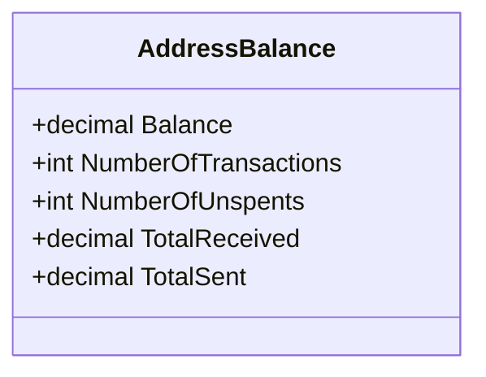

<div id="AddressCoinSpecific-class-diagram"></div>

##### `AddressCoinSpecific` class diagram

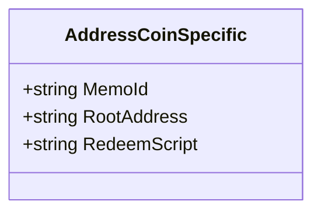

<div id="AddressInfo-class-diagram"></div>

##### `AddressInfo` class diagram

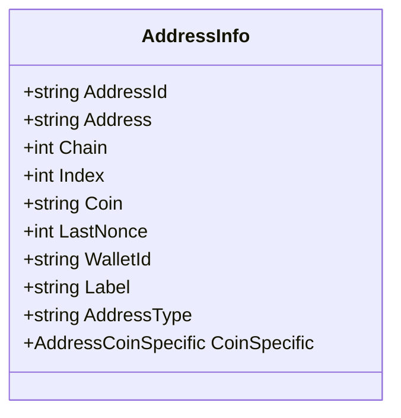

<div id="AddressInfoList-class-diagram"></div>

##### `AddressInfoList` class diagram

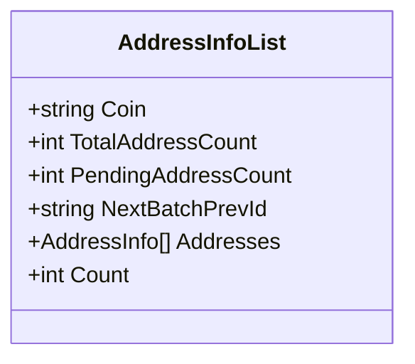

<div id="AddressInfoWithBalance-class-diagram"></div>

##### `AddressInfoWithBalance` class diagram

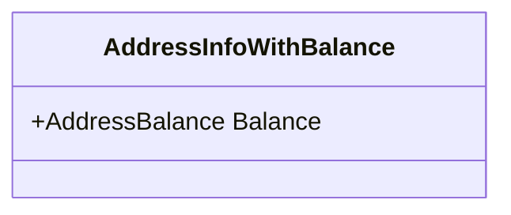

<div id="RequestData_AddressCreate-class-diagram"></div>

##### `RequestData_AddressCreate` class diagram

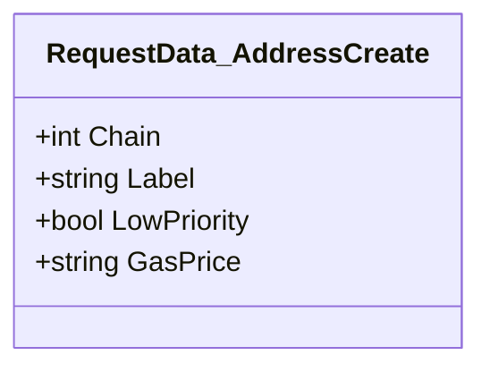

<div id="RequestData_AddressUpdate-class-diagram"></div>

##### `RequestData_AddressUpdate` class diagram

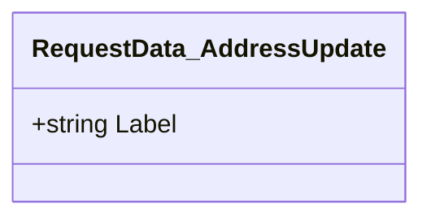

<div id="BaseConverter&lt;T&gt;-class-diagram"></div>

##### `BaseConverter<T>` class diagram

```mermaid
classDiagram
class BaseConverter<T>{
    -bool _quotes
    +List<KeyValuePair<T, string>> Mapping*
    +onverter(bool useQuotes) void
    +WriteJson(JsonWriter writer, object value, JsonSerializer serializer) void
    +ReadJson(JsonReader reader, Type objectType, object existingValue, JsonSerializer serializer) object
    +ReadString(string data) T
    +CanConvert(Type objectType) bool
    +GetValue(string value, out T result) bool
    +GetValue(T value) string
}

```

<div id="BitGoApi-class-diagram"></div>

##### `BitGoApi` class diagram

```mermaid
classDiagram
IBitGoApi <|-- BitGoApi : implements
class BitGoApi{
    -string MainPublicApi$
    -string TestPublicApi$
    -HttpClient _httpClient
    -DateTime _lastHttpSetupTime
    -HttpClient _lastHttpClient
    -object _gate
    +string EndpointUrl
    +SecureString AccessToken
    +bool ThrowThenErrorResponse
    +GetAddresses(string coin, string walletId, string labelContains = null, int limit = 25, bool mine = false, string prevId = null, string[] chains = null, int sort = 1, CancellationToken cancellationToken = null) WebCallResult<AddressInfoList>
    +GetAddressesAsync(string coin, string walletId, string labelContains = null, int limit = 25, bool mine = false, string prevId = null, string[] chains = null, int sort = 1, CancellationToken cancellationToken = null) Task<WebCallResult<AddressInfoList>>
    +CreateAddress(string coin, string walletId, string label, int chain, string gasPrice, bool lowPriority, CancellationToken cancellationToken = null) WebCallResult<AddressInfo>
    +CreateAddressAsync(string coin, string walletId, string label, int chain = 0, string gasPrice = null, bool lowPriority = false, CancellationToken cancellationToken = null) Task<WebCallResult<AddressInfo>>
    +GetAddress(string coin, string walletId, string addressOrId, CancellationToken cancellationToken = null) WebCallResult<AddressInfoWithBalance>
    +GetAddressAsync(string coin, string walletId, string addressOrId, CancellationToken cancellationToken = null) Task<WebCallResult<AddressInfoWithBalance>>
    +UpdateAddress(string coin, string walletId, string addressOrId, string label, CancellationToken cancellationToken = null) WebCallResult<AddressInfoWithBalance>
    +UpdateAddressAsync(string coin, string walletId, string addressOrId, string label, CancellationToken cancellationToken = null) Task<WebCallResult<AddressInfoWithBalance>>
    +.ctor(string accessToken, BitGoNetwork network = BitGoNetwork.Main) BitGoApi
    +.ctor(string accessToken, string apiRootUrl) BitGoApi
    +SetAccessToken(string accessToken) void
    +GetHttpClient() HttpClient
    +SetupHttpClient() void
    +CheckForErrors(string data) bool
    +ConvertToQueryString(Dictionary<string, object> nvc) string
    +GetAsync<T>(string url, CancellationToken cancellationToken = null) Task<WebCallResult<T>>
    +PostAsync<T>(string url, object obj = null, CancellationToken cancellationToken = null) Task<WebCallResult<T>>
    +PutAsync<T>(string url, object obj = null, CancellationToken cancellationToken = null) Task<WebCallResult<T>>
    +DeleteAsync<T>(string url, object obj = null, CancellationToken cancellationToken = null) Task<WebCallResult<T>>
    +EvaluateResponse<T>(HttpResponseMessage response, string content) WebCallResult<T>
    +ThrowErrorExceptionIfEnabled(Error error) void
    +EvaluateError<T>(Error error) WebCallResult<T>
    +Dispose() void
    +GetEnterprises(CancellationToken cancellationToken = null) WebCallResult<EnterpriseInfoList>
    +GetEnterprisesAsync(CancellationToken cancellationToken = null) Task<WebCallResult<EnterpriseInfoList>>
    +CreateEnterprise(string name, string enterpriseUrl, string emergencyPhone = "", CancellationToken cancellationToken = null) WebCallResult<EnterpriseInfoObjectTags>
    +CreateEnterpriseAsync(string name, string enterpriseUrl, string emergencyPhone = "", CancellationToken cancellationToken = null) Task<WebCallResult<EnterpriseInfoObjectTags>>
    +GetEnterprise(string enterpriseId, CancellationToken cancellationToken = null) WebCallResult<EnterpriseInfoObjectTags>
    +GetEnterpriseAsync(string enterpriseId, CancellationToken cancellationToken = null) Task<WebCallResult<EnterpriseInfoObjectTags>>
    +UpdateEnterprise(string enterpriseId, int approvalsRequired, CancellationToken cancellationToken = null) WebCallResult<PendingApprovalInfo>
    +UpdateEnterpriseAsync(string enterpriseId, int approvalsRequired, CancellationToken cancellationToken = null) Task<WebCallResult<PendingApprovalInfo>>
    +GetEnterpriseUsers(string enterpriseId, bool allowInactiveAdmins, CancellationToken cancellationToken = null) WebCallResult<EnterpriseUsers>
    +GetEnterpriseUsersAsync(string enterpriseId, bool allowInactiveAdmins, CancellationToken cancellationToken = null) Task<WebCallResult<EnterpriseUsers>>
    +AddUserToEnterprise(string enterpriseId, string username, string[] usernames, string permission, CancellationToken cancellationToken = null) WebCallResult<PendingApprovalInfo>
    +AddUserToEnterpriseAsync(string enterpriseId, string username, string[] usernames, string permission, CancellationToken cancellationToken = null) Task<WebCallResult<PendingApprovalInfo>>
    +RemoveUserFromEnterprise(string enterpriseId, string username, CancellationToken cancellationToken = null) WebCallResult<PendingApprovalInfo>
    +RemoveUserFromEnterpriseAsync(string enterpriseId, string username, CancellationToken cancellationToken = null) Task<WebCallResult<PendingApprovalInfo>>
    +FreezeEnterprise(string enterpriseId, int durationInSeconds, CancellationToken cancellationToken = null) WebCallResult<Freeze>
    +FreezeEnterpriseAsync(string enterpriseId, int durationInSeconds, CancellationToken cancellationToken = null) Task<WebCallResult<Freeze>>
    +GetEnterpriseWalletLimits(string enterpriseId, string[] coin = null, bool? isCustodial = null, CancellationToken cancellationToken = null) WebCallResult<EnterpriseWalletLimits>
    +GetEnterpriseWalletLimitsAsync(string enterpriseId, string[] coin = null, bool? isCustodial = null, CancellationToken cancellationToken = null) Task<WebCallResult<EnterpriseWalletLimits>>
    +GetEnterpriseFeeWalletBalance(string enterpriseId, string coin, CancellationToken cancellationToken = null) WebCallResult<EnterpriseFeeWalletBalance>
    +GetEnterpriseFeeWalletBalanceAsync(string enterpriseId, string coin, CancellationToken cancellationToken = null) Task<WebCallResult<EnterpriseFeeWalletBalance>>
    +PingExpressAsync(CancellationToken cancellationToken = null) Task<WebCallResult<PingExpressResult>>
    +VerifyAddressAsync(string coin, string address, CancellationToken cancellationToken = null) Task<WebCallResult<VerifyAddressResult>>
    +SendCoinsAsync(string coin, string walletId, SendCoinsRequestData request, CancellationToken cancellationToken = null) Task<WebCallResult<SendCoinResult>>
    +SendCoinsAsync(string coin, string walletId, string walletPassphrase, string sequenceId, string amount, string address, MemoType memo = null, CancellationToken cancellationToken = null) Task<WebCallResult<SendCoinResult>>
    +GetKeys(string coin, CancellationToken cancellationToken = null) WebCallResult<KeyInfoList>
    +GetKeysAsync(string coin, CancellationToken cancellationToken = null) Task<WebCallResult<KeyInfoList>>
    +CreateKey(string coin, string enterpriseId, string source = "bitgo", string encryptedPrv = "", bool newFeeAddress = false, string pub = "", CancellationToken cancellationToken = null) WebCallResult<KeyInfo>
    +CreateKeyAsync(string coin, string enterpriseId = "", string source = "bitgo", string encryptedPrv = "", bool newFeeAddress = false, string pub = "", CancellationToken cancellationToken = null) Task<WebCallResult<KeyInfo>>
    +GetKey(string coin, string keyId, CancellationToken cancellationToken = null) WebCallResult<KeyInfo>
    +GetAddressAsync(string coin, string keyId, CancellationToken cancellationToken = null) Task<WebCallResult<KeyInfo>>
    +GetPendingApprovals(string enterpriseId = null, string walletId = null, string[] coin = null, string[] state = null, CancellationToken cancellationToken = null) WebCallResult<PendingApprovalInfoList>
    +GetPendingApprovalsAsync(string enterpriseId = null, string walletId = null, string[] coin = null, string[] state = null, CancellationToken cancellationToken = null) Task<WebCallResult<PendingApprovalInfoList>>
    +GetPendingApproval(string pendingId, CancellationToken cancellationToken = null) WebCallResult<PendingApprovalInfo>
    +GetPendingApprovalAsync(string pendingId, CancellationToken cancellationToken = null) Task<WebCallResult<PendingApprovalInfo>>
    +UpdatePendingApproval(string pendingId, string otp, string state, CancellationToken cancellationToken = null) WebCallResult<PendingApprovalInfo>
    +UpdatePendingApprovalAsync(string pendingId, string otp, string state, CancellationToken cancellationToken = null) Task<WebCallResult<PendingApprovalInfo>>
    +GetTransfers(string coin, string walletId, bool? allTokens = null, string prevId = null, string state = null, string searchLabel = null, int limit = 25, string type = null, string pendingApprovalId = null, long? valueGte = null, long? valueLt = null, DateTime? dateGte = null, DateTime? dateLt = null, string address = null, bool? includeHex = null, CancellationToken cancellationToken = null) WebCallResult<TransferInfoList>
    +GetTransfersAsync(string coin, string walletId, bool? allTokens = null, string prevId = null, string state = null, string searchLabel = null, int limit = 25, string type = null, string pendingApprovalId = null, long? valueGte = null, long? valueLt = null, DateTime? dateGte = null, DateTime? dateLt = null, string address = null, bool? includeHex = null, CancellationToken cancellationToken = null) Task<WebCallResult<TransferInfoList>>
    +GetTransfer(string coin, string walletId, string transferId, CancellationToken cancellationToken = null) WebCallResult<TransferInfo>
    +GetTransferAsync(string coin, string walletId, string transferId = null, CancellationToken cancellationToken = null) Task<WebCallResult<TransferInfo>>
    +GetTransferBySequenceId(string coin, string walletId, string sequenceId, CancellationToken cancellationToken = null) WebCallResult<TransferInfo>
    +GetTransferBySequenceIdAsync(string coin, string walletId, string sequenceId = null, CancellationToken cancellationToken = null) Task<WebCallResult<TransferInfo>>
    +FeeEstimate(string coin, int? numBlocks = null, string recipient = null, string data = null, bool? hop = null, CancellationToken cancellationToken = null) WebCallResult<FeeEstimateInfo>
    +FeeEstimateAsync(string coin, int? numBlocks = null, string recipient = null, string data = null, bool? hop = null, CancellationToken cancellationToken = null) Task<WebCallResult<FeeEstimateInfo>>
    +GetUser(string userId, CancellationToken cancellationToken = null) WebCallResult<UserInfoResponse>
    +GetUserAsync(string userId, CancellationToken cancellationToken = null) Task<WebCallResult<UserInfoResponse>>
    +Login(string email, string password, string otp = "", CancellationToken cancellationToken = null) WebCallResult<UserLoginInfo>
    +LoginAsync(string email, string password, string otp = "", CancellationToken cancellationToken = null) Task<WebCallResult<UserLoginInfo>>
    +Logout(CancellationToken cancellationToken = null) WebCallResult<object>
    +LogoutAsync(CancellationToken cancellationToken = null) Task<WebCallResult<object>>
    +GetSession(CancellationToken cancellationToken = null) WebCallResult<UserSession>
    +GetSessionAsync(CancellationToken cancellationToken = null) Task<WebCallResult<UserSession>>
    +LockSession(CancellationToken cancellationToken = null) WebCallResult<UserSession>
    +LockSessionAsync(CancellationToken cancellationToken = null) Task<WebCallResult<UserSession>>
    +UnlockSession(string otp = "", int duration = 600, CancellationToken cancellationToken = null) WebCallResult<UserSession>
    +UnlockSessionAsync(string otp = "", int duration = 600, CancellationToken cancellationToken = null) Task<WebCallResult<UserSession>>
    +GetWallets(string coin, int limit = 25, bool allTokens = true, string prevId = null, string searchLabel = null, CancellationToken cancellationToken = null) WebCallResult<WalletInfoList>
    +GetWalletsAsync(string coin, int limit = 25, bool allTokens = true, string prevId = null, string searchLabel = null, CancellationToken cancellationToken = null) Task<WebCallResult<WalletInfoList>>
    +GetWallet(string coin, string walletId = null, bool? allTokens = null, CancellationToken cancellationToken = null) WebCallResult<WalletInfo>
    +GetWalletsAsync(string coin, string walletId = null, bool? allTokens = null, CancellationToken cancellationToken = null) Task<WebCallResult<WalletInfo>>
    +GetWalletByAddress(string coin, string address, CancellationToken cancellationToken = null) WebCallResult<WalletInfo>
    +GetWalletByAddressAsync(string coin, string address, CancellationToken cancellationToken = null) Task<WebCallResult<WalletInfo>>
    +AddWallet(string coin, string label, string enterpriseId, string stellarUsername, bool isCold, string[] keys, string bitgoKeySignature, string backupKeySignature, int requiredSignaturesNumber, int providedKeysNumber, string[] tags, string type, CancellationToken cancellationToken = null) WebCallResult<WalletInfo>
    +AddWalletAsync(string coin, string label, string enterpriseId, string stellarUsername, bool isCold, string[] keys, string bitgoKeySignature, string backupKeySignature, int requiredSignaturesNumber, int providedKeysNumber, string[] tags, string type, CancellationToken cancellationToken = null) Task<WebCallResult<WalletInfo>>
    +UpdateWallet(string coin, string walletId, string walletLabel, int approvalsRequired, bool disableTransactionNotifications, CancellationToken cancellationToken = null) WebCallResult<WalletInfo>
    +UpdateWalletAsync(string coin, string walletId, string walletLabel, int approvalsRequired, bool disableTransactionNotifications, CancellationToken cancellationToken = null) Task<WebCallResult<WalletInfo>>
    +DeleteWallet(string coin, string walletId, CancellationToken cancellationToken = null) WebCallResult<WalletInfo>
    +DeleteWalletAsync(string coin, string walletId, CancellationToken cancellationToken = null) Task<WebCallResult<WalletInfo>>
    +RemoveUserFromWallet(string coin, string walletId, string userId, CancellationToken cancellationToken = null) WebCallResult<WalletInfo>
    +RemoveUserFromWalletAsync(string coin, string walletId, string userId, CancellationToken cancellationToken = null) Task<WebCallResult<WalletInfo>>
    +FreezeWallet(string coin, string walletId, int durationInSeconds, CancellationToken cancellationToken = null) WebCallResult<Freeze>
    +FreezeWalletAsync(string coin, string walletId, int durationInSeconds, CancellationToken cancellationToken = null) Task<WebCallResult<Freeze>>
    +GetBalances(string coin, bool allTokens = true, string enterpriseId = null, CancellationToken cancellationToken = null) WebCallResult<BalanceInfo>
    +GetBalancesAsync(string coin, bool allTokens = true, string enterpriseId = null, CancellationToken cancellationToken = null) Task<WebCallResult<BalanceInfo>>
    +GetBalanceReserve(string coin, CancellationToken cancellationToken = null) WebCallResult<BalanceReserve>
    +GetBalanceReserveAsync(string coin, CancellationToken cancellationToken = null) Task<WebCallResult<BalanceReserve>>
    +GetUnspents(string coin, string walletId, int limit = 25, decimal? minValue = null, decimal? maxValue = null, int? minConfirms = null, int? minHeight = null, string prevId = null, int? target = null, string[] chains = null, CancellationToken cancellationToken = null) WebCallResult<UnspentsInfoList>
    +GetUnspentsAsync(string coin, string walletId, int limit = 25, decimal? minValue = null, decimal? maxValue = null, int? minConfirms = null, int? minHeight = null, string prevId = null, int? target = null, string[] chains = null, CancellationToken cancellationToken = null) Task<WebCallResult<UnspentsInfoList>>
    +GetMaximumSpendable(string coin, string walletId, int limit = 25, bool? allTokens = null, bool? enforceMinConfirmsForChange = null, int? feeRate = null, int? maxFeeRate = null, int? minConfirms = null, decimal? minHeight = null, decimal? minValue = null, decimal? maxValue = null, int numBlocks = 2, CancellationToken cancellationToken = null) WebCallResult<SpendableInfo>
    +GetMaximumSpendableAsync(string coin, string walletId, int limit = 25, bool? allTokens = null, bool? enforceMinConfirmsForChange = null, int? feeRate = null, int? maxFeeRate = null, int? minConfirms = null, decimal? minHeight = null, decimal? minValue = null, decimal? maxValue = null, int numBlocks = 2, CancellationToken cancellationToken = null) Task<WebCallResult<SpendableInfo>>
    +GetSpendingLimitsForWallet(string coin, string walletId, CancellationToken cancellationToken = null) WebCallResult<SpendingLimits>
    +GetSpendingLimitsForWalletAsync(string coin, string walletId, CancellationToken cancellationToken = null) Task<WebCallResult<SpendingLimits>>
    +AddWebhook(string coin, string walletId, string type, bool allToken, string url, string label, int numConfirmations, bool listenToFailureStates, CancellationToken cancellationToken = null) WebCallResult<WebhookInfo>
    +AddWebhookAsync(string coin, string walletId, string type, bool allToken, string url, string label, int numConfirmations, bool listenToFailureStates, CancellationToken cancellationToken = null) Task<WebCallResult<WebhookInfo>>
    +ListWebhooks(string coin, string walletId, CancellationToken cancellationToken = null) WebCallResult<WebhookInfoList>
    +ListWebhooksAsync(string coin, string walletId, CancellationToken cancellationToken = null) Task<WebCallResult<WebhookInfoList>>
    +RemoveWebhook(string coin, string walletId, string type, string url, string id, CancellationToken cancellationToken = null) WebCallResult<WebhookRemoveResponse>
    +RemoveWebhookAsync(string coin, string walletId, string type, string url, string id, CancellationToken cancellationToken = null) Task<WebCallResult<WebhookRemoveResponse>>
}

```

<div id="BitGoClient-class-diagram"></div>

##### `BitGoClient` class diagram

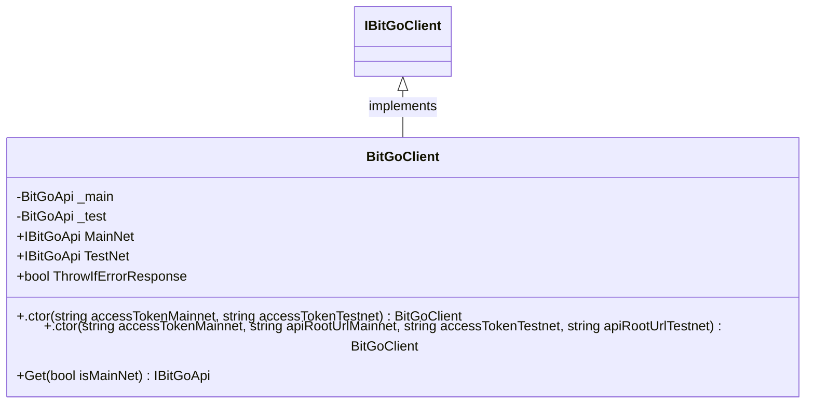

<div id="BitGoClientHelper-class-diagram"></div>

##### `BitGoClientHelper` class diagram

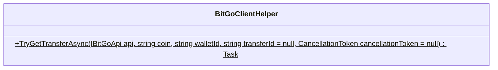

<div id="BitGoNetwork-class-diagram"></div>

##### `BitGoNetwork` class diagram

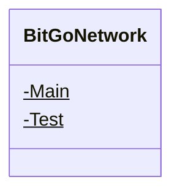

<div id="Extensions-class-diagram"></div>

##### `Extensions` class diagram

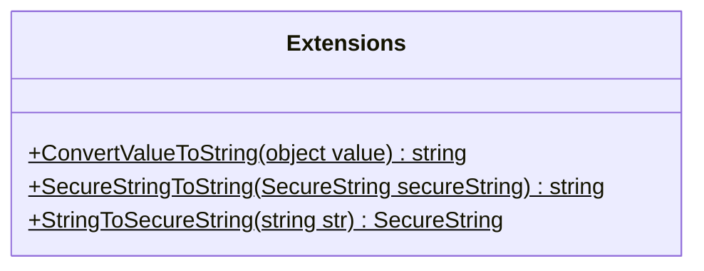

<div id="IBitGoApi-class-diagram"></div>

##### `IBitGoApi` class diagram

```mermaid
classDiagram
class IBitGoApi{
    +PingExpressAsync(CancellationToken cancellationToken = null)* Task<WebCallResult<PingExpressResult>>
    +VerifyAddressAsync(string coin, string address, CancellationToken cancellationToken = null)* Task<WebCallResult<VerifyAddressResult>>
    +SendCoinsAsync(string coin, string walletId, SendCoinsRequestData request, CancellationToken cancellationToken = null)* Task<WebCallResult<SendCoinResult>>
    +SendCoinsAsync(string coin, string walletId, string walletPassphrase, string sequenceId, string amount, string address, MemoType memo = null, CancellationToken cancellationToken = null)* Task<WebCallResult<SendCoinResult>>
    +GetTransfers(string coin, string walletId, bool? allTokens = null, string prevId = null, string state = null, string searchLabel = null, int limit = 25, string type = null, string pendingApprovalId = null, long? valueGte = null, long? valueLt = null, DateTime? dateGte = null, DateTime? dateLt = null, string address = null, bool? includeHex = null, CancellationToken cancellationToken = null)* WebCallResult<TransferInfoList>
    +GetTransfersAsync(string coin, string walletId, bool? allTokens = null, string prevId = null, string state = null, string searchLabel = null, int limit = 25, string type = null, string pendingApprovalId = null, long? valueGte = null, long? valueLt = null, DateTime? dateGte = null, DateTime? dateLt = null, string address = null, bool? includeHex = null, CancellationToken cancellationToken = null)* Task<WebCallResult<TransferInfoList>>
    +GetTransfer(string coin, string walletId, string transferId, CancellationToken cancellationToken = null)* WebCallResult<TransferInfo>
    +GetTransferAsync(string coin, string walletId, string transferId = null, CancellationToken cancellationToken = null)* Task<WebCallResult<TransferInfo>>
    +GetTransferBySequenceId(string coin, string walletId, string sequenceId, CancellationToken cancellationToken = null)* WebCallResult<TransferInfo>
    +GetTransferBySequenceIdAsync(string coin, string walletId, string sequenceId = null, CancellationToken cancellationToken = null)* Task<WebCallResult<TransferInfo>>
    +FeeEstimate(string coin, int? numBlocks = null, string recipient = null, string data = null, bool? hop = null, CancellationToken cancellationToken = null)* WebCallResult<FeeEstimateInfo>
    +FeeEstimateAsync(string coin, int? numBlocks = null, string recipient = null, string data = null, bool? hop = null, CancellationToken cancellationToken = null)* Task<WebCallResult<FeeEstimateInfo>>
    +GetUser(string userId, CancellationToken cancellationToken = null)* WebCallResult<UserInfoResponse>
    +GetUserAsync(string userId, CancellationToken cancellationToken = null)* Task<WebCallResult<UserInfoResponse>>
    +Login(string email, string password, string otp = "", CancellationToken cancellationToken = null)* WebCallResult<UserLoginInfo>
    +LoginAsync(string email, string password, string otp = "", CancellationToken cancellationToken = null)* Task<WebCallResult<UserLoginInfo>>
    +Logout(CancellationToken cancellationToken = null)* WebCallResult<object>
    +LogoutAsync(CancellationToken cancellationToken = null)* Task<WebCallResult<object>>
    +GetSession(CancellationToken cancellationToken = null)* WebCallResult<UserSession>
    +GetSessionAsync(CancellationToken cancellationToken = null)* Task<WebCallResult<UserSession>>
    +LockSession(CancellationToken cancellationToken = null)* WebCallResult<UserSession>
    +LockSessionAsync(CancellationToken cancellationToken = null)* Task<WebCallResult<UserSession>>
    +UnlockSession(string otp = "", int duration = 600, CancellationToken cancellationToken = null)* WebCallResult<UserSession>
    +UnlockSessionAsync(string otp = "", int duration = 600, CancellationToken cancellationToken = null)* Task<WebCallResult<UserSession>>
    +GetAddresses(string coin, string walletId, string labelContains = null, int limit = 25, bool mine = false, string prevId = null, string[] chains = null, int sort = 1, CancellationToken cancellationToken = null)* WebCallResult<AddressInfoList>
    +GetAddressesAsync(string coin, string walletId, string labelContains = null, int limit = 25, bool mine = false, string prevId = null, string[] chains = null, int sort = 1, CancellationToken cancellationToken = null)* Task<WebCallResult<AddressInfoList>>
    +CreateAddress(string coin, string walletId, string label, int chain = 0, string gasPrice = null, bool lowPriority = false, CancellationToken cancellationToken = null)* WebCallResult<AddressInfo>
    +CreateAddressAsync(string coin, string walletId, string label, int chain = 0, string gasPrice = null, bool lowPriority = false, CancellationToken cancellationToken = null)* Task<WebCallResult<AddressInfo>>
    +GetAddress(string coin, string walletId, string addressOrId, CancellationToken cancellationToken = null)* WebCallResult<AddressInfoWithBalance>
    +GetAddressAsync(string coin, string walletId, string addressOrId, CancellationToken cancellationToken = null)* Task<WebCallResult<AddressInfoWithBalance>>
    +UpdateAddress(string coin, string walletId, string addressOrId, string label, CancellationToken cancellationToken = null)* WebCallResult<AddressInfoWithBalance>
    +UpdateAddressAsync(string coin, string walletId, string addressOrId, string label, CancellationToken cancellationToken = null)* Task<WebCallResult<AddressInfoWithBalance>>
    +GetPendingApprovals(string enterpriseId = null, string walletId = null, string[] coin = null, string[] state = null, CancellationToken cancellationToken = null)* WebCallResult<PendingApprovalInfoList>
    +GetPendingApprovalsAsync(string enterpriseId = null, string walletId = null, string[] coin = null, string[] state = null, CancellationToken cancellationToken = null)* Task<WebCallResult<PendingApprovalInfoList>>
    +GetPendingApproval(string pendingId, CancellationToken cancellationToken = null)* WebCallResult<PendingApprovalInfo>
    +GetPendingApprovalAsync(string pendingId, CancellationToken cancellationToken = null)* Task<WebCallResult<PendingApprovalInfo>>
    +UpdatePendingApproval(string pendingId, string otp, string state, CancellationToken cancellationToken = null)* WebCallResult<PendingApprovalInfo>
    +UpdatePendingApprovalAsync(string pendingId, string otp, string state, CancellationToken cancellationToken = null)* Task<WebCallResult<PendingApprovalInfo>>
    +GetKeys(string coin, CancellationToken cancellationToken = null)* WebCallResult<KeyInfoList>
    +GetKeysAsync(string coin, CancellationToken cancellationToken = null)* Task<WebCallResult<KeyInfoList>>
    +CreateKey(string coin, string enterpriseId, string source = "bitgo", string encryptedPrv = "", bool newFeeAddress = false, string pub = "", CancellationToken cancellationToken = null)* WebCallResult<KeyInfo>
    +CreateKeyAsync(string coin, string enterpriseId = "", string source = "bitgo", string encryptedPrv = "", bool newFeeAddress = false, string pub = "", CancellationToken cancellationToken = null)* Task<WebCallResult<KeyInfo>>
    +GetKey(string coin, string keyId, CancellationToken cancellationToken = null)* WebCallResult<KeyInfo>
    +GetAddressAsync(string coin, string keyId, CancellationToken cancellationToken = null)* Task<WebCallResult<KeyInfo>>
    +GetWallets(string coin, int limit = 25, bool allTokens = true, string prevId = null, string searchLabel = null, CancellationToken cancellationToken = null)* WebCallResult<WalletInfoList>
    +GetWalletsAsync(string coin, int limit = 25, bool allTokens = true, string prevId = null, string searchLabel = null, CancellationToken cancellationToken = null)* Task<WebCallResult<WalletInfoList>>
    +GetWallet(string coin, string walletId = null, bool? allTokens = null, CancellationToken cancellationToken = null)* WebCallResult<WalletInfo>
    +GetWalletsAsync(string coin, string walletId = null, bool? allTokens = null, CancellationToken cancellationToken = null)* Task<WebCallResult<WalletInfo>>
    +GetWalletByAddress(string coin, string address, CancellationToken cancellationToken = null)* WebCallResult<WalletInfo>
    +GetWalletByAddressAsync(string coin, string address, CancellationToken cancellationToken = null)* Task<WebCallResult<WalletInfo>>
    +AddWallet(string coin, string label, string enterpriseId, string stellarUsername, bool isCold, string[] keys, string bitgoKeySignature, string backupKeySignature, int requiredSignaturesNumber, int providedKeysNumber, string[] tags, string type, CancellationToken cancellationToken = null)* WebCallResult<WalletInfo>
    +AddWalletAsync(string coin, string label, string enterpriseId, string stellarUsername, bool isCold, string[] keys, string bitgoKeySignature, string backupKeySignature, int requiredSignaturesNumber, int providedKeysNumber, string[] tags, string type, CancellationToken cancellationToken = null)* Task<WebCallResult<WalletInfo>>
    +UpdateWallet(string coin, string walletId, string walletLabel, int approvalsRequired, bool disableTransactionNotifications, CancellationToken cancellationToken = null)* WebCallResult<WalletInfo>
    +UpdateWalletAsync(string coin, string walletId, string walletLabel, int approvalsRequired, bool disableTransactionNotifications, CancellationToken cancellationToken = null)* Task<WebCallResult<WalletInfo>>
    +DeleteWallet(string coin, string walletId, CancellationToken cancellationToken = null)* WebCallResult<WalletInfo>
    +DeleteWalletAsync(string coin, string walletId, CancellationToken cancellationToken = null)* Task<WebCallResult<WalletInfo>>
    +RemoveUserFromWallet(string coin, string walletId, string userId, CancellationToken cancellationToken = null)* WebCallResult<WalletInfo>
    +RemoveUserFromWalletAsync(string coin, string walletId, string userId, CancellationToken cancellationToken = null)* Task<WebCallResult<WalletInfo>>
    +FreezeWallet(string coin, string walletId, int durationInSeconds, CancellationToken cancellationToken = null)* WebCallResult<Freeze>
    +FreezeWalletAsync(string coin, string walletId, int durationInSeconds, CancellationToken cancellationToken = null)* Task<WebCallResult<Freeze>>
    +GetBalances(string coin, bool allTokens = true, string enterpriseId = null, CancellationToken cancellationToken = null)* WebCallResult<BalanceInfo>
    +GetBalancesAsync(string coin, bool allTokens = true, string enterpriseId = null, CancellationToken cancellationToken = null)* Task<WebCallResult<BalanceInfo>>
    +GetBalanceReserve(string coin, CancellationToken cancellationToken = null)* WebCallResult<BalanceReserve>
    +GetBalanceReserveAsync(string coin, CancellationToken cancellationToken = null)* Task<WebCallResult<BalanceReserve>>
    +GetUnspents(string coin, string walletId, int limit = 25, decimal? minValue = null, decimal? maxValue = null, int? minConfirms = null, int? minHeight = null, string prevId = null, int? target = null, string[] chains = null, CancellationToken cancellationToken = null)* WebCallResult<UnspentsInfoList>
    +GetUnspentsAsync(string coin, string walletId, int limit = 25, decimal? minValue = null, decimal? maxValue = null, int? minConfirms = null, int? minHeight = null, string prevId = null, int? target = null, string[] chains = null, CancellationToken cancellationToken = null)* Task<WebCallResult<UnspentsInfoList>>
    +GetMaximumSpendable(string coin, string walletId, int limit = 25, bool? allTokens = null, bool? enforceMinConfirmsForChange = null, int? feeRate = null, int? maxFeeRate = null, int? minConfirms = null, decimal? minHeight = null, decimal? minValue = null, decimal? maxValue = null, int numBlocks = 2, CancellationToken cancellationToken = null)* WebCallResult<SpendableInfo>
    +GetMaximumSpendableAsync(string coin, string walletId, int limit = 25, bool? allTokens = null, bool? enforceMinConfirmsForChange = null, int? feeRate = null, int? maxFeeRate = null, int? minConfirms = null, decimal? minHeight = null, decimal? minValue = null, decimal? maxValue = null, int numBlocks = 2, CancellationToken cancellationToken = null)* Task<WebCallResult<SpendableInfo>>
    +GetSpendingLimitsForWallet(string coin, string walletId, CancellationToken cancellationToken = null)* WebCallResult<SpendingLimits>
    +GetSpendingLimitsForWalletAsync(string coin, string walletId, CancellationToken cancellationToken = null)* Task<WebCallResult<SpendingLimits>>
    +GetEnterprises(CancellationToken cancellationToken = null)* WebCallResult<EnterpriseInfoList>
    +GetEnterprisesAsync(CancellationToken cancellationToken = null)* Task<WebCallResult<EnterpriseInfoList>>
    +CreateEnterprise(string name, string enterpriseUrl, string emergencyPhone = "", CancellationToken cancellationToken = null)* WebCallResult<EnterpriseInfoObjectTags>
    +CreateEnterpriseAsync(string name, string enterpriseUrl, string emergencyPhone = "", CancellationToken cancellationToken = null)* Task<WebCallResult<EnterpriseInfoObjectTags>>
    +GetEnterprise(string enterpriseId, CancellationToken cancellationToken = null)* WebCallResult<EnterpriseInfoObjectTags>
    +GetEnterpriseAsync(string enterpriseId, CancellationToken cancellationToken = null)* Task<WebCallResult<EnterpriseInfoObjectTags>>
    +UpdateEnterprise(string enterpriseId, int approvalsRequired, CancellationToken cancellationToken = null)* WebCallResult<PendingApprovalInfo>
    +UpdateEnterpriseAsync(string enterpriseId, int approvalsRequired, CancellationToken cancellationToken = null)* Task<WebCallResult<PendingApprovalInfo>>
    +GetEnterpriseUsers(string enterpriseId, bool allowInactiveAdmins, CancellationToken cancellationToken = null)* WebCallResult<EnterpriseUsers>
    +GetEnterpriseUsersAsync(string enterpriseId, bool allowInactiveAdmins, CancellationToken cancellationToken = null)* Task<WebCallResult<EnterpriseUsers>>
    +AddUserToEnterprise(string enterpriseId, string username, string[] usernames, string permission, CancellationToken cancellationToken = null)* WebCallResult<PendingApprovalInfo>
    +AddUserToEnterpriseAsync(string enterpriseId, string username, string[] usernames, string permission, CancellationToken cancellationToken = null)* Task<WebCallResult<PendingApprovalInfo>>
    +RemoveUserFromEnterprise(string enterpriseId, string username, CancellationToken cancellationToken = null)* WebCallResult<PendingApprovalInfo>
    +RemoveUserFromEnterpriseAsync(string enterpriseId, string username, CancellationToken cancellationToken = null)* Task<WebCallResult<PendingApprovalInfo>>
    +FreezeEnterprise(string enterpriseId, int durationInSeconds, CancellationToken cancellationToken = null)* WebCallResult<Freeze>
    +FreezeEnterpriseAsync(string enterpriseId, int durationInSeconds, CancellationToken cancellationToken = null)* Task<WebCallResult<Freeze>>
    +GetEnterpriseWalletLimits(string enterpriseId, string[] coin = null, bool? isCustodial = null, CancellationToken cancellationToken = null)* WebCallResult<EnterpriseWalletLimits>
    +GetEnterpriseWalletLimitsAsync(string enterpriseId, string[] coin = null, bool? isCustodial = null, CancellationToken cancellationToken = null)* Task<WebCallResult<EnterpriseWalletLimits>>
    +GetEnterpriseFeeWalletBalance(string enterpriseId, string coin = null, CancellationToken cancellationToken = null)* WebCallResult<EnterpriseFeeWalletBalance>
    +GetEnterpriseFeeWalletBalanceAsync(string enterpriseId, string coin = null, CancellationToken cancellationToken = null)* Task<WebCallResult<EnterpriseFeeWalletBalance>>
    +AddWebhook(string coin, string walletId, string type, bool allToken, string url, string label, int numConfirmations, bool listenToFailureStates, CancellationToken cancellationToken = null)* WebCallResult<WebhookInfo>
    +AddWebhookAsync(string coin, string walletId, string type, bool allToken, string url, string label, int numConfirmations, bool listenToFailureStates, CancellationToken cancellationToken = null)* Task<WebCallResult<WebhookInfo>>
    +ListWebhooks(string coin, string walletId, CancellationToken cancellationToken = null)* WebCallResult<WebhookInfoList>
    +ListWebhooksAsync(string coin, string walletId, CancellationToken cancellationToken = null)* Task<WebCallResult<WebhookInfoList>>
    +RemoveWebhook(string coin, string walletId, string type, string url, string id, CancellationToken cancellationToken = null)* WebCallResult<WebhookRemoveResponse>
    +RemoveWebhookAsync(string coin, string walletId, string type, string url, string id, CancellationToken cancellationToken = null)* Task<WebCallResult<WebhookRemoveResponse>>
}

```

<div id="IBitGoClient-class-diagram"></div>

##### `IBitGoClient` class diagram

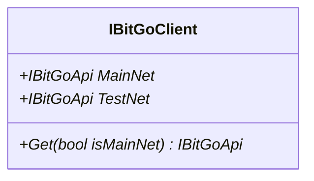

<div id="KeySourceTypeConverter-class-diagram"></div>

##### `KeySourceTypeConverter` class diagram

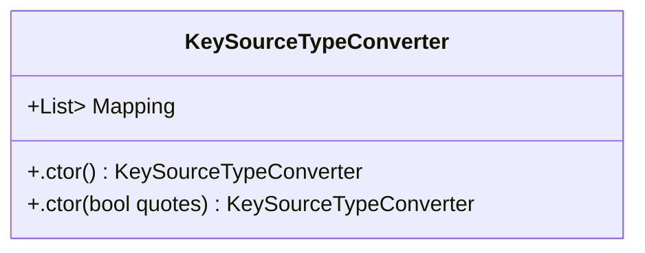

<div id="PendingApprovalResolveTypeConverter-class-diagram"></div>

##### `PendingApprovalResolveTypeConverter` class diagram

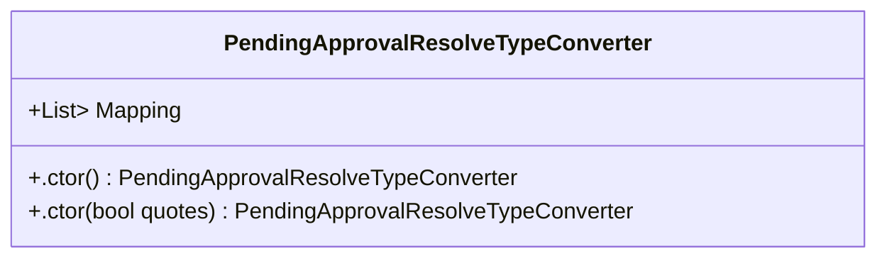

<div id="PendingApprovalStateConverter-class-diagram"></div>

##### `PendingApprovalStateConverter` class diagram

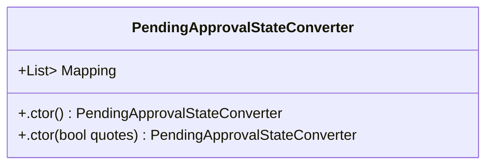

<div id="PermissionTypeConverter-class-diagram"></div>

##### `PermissionTypeConverter` class diagram

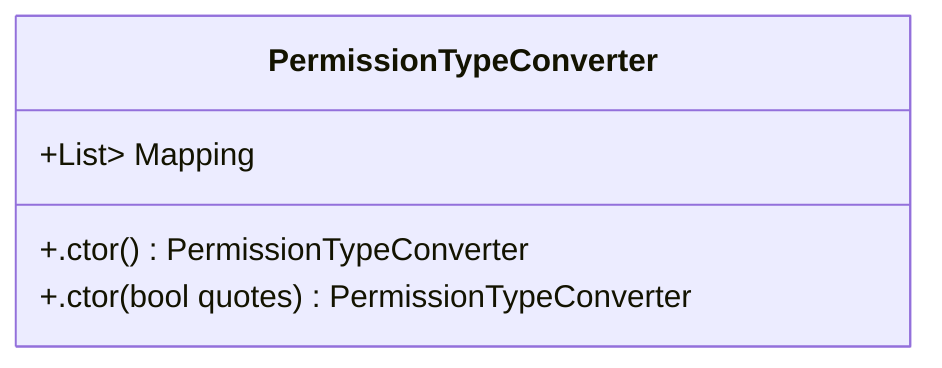

<div id="EnterpriseFeeWalletBalance-class-diagram"></div>

##### `EnterpriseFeeWalletBalance` class diagram

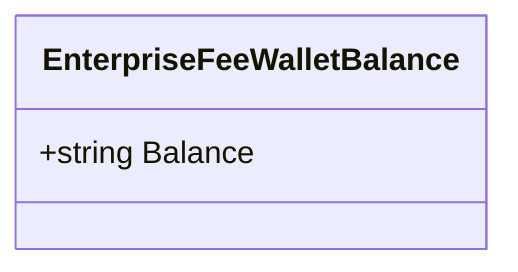

<div id="EnterpriseInfo-class-diagram"></div>

##### `EnterpriseInfo` class diagram

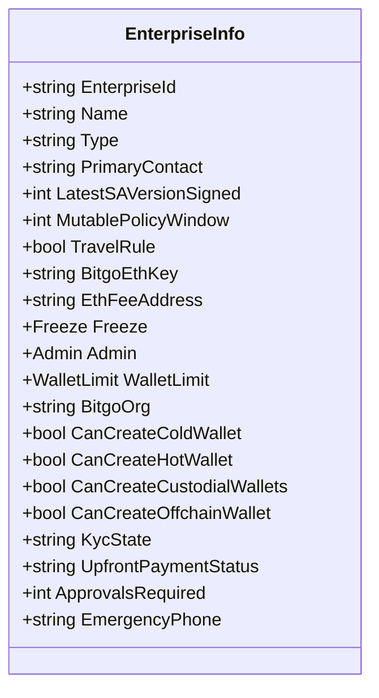

<div id="EnterpriseInfoList-class-diagram"></div>

##### `EnterpriseInfoList` class diagram

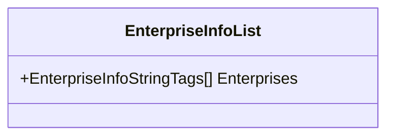

<div id="EnterpriseInfoObjectTags-class-diagram"></div>

##### `EnterpriseInfoObjectTags` class diagram

```mermaid
classDiagram
class EnterpriseInfoObjectTags{
    +EnterpriseTag[] Tags
}

```

<div id="EnterpriseInfoStringTags-class-diagram"></div>

##### `EnterpriseInfoStringTags` class diagram

```mermaid
classDiagram
class EnterpriseInfoStringTags{
    +string[] Tags
}

```

<div id="EnterpriseTag-class-diagram"></div>

##### `EnterpriseTag` class diagram

```mermaid
classDiagram
class EnterpriseTag{
    +string EnterpriseId
    +string Name
}

```

<div id="EnterpriseUserDetails-class-diagram"></div>

##### `EnterpriseUserDetails` class diagram

```mermaid
classDiagram
class EnterpriseUserDetails{
    +string Id
    +string Username
    +bool IsActive
    +bool Verified
    +EnterpriseUserEmail Email
    +EnterpriseUserIdentity identity
}

```

<div id="EnterpriseUserEmail-class-diagram"></div>

##### `EnterpriseUserEmail` class diagram

```mermaid
classDiagram
class EnterpriseUserEmail{
    +string Email
    +bool Verified
    +int verifyFailures
    +DateTime VerifySentAt
    +string verifyCode
}

```

<div id="EnterpriseUserIdentity-class-diagram"></div>

##### `EnterpriseUserIdentity` class diagram

```mermaid
classDiagram
class EnterpriseUserIdentity{
    +KYC KYC
}

```

<div id="EnterpriseUsers-class-diagram"></div>

##### `EnterpriseUsers` class diagram

```mermaid
classDiagram
class EnterpriseUsers{
    +EnterpriseUserDetails[] AdminUsers
    +EnterpriseUserDetails[] NonAdminUsers
    +EnterpriseUserDetails[] WalletUsers
    +int Count
    +bool Incomplete
}

```

<div id="EnterpriseWalletLimit-class-diagram"></div>

##### `EnterpriseWalletLimit` class diagram

```mermaid
classDiagram
class EnterpriseWalletLimit{
    +string Coin
    +int Count
    +int Limit
    +bool IsCustodial
}

```

<div id="EnterpriseWalletLimits-class-diagram"></div>

##### `EnterpriseWalletLimits` class diagram

```mermaid
classDiagram
class EnterpriseWalletLimits{
    +EnterpriseWalletLimit[] WalletLimits
}

```

<div id="RequestData_EnterpriseAddUser-class-diagram"></div>

##### `RequestData_EnterpriseAddUser` class diagram

```mermaid
classDiagram
class RequestData_EnterpriseAddUser{
    +string Permission
    +string Username
    +string[] Usernames
}

```

<div id="RequestData_EnterpriseCreate-class-diagram"></div>

##### `RequestData_EnterpriseCreate` class diagram

```mermaid
classDiagram
class RequestData_EnterpriseCreate{
    +string Name
    +string EmergencyPhone
    +string Url
}

```

<div id="RequestData_EnterpriseFreeze-class-diagram"></div>

##### `RequestData_EnterpriseFreeze` class diagram

```mermaid
classDiagram
class RequestData_EnterpriseFreeze{
    +int Duration
}

```

<div id="RequestData_EnterpriseRemoveUser-class-diagram"></div>

##### `RequestData_EnterpriseRemoveUser` class diagram

```mermaid
classDiagram
class RequestData_EnterpriseRemoveUser{
    +string Username
}

```

<div id="RequestData_EnterpriseUpdate-class-diagram"></div>

##### `RequestData_EnterpriseUpdate` class diagram

```mermaid
classDiagram
class RequestData_EnterpriseUpdate{
    +int ApprovalsRequired
}

```

<div id="MemoType.MemoEnum-class-diagram"></div>

##### `MemoType.MemoEnum` class diagram

```mermaid
classDiagram
class MemoEnum{
    -id$
}

```

<div id="MemoType-class-diagram"></div>

##### `MemoType` class diagram

```mermaid
classDiagram
class MemoType{
    +MemoEnum Type
    +string Value
}

```

<div id="PingExpressResult-class-diagram"></div>

##### `PingExpressResult` class diagram

```mermaid
classDiagram
class PingExpressResult{
    +string Status
}

```

<div id="SendCoinsRequestData.ReservationType-class-diagram"></div>

##### `SendCoinsRequestData.ReservationType` class diagram

```mermaid
classDiagram
class ReservationType{
    +DateTime expireTime
}

```

<div id="SendCoinResult-class-diagram"></div>

##### `SendCoinResult` class diagram

```mermaid
classDiagram
class SendCoinResult{
    +TransferInfo Transfer
    +string Txid
    +string Tx
    +string Status
    +bool IsRequireApproval
}

```

<div id="SendCoinsRequestData-class-diagram"></div>

##### `SendCoinsRequestData` class diagram

```mermaid
classDiagram
class SendCoinsRequestData{
    +string Address
    +string Amount
    +string WalletPassphrase
    +string PrivateKey
    +int NumBlocks
    +string FeeRate
    +string MaxFeeRate
    +int MinConfirms
    +bool EnforceMinConfirmsForChange
    +int GasPrice
    +int GasLimit
    +long targetWalletUnspents
    +long minValue
    +long MaxValue
    +string SequenceId
    +bool NoSplitChange
    +string[] Unspents
    +string ChangeAddress
    +bool Instant
    +MemoType Memo
    +string Comment
    +string AddressType
    +string StartTime
    +string consolidateId
    +int LastLedgerSequence
    +int LedgerSequenceDelta
    +string[] CpfpTxIds
    +int CpfpFeeRate
    +int MaxFee
    +int IdfVersion
    +string IdfSignedTimestamp
    +string IdfUserId
    +string Strategy
    +int ValidFromBlock
    +int ValidToBlock
    +string Type
    +StellarTrustline[] Trustlines
    +ReservationType Reservation
    +string Data
}

```

<div id="SendCoinResult.StatusEnum-class-diagram"></div>

##### `SendCoinResult.StatusEnum` class diagram

```mermaid
classDiagram
class StatusEnum{
    -Signed$
    -SignedSuppressed$
    -PendingApproval$
}

```

<div id="SendCoinsRequestData.StellarTrustline-class-diagram"></div>

##### `SendCoinsRequestData.StellarTrustline` class diagram

```mermaid
classDiagram
class StellarTrustline{
    +string Token
    +string Action
    +string Limit
}

```

<div id="VerifyAddressResult-class-diagram"></div>

##### `VerifyAddressResult` class diagram

```mermaid
classDiagram
class VerifyAddressResult{
    +bool IsValid
}

```

<div id="KeyInfo-class-diagram"></div>

##### `KeyInfo` class diagram

```mermaid
classDiagram
class KeyInfo{
    +string KeyId
    +string EncryptedPrv
    +string EthAddress
    +bool IsBitGoKey
    +string Pub
}

```

<div id="KeyInfoList-class-diagram"></div>

##### `KeyInfoList` class diagram

```mermaid
classDiagram
class KeyInfoList{
    +KeyInfo[] Keys
    +int Limit
}

```

<div id="RequestData_KeyCreate-class-diagram"></div>

##### `RequestData_KeyCreate` class diagram

```mermaid
classDiagram
class RequestData_KeyCreate{
    +string EncryptedPrv
    +string EnterpriseId
    +bool UseNewFeeAddress
    +string Pub
    +string Source
}

```

<div id="ArgumentError-class-diagram"></div>

##### `ArgumentError` class diagram

```mermaid
classDiagram
class ArgumentError{
    +.ctor(string message) ArgumentError
}

```

<div id="BitGoErrorException-class-diagram"></div>

##### `BitGoErrorException` class diagram

```mermaid
classDiagram
class BitGoErrorException{
    +Error Error
    +.ctor(Error error) BitGoErrorException
}

```

<div id="CallResult&lt;T&gt;-class-diagram"></div>

##### `CallResult<T>` class diagram

```mermaid
classDiagram
class CallResult<T>{
    +T Data
    +Error Error
    +bool Success
    +esult(T data, Error error) void
}

```

<div id="Error-class-diagram"></div>

##### `Error` class diagram

```mermaid
classDiagram
class Error{
    +string Code
    +string ErrorMessage
    +string RequestId
    +string Message
    +.ctor() Error
    +.ctor(string code, string message) Error
    +.ctor(string code, string message, string requestId) Error
    +ToString() string
}

```

<div id="KeySourceType-class-diagram"></div>

##### `KeySourceType` class diagram

```mermaid
classDiagram
class KeySourceType{
    -Backup$
    -Bitgo$
    -Cold$
    -User$
}

```

<div id="PendingApprovalResolveType-class-diagram"></div>

##### `PendingApprovalResolveType` class diagram

```mermaid
classDiagram
class PendingApprovalResolveType{
    -Approved$
    -Rejected$
}

```

<div id="PendingApprovalState-class-diagram"></div>

##### `PendingApprovalState` class diagram

```mermaid
classDiagram
class PendingApprovalState{
    -Pending$
    -AwaitingSignature$
    -PendingBitGoAdminApproval$
    -PendingFinalApproval$
}

```

<div id="PermissionType-class-diagram"></div>

##### `PermissionType` class diagram

```mermaid
classDiagram
class PermissionType{
    -Admin$
    -View$
    -Spend$
}

```

<div id="WebCallResult&lt;T&gt;-class-diagram"></div>

##### `WebCallResult<T>` class diagram

```mermaid
classDiagram
class WebCallResult<T>{
    +HttpStatusCode? ResponseStatusCode
    +Dictionary<string, string> ResponseHeaders
    +llResult(HttpResponseMessage response, T data, Error error) void
    +CreateErrorResult(Error error)$ WebCallResult<T>
    +CreateErrorResult(HttpResponseMessage response, Error error)$ WebCallResult<T>
}

```

<div id="BuildParams-class-diagram"></div>

##### `BuildParams` class diagram

```mermaid
classDiagram
class BuildParams{
    +TransactionRecipient[] Recipients
    +string SequenceId
}

```

<div id="Info-class-diagram"></div>

##### `Info` class diagram

```mermaid
classDiagram
class Info{
    +string Type
    +TransactionRequest TransactionRequest
    +UpdateEnterpriseRequest UpdateEnterpriseRequest
    +UpdateApprovalsRequiredRequest UpdateApprovalsRequiredRequest
}

```

<div id="PendingApprovalInfo-class-diagram"></div>

##### `PendingApprovalInfo` class diagram

```mermaid
classDiagram
class PendingApprovalInfo{
    +string Id
    +string Coin
    +string Enterprise
    +string WalletId
    +string WalletLabel
    +string Creator
    +DateTime CreateDate
    +Info Info
    +string State
    +string[] WalletUserIds
    +int ApprovalsRequired
}

```

<div id="PendingApprovalInfoList-class-diagram"></div>

##### `PendingApprovalInfoList` class diagram

```mermaid
classDiagram
class PendingApprovalInfoList{
    +PendingApprovalInfo[] PendingApprovals
}

```

<div id="RequestData_PendingApprovalUpdate-class-diagram"></div>

##### `RequestData_PendingApprovalUpdate` class diagram

```mermaid
classDiagram
class RequestData_PendingApprovalUpdate{
    +string OTP
    +string State
}

```

<div id="TransactionRecipient-class-diagram"></div>

##### `TransactionRecipient` class diagram

```mermaid
classDiagram
class TransactionRecipient{
    +string Address
    +string Amount
    +string Data
}

```

<div id="TransactionRequest-class-diagram"></div>

##### `TransactionRequest` class diagram

```mermaid
classDiagram
class TransactionRequest{
    +string Comment
    +string RequestedAmount
    +string SourceWallet
    +TransactionRecipient[] Recipients
    +BuildParams BuildParams
}

```

<div id="UpdateApprovalsRequiredRequest-class-diagram"></div>

##### `UpdateApprovalsRequiredRequest` class diagram

```mermaid
classDiagram
class UpdateApprovalsRequiredRequest{
    +int RequestedApprovalsRequired
}

```

<div id="UpdateEnterpriseRequest-class-diagram"></div>

##### `UpdateEnterpriseRequest` class diagram

```mermaid
classDiagram
class UpdateEnterpriseRequest{
    +string Action
    +string UserId
    +string[] Permissions
}

```

<div id="Admin-class-diagram"></div>

##### `Admin` class diagram

```mermaid
classDiagram
class Admin{
    +AdminPolicy Policy
}

```

<div id="AdminPolicy-class-diagram"></div>

##### `AdminPolicy` class diagram

```mermaid
classDiagram
class AdminPolicy{
    +string Id
    +DateTime Date
    +string Label
    +bool Latest
    +int Version
    +AdminPolicyRule[] Rules
}

```

<div id="AdminPolicyRule-class-diagram"></div>

##### `AdminPolicyRule` class diagram

```mermaid
classDiagram
class AdminPolicyRule{
    +string Id
    +DateTime LockDate
    +string MutabilityConstraint
    +string Coin
    +string Type
    +AdminPolicyRuleCondition Condition
    +AdminPolicyRuleAction Action
}

```

<div id="AdminPolicyRuleAction-class-diagram"></div>

##### `AdminPolicyRuleAction` class diagram

```mermaid
classDiagram
class AdminPolicyRuleAction{
    +string Type
    +int ApprovalsRequired
    +string[] UserIds
}

```

<div id="AdminPolicyRuleCondition-class-diagram"></div>

##### `AdminPolicyRuleCondition` class diagram

```mermaid
classDiagram
class AdminPolicyRuleCondition{
    +string AmountString
    +int TimeWindow
}

```

<div id="Freeze-class-diagram"></div>

##### `Freeze` class diagram

```mermaid
classDiagram
class Freeze{
    +DateTime Time
    +DateTime Expires
}

```

<div id="KYC-class-diagram"></div>

##### `KYC` class diagram

```mermaid
classDiagram
class KYC{
    +int FailureCount
    +string OverallState
    +bool Required
    +bool Available
    +KycState Data
    +KycState Documents
    +KycState Residency
    +bool Verified
}

```

<div id="KycState-class-diagram"></div>

##### `KycState` class diagram

```mermaid
classDiagram
class KycState{
    +string State
}

```

<div id="OtpDevice-class-diagram"></div>

##### `OtpDevice` class diagram

```mermaid
classDiagram
class OtpDevice{
    +string OtpDeviceId
    +DateTime CreateDate
    +DateTime LastValidatedDate
    +string Type
    +string Label
    +bool Verified
}

```

<div id="WalletLimit-class-diagram"></div>

##### `WalletLimit` class diagram

```mermaid
classDiagram
class WalletLimit{
    +decimal OFC
    +decimal TXRP
    +decimal XRP
    +decimal TestCoin
}

```

<div id="FeeEstimateInfo-class-diagram"></div>

##### `FeeEstimateInfo` class diagram

```mermaid
classDiagram
class FeeEstimateInfo{
    +string FeeEstimate
    +string GasLimitEstimate
    +string MinGasPrice
    +string MinGasLimit
    +string MaxGasLimit
    +long FeePerKb
    +long CpfpFeePerKb
    +long NumBlocks
    +int Confidence
}

```

<div id="TransferInfo-class-diagram"></div>

##### `TransferInfo` class diagram

```mermaid
classDiagram
class TransferInfo{
    +string Coin
    +string TransferId
    +string WalletId
    +string EnterpriseId
    +string TxId
    +int Height
    +DateTime Date
    +int Confirmations
    +TransferType Type
    +long Value
    +string ValueString
    +long BaseValue
    +string BaseValueString
    +string FeeString
    +string PayGoFee
    +string PayGoFeeString
    +decimal Usd
    +decimal UsdRate
    +string State
    +string[] Tags
    +TransferInfoHistory[] History
    +string Comment
    +long VSize
    +string SequenceId
    +TransferInfoEntry[] Entries
    +TransferInfoInputOutput[] Inputs
    +TransferInfoInputOutput[] Outputs
}

```

<div id="TransferInfoEntry-class-diagram"></div>

##### `TransferInfoEntry` class diagram

```mermaid
classDiagram
class TransferInfoEntry{
    +string Address
    +string WalletId
    +long Value
    +string ValueString
    +string Label
    +bool IsChange
    +bool IsPayGo
    +string Token
}

```

<div id="TransferInfoHistory-class-diagram"></div>

##### `TransferInfoHistory` class diagram

```mermaid
classDiagram
class TransferInfoHistory{
    +DateTime Date
    +string UserId
    +string Action
    +string Comment
}

```

<div id="TransferInfoInputOutput-class-diagram"></div>

##### `TransferInfoInputOutput` class diagram

```mermaid
classDiagram
class TransferInfoInputOutput{
    +string InputId
    +string Address
    +long Value
    +string valueString
    +long BlockHeight
    +DateTime Date
    +bool Coinbase
    +string WalletId
    +string FromWalletId
    +long Chain
    +long Index
    +string RedeemScript
    +string WitnessScript
    +bool IsSegwit
}

```

<div id="TransferInfoList-class-diagram"></div>

##### `TransferInfoList` class diagram

```mermaid
classDiagram
class TransferInfoList{
    +TransferInfo[] Transfers
    +string Coin
    +string NextBatchPrevId
}

```

<div id="TransferType-class-diagram"></div>

##### `TransferType` class diagram

```mermaid
classDiagram
class TransferType{
    -Send$
    -Receive$
}

```

<div id="RequestData_UserLogin-class-diagram"></div>

##### `RequestData_UserLogin` class diagram

```mermaid
classDiagram
class RequestData_UserLogin{
    +string Email
    +string Password
    +string OTP
}

```

<div id="RequestData_UserUnlockSession-class-diagram"></div>

##### `RequestData_UserUnlockSession` class diagram

```mermaid
classDiagram
class RequestData_UserUnlockSession{
    +int Duration
    +string OTP
}

```

<div id="UserInfo-class-diagram"></div>

##### `UserInfo` class diagram

```mermaid
classDiagram
class UserInfo{
    +string UserId
    +string Username
    +UserInfoName Name
    +UserInfoEmail Email
    +UserInfoPhone Phone
    +string Country
    +UserInfoIdentity Identity
    +OtpDevice[] OtpDevices
    +bool DisableResetOTP
    +UserInfoCurrency Currency
    +string Timezone
    +bool IsActive
    +string EcdhKeychain
    +bool ForceResetPassword
    +UserInfoAgreements Agreements
    +DateTime LastLogin
    +UserInfoEnterprise[] Enterprises
}

```

<div id="UserInfoAgreements-class-diagram"></div>

##### `UserInfoAgreements` class diagram

```mermaid
classDiagram
class UserInfoAgreements{
    +int TermsOfUse
    +int PatriotAct
    +DateTime TermsOfUseAcceptanceDate
}

```

<div id="UserInfoCurrency-class-diagram"></div>

##### `UserInfoCurrency` class diagram

```mermaid
classDiagram
class UserInfoCurrency{
    +string Currency
    +string BitcoinUnit
}

```

<div id="UserInfoEmail-class-diagram"></div>

##### `UserInfoEmail` class diagram

```mermaid
classDiagram
class UserInfoEmail{
    +string Email
    +bool Verified
}

```

<div id="UserInfoEnterprise-class-diagram"></div>

##### `UserInfoEnterprise` class diagram

```mermaid
classDiagram
class UserInfoEnterprise{
    +string EnterpriseId
    +string[] Permissions
}

```

<div id="UserInfoIdentity-class-diagram"></div>

##### `UserInfoIdentity` class diagram

```mermaid
classDiagram
class UserInfoIdentity{
    +UserInfoIdentityCivic Civic
    +KYC KYC
    +bool Verified
}

```

<div id="UserInfoIdentityCivic-class-diagram"></div>

##### `UserInfoIdentityCivic` class diagram

```mermaid
classDiagram
class UserInfoIdentityCivic{
    +string state
}

```

<div id="UserInfoName-class-diagram"></div>

##### `UserInfoName` class diagram

```mermaid
classDiagram
class UserInfoName{
    +string FullName
    +string FirstName
    +string LastName
}

```

<div id="UserInfoPhone-class-diagram"></div>

##### `UserInfoPhone` class diagram

```mermaid
classDiagram
class UserInfoPhone{
    +string Phone
    +bool Verified
}

```

<div id="UserInfoResponse-class-diagram"></div>

##### `UserInfoResponse` class diagram

```mermaid
classDiagram
class UserInfoResponse{
    +UserInfo User
}

```

<div id="UserLoginInfo-class-diagram"></div>

##### `UserLoginInfo` class diagram

```mermaid
classDiagram
class UserLoginInfo{
    +UserInfo User
    +string TokenType
    +string AccessToken
    +int ExpiresIn
    +int ExpiresAt
    +string[] Scope
}

```

<div id="UserSession-class-diagram"></div>

##### `UserSession` class diagram

```mermaid
classDiagram
class UserSession{
    +UserSessionInfo Session
}

```

<div id="UserSessionInfo-class-diagram"></div>

##### `UserSessionInfo` class diagram

```mermaid
classDiagram
class UserSessionInfo{
    +string SessionId
    +string Client
    +string UserId
    +string[] Scope
    +DateTime Created
    +DateTime Expires
    +string Ip
    +string[] IpRestrict
    +string Origin
    +bool IsExtensible
    +UserSessionInfoUnlock Unlock
}

```

<div id="UserSessionInfoUnlock-class-diagram"></div>

##### `UserSessionInfoUnlock` class diagram

```mermaid
classDiagram
class UserSessionInfoUnlock{
    +DateTime Time
    +DateTime Expires
    +long TxValueLimit
    +long TxValue
}

```

<div id="BalanceInfo-class-diagram"></div>

##### `BalanceInfo` class diagram

```mermaid
classDiagram
class BalanceInfo{
    +long Balance
    +string BalanceString
    +long? ConfirmedBalance
    +string ConfirmedBalanceString
    +long? SpendableBalance
    +string SpendableBalanceString
    +Dictionary<string, BalanceInfoToken> Tokens
}

```

<div id="BalanceInfoToken-class-diagram"></div>

##### `BalanceInfoToken` class diagram

```mermaid
classDiagram
class BalanceInfoToken{
    +string BalanceString
    +string ConfirmedBalanceString
    +string HeldBalanceString
    +string SpendableBalanceString
    +int TransferCount
}

```

<div id="BalanceReserve-class-diagram"></div>

##### `BalanceReserve` class diagram

```mermaid
classDiagram
class BalanceReserve{
    +string BaseFee
    +string BaseReserve
    +string Reserve
    +string MinimumFunding
    +int Height
    +DateTime Date
}

```

<div id="RequestData_AddWallet-class-diagram"></div>

##### `RequestData_AddWallet` class diagram

```mermaid
classDiagram
class RequestData_AddWallet{
    +Dictionary<string, Dictionary<string, string>> CoinSpecific
    +string EnterpriseId
    +bool IsCold
    +string[] Keys
    +Dictionary<string, string> KeySignatures
    +string Label
    +int RequiredSignaturesNumber
    +int ProvidedKeysNumber
    +string[] Tags
    +string Type
}

```

<div id="RequestData_GenerateWallet-class-diagram"></div>

##### `RequestData_GenerateWallet` class diagram

```mermaid
classDiagram
class RequestData_GenerateWallet{
    +string Label
    +string Passphrase
    +string UserKey
    +string BackupXpub
    +string BackupXpubProvider
    +string EnterpriseId
    +bool DisableTransactionNotifications
    +string PasscodeEncryptionCode
    +string ColdDerivationSeed
    +int GasPrice
    +bool DisableKRSEmail
}

```

<div id="RequestData_WalletFreeze-class-diagram"></div>

##### `RequestData_WalletFreeze` class diagram

```mermaid
classDiagram
class RequestData_WalletFreeze{
    +int Duration
}

```

<div id="RequestData_WalletUpdate-class-diagram"></div>

##### `RequestData_WalletUpdate` class diagram

```mermaid
classDiagram
class RequestData_WalletUpdate{
    +string Label
    +int ApprovalsRequired
    +bool DisableTransactionNotifications
}

```

<div id="SpendableInfo-class-diagram"></div>

##### `SpendableInfo` class diagram

```mermaid
classDiagram
class SpendableInfo{
    +string Coin
    +string MaximumSpendable
}

```

<div id="SpendingLimit-class-diagram"></div>

##### `SpendingLimit` class diagram

```mermaid
classDiagram
class SpendingLimit{
    +string Coin
    +string TimeWindow
    +string LimitAmountString
    +string AmountSpentString
}

```

<div id="SpendingLimits-class-diagram"></div>

##### `SpendingLimits` class diagram

```mermaid
classDiagram
class SpendingLimits{
    +SpendingLimit[] Limits
}

```

<div id="UnspentsInfo-class-diagram"></div>

##### `UnspentsInfo` class diagram

```mermaid
classDiagram
class UnspentsInfo{
    +string Id
    +string Address
    +long value
    +string valueString
    +int blockHeight
    +DateTime Date
    +bool Coinbase
    +string Wallet
    +string FromWallet
    +int Chain
    +int Index
    +string RedeemScript
    +string WitnessScript
    +bool IsSegwit
}

```

<div id="UnspentsInfoList-class-diagram"></div>

##### `UnspentsInfoList` class diagram

```mermaid
classDiagram
class UnspentsInfoList{
    +string coin
    +UnspentsInfo[] Unspents
    +string NextBatchPrevId
    +string ResultMessage
}

```

<div id="WalletCoinSpecific-class-diagram"></div>

##### `WalletCoinSpecific` class diagram

```mermaid
classDiagram
class WalletCoinSpecific{
    +string[] CreationFailure
    +bool PendingChainInitialization
    +string RootAddress
    +string StellarUsername
    +string StellarAddress
    +string HomeDomain
}

```

<div id="WalletInfo-class-diagram"></div>

##### `WalletInfo` class diagram

```mermaid
classDiagram
class WalletInfo{
    +string WalletId
    +WalletUser[] Users
    +string Coin
    +string Label
    +string Type
    +string Enterprise
    +int M
    +int N
    +string[] Keys
    +string[] Tags
    +bool DisableTransactionNotifications
    +Freeze Freeze
    +bool Deleted
    +int ApprovalsRequired
    +bool IsCold
    +WalletCoinSpecific CoinSpecific
    +Admin Admin
    +string[] ClientFlags
    +bool AllowBackupKeySigning
    +bool Recoverable
    +decimal Balance
    +decimal ConfirmedBalance
    +decimal SpendableBalance
    +string BalanceString
    +string ConfirmedBalanceString
    +string SpendableBalanceString
    +DateTime StartDate
    +AddressInfo ReceiveAddress
}

```

<div id="WalletInfoList-class-diagram"></div>

##### `WalletInfoList` class diagram

```mermaid
classDiagram
class WalletInfoList{
    +string Coin
    +string NextBatchPrevId
    +WalletInfo[] Wallets
}

```

<div id="WalletUser-class-diagram"></div>

##### `WalletUser` class diagram

```mermaid
classDiagram
class WalletUser{
    +string UserId
    +string[] Permissions
}

```

<div id="RequestData_WebhookAdd-class-diagram"></div>

##### `RequestData_WebhookAdd` class diagram

```mermaid
classDiagram
class RequestData_WebhookAdd{
    +string Type
    +bool AllToken
    +string Url
    +string Label
    +int NumConfirmations
    +bool ListenToFailureStates
}

```

<div id="RequestData_WebhookRemove-class-diagram"></div>

##### `RequestData_WebhookRemove` class diagram

```mermaid
classDiagram
class RequestData_WebhookRemove{
    +string Type
    +string Url
    +string Id
}

```

<div id="WebhookInfo-class-diagram"></div>

##### `WebhookInfo` class diagram

```mermaid
classDiagram
class WebhookInfo{
    +string Id
    +string Label
    +string Created
    +string Coin
    +string Type
    +string Url
    +string Version
    +string NumConfirmations
    +string State
    +string LastAttempt
    +string FailingSince
    +int SuccessiveFailedAttempts
    +string WalletId
    +bool AllToken
}

```

<div id="WebhookInfoList-class-diagram"></div>

##### `WebhookInfoList` class diagram

```mermaid
classDiagram
class WebhookInfoList{
    +WebhookInfo[] Webhooks
}

```

<div id="WebhookRemoveResponse-class-diagram"></div>

##### `WebhookRemoveResponse` class diagram

```mermaid
classDiagram
class WebhookRemoveResponse{
    +int Removed
}

```

<div id="Program-class-diagram"></div>

##### `Program` class diagram

```mermaid
classDiagram
class Program{
    -string _walletPassphrase1$
    +Main(string[] args)$ Task
    +TestAddresses(IBitGoApi api, string coin, string walletId, string label = null)$ Task
    +TestGetTransfer(IBitGoApi api, string coin, string walletId)$ Task
    +TestGetTransferById(IBitGoApi api, string coin, string walletId, string transferId)$ Task
    +TestEnterpise(IBitGoApi api, string coin, string enterprise)$ Task
    +TestPendingApproval(IBitGoApi api)$ Task
    +TestSpendingLimits(IBitGoApi api)$ Task
    +TestExpress(IBitGoApi api, string coin, string fromWalletId, string toWalletId, string toUser, string amount)$ Task
    +TestExpress2(IBitGoApi api, string coin, string fromWalletId, string toWalletId, string toUser, string amount)$ Task
    +ApplyWebhook(IBitGoApi api)$ Task
}

```

*This file is maintained by a bot.*

<!-- markdownlint-restore -->
